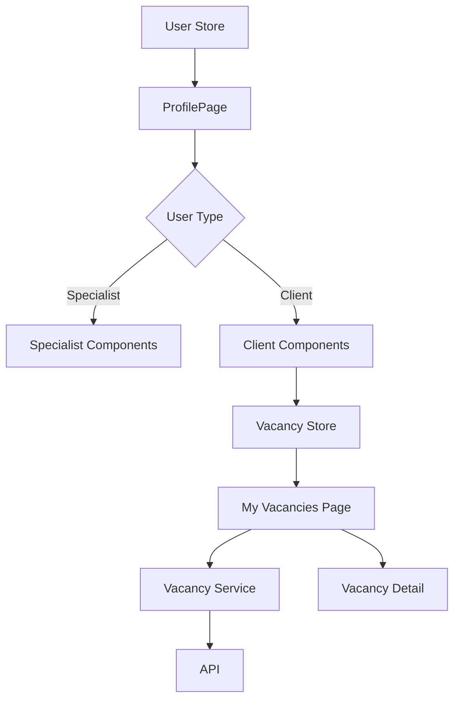

# Client Profile with Vacancies Management Design Document

## 1. Overview

This document outlines the design for implementing a client profile feature that allows users who post vacancies to manage their job postings. The solution will differentiate between specialist and client user types and provide appropriate UI components and functionality for each.

Based on the existing codebase analysis, we will implement conditional rendering in the profile page to show different components based on user type. For specialists, we'll keep the existing "Questionnaire" section, while for clients, we'll replace it with a "My Vacancies" section that leads to a dedicated page for managing vacancies.

The implementation will follow existing patterns in the codebase:

- Use the existing `userType` field to differentiate user types
- Follow the component structure and design patterns established by existing pages
- Implement new functionality using the same architectural approaches (Pinia stores, service layers, component composition)
- Use Tailwind CSS for styling as per project standards
- Use pnpm as the package manager for any new dependencies

## 2. Architecture

### 2.1 User Type Differentiation

- Users already have a `userType` property with values: `'specialist'` or `'client'` (as seen in the existing User type definition)
- The profile page will conditionally render different components based on user type
- For specialists: Display "Questionnaire" section
- For clients: Display "My Vacancies" section instead of questionnaire
- This is implemented using Vue's conditional rendering (`v-if`) based on `userStore.currentUser?.userType`

### 2.2 Component Structure

```
ProfilePage.vue
├── ProfileHeader.vue (existing)
├── ProfileActions.vue (modified)
│   ├── SpecialistQuestionnaireCard.vue (existing, specialist only)
│   ├── MyVacanciesCard.vue (new implementation, client only)
│   ├── ChangePasswordCard.vue (existing, both)
│   └── LogoutCard.vue (existing, both)
└── MyVacanciesPage.vue (new page, client only)
    ├── VacancySearch.vue (new component)
    └── VacancyList.vue (new component)
        └── VacancyCard.vue (new component)
        └── VacancyDetail.vue (new component)
```

The component structure follows the existing patterns in the codebase:

- Reuse existing components where possible (ProfileHeader, ChangePasswordCard, LogoutCard)
- Create new components for client-specific functionality
- Follow the same styling and architectural patterns as existing components
- Use Tailwind CSS for all styling following the project conventions
- The new components will be placed in appropriate directories following the existing structure:
  - `MyVacanciesPage.vue` in `src/pages/`
  - `VacancySearch.vue`, `VacancyList.vue`, `VacancyCard.vue`, `VacancyDetail.vue` in `src/components/vacancies/`
  - New store in `src/stores/vacancies.ts`
  - New service in `src/services/vacancies.ts`

### 2.3 Data Flow



## 3. Component Architecture

Based on the analysis of `ProfilePage.vue`, the implementation will modify the existing grid of action cards to conditionally show different cards based on user type. No new top-level components are needed for the profile page itself.

### 3.1 Profile Page Components

#### ProfileHeader.vue

- Displays user avatar, name, email
- Shows user type badge (Specialist/Client)
- Shows account status (Active/Inactive)
- No changes needed - already implements user type display

#### ProfileActions.vue

- Conditionally renders action cards based on user type
- For specialists: Questionnaire card, Change Password card, Logout card
- For clients: My Vacancies card, Change Password card, Logout card
- Implementation will modify the existing grid in ProfilePage.vue to conditionally show different cards

#### MyVacancies Action Card (Modified Implementation)

- Visible only to clients (using `v-if="userStore.currentUser?.userType === 'client'"`)
- Navigates to `/profile/vacancies` route
- Shows count of active vacancies (to be implemented)
- Follows the same design pattern as existing ActionCard components
- Will use the existing ActionCard component with appropriate props
- Will be implemented directly in `ProfilePage.vue` rather than as a separate component

### 3.2 Vacancy Management Components

#### MyVacanciesPage.vue (New Page)

- Route: `/profile/vacancies`
- Contains search functionality for vacancies
- Displays list of vacancies for current client
- Follows the same page structure as other pages in the application
- Uses identical content block sizing as existing pages

#### VacancySearch.vue (New Component)

- Text search input for filtering vacancies
- Clear search button
- Loading state handling
- Follows the same design patterns as SpecialistSearchFilters component

#### VacancyList.vue (New Component)

- Displays list of vacancy cards
- Empty state handling
- Loading state handling
- Error state handling
- Responsive grid layout similar to search results

#### VacancyCard.vue (New Component)

- Displays vacancy title, description, status
- Edit/Delete actions
- View applications action (future implementation)
- Follows the same card design patterns as SpecialistCard component
- Use Tailwind CSS for styling

#### VacancyDetail.vue (New Component)

- Single component for vacancy detail view
- Can be used by both clients and specialists -借鉴 the styling approach from the specialist profile detail page
- Simple and readable design
- Use Tailwind CSS for all styling

## 4. Routing & Navigation

### 4.1 New Routes

```typescript
{
  path: '/profile/vacancies',
  name: 'MyVacancies',
  component: () => import('@/pages/MyVacanciesPage.vue'),
  meta: {
    title: 'Мои вакансии',
    requiresAuth: true,
  },
}
```

### 4.2 Navigation Guards

- Route will be accessible only to authenticated users with `userType === 'client'`
- Redirect to profile page if user is not a client
- Follow the same pattern as existing route guards in `router/index.ts`

## 5. State Management

### 5.1 User Store (Existing)

- No changes needed to user store
- Current implementation already supports `userType: 'specialist' | 'client'`
- The `useUserStore` already provides `currentUser` with the correct type information

### 5.2 Vacancy Store (New)

Following the pattern established by existing stores like `useSpecialistSearchStore` and `useNeuralNetworkProfileStore`, we will create a new Pinia store for vacancy management.

```typescript
interface VacancyStoreState {
  vacancies: Vacancy[]
  loading: boolean
  error: string | null
  searchQuery: string
}

interface Vacancy {
  id: string
  title: string
  description: string
  status: 'draft' | 'published' | 'closed'
  createdAt: string
  updatedAt: string
  clientId: string
}
```

The store will follow the same patterns as existing stores:

- Use `defineStore` from Pinia
- Implement reactive state with `ref`
- Use computed properties for derived data
- Implement async actions for API calls

## 6. API Integration Layer

### 6.1 Vacancy Service (New)

Following the pattern established by existing services like `UserService` and `SpecialistSearchService`, we will create a new service for vacancy management.

```typescript
class VacancyService {
  // Get all vacancies for current client
  async getMyVacancies(searchQuery?: string): Promise<Vacancy[]>

  // Create new vacancy
  async createVacancy(data: Partial<Vacancy>): Promise<Vacancy>

  // Update existing vacancy
  async updateVacancy(id: string, data: Partial<Vacancy>): Promise<Vacancy>

  // Delete vacancy
  async deleteVacancy(id: string): Promise<void>
}
```

The service will follow the same patterns as existing services:

- Use the existing HTTP client configuration
- Implement proper error handling
- Follow the same request/response patterns as other services

## 7. UI/UX Design

### 7.1 Profile Page Modifications

- Add conditional rendering in ProfileActions section
- Replace "Questionnaire" card with "My Vacancies" card for clients
- Maintain consistent styling with existing action cards
- Use the existing `ActionCard` component with appropriate props for consistency

### 7.2 My Vacancies Page Design

- Clean, searchable list interface
- Consistent with existing design language
- Responsive grid layout for vacancy cards
- Search bar at the top of the page
- Follow the same design patterns as `SearchSpecialistsPage`
- Use Tailwind CSS for all styling
- Use identical content block sizing as existing pages (ProfilePage, SearchSpecialistsPage, etc.)
- Maintain consistent spacing and padding with other pages in the application

### 7.3 Vacancy Card Design

- Title and description preview
- Status badge (Draft/Published/Closed)
- Action buttons (Edit, Delete, View Applications)
- Creation/update timestamps
- Follow the same design patterns as `SpecialistCard` component
- Use Tailwind CSS for all styling

### 7.4 Vacancy Detail Design

- Create a single vacancy detail component that can be used by both clients and specialists -借鉴 the styling approach from the specialist profile detail page (`SpecialistProfileViewPage.vue`)
- Simple and readable design
- Use Tailwind CSS for all styling
- Follow the same design patterns as `ProfileOverview.vue` component -借鉴 the component structure from `ProfileOverview.vue` for consistency
- Use identical content block sizing as existing pages

## 8. Testing Strategy

### 8.1 Unit Tests

- ProfilePage component tests for both user types
- Conditional rendering logic tests
- MyVacanciesCard component tests
- VacancyList and VacancyCard component tests
- VacancyDetail component tests
- Follow the same patterns as existing tests like `ProfilePage.test.ts`

### 8.2 Integration Tests

- Profile page navigation for different user types
- Vacancy search and filtering functionality
- API integration tests for vacancy operations
- Follow the same patterns as existing integration tests

### 8.3 E2E Tests

- User type differentiation flow
- Client navigation to vacancies page
- Vacancy management workflows
- Follow the same patterns as existing E2E tests
