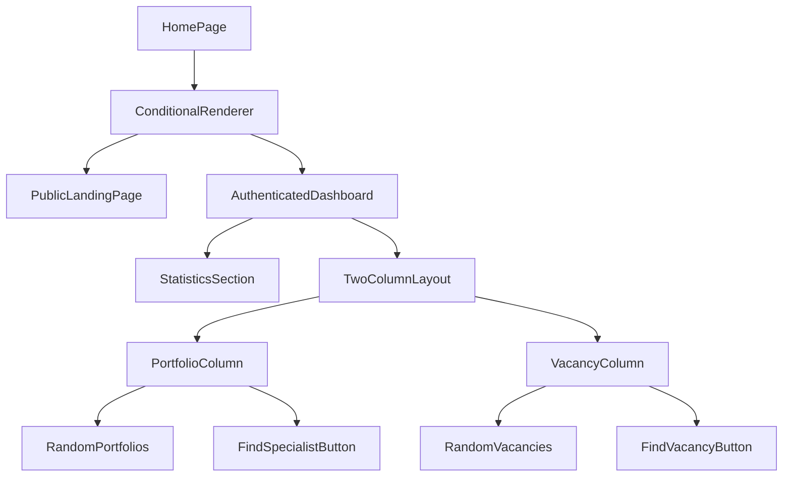

# Dashboard Removal and Home Page Enhancement Design

## Overview

This design document outlines the changes needed to:

1. Remove the Dashboard page entirely from the application
2. Make the Home page the default landing page after user authentication
3. Enhance the Home page to display statistics for portfolios and vacancies
4. Implement a two-column layout showing random portfolios and vacancies with navigation buttons

The HomePage will be transformed from a static landing page for unauthenticated users to a dynamic dashboard for authenticated users that displays key platform statistics and quick access to core features.

## Architecture

### Current Architecture

- The application uses Vue 3 with TypeScript and Pinia for state management
- Vue Router handles navigation with route guards for authentication
- The current routes include `/` (HomePage), `/dashboard` (DashboardPage), and `/login` (LoginPage)
- Authentication state is managed in the `userStore`

### Proposed Changes

1. Remove the DashboardPage component and its route
2. Update the router configuration to redirect authenticated users to `/` instead of `/dashboard`
3. Enhance the HomePage component with statistics and portfolio/vacancy display
4. Update navigation links throughout the application to point to the new home page

The existing HomePage component will be completely reworked to serve as the authenticated user dashboard, while maintaining its role as the public landing page for unauthenticated users.

## Component Architecture

### HomePage Component Enhancement

The HomePage component will be enhanced to include:

1. **Statistics Section**
   - Display count of active portfolios in the system
   - Display count of published vacancies
   - Add an introductory text section for authenticated users

2. **Two-Column Layout**
   - Left column: Display 5 random portfolios from the system
   - Right column: Display 5 random vacancies from the system
   - Each block will have a navigation button:
     - "Найти специалиста" for portfolios
     - "Найти вакансию" for vacancies

3. **Conditional Rendering**
   - For unauthenticated users: Show the current landing page content
   - For authenticated users: Show the new dashboard content with statistics and cards

### Component Structure



## Routing & Navigation

### Route Changes

1. Remove the `/dashboard` route entirely
2. Update the router's navigation guard to redirect authenticated users to `/` instead of `/dashboard`
3. Update the "Get Started" button on HomePage to navigate to the authenticated home page
4. Update the redirect in the login page to send users to `/` instead of `/dashboard`

### Navigation Guard Update

The `router.beforeEach` guard in `src/router/index.ts` needs to be modified:

- When an authenticated user accesses the login page, they should be redirected to `/` instead of `/dashboard`

## State Management

### Required Data Fetching

The HomePage will need to fetch:

1. Portfolio statistics (count of active portfolios)
2. Vacancy statistics (count of published vacancies)
3. Random portfolios (5 items)
4. Random vacancies (5 items)

We'll leverage existing services where possible:

- Extend the `VacancyService` to fetch statistics and random vacancies
- Create a new `PortfolioService` or leverage existing specialist profile services for portfolio data

### Store Integration

We'll need to:

1. Create or extend services to fetch portfolio statistics
2. Use existing vacancy service to fetch vacancy statistics and random vacancies
3. Create new composables if needed for data fetching

## API Integration Layer

### API Service Extensions

We'll extend existing services rather than creating new endpoints:

1. **VacancyService extensions**:
   - Add method to fetch vacancy statistics
   - Add method to fetch random published vacancies

2. **Specialist Profile Service extensions**:
   - Add method to fetch portfolio statistics
   - Add method to fetch random portfolios

For this implementation, we'll use the existing mock data approach in the services to simulate the API responses.

### Service Layer Changes

1. Extend the existing `VacancyService` in `src/services/vacancy.ts` to support:
   - Fetching vacancy statistics
   - Fetching random published vacancies
2. Leverage existing specialist profile services in `src/services/specialist-profile-view.ts` to fetch portfolio data

## Data Models & Type System

### Data Models

We'll use existing data models where possible and extend them as needed:

1. **Existing Models**:
   - `Vacancy` from `src/types/vacancy.ts`
   - Portfolio data can be extracted from specialist profiles

2. **New Interfaces**:

```typescript
interface PortfolioItem {
  id: string
  title: string
  description: string
  specialistId: string
  specialistName: string
  createdAt: string
  result?: string // Results from portfolio case
  tools?: string[] // Tools used in the project
}

interface PlatformStatistics {
  portfolioCount: number
  vacancyCount: number
}
```

### Existing Data Models

We'll leverage existing models:

- `Vacancy` model from `src/types/vacancy.ts`
- User model from `src/types/index.ts`

## Business Logic Layer

### HomePage Logic

1. On component mount:
   - Fetch portfolio statistics
   - Fetch vacancy statistics
   - Fetch 5 random portfolios
   - Fetch 5 random vacancies

2. Button actions:
   - "Найти специалиста" navigates to `/search/specialists`
   - "Найти вакансию" navigates to `/vacancies`

### Data Fetching Logic

1. Implement random selection logic for portfolios and vacancies
2. Handle loading and error states appropriately
3. Cache data when appropriate to improve performance

## UI/UX Design

### Layout Structure

```
+--------------------------------------------------+
|                    Header                        |
+--------------------------------------------------+
| For Unauthenticated Users:                       |
|   - Hero section with tagline                    |
|   - Features grid                                |
|   - Call-to-action buttons                       |
|                                                  |
| For Authenticated Users:                         |
|   - Welcome message                              |
|   - Statistics cards (2-col grid)                |
|   - Introduction text                            |
|   - Two-column layout:                           |
|     +----------------+ +----------------------+  |
|     | Portfolios     | | Vacancies            |  |
|     | Column         | | Column               |  |
|     |                | |                      |  |
|     | [Portfolio 1]  | | [Vacancy 1]          |  |
|     | [Portfolio 2]  | | [Vacancy 2]          |  |
|     | [Portfolio 3]  | | [Vacancy 3]          |  |
|     | [Portfolio 4]  | | [Vacancy 4]          |  |
|     | [Portfolio 5]  | | [Vacancy 5]          |  |
|     |                | |                      |  |
|     | [Button]       | | [Button]             |  |
|     | Find Specialist| | Find Vacancy         |  |
|     +----------------+ +----------------------+  |
+--------------------------------------------------+
```

### Component Design

#### New Components

1. **StatisticsCard**
   - Clean, visually appealing cards showing counts
   - Consistent styling with the rest of the application
   - Will display portfolio count and vacancy count

2. **PortfolioCard**
   - Compact design showing portfolio title, description, and specialist name
   - Similar to existing VacancyCard component
   - Will show key results and tools when available

3. **DashboardHeader**
   - Welcome message for authenticated users
   - Introduction text section
   - Responsive design

4. **FindButtons**
   - "Найти специалиста" button that navigates to `/search/specialists`
   - "Найти вакансию" button that navigates to `/vacancies`
   - Consistent styling with existing buttons in the application

#### Modified Components

1. **HomePage**
   - Add conditional rendering logic
   - Integrate new components
   - Add data fetching logic

2. **Router Configuration**
   - Remove Dashboard route
   - Update redirect logic for authenticated users

## Testing Strategy

### Unit Tests

1. Test HomePage component with different data states:
   - Loading state
   - Success state with data
   - Error state
   - Authenticated vs unauthenticated views

2. Test navigation button functionality:
   - Ensure buttons navigate to correct routes
   - Test button rendering based on user type

3. Test data fetching logic:
   - Mock API responses
   - Test error handling
   - Test loading states

4. Test conditional rendering logic

### Integration Tests

1. Test the complete flow from login to HomePage
2. Test that authenticated users are redirected to HomePage
3. Test that statistics and data are displayed correctly
4. Test navigation between HomePage and other sections

### Component Tests

1. Test StatisticsCard component
2. Test PortfolioCard and VacancyCard components
3. Test navigation button components
4. Test DashboardHeader component

### Test Data

- Use existing mock data from `fakeVacancyService.ts` for vacancies
- Create mock portfolio data based on existing specialist profile structures

## Implementation Plan

### Phase 1: Infrastructure Changes

1. Remove DashboardPage component (`src/pages/DashboardPage.vue`)
2. Update router configuration in `src/router/index.ts`:
   - Remove the `/dashboard` route
   - Update the navigation guard to redirect authenticated users to `/` instead of `/dashboard`
   - Update the redirect in the login page
3. Update the "Get Started" button on HomePage to navigate to the authenticated home page

### Phase 2: HomePage Enhancement

1. Modify HomePage component (`src/pages/HomePage.vue`) to:
   - Conditionally render different content for authenticated vs unauthenticated users
   - Add statistics fetching logic using existing stores/services
   - Implement random data fetching for portfolios and vacancies
   - Create UI components for statistics cards and two-column layout

### Phase 3: Service Layer Extensions

1. Extend VacancyService (`src/services/vacancy.ts`) to:
   - Add method to fetch vacancy statistics
   - Add method to fetch random published vacancies
2. Create or extend portfolio-related services to fetch portfolio data

### Phase 4: Store Updates

1. Update or create composables for data fetching if needed
2. Ensure proper error handling and loading states

### Phase 5: Integration and Testing

1. Connect HomePage to extended services
2. Implement navigation functionality for the action buttons
3. Conduct thorough testing including:
   - Unit tests for new components
   - Integration tests for data fetching
   - UI testing for both authenticated and unauthenticated views

### Phase 6: Polish and Deployment

1. UI refinement and responsiveness checks
2. Performance optimization
3. Final testing and deployment
