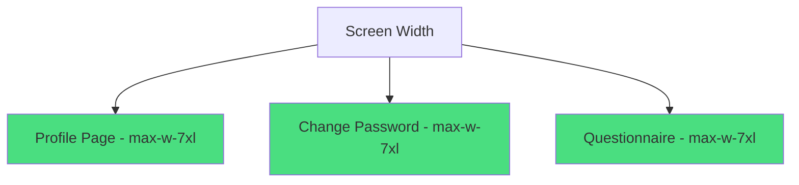

# Feature Enhancement: Expand Content Area Width

## Overview

This design document outlines the enhancement to expand the content area width of the Neural Network Questionnaire page and Change Password page to match the dimensions used in the Profile page. Currently, these pages use different max-width constraints which creates an inconsistent user experience.

## Current State Analysis

### Profile Page Layout

The Profile page uses a maximum width of `max-w-7xl` with padding on all sides:

```html
<div class="max-w-7xl mx-auto py-8 px-4 sm:px-6 lg:px-8"></div>
```

### Change Password Page Layout

The Change Password page currently uses a maximum width of `max-w-2xl`:

```html
<div class="max-w-2xl mx-auto px-4 py-8"></div>
```

### Neural Network Questionnaire Page Layout

The Neural Network Questionnaire page uses multiple containers with different widths:

- Progress header: `max-w-4xl`
- Main content: `max-w-4xl`

## Proposed Enhancement

### Change Password Page Enhancement

Update the container class from `max-w-2xl` to `max-w-7xl` to match the Profile page dimensions.

### Neural Network Questionnaire Page Enhancement

Update both container classes from `max-w-4xl` to `max-w-7xl` to match the Profile page dimensions.

## Implementation Plan

### 1. Change Password Page Modification

File: `src/pages/ChangePasswordPage.vue`

- Update the main container class from `max-w-2xl` to `max-w-7xl`
- Maintain existing padding and responsive classes
- Specific change: `<div class="max-w-7xl mx-auto px-4 py-8 sm:px-6 lg:px-8">`

### 2. Neural Network Questionnaire Page Modification

File: `src/components/profile/NeuralNetworkQuestionnaireForm.vue`

- Update progress header container from `max-w-4xl` to `max-w-7xl`
- Update main content container from `max-w-4xl` to `max-w-7xl`
- Specific changes:
  - Progress header: `<div class="max-w-7xl mx-auto px-4 py-4">`
  - Main content: `<div class="max-w-7xl mx-auto px-4 py-8">`

## Benefits

1. **Consistent User Experience**: All profile-related pages will have the same content width
2. **Better Utilization of Screen Real Estate**: Wider content area on larger screens
3. **Improved Readability**: More space for form elements and content

## Technical Considerations

1. Form elements will need to be checked for proper alignment within the wider container
2. Responsive behavior should be tested across different screen sizes
3. Ensure that the wider layout doesn't negatively impact the readability of content
4. Verify that all child components adapt properly to the increased width
5. Test form validation messages and error display in the wider layout
6. Confirm that the progress indicators and navigation elements properly align
7. Check that all text elements maintain proper line lengths for readability
8. Verify that existing responsive breakpoints still function correctly
9. Confirm that the wider layout works well with existing dark mode styling

## Visual Representation

### Current Layout Comparison


### After Enhancement


