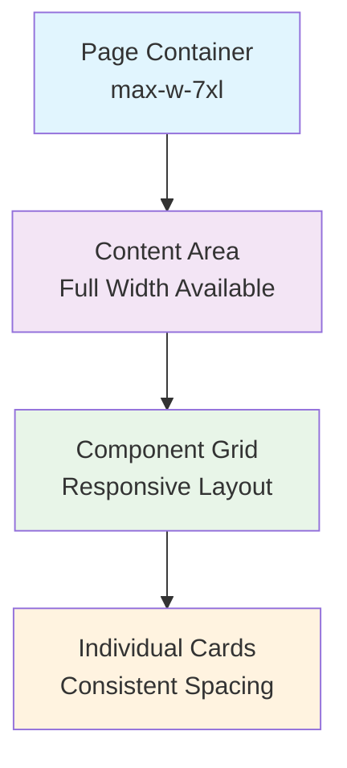
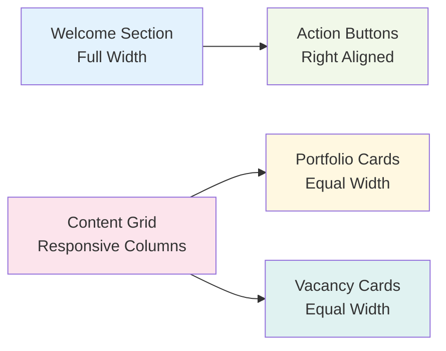

# Main Page Content Expansion Design

## Overview

This design addresses the expansion of the main page (HomePage.vue) content area width to match the full 7xl layout used by other pages like AllVacanciesPage, and implements comprehensive test improvements across the project.

## Current State Analysis

### HomePage Layout Issues

The HomePage currently uses a nested layout structure that constrains content width:

- Outer container: `max-w-7xl` (full application width)
- Inner content container: `max-w-4xl` (artificially constrained)
- This creates inconsistent visual experience compared to other pages

### Comparison with AllVacanciesPage

AllVacanciesPage uses the full `max-w-7xl` width consistently:

```vue
<div class="max-w-7xl mx-auto py-8 px-4 sm:px-6 lg:px-8">
  <!-- Direct content without nested width constraints -->
</div>
```

### Test Coverage Gaps

Current testing issues identified:

- Incomplete component test coverage
- Outdated test assertions
- Missing integration tests for key user flows
- Test utilities need standardization

## Architecture Changes

### Layout Standardization

Implement consistent width patterns across all pages:



### Responsive Breakpoints

Maintain consistent responsive behavior:

- Mobile: Single column, full width
- Tablet (md): 2-column grid where appropriate
- Desktop (lg+): 3-column grid for card layouts

### Content Organization

Structure content to utilize full available width:



## Implementation Strategy

### HomePage Layout Updates

#### Remove Width Constraints

- Remove `max-w-4xl` container
- Use full `max-w-7xl` available width
- Implement responsive card grids

#### Content Reorganization

- Expand welcome section to full width
- Create responsive grid for portfolio/vacancy cards
- Optimize spacing and typography for wider layout

#### Responsive Grid System

- Mobile: 1 column
- Tablet: 2 columns
- Desktop: 3 columns
- Large screens: 4 columns (when beneficial)

### Test Infrastructure Improvements

#### Test Utilities Standardization

Create common test utilities:

- Mock factories for consistent test data
- Wrapper creation helpers
- Assertion utilities for Vue components

#### Component Testing Enhancements

Improve test coverage for:

- HomePage user type rendering
- Portfolio and vacancy card interactions
- Responsive behavior validation
- Error state handling

#### Integration Test Expansion

Add comprehensive integration tests:

- User flow testing
- Cross-component communication
- State management integration
- Router navigation testing

## Component Updates

### HomePage.vue Changes

#### Template Structure

```vue
<template>
  <div class="min-h-screen bg-gray-50 dark:bg-gray-900">
    <main class="max-w-7xl mx-auto py-12 px-4 sm:px-6 lg:px-8">
      <!-- Welcome Section - Full Width -->
      <div class="text-center mb-12">
        <!-- Welcome title and description -->
      </div>

      <!-- Content Grid - Full Width -->
      <div class="w-full">
        <!-- Responsive grid layout -->
        <div class="grid grid-cols-1 md:grid-cols-2 lg:grid-cols-3 gap-6">
          <!-- Dynamic content cards -->
        </div>
      </div>
    </main>
  </div>
</template>
```

#### Responsive Card Layout

- Implement CSS Grid for consistent card sizing
- Ensure proper spacing and alignment
- Maintain readability across all screen sizes

### CSS Grid Implementation

```css
.content-grid {
  display: grid;
  grid-template-columns: repeat(auto-fit, minmax(300px, 1fr));
  gap: 1.5rem;
}

@media (min-width: 768px) {
  .content-grid {
    grid-template-columns: repeat(2, 1fr);
  }
}

@media (min-width: 1024px) {
  .content-grid {
    grid-template-columns: repeat(3, 1fr);
  }
}
```

## Testing Strategy

### Unit Test Enhancements

#### HomePage Test Updates

- Test responsive layout rendering
- Validate grid behavior across breakpoints
- Test user type-specific content display
- Verify card interaction handling

#### Component Test Standards

- Consistent mock implementations
- Comprehensive prop testing
- Event emission validation
- Error boundary testing

#### Test Utilities

```typescript
// Test utility functions
export const createMockUser = (userType: 'client' | 'specialist'): User => {
  return {
    id: generateId(),
    userType,
    firstName: 'Test',
    lastName: 'User',
    // ... other properties
  }
}

export const createWrapper = (component: Component, options?: MountOptions) => {
  return mount(component, {
    global: {
      plugins: [createTestPinia(), createTestRouter()],
      ...options?.global,
    },
    ...options,
  })
}
```

### Integration Test Suite

#### User Flow Testing

- Client dashboard flow
- Specialist dashboard flow
- Cross-page navigation
- State persistence

#### Responsive Testing

```typescript
describe('Responsive Layout', () => {
  it('renders single column on mobile', () => {
    // Test mobile layout
  })

  it('renders multi-column grid on desktop', () => {
    // Test desktop layout
  })
})
```

## Visual Design Consistency

### Layout Patterns

Ensure HomePage follows established patterns:

- Same outer container as other pages
- Consistent padding and margins
- Unified typography scale
- Matching color schemes

### Card Design System

- Consistent card shadows and borders
- Unified hover states
- Standardized spacing within cards
- Responsive image handling

### Typography Hierarchy

- Maintain consistent heading sizes
- Preserve reading comfort at wider widths
- Ensure proper contrast ratios
- Optimize line length for readability

## Performance Considerations

### Layout Rendering

- Minimize layout shifts during responsive changes
- Optimize CSS Grid performance
- Implement efficient card virtualization if needed

### Image Optimization

- Implement lazy loading for portfolio images
- Use responsive image sizes
- Optimize image formats and compression

### Bundle Size Impact

- Monitor CSS bundle size changes
- Optimize grid-related styles
- Minimize duplicate responsive utilities

## Testing Implementation

### Test File Structure

```
tests/
├── pages/
│   ├── HomePage.test.ts (enhanced)
│   └── HomePage.integration.test.ts (new)
├── components/
│   ├── ui/
│   │   ├── PortfolioSpecialistCard.test.ts (updated)
│   │   └── VacancyCard.test.ts (updated)
├── utils/
│   ├── test-helpers.ts (new)
│   └── mock-factories.ts (new)
```

### Test Coverage Targets

- Component unit tests: >90%
- Integration tests: >80%
- E2E critical paths: 100%
- Accessibility tests: Complete

## Migration Plan

### Phase 1: Layout Updates

1. Update HomePage container structure
2. Implement responsive grid system
3. Test visual consistency across devices

### Phase 2: Test Infrastructure

1. Create standardized test utilities
2. Update existing component tests
3. Add integration test suite

### Phase 3: Quality Assurance

1. Cross-browser testing
2. Accessibility audit
3. Performance validation
4. User acceptance testing

## Quality Assurance

### Visual Testing

- Compare layouts across different screen sizes
- Validate consistent spacing and alignment
- Ensure proper card aspect ratios
- Test dark/light theme consistency

### Functional Testing

- Verify all interactive elements work
- Test responsive behavior
- Validate navigation flows
- Confirm data loading states

### Accessibility Testing

- Screen reader compatibility
- Keyboard navigation
- Focus management
- Color contrast compliance

### Performance Testing

- Layout rendering performance
- Responsive transition smoothness
- Image loading optimization
- Bundle size impact assessment
