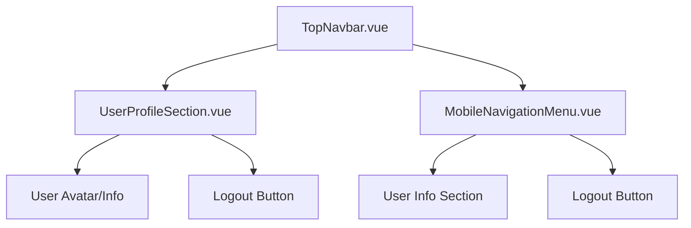
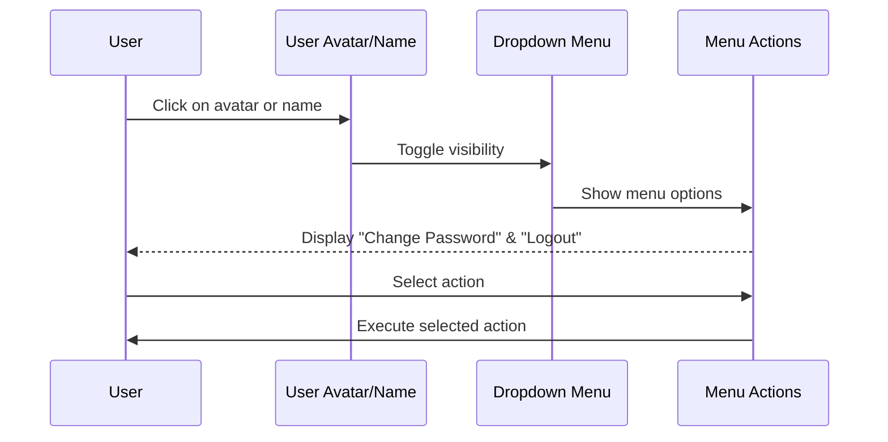
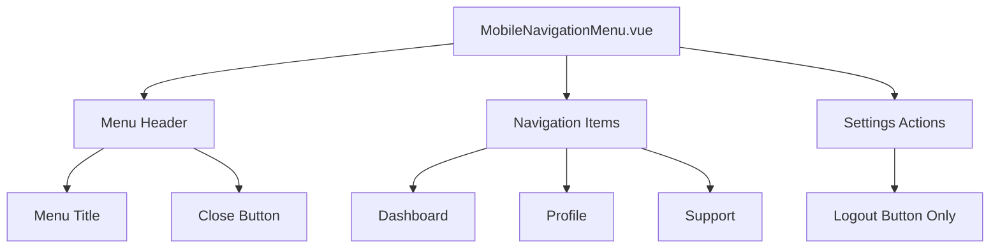

# Navigation Menu Enhancements Design

## Overview

This design document outlines enhancements to the Maya Platform navigation menu system to improve user experience by implementing a dropdown menu for user profile actions and optimizing mobile navigation display.

### Key Objectives

- Implement user profile dropdown menu with "Change Password" and "Logout" options
- Remove standalone logout icon from navigation bar
- Hide user profile display in mobile navigation menu

## Current Architecture Analysis

### Existing Components Structure



### Current User Interface Elements

- **Desktop Navigation**: User avatar, name, and separate logout icon
- **Mobile Navigation**: Full-screen slide menu with user profile section at bottom
- **User Profile Display**: Avatar, full name, and user type label in mobile view

## Enhanced Architecture Design

### Component Modifications

#### UserProfileSection.vue Enhancement

Transform the current linear layout into a dropdown-based interface:



#### Mobile Navigation Optimization

Simplify mobile navigation by removing user profile display:



## Component Specifications

### Enhanced UserProfileSection Component

#### Desktop Layout Structure

```markdown
┌─────────────────────────────────────┐
│ [Avatar] [User Name] [Dropdown ▼] │
│ │
│ Dropdown Menu (when opened): │
│ ┌─────────────────────────────┐ │
│ │ 🔑 Сменить пароль │ │
│ │ 🚪 Выход │ │
│ └─────────────────────────────┘ │
└─────────────────────────────────────┘
```

#### Component Props Interface

| Property | Type         | Required | Description         |
| -------- | ------------ | -------- | ------------------- |
| user     | User \| null | Yes      | Current user object |

#### Component State Management

| State          | Type    | Default | Description                  |
| -------------- | ------- | ------- | ---------------------------- |
| isDropdownOpen | boolean | false   | Controls dropdown visibility |

#### User Interactions

| Interaction             | Trigger                       | Action                           |
| ----------------------- | ----------------------------- | -------------------------------- |
| Click avatar/name       | Mouse click or keyboard Enter | Toggle dropdown menu             |
| Click "Change Password" | Menu item selection           | Navigate to password change page |
| Click "Logout"          | Menu item selection           | Execute logout and redirect      |
| Click outside           | Click event outside component | Close dropdown menu              |
| Press Escape            | Keyboard event                | Close dropdown menu              |

#### Component Methods

```typescript
interface UserProfileMethods {
  toggleDropdown(): void
  closeDropdown(): void
  handleChangePassword(): void
  handleLogout(): void
  handleClickOutside(event: Event): void
}
```

### Mobile Navigation Modifications

#### Simplified Mobile Layout

```markdown
┌─────────────────────────────────────┐
│ [≡] Меню [✕] │
├─────────────────────────────────────┤
│ 📊 Главная │
│ 👤 Профиль │
│ 🎯 Поиск специалистов │
│ 📞 Поддержка │
├─────────────────────────────────────┤
│ │
│ [🚪 Выйти] │
└─────────────────────────────────────┘
```

#### Removed Elements

- User avatar display
- User name display
- User type label display
- User info section container

#### Retained Elements

- Navigation menu items
- Logout button (standalone at bottom)
- Menu header with title and close button

## Implementation Strategy

### Phase 1: UserProfileSection Enhancement

#### Template Structure Changes

```vue
<template>
  <div class="relative" ref="profileRef">
    <!-- Clickable User Profile Trigger -->
    <button
      @click="toggleDropdown"
      :aria-expanded="isDropdownOpen"
      aria-haspopup="true"
      aria-label="User profile menu"
      class="group flex items-center space-x-3 hover:bg-gray-50 
             dark:hover:bg-gray-700 rounded-lg p-2 transition-colors 
             duration-150 focus:outline-none focus:ring-2 
             focus:ring-blue-500 focus:ring-offset-2"
    >
      <!-- User Avatar -->
      
      <div
        v-else
        class="h-8 w-8 rounded-full bg-gray-300 dark:bg-gray-600 
               flex items-center justify-center"
      >
        <span class="text-sm font-medium text-gray-700 dark:text-gray-300">
          {{ userInitials }}
        </span>
      </div>

      <!-- User Info -->
      <div class="flex flex-col">
        <span class="text-sm font-medium text-gray-900 dark:text-white">
          {{ userDisplayName }}
        </span>
      </div>

      <!-- Dropdown Indicator -->
      <ChevronDownIcon
        class="w-4 h-4 text-gray-500 dark:text-gray-400 
               transition-transform duration-200 
               group-aria-expanded:rotate-180"
      />
    </button>

    <!-- Dropdown Menu -->
    <Transition
      enter-active-class="transition ease-out duration-100"
      enter-from-class="transform opacity-0 scale-95"
      enter-to-class="transform opacity-100 scale-100"
      leave-active-class="transition ease-in duration-75"
      leave-from-class="transform opacity-100 scale-100"
      leave-to-class="transform opacity-0 scale-95"
    >
      <div
        v-if="isDropdownOpen"
        role="menu"
        aria-label="User profile options"
        class="absolute top-full right-0 min-w-[200px] bg-white 
               dark:bg-gray-800 border border-gray-200 dark:border-gray-700 
               rounded-lg shadow-lg z-50 mt-1 py-1"
      >
        <button
          @click="handleChangePassword"
          role="menuitem"
          class="flex items-center w-full px-4 py-3 text-left text-sm 
                 text-gray-700 dark:text-gray-300 hover:bg-gray-50 
                 dark:hover:bg-gray-700 transition-colors duration-150 
                 focus:outline-none focus:bg-gray-50 dark:focus:bg-gray-700"
        >
          <KeyIcon class="w-4 h-4 mr-3 text-gray-500 dark:text-gray-400" />
          Сменить пароль
        </button>
        <button
          @click="handleLogout"
          role="menuitem"
          class="flex items-center w-full px-4 py-3 text-left text-sm 
                 text-gray-700 dark:text-gray-300 hover:bg-gray-50 
                 dark:hover:bg-gray-700 transition-colors duration-150 
                 focus:outline-none focus:bg-gray-50 dark:focus:bg-gray-700"
        >
          <ArrowRightOnRectangleIcon class="w-4 h-4 mr-3 text-gray-500 dark:text-gray-400" />
          Выход
        </button>
      </div>
    </Transition>
  </div>
</template>
```

#### Script Logic Implementation

```vue
<script setup lang="ts">
import { ref, onMounted, onUnmounted } from 'vue'
import { useRouter } from 'vue-router'
import { ChevronDownIcon, KeyIcon, ArrowRightOnRectangleIcon } from '@heroicons/vue/24/outline'

const isDropdownOpen = ref(false)
const profileRef = ref<HTMLElement>()

const toggleDropdown = () => {
  isDropdownOpen.value = !isDropdownOpen.value
}

const closeDropdown = () => {
  isDropdownOpen.value = false
}

const handleChangePassword = () => {
  closeDropdown()
  router.push('/profile/change-password')
}

const handleLogout = () => {
  closeDropdown()
  userStore.logout()
  router.push('/login')
}

const handleClickOutside = (event: Event) => {
  if (profileRef.value && !profileRef.value.contains(event.target as Node)) {
    closeDropdown()
  }
}

onMounted(() => {
  document.addEventListener('click', handleClickOutside)
  document.addEventListener('keydown', e => {
    if (e.key === 'Escape') closeDropdown()
  })
})

onUnmounted(() => {
  document.removeEventListener('click', handleClickOutside)
})
</script>
```

### Phase 2: Mobile Navigation Simplification

#### Template Modifications

```vue
<template>
  <!-- Mobile menu overlay -->
  <Transition
    enter-active-class="transition-opacity duration-300"
    enter-from-class="opacity-0"
    enter-to-class="opacity-100"
    leave-active-class="transition-opacity duration-300"
    leave-from-class="opacity-100"
    leave-to-class="opacity-0"
  >
    <div
      v-if="isOpen"
      class="fixed inset-0 z-40 bg-black bg-opacity-25 lg:hidden"
      @click="$emit('close')"
    />
  </Transition>

  <!-- Mobile menu panel -->
  <Transition
    enter-active-class="transition-transform duration-300 ease-in-out"
    enter-from-class="-translate-x-full"
    enter-to-class="translate-x-0"
    leave-active-class="transition-transform duration-300 ease-in-out"
    leave-from-class="translate-x-0"
    leave-to-class="-translate-x-full"
  >
    <div
      v-if="isOpen"
      class="fixed top-0 left-0 z-50 h-full w-64 bg-white 
             dark:bg-gray-800 shadow-xl transform lg:hidden"
    >
      <!-- Menu Header -->
      <div
        class="flex items-center justify-between p-4 border-b 
                  border-gray-200 dark:border-gray-700"
      >
        <span class="text-lg font-semibold text-gray-900 dark:text-white"> Меню </span>
        <button
          @click="$emit('close')"
          class="p-2 rounded-md text-gray-400 hover:text-gray-500 
                 dark:text-gray-300 dark:hover:text-gray-200 
                 hover:bg-gray-100 dark:hover:bg-gray-700 
                 transition-colors focus:outline-none focus:ring-2 
                 focus:ring-blue-500"
        >
          <XMarkIcon class="h-5 w-5" />
        </button>
      </div>

      <!-- Navigation Items -->
      <div class="py-4">
        <router-link
          v-for="item in navigationItems"
          :key="item.id"
          :to="item.route"
          class="flex items-center px-4 py-3 text-base font-medium 
                 text-gray-700 dark:text-gray-300 hover:text-gray-900 
                 dark:hover:text-white hover:bg-gray-50 
                 dark:hover:bg-gray-700 border-l-4 border-transparent 
                 hover:border-blue-500 transition-colors duration-150"
          :class="{ 
            'text-blue-600 dark:text-blue-400 bg-blue-50 
             dark:bg-blue-900/20 border-blue-500': 
            isActiveRoute(item.route) 
          }"
          @click="$emit('close')"
        >
          {{ item.label }}
        </router-link>
      </div>

      <!-- Logout Section (Simplified) -->
      <div
        class="absolute bottom-0 left-0 right-0 p-4 border-t 
                  border-gray-200 dark:border-gray-700"
      >
        <button
          @click="handleLogout"
          class="w-full flex items-center justify-center px-4 py-3 
                 text-sm font-medium text-red-600 dark:text-red-400 
                 bg-red-50 dark:bg-red-900/20 hover:bg-red-100 
                 dark:hover:bg-red-900/30 rounded-md transition-colors 
                 duration-150 focus:outline-none focus:ring-2 
                 focus:ring-red-500 focus:ring-offset-2"
        >
          <ArrowRightOnRectangleIcon class="h-4 w-4 mr-2" />
          Выйти
        </button>
      </div>
    </div>
  </Transition>
</template>
```

### Phase 3: TopNavbar Integration

#### Remove Standalone Elements

- Remove logout icon button from user section
- Update UserProfileSection props to handle dropdown functionality
- Maintain responsive behavior for desktop/mobile views

## Styling Specifications

### Tailwind CSS Classes Implementation

The project uses Tailwind CSS utility classes for styling instead of custom CSS. All styling is implemented through Tailwind utility classes following the project's design system.

#### Dropdown Menu Tailwind Classes

```html
<!-- Dropdown Container -->
<div
  class="absolute top-full right-0 min-w-[200px] bg-white dark:bg-gray-800 
            border border-gray-200 dark:border-gray-700 rounded-lg 
            shadow-lg z-50 mt-1"
>
  <!-- Menu Items -->
  <button
    class="flex items-center w-full px-4 py-3 text-left text-sm 
                 text-gray-700 dark:text-gray-300 hover:bg-gray-50 
                 dark:hover:bg-gray-700 transition-colors duration-150 
                 first:rounded-t-lg last:rounded-b-lg"
  >
    <!-- Menu item content -->
  </button>
</div>

<!-- Dropdown Toggle Icon -->
<ChevronDownIcon
  class="w-4 h-4 text-gray-500 dark:text-gray-400 
                        transition-transform duration-200 
                        group-aria-expanded:rotate-180"
/>
```

#### Mobile Menu Tailwind Classes

```html
<!-- Simplified Logout Section -->
<div
  class="absolute bottom-0 left-0 right-0 p-4 
            border-t border-gray-200 dark:border-gray-700"
>
  <button
    class="w-full flex items-center justify-center px-4 py-3 
                 text-sm font-medium text-red-600 dark:text-red-400 
                 bg-red-50 dark:bg-red-900/20 hover:bg-red-100 
                 dark:hover:bg-red-900/30 rounded-md transition-colors 
                 duration-150 focus:outline-none focus:ring-2 
                 focus:ring-red-500 focus:ring-offset-2"
  >
    <!-- Logout button content -->
  </button>
</div>
```

## Accessibility Considerations

### Keyboard Navigation

- **Tab navigation**: Dropdown trigger accessible via Tab key
- **Enter/Space**: Activate dropdown menu
- **Escape key**: Close dropdown menu
- **Arrow keys**: Navigate between dropdown menu items

### Screen Reader Support

```vue
<button
  @click="toggleDropdown"
  :aria-expanded="isDropdownOpen"
  aria-haspopup="true"
  aria-label="User profile menu"
  class="group flex items-center space-x-3 hover:bg-gray-50 
         dark:hover:bg-gray-700 rounded-lg p-2 transition-colors 
         duration-150 focus:outline-none focus:ring-2 
         focus:ring-blue-500 focus:ring-offset-2"
>
  <!-- Profile content -->
</button>

<div
  v-if="isDropdownOpen"
  role="menu"
  aria-label="User profile options"
  class="absolute top-full right-0 min-w-[200px] bg-white 
         dark:bg-gray-800 border border-gray-200 dark:border-gray-700 
         rounded-lg shadow-lg z-50 mt-1 py-1"
>
  <button 
    role="menuitem" 
    @click="handleChangePassword"
    class="flex items-center w-full px-4 py-3 text-left text-sm 
           text-gray-700 dark:text-gray-300 hover:bg-gray-50 
           dark:hover:bg-gray-700 transition-colors duration-150 
           focus:outline-none focus:bg-gray-50 dark:focus:bg-gray-700"
  >
    Сменить пароль
  </button>
  <button 
    role="menuitem" 
    @click="handleLogout"
    class="flex items-center w-full px-4 py-3 text-left text-sm 
           text-gray-700 dark:text-gray-300 hover:bg-gray-50 
           dark:hover:bg-gray-700 transition-colors duration-150 
           focus:outline-none focus:bg-gray-50 dark:focus:bg-gray-700"
  >
    Выход
  </button>
</div>
```

### Focus Management

- Trap focus within dropdown when open
- Return focus to trigger button when closed
- Provide clear visual focus indicators

## Testing Strategy

### Unit Testing Requirements

#### UserProfileSection Tests

```typescript
describe('UserProfileSection', () => {
  test('should toggle dropdown on click', () => {})
  test('should close dropdown on outside click', () => {})
  test('should close dropdown on escape key', () => {})
  test('should navigate to change password page', () => {})
  test('should execute logout functionality', () => {})
  test('should handle keyboard navigation', () => {})
})

// Run tests with: pnpm test
// Run specific test file: pnpm test UserProfileSection.test.ts
```

#### MobileNavigationMenu Tests

```typescript
describe('MobileNavigationMenu', () => {
  test('should not display user profile section', () => {})
  test('should display only logout button', () => {})
  test('should execute logout from mobile menu', () => {})
  test('should close menu after logout', () => {})
})

// Run tests with: pnpm test
// Run specific test file: pnpm test MobileNavigationMenu.test.ts
```

### Integration Testing

- Test dropdown functionality across different screen sizes
- Verify mobile navigation behavior without user profile
- Test navigation flow from dropdown actions
- Validate accessibility compliance

### Visual Regression Testing

- Compare dropdown menu appearance across browsers
- Verify mobile menu layout without user profile section
- Test responsive behavior during screen size transitions

### Running Tests

```bash
# Run all tests
pnpm test

# Run tests in watch mode
pnpm test --watch

# Run specific test file
pnpm test UserProfileSection.test.ts

# Run type checking
pnpm type-check

# Run linting
pnpm run lint
```
