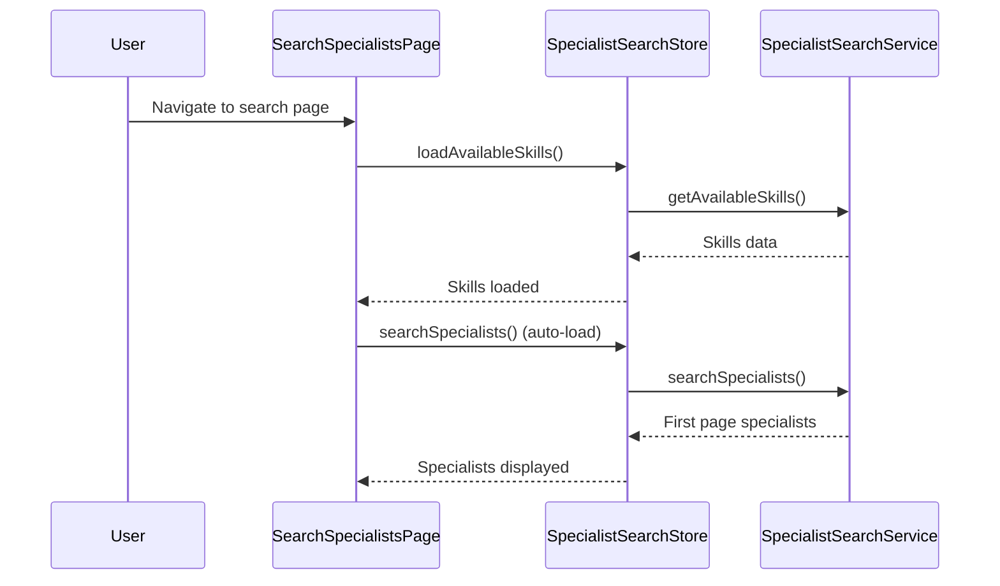
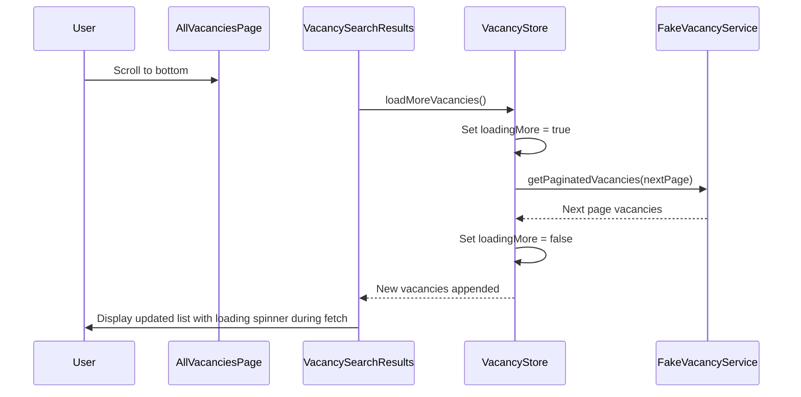

# Specialist Search Auto-Load and Vacancy Page Spinner Implementation

## Overview

This document outlines the implementation plan for two enhancements to the platform:

1. **Automatic data loading for the specialist search page** - Implement automatic loading of the first page of specialists when the page loads, similar to how it's implemented on the vacancies page.
2. **Add spinner for vacancy page data loading** - Add a loading spinner to the vacancy page during infinite scroll data loading, reusing the logic from the specialist search page.

## Architecture

### Current Implementation Analysis

#### Specialist Search Page (`SearchSpecialistsPage.vue`)

- Automatically loads available skills on page mount via `onMounted` hook
- Does NOT automatically load the first page of specialists
- Uses `useSpecialistSearchStore` for state management
- Implements infinite scroll with loading indicators using `useInfiniteScroll` composable
- Shows loading spinner with text "Загружаем еще специалистов..." during infinite scroll

#### All Vacancies Page (`AllVacanciesPage.vue`)

- Automatically loads initial vacancies on page mount via `onMounted` hook
- Uses `useVacancyStore` for state management
- Implements infinite scroll with loading indicators using `useInfiniteScroll` composable
- Missing loading spinner during infinite scroll data loading

### Key Components

1. **Pages**:
   - `SearchSpecialistsPage.vue` - Specialist search page
   - `AllVacanciesPage.vue` - All vacancies page

2. **Stores**:
   - `useSpecialistSearchStore` - Specialist search state management
   - `useVacancyStore` - Vacancy state management

3. **Components**:
   - `SpecialistSearchResults.vue` - Specialist search results with loading spinner
   - `VacancySearchResults.vue` - Vacancy search results (missing loading spinner)

4. **Composables**:
   - `useInfiniteScroll` - Handles infinite scroll functionality

## Implementation Plan

### 1. Auto-Load First Page of Specialists

#### Problem

The specialist search page does not automatically load the first page of specialists when the page loads, unlike the vacancies page.

#### Solution

Add automatic loading of the first page of specialists in the `onMounted` hook of `SearchSpecialistsPage.vue`.

#### Implementation Steps

1. Modify `SearchSpecialistsPage.vue` to call `searchSpecialists()` on mount
2. Ensure the initial search uses default parameters (no filters)

#### Code Changes

```typescript
// In SearchSpecialistsPage.vue
onMounted(async () => {
  // Load available skills on page mount
  await searchStore.loadAvailableSkills()
  // Automatically load first page of specialists
  await searchStore.searchSpecialists()
})
```

### 2. Add Loading Spinner to Vacancy Page

#### Problem

The vacancy page is missing a loading spinner during infinite scroll data loading, making it unclear to users when more data is being fetched.

#### Solution

Implement the same loading spinner UI that exists in `SpecialistSearchResults.vue` in `VacancySearchResults.vue`.

#### Implementation Analysis

The `VacancySearchResults.vue` component already has:

- `loadingMore` prop handling
- Loading spinner markup (but it's not visible in the UI)
- Proper integration with the `useInfiniteScroll` composable

However, the vacancy store needs to properly set the `loadingMore` state during infinite scroll operations.

#### Implementation Steps

1. Update `useVacancyStore` to properly manage `loadingMore` state
2. Verify `VacancySearchResults.vue` properly displays the loading spinner

#### Code Changes

##### Update Vacancy Store

```typescript
// In vacancy store loadMoreVacancies function
const loadMoreVacancies = async () => {
  if (!canLoadMore.value) return

  // Set loadingMore to true before incrementing page
  loadingMore.value = true
  currentPage.value++

  try {
    await searchVacancies(
      {
        page: currentPage.value,
      },
      false
    ) // Don't reset results
  } catch (err) {
    // Revert page increment on error
    currentPage.value--
    error.value = err instanceof Error ? err.message : 'Ошибка загрузки дополнительных результатов'
  } finally {
    loadingMore.value = false
  }
}
```

## Data Flow

### Specialist Search Auto-Load Flow



### Vacancy Page Infinite Scroll Flow



## UI/UX Considerations

### Loading States

1. **Initial Loading**:
   - Both pages show a centered spinner with descriptive text during initial data loading
   - Consistent styling with blue spinner and appropriate messaging

2. **Infinite Scroll Loading**:
   - Specialist search page shows "Загружаем еще специалистов..." with spinner
   - Vacancy page will now show "Загружаем еще вакансии..." with spinner (already implemented in markup)

### Error Handling

Both pages implement consistent error handling:

- Clear error messages
- Retry functionality
- Visual distinction for error states

### Responsive Design

Both pages use responsive grid layouts that adapt to different screen sizes, with consistent spacing and component sizing.

## Testing Strategy

### Unit Tests

1. Test that `SearchSpecialistsPage.vue` automatically loads specialists on mount
2. Test that `VacancySearchResults.vue` properly displays loading spinner when `loadingMore` prop is true
3. Test that `useVacancyStore` correctly manages `loadingMore` state during infinite scroll

### Integration Tests

1. Verify that navigating to the specialist search page automatically loads the first page of results
2. Verify that scrolling to the bottom of the vacancy page shows loading spinner during data fetch
3. Verify that both pages maintain proper state during loading, error, and success scenarios

## Dependencies

- `useInfiniteScroll` composable for handling scroll detection
- Pinia stores for state management
- Tailwind CSS for styling
- HeroIcons for UI icons

## Performance Considerations

1. Throttling of scroll events is handled by the `useInfiniteScroll` composable
2. Proper cleanup of observers prevents memory leaks
3. Loading states provide clear feedback to users to prevent repeated actions})

````

### 2. Add Loading Spinner to Vacancy Page

#### Problem
The vacancy page is missing a loading spinner during infinite scroll data loading, making it unclear to users when more data is being fetched.

#### Solution
Implement the same loading spinner UI that exists in `SpecialistSearchResults.vue` in `VacancySearchResults.vue`.

#### Implementation Analysis
The `VacancySearchResults.vue` component already has:
- `loadingMore` prop handling
- Loading spinner markup (but it's not visible in the UI)
- Proper integration with the `useInfiniteScroll` composable

However, the vacancy store needs to properly set the `loadingMore` state during infinite scroll operations.

#### Implementation Steps
1. Update `useVacancyStore` to properly manage `loadingMore` state
2. Verify `VacancySearchResults.vue` properly displays the loading spinner

#### Code Changes

##### Update Vacancy Store
```typescript
// In vacancy store loadMoreVacancies function
const loadMoreVacancies = async () => {
  if (!canLoadMore.value) return

  // Set loadingMore to true before incrementing page
  loadingMore.value = true
  currentPage.value++

  try {
    await searchVacancies(
      {
        page: currentPage.value,
      },
      false
    ) // Don't reset results
  } catch (err) {
    // Revert page increment on error
    currentPage.value--
    error.value = err instanceof Error ? err.message : 'Ошибка загрузки дополнительных результатов'
  } finally {
    loadingMore.value = false
  }
}
````

## Data Flow

### Specialist Search Auto-Load Flow


### Vacancy Page Infinite Scroll Flow


## UI/UX Considerations

### Loading States

1. **Initial Loading**:
   - Both pages show a centered spinner with descriptive text during initial data loading
   - Consistent styling with blue spinner and appropriate messaging

2. **Infinite Scroll Loading**:
   - Specialist search page shows "Загружаем еще специалистов..." with spinner
   - Vacancy page will now show "Загружаем еще вакансии..." with spinner (already implemented in markup)

### Error Handling

Both pages implement consistent error handling:

- Clear error messages
- Retry functionality
- Visual distinction for error states

### Responsive Design

Both pages use responsive grid layouts that adapt to different screen sizes, with consistent spacing and component sizing.

## Testing Strategy

### Unit Tests

1. Test that `SearchSpecialistsPage.vue` automatically loads specialists on mount
2. Test that `VacancySearchResults.vue` properly displays loading spinner when `loadingMore` prop is true
3. Test that `useVacancyStore` correctly manages `loadingMore` state during infinite scroll

### Integration Tests

1. Verify that navigating to the specialist search page automatically loads the first page of results
2. Verify that scrolling to the bottom of the vacancy page shows loading spinner during data fetch
3. Verify that both pages maintain proper state during loading, error, and success scenarios

## Dependencies

- `useInfiniteScroll` composable for handling scroll detection
- Pinia stores for state management
- Tailwind CSS for styling
- HeroIcons for UI icons

## Performance Considerations

1. Throttling of scroll events is handled by the `useInfiniteScroll` composable
2. Proper cleanup of observers prevents memory leaks
3. Loading states provide clear feedback to users to prevent repeated actions
