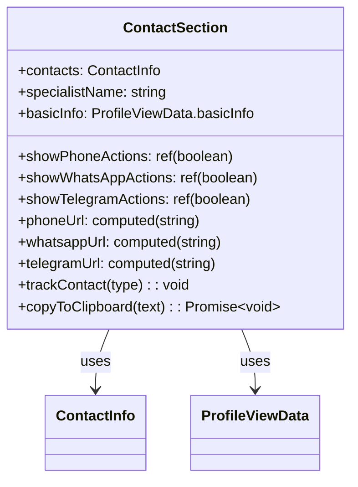
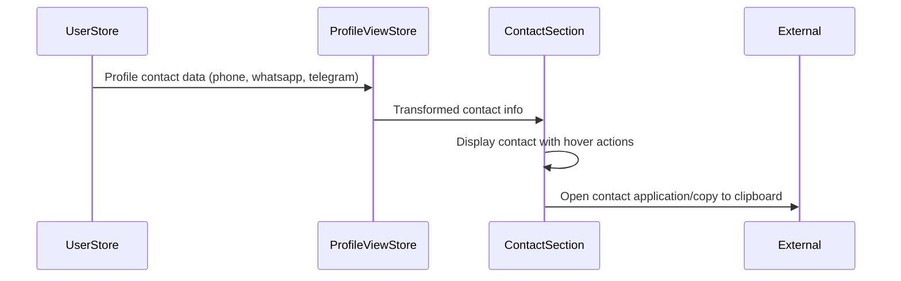
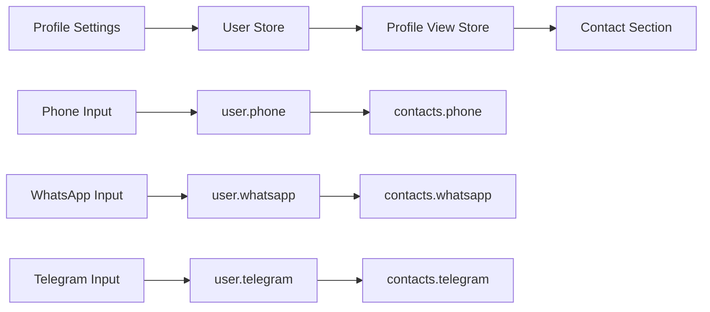

# Profile Contact Section Update Design

## Overview

This design document outlines the update to the ContactSection component in the specialist profile detail/portfolio page. The update involves replacing the website contact field with phone contact while retaining Telegram and Email. The new contact information will be sourced from the user profile settings.

## Repository Type

Frontend Application (Vue.js)

## Architecture

### Current State Analysis

The ContactSection component currently displays:

- Telegram contact with hover actions (open link, copy to clipboard)
- Email contact with hover actions (open mailto, copy to clipboard)
- Website contact with hover actions (open link, copy to clipboard)

### Updated Contact Fields

The component will be modified to display:

- **Phone** - with hover actions (call, copy to clipboard)
- **WhatsApp** - with hover actions (open WhatsApp chat, copy to clipboard)
- **Telegram** - with hover actions (open Telegram, copy to clipboard)

## Component Architecture

### ContactSection Component Updates



### Data Flow Integration



### Type Definitions Update

The existing `ContactInfo` interface already supports the required fields:

```typescript
interface ContactInfo {
  telegram?: string
  email?: string
  website?: string // Will be removed from display
  phone?: string // Will be displayed
  whatsapp?: string // Will be displayed
  // ... other fields
}
```

## UI/UX Design

### Contact Display Layout

Each contact method follows a consistent pattern:

- **Icon Container**: Colored background with white icon
- **Content Area**: Label and contact value
- **Hover Actions**: Open external app and copy to clipboard buttons

### Contact Method Styling

| Contact Type | Icon Color               | Icon          | Label      |
| ------------ | ------------------------ | ------------- | ---------- |
| Phone        | Orange (`bg-orange-500`) | Phone icon    | "Телефон"  |
| WhatsApp     | Green (`bg-green-500`)   | WhatsApp icon | "WhatsApp" |
| Telegram     | Blue (`bg-blue-500`)     | Telegram icon | "Telegram" |

### Hover Interaction Patterns

```mermaid
stateDiagram-v2
    [*] --> Default
    Default --> ShowActions : mouseenter
    ShowActions --> Default : mouseleave
    ShowActions --> External : click_open
    ShowActions --> Clipboard : click_copy
    External --> ShowActions : return
    Clipboard --> ShowActions : complete
```

## Implementation Details

### Template Structure Changes

```vue
<!-- Phone Contact -->
<div
  v-if="contacts.phone"
  class="flex items-center space-x-3 group relative"
  @mouseenter="showPhoneActions = true"
  @mouseleave="showPhoneActions = false"
>
  <div class="w-10 h-10 bg-orange-500 rounded-lg flex items-center justify-center">
    <!-- Phone icon SVG -->
  </div>
  <div class="flex-1 min-w-0">
    <div class="text-sm font-medium text-gray-900 dark:text-white">Телефон</div>
    <div class="text-sm text-gray-600 dark:text-gray-400 truncate">{{ contacts.phone }}</div>
  </div>
  <!-- Hover actions for call and copy -->
</div>

<!-- WhatsApp Contact -->
<div
  v-if="contacts.whatsapp"
  class="flex items-center space-x-3 group relative"
  @mouseenter="showWhatsAppActions = true"
  @mouseleave="showWhatsAppActions = false"
>
  <div class="w-10 h-10 bg-green-500 rounded-lg flex items-center justify-center">
    <!-- WhatsApp icon SVG -->
  </div>
  <!-- Similar structure with WhatsApp-specific actions -->
</div>
```

### URL Generation Logic

```typescript
// Phone URL for tel: protocol
const phoneUrl = computed(() => {
  if (!props.contacts.phone) return ''
  return `tel:${props.contacts.phone}`
})

// WhatsApp URL with pre-filled message
const whatsappUrl = computed(() => {
  if (!props.contacts.whatsapp) return ''
  const cleanPhone = props.contacts.whatsapp.replace(/\D/g, '')
  const message = encodeURIComponent(
    `Здравствуйте! Интересуют ваши услуги. Увидел ваш профиль на MayaWork.`
  )
  return `https://wa.me/${cleanPhone}?text=${message}`
})
```

### Reactive State Management

```typescript
// Hover state for each contact type
const showPhoneActions = ref(false)
const showWhatsAppActions = ref(false)
const showTelegramActions = ref(false) // existing
// Remove: showEmailActions, showWebsiteActions
```

## Data Integration

### User Profile Connection

The contact information flows from the user profile settings:



### Contact Information Source

The contact data is already available in the user store with the following structure:

```typescript
// From UserStore currentUser
{
  phone: '+7 (916) 123-45-67',
  whatsapp: '+7 (916) 123-45-67',
  telegram: '@anna_designer'
}
```

## Testing Strategy

### Component Testing

```typescript
describe('ContactSection Component', () => {
  it('should display phone contact when available', () => {
    // Test phone contact rendering
  })

  it('should display WhatsApp contact when available', () => {
    // Test WhatsApp contact rendering
  })

  it('should not display website contact', () => {
    // Ensure website is not rendered
  })

  it('should generate correct phone URL', () => {
    // Test tel: URL generation
  })

  it('should generate correct WhatsApp URL', () => {
    // Test WhatsApp URL with message
  })

  it('should show hover actions on mouseenter', () => {
    // Test hover interaction
  })
})
```

### Integration Testing

- Verify contact data flows from user profile to specialist profile view
- Test contact actions (call, WhatsApp chat, copy to clipboard)
- Validate responsive behavior across device sizes

## Migration Considerations

### Backward Compatibility

- Existing email and telegram contacts continue to work
- Website field remains in data model but is not displayed
- No database schema changes required

### Data Mapping

The specialist profile view service already transforms user contact data:

```typescript
// In specialist-profile-view.ts service
const contacts: ContactInfo = {
  telegram: detailedProfile.contacts.data.telegram,
  email: detailedProfile.contacts.data.email,
  phone: detailedProfile.contacts.data.phone, // Already mapped
  whatsapp: detailedProfile.contacts.data.whatsapp, // Already mapped
  // website removed from display but kept in data
}
```
