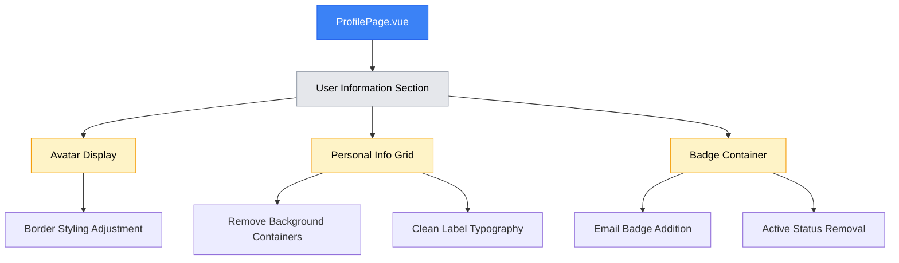

# Profile Page Enhancements Design

## Overview

This design document outlines enhancements to the MayaWork profile page to improve user experience and visual clarity. The improvements focus on modernizing the personal information display, reducing visual clutter, and highlighting important contact information.

## Current State Analysis

The profile page currently displays user information in a structured layout with:

- Avatar section with thick gray border (4px)
- Name and surname fields wrapped in gray background containers
- Email displayed as plain text
- "Активен" (Active) status badge for all users
- User type badge (Specialist/Client)

## Enhancement Requirements

### 1. Personal Information Layout Redesign

**Current Implementation:**

- Name and surname fields are displayed in gray background containers with rounded borders
- Each field uses `bg-gray-50 dark:bg-gray-700/30 rounded-lg p-4` styling

**Required Changes:**

- Remove gray background containers and borders
- Display labels properly with clean typography
- Maintain current values display below labels
- Preserve responsive grid layout (1 column on mobile, 2 columns on desktop)

### 2. Avatar Border Refinement

**Current Implementation:**

- Avatar uses thick border: `border-4 border-gray-300 dark:border-gray-600`

**Required Changes:**

- Reduce border thickness to create a more refined appearance
- Maintain dark mode compatibility

### 3. Email Badge Styling

**Current Implementation:**

- Email displayed as plain text with gray color

**Required Changes:**

- Style email as green badge for better visibility and quick identification
- Use consistent badge styling pattern from the platform

### 4. Status Badge Removal

**Current Implementation:**

- "Активен" (Active) status badge shown for all users

**Required Changes:**

- Remove the active status badge completely
- Users cannot manage this status, making it unnecessary UI clutter
- Preserve user type badge (Specialist/Client)

## Technical Implementation Strategy

### Component Structure



### Layout Architecture

#### Current Personal Information Grid

```vue
<div class="grid grid-cols-1 sm:grid-cols-2 gap-4">
  <div class="bg-gray-50 dark:bg-gray-700/30 rounded-lg p-4">
    <label class="block text-xs font-semibold text-gray-500 dark:text-gray-400 uppercase tracking-wider mb-1">
      Имя
    </label>
    <p class="text-gray-900 dark:text-white">
      {{ userStore.currentUser?.firstName }}
    </p>
  </div>
  <div class="bg-gray-50 dark:bg-gray-700/30 rounded-lg p-4">
    <label class="block text-xs font-semibold text-gray-500 dark:text-gray-400 uppercase tracking-wider mb-1">
      Фамилия
    </label>
    <p class="text-gray-900 dark:text-white">
      {{ userStore.currentUser?.lastName }}
    </p>
  </div>
</div>
```

#### Enhanced Personal Information Grid

```vue
<div class="grid grid-cols-1 sm:grid-cols-2 gap-6">
  <div class="space-y-2">
    <label class="block text-sm font-medium text-gray-500 dark:text-gray-400 uppercase tracking-wider">
      Имя
    </label>
    <p class="text-lg font-medium text-gray-900 dark:text-white">
      {{ userStore.currentUser?.firstName }}
    </p>
  </div>
  <div class="space-y-2">
    <label class="block text-sm font-medium text-gray-500 dark:text-gray-400 uppercase tracking-wider">
      Фамилия
    </label>
    <p class="text-lg font-medium text-gray-900 dark:text-white">
      {{ userStore.currentUser?.lastName }}
    </p>
  </div>
</div>
```

### Avatar Styling Enhancement

#### Current Avatar Implementation

```vue
<div
  class="bg-gray-200 dark:bg-gray-700 border-4 border-gray-300 dark:border-gray-600 rounded-full shadow-md w-40 h-40 flex items-center justify-center overflow-hidden"
></div>
```

#### Enhanced Avatar Implementation

```vue
<div
  class="bg-gray-200 dark:bg-gray-700 border-2 border-gray-200 dark:border-gray-500 rounded-full shadow-md w-40 h-40 flex items-center justify-center overflow-hidden"
></div>
```

### Badge System Implementation

#### Current Badge Layout

```vue
<div class="flex flex-wrap justify-center md:justify-end gap-2">
  <!-- User Type Badge -->
  <span class="inline-flex items-center px-3 py-1 rounded-full text-sm font-medium bg-green-100 text-green-800 dark:bg-green-900/20 dark:text-green-400">
    {{ userStore.currentUser?.userType === 'specialist' ? 'Специалист' : 'Клиент' }}
  </span>
  <!-- Active Status Badge (TO BE REMOVED) -->
  <span class="inline-flex items-center px-3 py-1 rounded-full text-sm font-medium bg-green-100 text-green-800 dark:bg-green-900/20 dark:text-green-400">
    {{ userStore.currentUser?.isActive ? 'Активен' : 'Неактивен' }}
  </span>
</div>
```

#### Enhanced Badge Layout with Email Badge

```vue
<div class="flex flex-wrap justify-center md:justify-end gap-2">
  <!-- Email Badge (NEW) -->
  <span class="inline-flex items-center px-3 py-1 rounded-full text-sm font-medium bg-green-100 text-green-800 dark:bg-green-900/20 dark:text-green-400">
    {{ userStore.currentUser?.email }}
  </span>
  <!-- User Type Badge -->
  <span class="inline-flex items-center px-3 py-1 rounded-full text-sm font-medium"
        :class="userStore.currentUser?.userType === 'specialist' 
                ? 'bg-blue-100 text-blue-800 dark:bg-blue-900/20 dark:text-blue-400'
                : 'bg-purple-100 text-purple-800 dark:bg-purple-900/20 dark:text-purple-400'">
    {{ userStore.currentUser?.userType === 'specialist' ? 'Специалист' : 'Клиент' }}
  </span>
</div>
```

### Typography and Spacing System

#### Label Typography Enhancement

- **Current**: `text-xs font-semibold` (12px, semi-bold)
- **Enhanced**: `text-sm font-medium` (14px, medium weight)
- Improved readability while maintaining visual hierarchy

#### Value Typography Enhancement

- **Current**: Default paragraph styling
- **Enhanced**: `text-lg font-medium` for better emphasis
- Creates clear distinction between label and value

#### Spacing Improvements

- **Current**: `gap-4` (16px) between grid items
- **Enhanced**: `gap-6` (24px) for better visual separation
- **Field Spacing**: `space-y-2` (8px) between label and value

## Design Principles

### Visual Hierarchy

1. **Primary Information**: User name displayed prominently
2. **Secondary Information**: Email highlighted as green badge for quick identification
3. **Tertiary Information**: User type badge with color coding
4. **Supporting Information**: Name/surname fields with clear labels

### Color Strategy

- **Green Badges**: Email contact information (high visibility)
- **Blue Badges**: Specialist user type
- **Purple Badges**: Client user type
- **Neutral Colors**: Labels and secondary text

### Responsive Behavior

- **Mobile (< 640px)**: Single column layout for personal information
- **Tablet/Desktop (≥ 640px)**: Two-column grid layout
- **Badge Layout**: Centered on mobile, right-aligned on desktop

## Accessibility Considerations

### Screen Reader Support

- Maintain semantic label-value relationships
- Preserve ARIA attributes for interactive elements
- Ensure adequate color contrast ratios

### Keyboard Navigation

- Badge elements remain focusable where interactive
- Tab order preserved for logical navigation

### Color Accessibility

- Green badge meets WCAG AA contrast requirements
- Dark mode implementation maintains accessibility standards

## Testing Strategy

### Visual Regression Testing

- Compare before/after screenshots for layout changes
- Verify responsive behavior across breakpoints
- Test dark mode implementation

### Functional Testing

- Ensure email display functions correctly
- Verify badge visibility and readability
- Test responsive layout behavior

### Cross-Browser Compatibility

- Verify consistent rendering across major browsers
- Test mobile device compatibility
- Validate dark mode transitions

## Performance Impact

### CSS Optimizations

- Remove unnecessary background styling from personal info fields
- Simplify border properties for avatar
- Maintain Tailwind CSS utility classes for optimal bundle size

### Rendering Efficiency

- No additional JavaScript logic required
- Template changes only affect rendering, not reactivity
- Minimal impact on component performance

## Future Considerations

### Extensibility

- Badge system designed for easy addition of new status indicators
- Personal information layout can accommodate additional fields
- Avatar system prepared for future enhancement features

### Maintenance

- Consistent use of design tokens for easy theme updates
- Modular styling approach for component reusability
- Clear documentation for future developer reference
