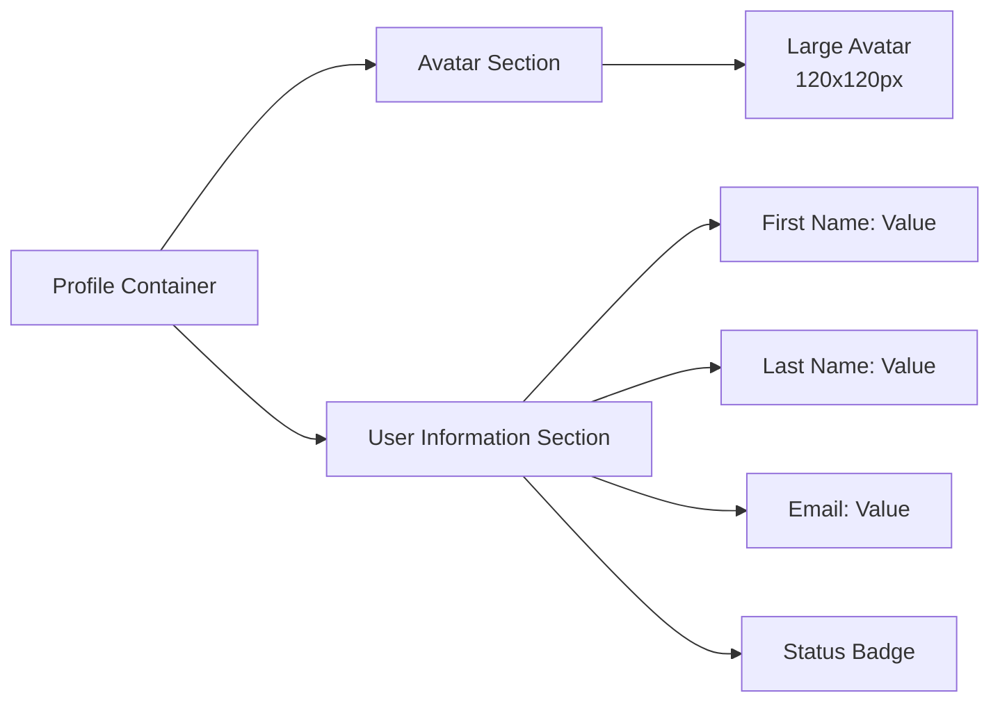

# Profile Page Redesign

## Overview

This document outlines the redesign of the user profile page to improve its visual appeal and layout. The main goals are to:

1. Reposition the avatar to the left side of the profile information block
2. Move other profile fields to the right side
3. Increase the avatar size for better visual impact
4. Enhance the overall visual presentation of the profile

## Current Profile Page Structure

Based on the analysis, the current profile page (`/profile`) includes:

- User information section with name, email, and status
- Profile actions section with action cards for specialists and clients

The user information is currently displayed in a grid layout with fields distributed across columns.

## Redesign Requirements

1. **Avatar Placement**: Move the user avatar to the left side of the profile information block
2. **Content Layout**: Position other profile fields (name, email, status) on the right side of the avatar
3. **Avatar Size**: Increase the avatar size for better visual prominence
4. **Visual Enhancement**: Improve the overall styling and visual hierarchy of the profile section

## Proposed Design

### Layout Structure

The new layout will implement a flex-based design with the avatar on the left and user information on the right:

### Avatar Enhancement

- **Current Size**: Small/medium sized avatar in the grid layout
- **New Size**: Significantly larger avatar (approximately 120x120px or more)
- **Styling**: Enhanced visual treatment with border, shadow, and potential placeholder styling

### Content Layout Changes

- **Current Layout**: Grid-based layout with fields distributed across columns
- **New Layout**: Two-column layout with avatar on the left and information on the right
- **Alignment**: Proper vertical alignment between avatar and information fields

## Visual Design Specifications

### Avatar Styling

- Size: 120px x 120px (desktop), responsive on mobile
- Border: 4px solid with subtle color
- Shadow: Subtle drop shadow for depth
- Placeholder: Initials-based placeholder when no image is available

### Layout Spacing

- Gap between avatar and information: 24px
- Internal padding within information section: 16px
- Section padding: 24px

### Typography

- User name: Larger font size for prominence
- Labels: Consistent styling with current design system
- Values: Clear, readable text

## Implementation Details

### Component Structure

The profile page will be restructured to include:

1. **Profile Information Section**
   - Avatar container (left side)
   - User details container (right side)
   - Responsive layout for different screen sizes

2. **Profile Actions Section**
   - Maintains existing functionality
   - May require minor styling adjustments for consistency

### CSS Classes and Styling

- Utilize Flexbox through Tailwind CSS classes (`flex`, `flex-row`, `flex-col` for responsive behavior)
- Implement responsive design with Tailwind's breakpoints (`sm`, `md`, `lg`, `xl`)
- Enhance visual styling with Tailwind's utility classes for shadows, borders, and spacing
- Maintain dark theme compatibility using Tailwind's `dark:` variant classes

### Responsive Considerations

- On mobile devices, use `flex-col` to stack avatar on top with information below
- On tablet and desktop, use `flex-row` to maintain the left-right layout
- Ensure proper spacing and sizing using Tailwind's responsive spacing utilities

## Technical Implementation

### File Modifications

- `/src/pages/ProfilePage.vue` - Main layout changes
- Related CSS files for styling updates

### Component Changes

- Restructure the user information section markup
- Update styling to implement the new layout using Tailwind CSS classes
- Ensure responsive behavior across device sizes

### Data Handling

- No changes to data flow or store interactions
- Maintain existing computed properties and data bindings

## Testing Considerations

### Visual Testing

- Verify avatar size and positioning on different screen sizes
- Check alignment between avatar and information fields
- Ensure consistent styling with rest of the application

### Functional Testing

- Confirm all user data is displayed correctly
- Validate that action cards still function as expected
- Test dark theme compatibility

## Dependencies

This redesign does not introduce new dependencies and works within the existing:

- Vue 3 with Composition API
- Tailwind CSS for styling
- Pinia for state management
- Existing component library

The project uses pnpm for package management, so all existing dependencies and build processes will remain unchanged.

## Development Process

To implement this redesign, developers should:

1. Use pnpm to install any necessary dependencies (though none are expected for this redesign)
2. Leverage Tailwind CSS utility classes for all styling changes
3. Test the implementation using the existing development server
4. Run type checking with `pnpm type-check` to ensure TypeScript compatibility
5. Follow existing component patterns and conventions
