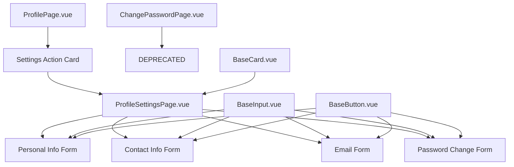
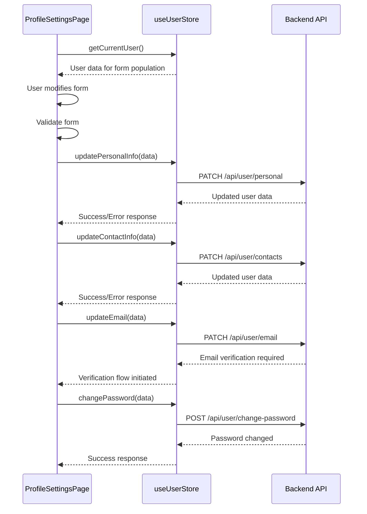
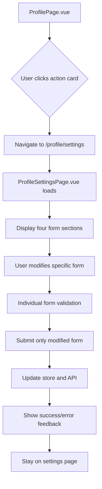
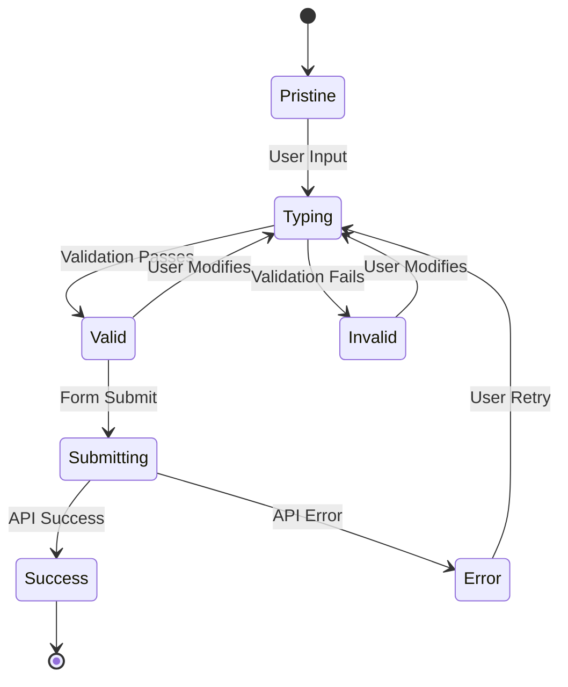

# Profile Settings Enhancement Design

## Overview

This document outlines the redesign of the current profile and password change pages into a comprehensive profile settings system. The enhancement transforms the existing change password page into a centralized profile settings hub with multiple independent forms for different user data categories.

### Key Changes

1. **Change Password Page → Profile Settings Page**: Convert the existing password change page into a comprehensive settings interface
2. **Modular Form Structure**: Implement four independent forms within the settings page
3. **Profile Navigation Update**: Replace "Смена пароля" with "Настройки" in profile actions

## Technology Stack & Dependencies

**Frontend Framework**: Vue 3 with Composition API
**State Management**: Pinia stores
**Styling**: Tailwind CSS with dark mode support
**Form Validation**: Custom validation logic with reactive error handling
**Navigation**: Vue Router
**UI Components**: Existing base components (BaseInput, BaseButton, BaseCard)

## Component Architecture

### Updated Component Hierarchy



### Component Definitions

#### ProfileSettingsPage.vue (New Component)

**Purpose**: Central hub for all profile-related settings
**Location**: `/src/pages/ProfileSettingsPage.vue`
**Features**:

- Four independent form sections
- Consistent dark mode styling
- Individual form validation
- Selective form submission
- Responsive grid layout

#### Individual Form Sections

**Personal Information Form**:

- First Name field
- Last Name field
- Photo upload functionality
- Avatar preview

**Contact Information Form**:

- Phone number field
- WhatsApp contact field
- Telegram username field

**Email Form**:

- Current email display
- New email field
- Email confirmation field
- Email verification flow

**Password Change Form**:

- Migrated from existing ChangePasswordPage
- Current password field
- New password field with strength indicator
- Password confirmation field

### Props and State Management

#### ProfileSettingsPage State Structure

```typescript
interface PersonalInfoForm {
  firstName: string
  lastName: string
  avatar: File | null
  avatarPreview: string
}

interface ContactInfoForm {
  phone: string
  whatsapp: string
  telegram: string
}

interface EmailForm {
  currentEmail: string
  newEmail: string
  confirmEmail: string
}

interface PasswordForm {
  currentPassword: string
  newPassword: string
  confirmPassword: string
}

interface FormStates {
  personalInfo: {
    isLoading: boolean
    isValid: boolean
    errors: Record<string, string>
  }
  contactInfo: {
    isLoading: boolean
    isValid: boolean
    errors: Record<string, string>
  }
  email: {
    isLoading: boolean
    isValid: boolean
    errors: Record<string, string>
  }
  password: {
    isLoading: boolean
    isValid: boolean
    errors: Record<string, string>
  }
}
```

#### User Store Integration



## Routing & Navigation

### Route Configuration Updates

```typescript
// Updated route in router/index.ts
{
  path: '/profile/settings',
  name: 'ProfileSettings',
  component: ProfileSettingsPage,
  meta: {
    title: 'Настройки профиля',
    requiresAuth: true,
  },
},
// Deprecated route - redirect to settings
{
  path: '/profile/change-password',
  name: 'ChangePassword',
  redirect: '/profile/settings'
}
```

### Navigation Flow



## State Management

### User Store Extensions

```typescript
// Additional methods in stores/user.ts
export const useUserStore = defineStore('user', () => {
  // Existing state...

  const updatePersonalInfo = async (data: PersonalInfoUpdate) => {
    try {
      const response = await userService.updatePersonalInfo(data)
      if (currentUser.value) {
        currentUser.value.firstName = response.firstName
        currentUser.value.lastName = response.lastName
        currentUser.value.avatar = response.avatar
      }
      return response
    } catch (error) {
      console.error('Failed to update personal info:', error)
      throw error
    }
  }

  const updateContactInfo = async (data: ContactInfoUpdate) => {
    try {
      const response = await userService.updateContactInfo(data)
      // Update local state with new contact information
      return response
    } catch (error) {
      console.error('Failed to update contact info:', error)
      throw error
    }
  }

  const updateEmail = async (data: EmailUpdate) => {
    try {
      const response = await userService.updateEmail(data)
      // Handle email verification flow
      return response
    } catch (error) {
      console.error('Failed to update email:', error)
      throw error
    }
  }

  const changePassword = async (data: PasswordChange) => {
    try {
      const response = await userService.changePassword(data)
      return response
    } catch (error) {
      console.error('Failed to change password:', error)
      throw error
    }
  }

  return {
    // Existing exports...
    updatePersonalInfo,
    updateContactInfo,
    updateEmail,
    changePassword,
  }
})
```

## API Integration Layer

### Service Layer Extensions

```typescript
// services/user.ts extensions
export interface PersonalInfoUpdate {
  firstName: string
  lastName: string
  avatar?: File
}

export interface ContactInfoUpdate {
  phone: string
  whatsapp: string
  telegram: string
}

export interface EmailUpdate {
  newEmail: string
  confirmEmail: string
}

export interface PasswordChange {
  currentPassword: string
  newPassword: string
  confirmPassword: string
}

export const userService = {
  // Existing methods...

  async updatePersonalInfo(data: PersonalInfoUpdate): Promise<User> {
    const formData = new FormData()
    formData.append('firstName', data.firstName)
    formData.append('lastName', data.lastName)
    if (data.avatar) {
      formData.append('avatar', data.avatar)
    }

    const response = await api.patch('/api/user/personal', formData, {
      headers: { 'Content-Type': 'multipart/form-data' },
    })
    return response.data
  },

  async updateContactInfo(data: ContactInfoUpdate): Promise<User> {
    const response = await api.patch('/api/user/contacts', data)
    return response.data
  },

  async updateEmail(
    data: EmailUpdate
  ): Promise<{ message: string; verificationRequired: boolean }> {
    const response = await api.patch('/api/user/email', data)
    return response.data
  },

  async changePassword(data: PasswordChange): Promise<{ message: string }> {
    const response = await api.post('/api/user/change-password', data)
    return response.data
  },
}
```

## UI/UX Design Specifications

### Layout Structure

```mermaid
graph TB
    A[Page Header: "Настройки профиля"] --> B[Main Container]
    B --> C[Four-Column Grid Layout]
    C --> D[Personal Info Card]
    C --> E[Contact Info Card]
    C --> F[Email Card]
    C --> G[Password Card]

    D --> D1[Avatar Upload]
    D --> D2[First Name Input]
    D --> D3[Last Name Input]
    D --> D4[Save Button]

    E --> E1[Phone Input]
    E --> E2[WhatsApp Input]
    E --> E3[Telegram Input]
    E --> E4[Save Button]

    F --> F1[Current Email Display]
    F --> F2[New Email Input]
    F --> F3[Confirm Email Input]
    F --> F4[Update Button]

    G --> G1[Current Password Input]
    G --> G2[New Password Input + Strength]
    G --> G3[Confirm Password Input]
    G --> G4[Change Button]
```

### Responsive Design

**Desktop (lg+)**: 2x2 grid layout
**Tablet (md)**: 2x2 grid layout with smaller cards
**Mobile (sm)**: Single column stack

### Dark Mode Support

All form components inherit existing dark mode styling:

- Background: `bg-white dark:bg-gray-800`
- Text: `text-gray-900 dark:text-white`
- Borders: `border-gray-200 dark:border-gray-700`
- Inputs: Existing BaseInput dark mode support

### Form Validation Design

#### Visual Validation States



#### Error Display Patterns

- **Field-level errors**: Display below each input with red text
- **Form-level errors**: Display at top of each card with error banner
- **Success feedback**: Green banner with success message
- **Loading states**: Button shows spinner and "Сохранение..." text

## Testing Strategy

### Unit Testing Requirements

#### Component Tests

- **ProfileSettingsPage.vue**: Test form rendering, validation, submission
- **Form sections**: Test individual form logic and validation
- **User store methods**: Test new API integration methods

#### Test Structure

```typescript
// tests/pages/ProfileSettingsPage.test.ts
describe('ProfileSettingsPage', () => {
  describe('Personal Info Form', () => {
    it('should validate first name requirement')
    it('should validate last name requirement')
    it('should handle avatar upload')
    it('should submit personal info independently')
  })

  describe('Contact Info Form', () => {
    it('should validate phone number format')
    it('should allow optional WhatsApp field')
    it('should allow optional Telegram field')
    it('should submit contact info independently')
  })

  describe('Email Form', () => {
    it('should display current email')
    it('should validate email format')
    it('should validate email confirmation match')
    it('should handle email verification flow')
  })

  describe('Password Form', () => {
    it('should migrate existing password change logic')
    it('should maintain password strength indicator')
    it('should validate password confirmation')
    it('should submit password change independently')
  })
})
```

### Integration Testing

#### User Store Integration

- Test new store methods with mock API responses
- Test error handling for failed API calls
- Test state updates after successful operations

#### Routing Integration

- Test navigation from ProfilePage to ProfileSettingsPage
- Test breadcrumb navigation
- Test redirect from deprecated password change route

## Migration Strategy

### Phase 1: Component Creation

1. Create ProfileSettingsPage.vue component
2. Implement four form sections with existing BaseInput/BaseButton components
3. Add routing configuration

### Phase 2: Store Integration

1. Extend user store with new methods
2. Extend user service with new API endpoints
3. Implement form submission logic

### Phase 3: Profile Page Updates

1. Update ProfilePage action card
2. Change "Смена пароля" to "Настройки"
3. Update click handler to navigate to /profile/settings

### Phase 4: Deprecation

1. Add redirect from /profile/change-password to /profile/settings
2. Mark ChangePasswordPage as deprecated
3. Update all internal navigation references

### Phase 5: Testing & Validation

1. Run comprehensive test suite
2. Validate responsive design across devices
3. Test dark mode compatibility
4. Validate accessibility compliance

## Implementation Tasks

### High Priority

1. **Create ProfileSettingsPage component** - Central settings interface
2. **Implement four independent forms** - Personal, Contact, Email, Password
3. **Update ProfilePage navigation** - Change action card text and destination
4. **Extend user store methods** - Add new API integration methods

### Medium Priority

1. **Add comprehensive form validation** - Individual form validation logic
2. **Implement responsive design** - Mobile/tablet optimizations
3. **Add loading states** - Individual form loading indicators
4. **Create migration tests** - Ensure backward compatibility

### Low Priority

1. **Add advanced features** - Avatar cropping, email verification UI
2. **Optimize performance** - Form-specific lazy loading
3. **Enhance accessibility** - ARIA labels, keyboard navigation
4. **Add internationalization** - Multi-language support for new strings
