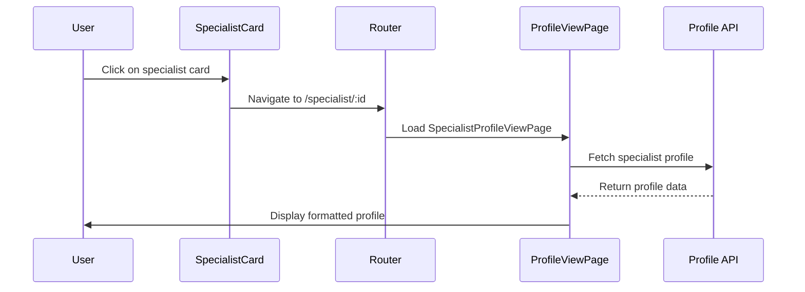
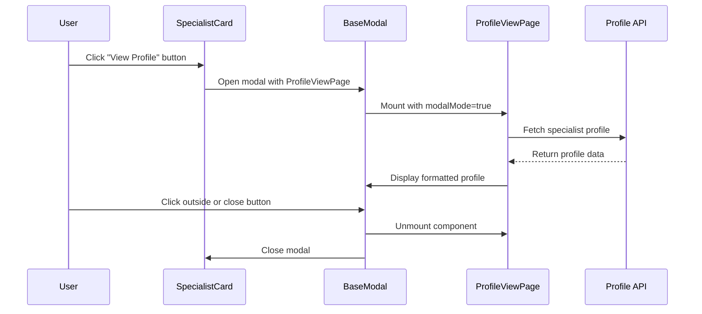
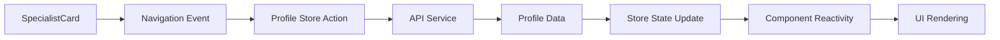

# Profile View Page Design

## Overview

This document outlines the design for a new profile view page that displays completed specialist profiles in a beautiful and presentable format. The page will showcase specialist information from their neural network questionnaire in a visual and engaging way, accessible from specialist search results cards.

## Technology Stack & Dependencies

- **Frontend Framework**: Vue 3 with Composition API
- **TypeScript**: Full type safety with existing specialist profile types
- **Styling**: Tailwind CSS for responsive design and styling
- **State Management**: Pinia stores for data management
- **Routing**: Vue Router 4 for navigation
- **Package Manager**: pnpm for dependency management

## Component Architecture

### Component Definition

**Primary Component**: `SpecialistProfileView.vue`

- **Location**: `src/pages/SpecialistProfileViewPage.vue`
- **Purpose**: Display complete specialist profile in read-only format
- **Type**: Page-level component with modal capability

### Component Hierarchy

```mermaid
graph TD
    A[SpecialistProfileViewPage.vue] --> B[ProfileHeader.vue]
    A --> C[ProfileOverview.vue]
    A --> D[SpecializationsSection.vue]
    A --> E[AbilitiesSection.vue]
    A --> F[ServicesSection.vue]
    A --> G[PortfolioSection.vue]
    A --> H[ExperienceSection.vue]
    A --> I[TestimonialsSection.vue]
    A --> J[ContactSection.vue]
    A --> K[LoadingOverlay.vue]
    A --> L[BaseModal.vue]

    B --> M[UserAvatar.vue]
    B --> N[ContactButtons.vue]
    F --> O[ServiceCard.vue]
    G --> P[PortfolioCard.vue]
    H --> Q[ExperienceCard.vue]
    I --> R[TestimonialCard.vue]

    style A fill:#4C82AF,stroke:#333
    style B fill:#7D5BA6,stroke:#333
    style C fill:#7D5BA6,stroke:#333
    style D fill:#7D5BA6,stroke:#333
    style E fill:#7D5BA6,stroke:#333
    style F fill:#7D5BA6,stroke:#333
    style G fill:#7D5BA6,stroke:#333
    style H fill:#7D5BA6,stroke:#333
    style I fill:#7D5BA6,stroke:#333
    style J fill:#7D5BA6,stroke:#333
```



### Props/State Management

**SpecialistProfileViewPage Props:**

```typescript
interface Props {
  specialistId: string
  modalMode?: boolean // Open as modal vs full page
}
```

**State Management:**

- Uses existing `SpecialistProfile` type from specialist-search module
- Leverages neural network profile structure for detailed data
- Modal state management for overlay display

### Lifecycle Methods/Hooks

```typescript
// Page lifecycle
onMounted(() => {
  loadSpecialistProfile(props.specialistId)
})

// Modal lifecycle
watch(
  () => props.modalMode,
  isModal => {
    if (isModal) {
      document.body.style.overflow = 'hidden'
    } else {
      document.body.style.overflow = 'auto'
    }
  }
)

onUnmounted(() => {
  document.body.style.overflow = 'auto'
})
```

## Routing & Navigation

### Route Configuration

```typescript
// New route for profile view
{
  path: '/specialist/:id',
  name: 'SpecialistProfile',
  component: () => import('@/pages/SpecialistProfileViewPage.vue'),
  props: true
}
```

### Navigation Flow



### Modal Integration



## Styling Strategy

### Layout Design

**Page Layout:**

- Full-width hero section with specialist header
- Two-column layout for main content (desktop)
- Single column layout for mobile
- Sticky sidebar with contact information
- Smooth scrolling navigation

**Modal Layout:**

- Centered modal with max-width constraints
- Overlay background with blur effect
- Responsive design for different screen sizes
- Scroll handling for long content

### Visual Design System

**Color Palette:**

- Primary: Blue gradient for headers and CTA buttons
- Secondary: Purple accents for skill tags
- Success: Green for availability status
- Background: Light gray/white with dark mode support

**Typography:**

- Headers: Bold, large fonts for section titles
- Body: Clean, readable fonts for descriptions
- Tags: Small, condensed fonts for skills/abilities

**Spacing & Grid:**

- 8px base spacing unit
- 24px section margins
- 16px card padding
- Responsive grid system

### Component Styling

```typescript
// Tailwind CSS classes for sections
const sectionClasses = 'bg-white dark:bg-gray-800 rounded-lg shadow-sm p-6 mb-6'
const headerClasses = 'text-2xl font-bold text-gray-900 dark:text-white mb-4'
const tagClasses = 'inline-flex items-center px-3 py-1 text-sm font-medium rounded-full'
```

## State Management

### Data Flow Architecture



### Store Integration

**New Store: `specialist-profile-view.ts`**

```typescript
interface SpecialistProfileViewStore {
  // State
  currentProfile: SpecialistProfile | null
  detailedProfile: NeuralNetworkProfileSchema | null
  isLoading: boolean
  error: string | null

  // Actions
  loadProfile(id: string): Promise<void>
  clearProfile(): void

  // Getters
  isProfileLoaded: boolean
  profileSections: ComputedRef<ProfileSection[]>
}
```

## API Integration Layer

### Data Mapping

**Specialist Card Data → Profile View Data:**

```typescript
interface ProfileViewData {
  // From SpecialistProfile
  basicInfo: {
    id: string
    displayName: string
    superpower: string
    avatarUrl?: string
    status: 'available' | 'busy' | 'unavailable'
    lastActive: string
  }

  // From NeuralNetworkProfileSchema
  detailedInfo: {
    specializations: string[]
    abilities: string[]
    services: ServiceDetails[]
    portfolio: PortfolioCase[]
    experience: ExperienceEntry[]
    testimonials: TestimonialEntry[]
    contacts: ContactInfo
  }
}
```

### API Service Methods

```typescript
class SpecialistProfileAPI {
  async getProfileById(id: string): Promise<ProfileViewData>
  async getProfileSummary(id: string): Promise<SpecialistProfile>
  async getProfileDetails(id: string): Promise<NeuralNetworkProfileSchema>
}
```

## Component Sections

### 1. ProfileHeader Section

**Purpose**: Display specialist's basic information and hero content

**Content:**

- Large avatar/profile image
- Specialist name and superpower tagline
- Availability status indicator
- Quick contact buttons (Telegram, Email, Website)
- Rating and review count (if available)

**Design:**

```typescript
// ProfileHeader layout
<div class="bg-gradient-to-r from-blue-600 to-purple-600 text-white">
  <div class="container mx-auto px-4 py-12">
    <div class="flex items-center space-x-8">
      <UserAvatar size="xl" />
      <div class="flex-1">
        <h1 class="text-4xl font-bold">{{ profile.displayName }}</h1>
        <p class="text-xl opacity-90">{{ profile.superpower }}</p>
        <StatusBadge :status="profile.status" />
      </div>
      <ContactButtons :contacts="profile.contacts" />
    </div>
  </div>
</div>
```

### 2. ProfileOverview Section

**Purpose**: Summary of key information at a glance

**Content:**

- Skills overview with tags
- Service count and pricing range
- Completed projects count
- Response time

### 3. SpecializationsSection

**Purpose**: Display specialist's areas of expertise

**Content:**

- Neural assistants, funnels, content generation, etc.
- Custom specializations
- Visual tag representation

### 4. AbilitiesSection

**Purpose**: Show specific skills and capabilities

**Content:**

- Funnel assembly, AI assistants, selling texts, etc.
- Custom abilities
- Grouped by category

### 5. ServicesSection

**Purpose**: Detailed service offerings and pricing

**Content:**

- Service cards with descriptions
- Pricing information
- Service categories
- Call-to-action buttons

**Design:**

```typescript
// ServiceCard component
<div class="border rounded-lg p-6 hover:shadow-lg transition-shadow">
  <h3 class="text-lg font-semibold">{{ service.name }}</h3>
  <p class="text-gray-600 mb-4">{{ service.description }}</p>
  <div class="flex justify-between items-center">
    <span class="text-2xl font-bold text-blue-600">{{ formatPrice(service) }}</span>
    <BaseButton @click="contactForService(service)">Заказать</BaseButton>
  </div>
</div>
```

### 6. PortfolioSection

**Purpose**: Showcase previous work and case studies

**Content:**

- Portfolio cases with thumbnails
- Case descriptions and results
- External links and file attachments
- Modal view for detailed case study

### 7. ExperienceSection

**Purpose**: Display work history and client projects

**Content:**

- Client names and project descriptions
- Tools used and results achieved
- Timeline of projects

### 8. TestimonialsSection

**Purpose**: Show client feedback and recommendations

**Content:**

- Text testimonials with ratings
- External review links
- Client information and project context

### 9. ContactSection

**Purpose**: Comprehensive contact information and communication options

**Content:**

- All available contact methods
- Response time information
- Contact preference indicators
- Direct communication buttons

## Testing Strategy

### Unit Testing

**Component Tests:**

- ProfileHeader rendering and props
- ServiceCard pricing display
- ContactButtons link generation
- Modal open/close functionality

**Store Tests:**

- Profile loading states
- Data transformation accuracy
- Error handling scenarios

### Integration Testing

**Navigation Tests:**

- Card click to profile view
- Modal open/close workflow
- Route parameter handling

**API Integration Tests:**

- Profile data fetching
- Error state handling
- Loading state management

### Visual Regression Testing

**Storybook Stories:**

- All profile sections in different states
- Modal vs full page layouts
- Dark mode compatibility
- Mobile responsive design
