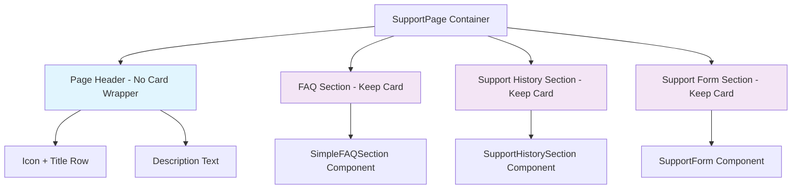

# Support Page Style Update

## Overview

This design document outlines the requirements for updating the Support page (`SupportPage.vue`) styling to align with the established design pattern used in the Vacancies page. The main objective is to remove the card wrapper from the page header and adopt the simpler, more consistent styling approach.

## Current State Analysis

### Current Support Page Header

The Support page currently wraps its header content in a card component:

```vue
<!-- Current: Header wrapped in card -->
<div class="bg-white dark:bg-gray-800 shadow rounded-lg p-6">
  <div class="flex items-center space-x-3">
    <QuestionMarkCircleIcon class="h-8 w-8 text-blue-600 dark:text-blue-400" />
    <div>
      <h1 class="text-3xl font-bold text-gray-900 dark:text-white">
        Центр поддержки
      </h1>
      <p class="text-gray-600 dark:text-gray-400 mt-1">
        Найдите ответы на вопросы или свяжитесь с нашей командой поддержки
      </p>
    </div>
  </div>
</div>
```

### Reference Pattern (Vacancies Page)

The Vacancies page uses a cleaner approach without card wrapper:

```vue
<!-- Target: Simple header without card wrapper -->
<div class="mb-8">
  <div class="flex items-center space-x-3 mb-4">
    <BriefcaseIcon class="h-8 w-8 text-blue-600 dark:text-blue-400" />
    <h1 class="text-3xl font-bold text-gray-900 dark:text-white">
      Все вакансии
    </h1>
  </div>
  <p class="text-lg text-gray-600 dark:text-gray-400">
    Просмотрите все опубликованные вакансии на платформе
  </p>
</div>
```

## Design Requirements

### 1. Header Styling Update

**Remove Card Wrapper**

- Remove the `bg-white dark:bg-gray-800 shadow rounded-lg p-6` wrapper from the page header
- Apply the vacancies page pattern directly to the main container

**Updated Header Structure**

```vue
<!-- New header structure -->
<div class="mb-8">
  <div class="flex items-center space-x-3 mb-4">
    <QuestionMarkCircleIcon class="h-8 w-8 text-blue-600 dark:text-blue-400" />
    <h1 class="text-3xl font-bold text-gray-900 dark:text-white">
      Центр поддержки
    </h1>
  </div>
  <p class="text-lg text-gray-600 dark:text-gray-400">
    Найдите ответы на вопросы или свяжитесь с нашей командой поддержки
  </p>
</div>
```

### 2. Component Layout Structure



### 3. Styling Specifications

**Header Container**

- Class: `mb-8` (bottom margin)
- No background, shadow, or padding

**Icon and Title Row**

- Class: `flex items-center space-x-3 mb-4`
- Icon: `h-8 w-8 text-blue-600 dark:text-blue-400`
- Title: `text-3xl font-bold text-gray-900 dark:text-white`

**Description Text**

- Class: `text-lg text-gray-600 dark:text-gray-400`
- Positioned outside and below the icon+title container

**Section Cards**

- Keep existing card styling for FAQ, Support History, and Support Form sections
- Maintain `bg-white dark:bg-gray-800 shadow rounded-lg p-6` wrapper for content sections

## Implementation

### Target File

- `src/pages/SupportPage.vue`

### Changes Required

1. **Remove card wrapper from header**
   - Remove `<div class="bg-white dark:bg-gray-800 shadow rounded-lg p-6">` wrapper
   - Update container structure to match vacancies pattern

2. **Restructure header layout**
   - Move title into the flex container with icon
   - Place description text outside the flex container
   - Adjust spacing and typography to match target pattern

3. **Maintain section styling**
   - Keep card wrappers for FAQ, Support History, and Support Form sections
   - Ensure consistent spacing between sections

### Before/After Comparison

**Before (Current)**

```vue
<div class="space-y-8">
  <!-- Page Header -->
  <div class="bg-white dark:bg-gray-800 shadow rounded-lg p-6">
    <div class="flex items-center space-x-3">
      <QuestionMarkCircleIcon class="h-8 w-8 text-blue-600 dark:text-blue-400" />
      <div>
        <h1 class="text-3xl font-bold text-gray-900 dark:text-white">
          Центр поддержки
        </h1>
        <p class="text-gray-600 dark:text-gray-400 mt-1">
          Найдите ответы на вопросы или свяжитесь с нашей командой поддержки
        </p>
      </div>
    </div>
  </div>
```

**After (Target)**

```vue
<div class="space-y-8">
  <!-- Page Header -->
  <div class="mb-8">
    <div class="flex items-center space-x-3 mb-4">
      <QuestionMarkCircleIcon class="h-8 w-8 text-blue-600 dark:text-blue-400" />
      <h1 class="text-3xl font-bold text-gray-900 dark:text-white">
        Центр поддержки
      </h1>
    </div>
    <p class="text-lg text-gray-600 dark:text-gray-400">
      Найдите ответы на вопросы или свяжитесь с нашей командой поддержки
    </p>
  </div>
```

## Design Consistency

### Pattern Alignment

This update aligns the Support page with the established design patterns used throughout the application:

- **Vacancies Pages**: `AllVacanciesPage.vue`, `MyVacanciesPage.vue`
- **Profile Pages**: Similar header patterns without card wrappers
- **Navigation consistency**: Maintains visual hierarchy across pages

### Typography Consistency

- **H1 Title**: `text-3xl font-bold text-gray-900 dark:text-white`
- **Description**: `text-lg text-gray-600 dark:text-gray-400`
- **Icon Styling**: `h-8 w-8 text-blue-600 dark:text-blue-400`

### Spacing Standards

- **Container margins**: `mb-8` for section separation
- **Icon-title spacing**: `space-x-3` between elements
- **Title-description spacing**: `mb-4` between title row and description

## Accessibility Considerations

### Semantic Structure

- Maintains proper heading hierarchy with `h1` for page title
- Preserves descriptive text for screen readers
- Icon remains decorative with appropriate color contrast

### Focus Management

- No impact on keyboard navigation
- Maintains existing focus patterns for interactive elements
- Card sections retain their focus boundaries

## Testing Strategy

### Visual Regression Testing

- Compare before/after screenshots
- Test across different screen sizes
- Verify dark mode appearance

### Responsive Design Testing

- Mobile (320px - 767px)
- Tablet (768px - 1023px)
- Desktop (1024px+)

### Cross-browser Compatibility

- Test on Chrome, Firefox, Safari, Edge
- Verify Tailwind CSS classes render correctly

## Benefits

### Design Consistency

- Aligns Support page with established page header patterns
- Creates visual coherence across the application
- Reduces design debt and inconsistencies

### User Experience

- Cleaner, less cluttered page layout
- Better content hierarchy and readability
- More focused attention on actual functionality

### Maintenance

- Follows established design system patterns
- Easier to maintain and update in the future
- Reduces code complexity
