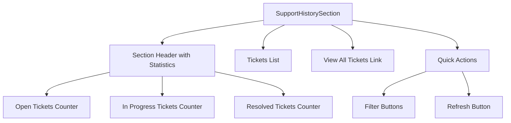
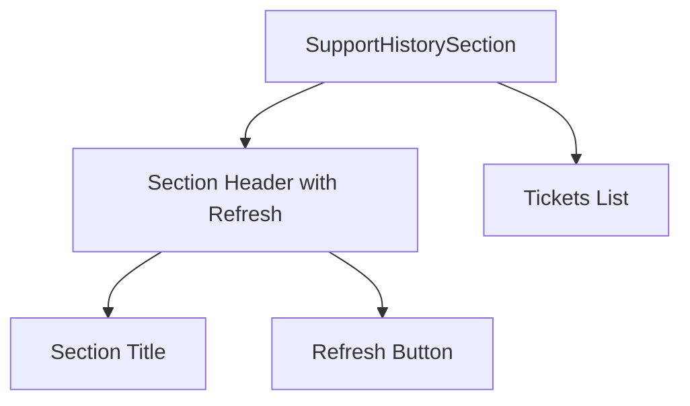

# Support Page Tickets Block Update

## Overview

This document outlines the changes required for the Support page tickets block. The main goal is to simplify the UI by removing unnecessary elements and adding a refresh functionality.

## Current Implementation

The Support page currently displays:

1. Ticket statistics (counters for open, in-progress, and resolved tickets)
2. Recent tickets list (limited to 5 items)
3. "View all tickets" link
4. Quick action buttons for filtering and refreshing

## Proposed Changes

### 1. Replace Statistics with Refresh Icon

Instead of showing ticket counters, we'll add a refresh icon/button to update the ticket data.

**Current location**: Header section of SupportHistorySection.vue component
**Change**: Replace the statistics display with a refresh button

### 2. Remove Ticket Counters

Completely remove all ticket status counters from both desktop and mobile views.

**Current location**: SupportHistorySection.vue component
**Change**: Remove all counter elements and related computed properties

### 3. Remove Quick Actions Block

Eliminate the quick actions section that contains filter buttons.

**Current location**: Bottom of SupportHistorySection.vue component
**Change**: Remove the entire quick actions section

### 4. Remove "View All Tickets" Link

Remove the link that allows users to view all tickets.

**Current location**: Below the ticket list in SupportHistorySection.vue component
**Change**: Remove the "View all tickets" button/link

## Component Modifications

### SupportHistorySection.vue

#### Before

```
[Header with statistics]
[Tickets list]
[View all tickets link]
[Quick actions]
```

#### After

```
[Header with refresh button]
[Tickets list - max 5 items]
```

### Implementation Details

1. **Header Section**:
   - Remove statistics counters (open, in-progress, resolved)
   - Add refresh button with icon in the header area
   - Maintain the section title "История обращений"

2. **Tickets List**:
   - Keep the same display of tickets (max 5)
   - Retain all existing ticket item functionality
   - Keep the empty state and loading/error states

3. **Removed Elements**:
   - Desktop statistics counters
   - Mobile statistics grid
   - "View all tickets" link
   - Quick actions section with filter buttons

## UI Component Structure

### Current Structure (Before Changes)



### New Structure (After Changes)



## Data Flow

The refresh functionality will:

1. Trigger the existing `refreshTickets` method in the support composable
2. Update the ticket data in the store
3. Automatically reflect changes in the UI

No changes to the underlying data flow or store structure are required.

## UI/UX Considerations

1. **Refresh Button Placement**:
   - Positioned in the top right of the section header
   - Uses the existing `ArrowPathIcon` for consistency
   - Maintains the same styling as the previous refresh button in quick actions

2. **Responsive Design**:
   - The refresh button will be visible on both desktop and mobile
   - No changes to the responsive behavior of ticket items

3. **Accessibility**:
   - Refresh button will be keyboard accessible
   - Proper ARIA labels will be maintained
   - Focus states will be preserved

## Visual Design

### Refresh Button Styling

The refresh button will use a subtle styling approach:

- Circular button with icon only
- Subtle hover effect (light gray background)
- Focus ring for keyboard navigation
- Consistent dark mode support

### Layout Adjustments

With the removal of statistics counters:

- More vertical space for the ticket list
- Cleaner header area
- Better focus on the actual ticket content

### Spacing and Alignment

- Maintain consistent padding and margins
- Ensure proper vertical rhythm between elements
- Preserve existing typography hierarchy

## Technical Implementation

### Files to Modify

1. **src/components/support/SupportHistorySection.vue**
   - Remove statistics display (both desktop and mobile)
   - Remove "View all tickets" link
   - Remove quick actions section
   - Add refresh button to header
   - Update component logic to remove unused computed properties

2. **src/pages/SupportPage.vue**
   - Remove unused event handlers related to removed features
   - Clean up component logic

### Component Changes

#### SupportHistorySection.vue

**Template Changes:**

- Remove the entire `<div class="hidden md:flex items-center space-x-6">` section (desktop statistics)
- Remove the entire `<div class="md:hidden grid grid-cols-3 gap-4">` section (mobile statistics)
- Remove the `<div v-if="tickets.length >= 5" class="text-center pt-4">` section (view all tickets link)
- Remove the entire quick actions section at the bottom
- Add refresh button to the header section:

```html
<div class="flex items-center justify-between">
  <div class="flex items-center space-x-3">
    <ClockIcon class="h-8 w-8 text-green-600 dark:text-green-400" />
    <div>
      <h2 class="text-2xl font-bold text-gray-900 dark:text-white">История обращений</h2>
      <p class="text-sm text-gray-600 dark:text-gray-400 mt-1">
        Ваши последние {{ tickets.length }} обращени{{ getTicketsEnding(tickets.length) }} в
        поддержку
      </p>
    </div>
  </div>

  <!-- Refresh Button -->
  <button
    type="button"
    class="p-2 rounded-full hover:bg-gray-100 dark:hover:bg-gray-700 focus:outline-none focus:ring-2 focus:ring-blue-500"
    @click="handleRefresh"
    title="Обновить"
  >
    <ArrowPathIcon class="h-5 w-5 text-gray-600 dark:text-gray-400" />
  </button>
</div>
```

**Script Changes:**

- Remove computed properties: `openTicketsCount`, `inProgressTicketsCount`, `resolvedTicketsCount`
- Remove event handlers: `handleFilter`, `handleViewAll`
- Keep `handleRefresh` and `handleRetry` event handlers

#### SupportPage.vue

**Template Changes:**

- Remove `@view-all`, `@filter` props from SupportHistorySection component

**Script Changes:**

- Remove `handleViewAllTickets` and `handleFilterTickets` methods
- Keep `handleRefreshTickets` and `handleTicketClick` methods

### Composable Changes

No changes required to:

- `useSupportData.ts` composable
- `support.ts` store
- Data models or types

The existing refresh functionality will be repurposed for the new refresh button.

## Testing Considerations

1. **UI Tests**:
   - Update snapshots for SupportHistorySection component
   - Verify refresh button functionality
   - Confirm removal of statistics elements
   - Check responsive behavior on different screen sizes

2. **Integration Tests**:
   - Ensure ticket list still displays correctly
   - Verify refresh functionality still works
   - Confirm no regression in ticket item interactions

3. **Accessibility Tests**:
   - Verify refresh button is keyboard accessible
   - Check screen reader announcements

4. **Unit Tests**:
   - Update tests for SupportHistorySection component
   - Remove tests for removed functionality
   - Add tests for new refresh button

5. **Regression Tests**:
   - Verify other support page components are unaffected
   - Confirm ticket click functionality still works
   - Check that error and loading states still display correctly

## Deployment Considerations

1. **Backward Compatibility**:
   - Changes are UI-only, no API changes
   - No database migrations required
   - No breaking changes for existing functionality

2. **Performance Impact**:
   - Reduced DOM complexity due to removed elements
   - Slightly faster rendering
   - No additional API calls

3. **Rollout Strategy**:
   - Can be deployed as part of regular release cycle
   - No feature flags needed
   - Immediate availability to all users
