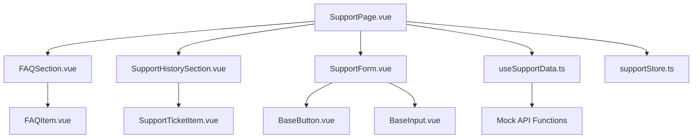
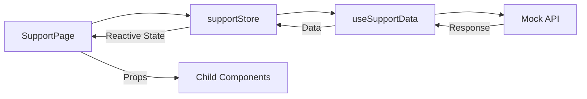
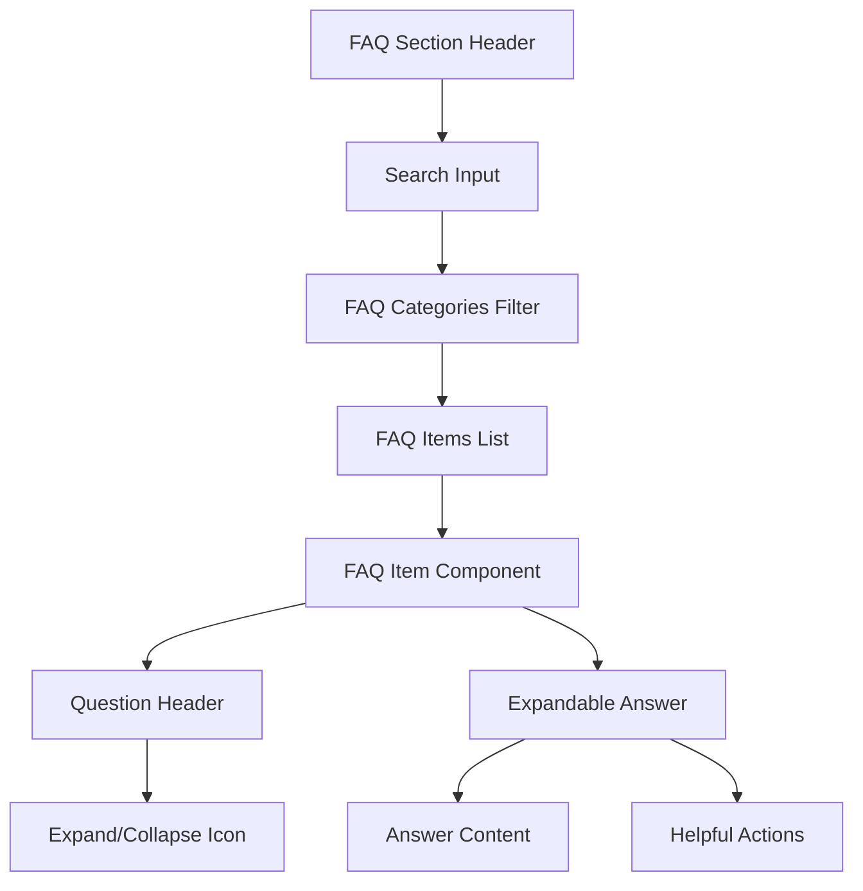
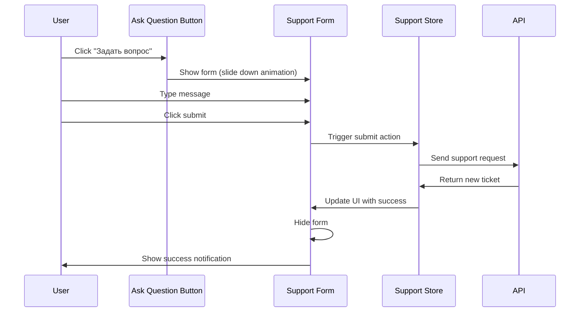

# Support Section Updates Design

## Overview

This design document outlines the complete restructuring of the support module to provide a comprehensive user support experience. The updated support section will include an FAQ system, support ticket management, and streamlined user interaction flows.

## Technology Stack & Dependencies

- **Framework**: Vue 3.5.18 with Composition API and TypeScript 5.8.0
- **Build Tool**: Vite 7.0.6 for fast development and optimized builds
- **Package Manager**: pnpm (preferred over npm for dependency management)
- **State Management**: Pinia 3.0.3 stores for centralized data management
- **Styling**: Tailwind CSS for utility-first responsive design
- **UI Components**: Existing base components (BaseButton, BaseInput, BaseModal)
- **Icons**: Heroicons for consistent visual elements
- **HTTP Client**: Axios 1.11.0 with custom composables for API integration
- **Data Management**: Custom composables (useApi, useAsyncState) for async operations
- **Development Tools**: ESLint 9.31.0, Prettier 3.6.2 for code quality

## Component Architecture

### Component Hierarchy



### Component Definitions

#### SupportPage.vue (Main Container)

- **Purpose**: Main page container orchestrating all support functionality
- **Responsibilities**: Layout management, data fetching coordination, state management
- **Props**: None (route-based component)
- **State**: Manages visibility of support form, loading states
- **Events**: Handles form submissions, FAQ interactions

#### FAQSection.vue

- **Purpose**: Displays frequently asked questions with expandable answers
- **Responsibilities**: FAQ rendering, expand/collapse functionality, search filtering
- **Props**:
  - `faqs: FAQ[]` - Array of FAQ items
  - `loading: boolean` - Loading state indicator
- **State**: Search query, expanded items tracking
- **Events**: Emits FAQ interaction events for analytics

#### SupportHistorySection.vue

- **Purpose**: Shows user's recent support ticket history
- **Responsibilities**: Ticket list rendering, status display, navigation to detailed views
- **Props**:
  - `tickets: SupportTicket[]` - Recent support tickets (limit 5)
  - `loading: boolean` - Loading state indicator
- **State**: None (presentational component)
- **Events**: Emits ticket selection events

#### SupportForm.vue

- **Purpose**: Collapsible form for submitting new support requests
- **Responsibilities**: Form validation, submission handling, user input management
- **Props**:
  - `visible: boolean` - Controls form visibility
  - `loading: boolean` - Submission state
- **State**: Form data, validation errors
- **Events**: Emits form submission and visibility change events

#### FAQItem.vue

- **Purpose**: Individual FAQ item with expand/collapse functionality
- **Responsibilities**: Answer visibility toggle, smooth animations
- **Props**:
  - `faq: FAQ` - FAQ data object
  - `expanded: boolean` - Expansion state
- **State**: Internal animation state
- **Events**: Emits toggle events

#### SupportTicketItem.vue

- **Purpose**: Individual support ticket display component
- **Responsibilities**: Ticket information presentation, status indication
- **Props**:
  - `ticket: SupportTicket` - Ticket data object
- **State**: None (presentational component)
- **Events**: Emits ticket click events

### Props and State Management

#### Data Flow Pattern



#### Component Communication

- **Parent to Child**: Props for data passing
- **Child to Parent**: Events for actions and state changes
- **Global State**: Pinia store for support data management
- **Local State**: Vue reactive refs for component-specific state

## Routing & Navigation

The support section utilizes the existing routing structure with no additional routes required. The main `/support` route renders the updated SupportPage component.

## Styling Strategy

### Tailwind CSS Implementation

- **Package Manager**: All Tailwind dependencies managed via pnpm
- **Configuration**: Existing tailwind.config.js with project-specific customizations
- **Responsive Design**: Mobile-first approach with responsive breakpoints (sm, md, lg, xl)
- **Dark Mode Support**: Full dark mode compatibility using Tailwind's `dark:` variant classes
- **Component Styling**: Utility-first approach with consistent spacing and typography
- **Animation System**: Tailwind's built-in transitions and animations for smooth interactions
- **Build Integration**: PostCSS integration through Vite for optimal CSS processing

### Design System Components

- **Color Palette**: Tailwind's semantic color system (blue, gray, green, red for status)
- **Typography**: Tailwind's type scale with consistent heading hierarchy
- **Spacing**: Standardized margin and padding using Tailwind's spacing scale (0.25rem increments)
- **Interactive Elements**: Tailwind hover, focus, and active states with transition effects
- **Component Classes**: Reusable utility combinations for consistent component styling

## State Management

### Support Store (supportStore.ts)

```typescript
interface SupportStoreState {
  faqs: FAQ[]
  supportTickets: SupportTicket[]
  currentTicket: SupportTicket | null
  loading: {
    faqs: boolean
    tickets: boolean
    submission: boolean
  }
  error: string | null
}

interface SupportStoreActions {
  fetchFAQs(): Promise<void>
  fetchSupportTickets(): Promise<void>
  submitSupportRequest(message: string): Promise<void>
  toggleFAQ(faqId: string): void
  clearErrors(): void
}
```

### Composable Functions

#### useSupportData.ts

```typescript
interface UseSupportDataReturn {
  faqs: Ref<FAQ[]>
  recentTickets: Ref<SupportTicket[]>
  loading: Ref<boolean>
  error: Ref<string | null>
  refreshFAQs: () => Promise<void>
  refreshTickets: () => Promise<void>
  submitTicket: (message: string) => Promise<void>
}
```

## API Integration Layer

### Development Commands

- **Install dependencies**: `pnpm install`
- **Start development server**: `pnpm dev`
- **Build for production**: `pnpm build`
- **Run type checking**: `pnpm type-check`
- **Run tests**: `pnpm test`
- **Lint code**: `pnpm lint`
- **Format code**: `pnpm format`

### Mock API Implementation

Since this iteration uses fake data, we'll implement mock API functions that simulate real server responses with appropriate delays and realistic data structures.

#### API Service Structure

```typescript
// Mock API functions with realistic response times
const mockApiFAQs = async (): Promise<FAQ[]> => {
  await new Promise(resolve => setTimeout(resolve, 800)) // Simulate network delay
  return mockFAQData
}

const mockApiSupportTickets = async (): Promise<SupportTicket[]> => {
  await new Promise(resolve => setTimeout(resolve, 600))
  return mockSupportTicketsData.slice(0, 5) // Return last 5 tickets
}

const mockApiSubmitTicket = async (message: string): Promise<SupportTicket> => {
  await new Promise(resolve => setTimeout(resolve, 1200))
  return createMockTicket(message)
}
```

### HTTP Client Integration

The mock functions will be integrated with the existing `useApi` composable to maintain consistency with the application's data fetching patterns.

## Data Models & Type System

### Core Data Interfaces

```typescript
interface FAQ {
  id: string
  question: string
  answer: string
  category: 'general' | 'technical' | 'billing' | 'account'
  priority: number
  isPopular: boolean
  createdAt: string
  updatedAt: string
}

interface SupportTicket {
  id: string
  message: string
  status: 'open' | 'in-progress' | 'resolved' | 'closed'
  priority: 'low' | 'medium' | 'high' | 'urgent'
  createdAt: string
  updatedAt: string
  resolvedAt?: string
  assignedTo?: string
  messages: SupportMessage[]
}

interface SupportMessage {
  id: string
  ticketId: string
  message: string
  isFromSupport: boolean
  createdAt: string
  author: {
    name: string
    role: 'user' | 'support' | 'admin'
  }
}

interface SupportFormData {
  message: string
}
```

### Mock Data Structure

```typescript
const mockFAQData: FAQ[] = [
  {
    id: '1',
    question: 'Как создать аккаунт на платформе?',
    answer:
      'Для создания аккаунта нажмите на кнопку "Регистрация" в правом верхнем углу страницы...',
    category: 'general',
    priority: 1,
    isPopular: true,
    createdAt: '2024-01-15T10:00:00Z',
    updatedAt: '2024-01-15T10:00:00Z',
  },
  // Additional FAQ items...
]

const mockSupportTicketsData: SupportTicket[] = [
  {
    id: 'ticket-1',
    message: 'Не могу войти в свой аккаунт',
    status: 'resolved',
    priority: 'medium',
    createdAt: '2024-01-20T14:30:00Z',
    updatedAt: '2024-01-21T09:15:00Z',
    resolvedAt: '2024-01-21T09:15:00Z',
    messages: [
      {
        id: 'msg-1',
        ticketId: 'ticket-1',
        message: 'Не могу войти в свой аккаунт',
        isFromSupport: false,
        createdAt: '2024-01-20T14:30:00Z',
        author: {
          name: 'Иван Петров',
          role: 'user',
        },
      },
      {
        id: 'msg-2',
        ticketId: 'ticket-1',
        message: 'Здравствуйте! Попробуйте сбросить пароль через форму восстановления.',
        isFromSupport: true,
        createdAt: '2024-01-20T15:45:00Z',
        author: {
          name: 'Анна Смирнова',
          role: 'support',
        },
      },
      {
        id: 'msg-3',
        ticketId: 'ticket-1',
        message: 'Спасибо, получилось!',
        isFromSupport: false,
        createdAt: '2024-01-21T09:15:00Z',
        author: {
          name: 'Иван Петров',
          role: 'user',
        },
      },
    ],
  },
  // Additional ticket items...
]
```

## User Interface Architecture

### FAQ Section Design



#### Visual Design Specifications

- **Layout**: Single column with cards for each FAQ item
- **Interaction**: Click anywhere on question to expand/collapse
- **Animation**: Smooth height transition (300ms ease-in-out)
- **Visual States**:
  - Collapsed: Question visible, subtle hover effect
  - Expanded: Question + answer visible, highlighted border
  - Loading: Skeleton placeholders during data fetch

### Support History Section Design

#### Display Requirements

- **Item Limit**: Maximum 5 most recent tickets
- **Information Display**:
  - Ticket ID (abbreviated)
  - Message preview (first 100 characters)
  - Status badge with color coding
  - Creation date (relative time format)
  - Priority indicator

#### Status Color Coding

```typescript
const statusColors = {
  open: 'bg-blue-100 text-blue-800 dark:bg-blue-900 dark:text-blue-200',
  'in-progress': 'bg-yellow-100 text-yellow-800 dark:bg-yellow-900 dark:text-yellow-200',
  resolved: 'bg-green-100 text-green-800 dark:bg-green-900 dark:text-green-200',
  closed: 'bg-gray-100 text-gray-800 dark:bg-gray-900 dark:text-gray-200',
}
```

### Support Form Design

#### Interaction Flow



#### Form Specifications

- **Visibility**: Hidden by default, shown on button click
- **Animation**: Slide down/up animation (400ms ease-out)
- **Validation**:
  - Required field validation
  - Minimum character count (10 characters)
  - Maximum character count (1000 characters)
- **Submission**: Loading state with spinner, success/error feedback

## Testing Strategy

### Component Testing Requirements

#### Unit Tests

- **FAQSection.vue**: FAQ rendering, search functionality, expand/collapse behavior
- **SupportForm.vue**: Form validation, submission handling, visibility toggle
- **useSupportData.ts**: Data fetching, error handling, state management
- **supportStore.ts**: Store actions, mutations, state updates

#### Integration Tests

- **Support Page Flow**: Complete user journey from page load to ticket submission
- **API Integration**: Mock API response handling and error scenarios
- **State Synchronization**: Store updates reflecting in components

#### Test Coverage Requirements

- **Components**: 90% coverage minimum
- **Composables**: 95% coverage minimum
- **Store Logic**: 100% coverage for critical paths

### Testing Implementation Examples

```typescript
// FAQSection.vue test
describe('FAQSection.vue', () => {
  it('should expand FAQ item when clicked', async () => {
    const wrapper = mount(FAQSection, {
      props: { faqs: mockFAQs, loading: false },
    })

    await wrapper.find('[data-testid="faq-item-1"]').trigger('click')

    expect(wrapper.find('[data-testid="faq-answer-1"]').isVisible()).toBe(true)
  })
})

// useSupportData.ts test
describe('useSupportData', () => {
  it('should handle API errors gracefully', async () => {
    const mockError = new Error('Network error')
    vi.spyOn(supportApi, 'fetchFAQs').mockRejectedValue(mockError)

    const { error, refreshFAQs } = useSupportData()
    await refreshFAQs()

    expect(error.value).toBe('Network error')
  })
})
```
