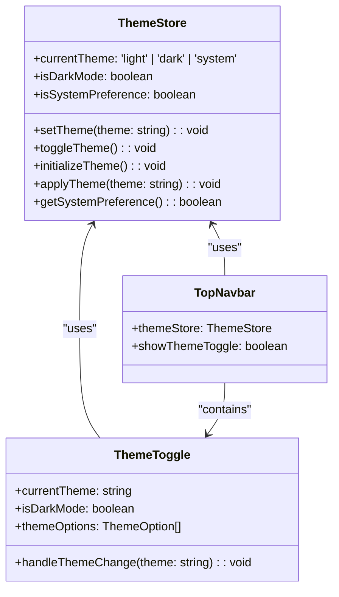
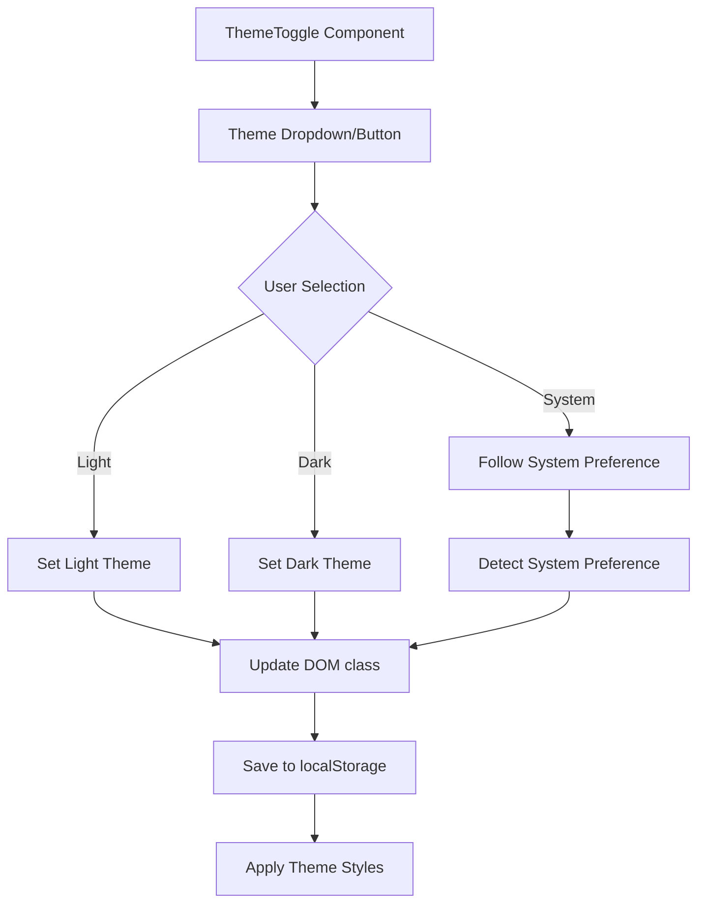
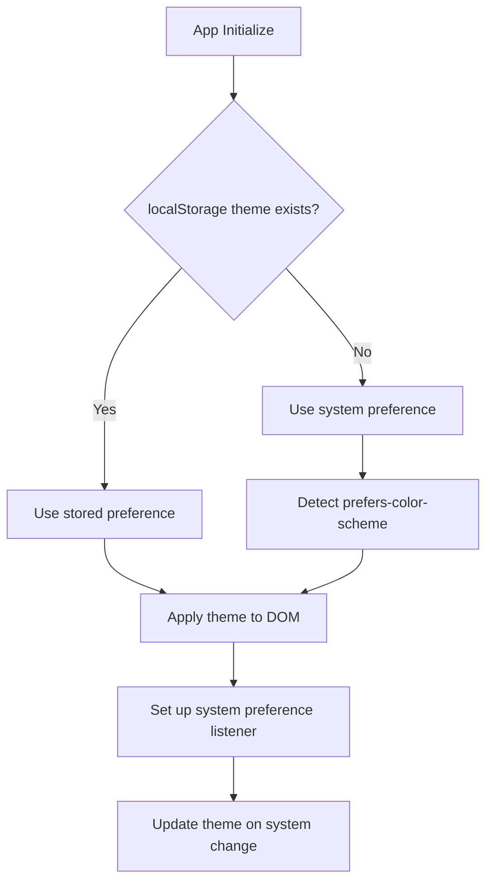

# Theme Toggle Feature Design

## Overview

This document outlines the design for implementing a theme toggle feature that allows users to manually switch between light and dark themes in the MayaWork frontend application. The feature will be integrated into the TopNavbar component and provide persistent theme preference storage.

## Current Architecture Analysis

The application currently uses:

- **Automatic Theme Detection**: Uses `prefers-color-scheme: dark` media query for automatic dark mode
- **CSS Variables**: Defined in `base.css` for theme colors
- **Tailwind CSS**: Dark mode classes with `dark:` prefix
- **Vue 3 + TypeScript**: Component-based architecture with Composition API

## Component Architecture

### Theme Store (Pinia)



### Theme Toggle Component Design



## Data Models & State Management

### Theme Store State

```typescript
interface ThemeState {
  currentTheme: 'light' | 'dark' | 'system'
  isDarkMode: boolean
}

interface ThemeOption {
  value: 'light' | 'dark' | 'system'
  label: string
  icon: string
}
```

### Theme Store Actions

| Action            | Description                                      | Parameters                             |
| ----------------- | ------------------------------------------------ | -------------------------------------- |
| `setTheme`        | Sets the current theme and applies it            | `theme: 'light' \| 'dark' \| 'system'` |
| `toggleTheme`     | Toggles between light and dark (excludes system) | None                                   |
| `initializeTheme` | Initializes theme from localStorage or system    | None                                   |
| `applyTheme`      | Applies the theme to DOM and saves preference    | `theme: string`                        |

## Theme Toggle Component Specifications

### Props Interface

```typescript
interface ThemeToggleProps {
  variant?: 'button' | 'dropdown' | 'switch'
  size?: 'sm' | 'md' | 'lg'
  showLabel?: boolean
  position?: 'left' | 'right'
}
```

### Component Variants

#### 1. Icon Button Variant (Primary)

- Compact sun/moon icon button
- Cycles through: Light → Dark → System
- Tooltip shows current mode
- Suitable for navbar integration

#### 2. Dropdown Variant (Alternative)

- Dropdown menu with all options
- Icons and labels for each theme
- More explicit user control
- Better accessibility

#### 3. Switch Variant (Simple)

- Toggle switch for Light/Dark only
- No system option
- Minimal UI footprint

### Visual Design Specifications

#### Icon States

| Theme  | Icon                  | Color (Light)     | Color (Dark)      |
| ------ | --------------------- | ----------------- | ----------------- |
| Light  | `SunIcon`             | `text-yellow-500` | `text-yellow-400` |
| Dark   | `MoonIcon`            | `text-indigo-600` | `text-indigo-400` |
| System | `ComputerDesktopIcon` | `text-gray-600`   | `text-gray-400`   |

#### Button Styling

```css
.theme-toggle-button {
  @apply p-2 rounded-md text-gray-500 hover:text-gray-900 hover:bg-gray-100;
  @apply dark:text-gray-400 dark:hover:text-gray-100 dark:hover:bg-gray-700;
  @apply transition-colors duration-200;
  @apply focus:outline-none focus:ring-2 focus:ring-blue-500 focus:ring-offset-2;
  @apply dark:focus:ring-offset-gray-800;
}
```

## TopNavbar Integration

### Layout Positioning

The theme toggle will be positioned in the TopNavbar component between the navigation items and user profile section:

```
[Logo] [Navigation Items] [Theme Toggle] [Create Vacancy] [User Profile] [Mobile Menu]
```

### Responsive Behavior

- **Desktop (lg+)**: Show theme toggle as icon button
- **Mobile**: Include in mobile navigation menu
- **Tablet (md-lg)**: Show theme toggle in collapsed state

### Integration Code Structure

```typescript
// TopNavbar.vue additions
const themeStore = useThemeStore()

// Template addition
<div class="flex items-center space-x-4">
  <ThemeToggle v-if="!navigationStore.isMobileMenuOpen" variant="button" />
  <!-- existing user section -->
</div>
```

## Theme Management System

### Theme Detection Logic



### DOM Implementation

The theme will be applied by adding/removing classes on the `<html>` element:

```javascript
// Light mode
document.documentElement.classList.remove('dark')

// Dark mode
document.documentElement.classList.add('dark')
```

### System Preference Monitoring

```typescript
// Monitor system theme changes
const mediaQuery = window.matchMedia('(prefers-color-scheme: dark)')
mediaQuery.addEventListener('change', e => {
  if (currentTheme === 'system') {
    applyTheme(e.matches ? 'dark' : 'light')
  }
})
```

## Persistence Strategy

### LocalStorage Schema

```json
{
  "maya-platform-theme": "light" | "dark" | "system"
}
```

### Storage Management

- **Key**: `maya-platform-theme`
- **Values**: `light`, `dark`, `system`
- **Fallback**: System preference if no stored value
- **Sync**: Update localStorage on every theme change

## Accessibility Considerations

### ARIA Support

```html
<button role="button" aria-label="Toggle theme" aria-expanded="false" aria-haspopup="true">
  <SunIcon aria-hidden="true" />
</button>
```

### Keyboard Navigation

- **Tab**: Focus theme toggle button
- **Enter/Space**: Cycle through themes
- **Escape**: Close dropdown (if applicable)

### Screen Reader Support

- Announce current theme state
- Provide clear action descriptions
- Use semantic HTML elements

## Animation & Transitions

### Theme Transition

```css
.theme-transition {
  transition:
    background-color 0.3s ease,
    color 0.3s ease,
    border-color 0.3s ease;
}
```

### Icon Transitions

```css
.theme-icon {
  @apply transition-all duration-300 ease-in-out;
}

.theme-icon-enter {
  @apply opacity-0 scale-90 rotate-90;
}

.theme-icon-leave {
  @apply opacity-100 scale-100 rotate-0;
}
```

## Mobile Navigation Integration

### MobileNavigationMenu Updates

Add theme toggle section in mobile menu:

```html
<div class="border-t border-gray-200 dark:border-gray-700 pt-4">
  <div class="px-4 py-3">
    <ThemeToggle variant="dropdown" showLabel="true" />
  </div>
</div>
```

### Mobile-Specific Behavior

- Show theme options with labels
- Larger touch targets (min 44px)
- Close mobile menu after theme selection

## Performance Considerations

### Optimization Strategies

1. **Lazy Loading**: Load theme icons on demand
2. **CSS Variables**: Minimize style recalculation
3. **Debouncing**: Prevent rapid theme switching
4. **Memory Management**: Clean up event listeners

### Bundle Size Impact

- **Icons**: ~2KB (sun, moon, computer icons)
- **Store**: ~1KB (theme management logic)
- **Component**: ~3KB (theme toggle component)
- **Total**: ~6KB additional bundle size

## Testing Strategy

### Unit Tests

```typescript
describe('ThemeStore', () => {
  test('should initialize with system preference')
  test('should persist theme changes to localStorage')
  test('should apply correct CSS classes')
  test('should handle system preference changes')
})

describe('ThemeToggle', () => {
  test('should render correct icon for current theme')
  test('should cycle through themes on click')
  test('should emit theme change events')
})
```

### Integration Tests

- Theme persistence across page reloads
- System preference detection
- Mobile menu integration
- Accessibility compliance

### Visual Regression Tests

- Theme toggle states in light/dark modes
- Mobile navigation with theme toggle
- Cross-browser theme rendering

## Implementation Phases

### Phase 1: Core Infrastructure

1. Create theme store with Pinia
2. Implement theme detection and persistence
3. Set up DOM class management

### Phase 2: Component Development

1. Build ThemeToggle component variants
2. Add icons and styling
3. Implement accessibility features

### Phase 3: Integration

1. Integrate into TopNavbar
2. Add mobile navigation support
3. Implement responsive behavior

### Phase 4: Polish & Testing

1. Add animations and transitions
2. Comprehensive testing
3. Performance optimization
4. Documentation updates
