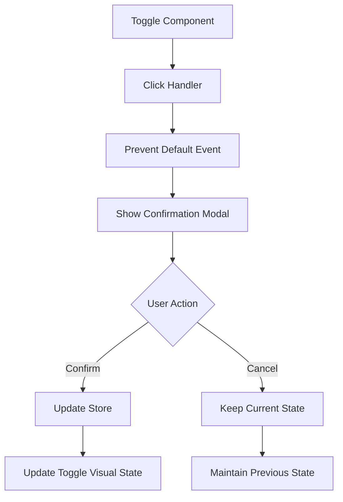
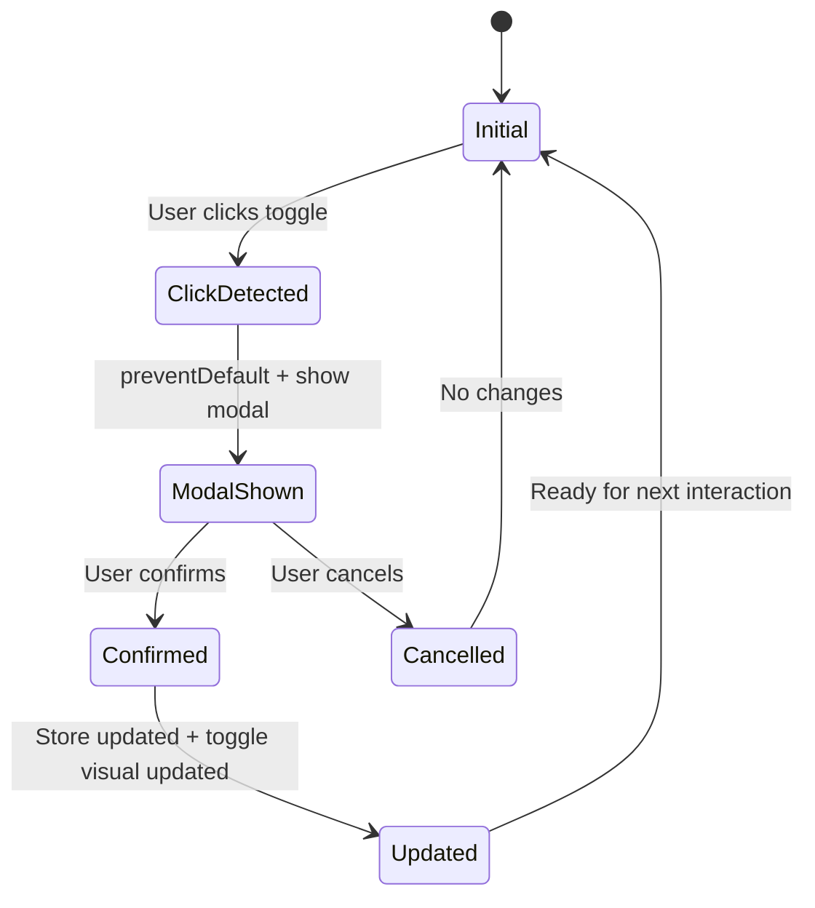
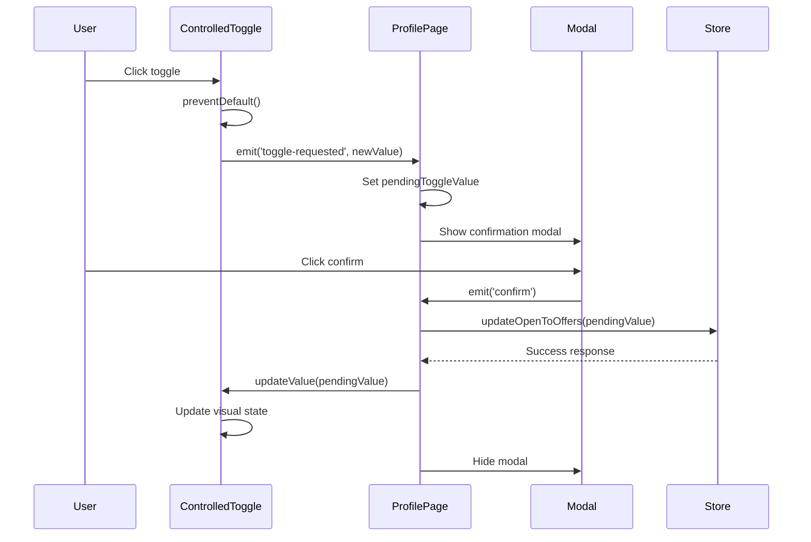
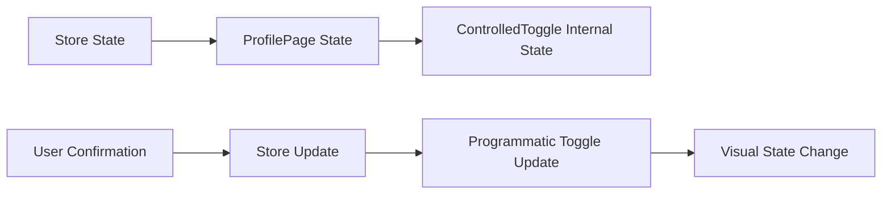

# Toggle Checkbox Behavior Design

## Overview

This design addresses the implementation of a controlled checkbox/toggle behavior where the visual state change is prevented on click and only updated programmatically after user confirmation through a modal dialog. The current ProfilePage implementation shows the profile is updated in the header but the checkbox doesn't toggle after confirmation.

## Current Problem Analysis

The existing implementation in ProfilePage uses a Vue watch mechanism that reverts the toggle state immediately after click to show a confirmation modal. However, this approach creates inconsistency between the profile header updates and the checkbox visual state.

**Current Flow Issues:**

1. User clicks toggle → Value changes → Watch detects change
2. Modal shows → Toggle reverts to previous state
3. User confirms → Profile updates → Header reflects change
4. **Problem:** Toggle visual state doesn't update to match confirmed value

## Architecture

### Component Structure



### State Management Pattern



## Implementation Strategy

### 1. Custom Controlled Toggle Component

Create a `ControlledToggle` component that prevents default toggle behavior and manages state programmatically:

```vue
<template>
  <Switch
    :model-value="internalValue"
    @click.prevent="handleToggleClick"
    :disabled="disabled"
    :class="toggleClasses"
    class="relative inline-flex h-6 w-11 flex-shrink-0 cursor-pointer rounded-full border-2 border-transparent transition-colors duration-200 ease-in-out focus:outline-none focus:ring-2 focus:ring-green-500 focus:ring-offset-2 disabled:opacity-50 disabled:cursor-not-allowed"
  >
    <!-- Toggle visual elements -->
  </Switch>
</template>
```

### 2. Event Prevention Strategy

Implement click event prevention to stop default toggle behavior:

```typescript
const handleToggleClick = (event: Event) => {
  // Prevent default toggle behavior
  event.preventDefault()
  event.stopPropagation()

  // Calculate intended new value
  const intendedValue = !internalValue.value

  // Emit custom event with intended value
  emit('toggle-requested', intendedValue)
}
```

### 3. Programmatic State Update

Provide methods to update toggle state only after confirmation:

```typescript
interface ControlledToggleExposed {
  updateValue: (newValue: boolean) => void
  getCurrentValue: () => boolean
}

const updateValue = (newValue: boolean) => {
  internalValue.value = newValue
}

defineExpose({
  updateValue,
  getCurrentValue: () => internalValue.value,
})
```

## Component Specifications

### ControlledToggle Component

**Props:**

- `modelValue: boolean` - Current toggle state
- `disabled: boolean` - Whether toggle is disabled
- `confirmationRequired: boolean` - Whether to require confirmation (default: true)

**Events:**

- `toggle-requested(newValue: boolean)` - Emitted when user attempts to toggle

**Methods:**

- `updateValue(newValue: boolean)` - Programmatically update toggle state
- `getCurrentValue()` - Get current toggle value

### ProfilePage Integration

**State Management:**

```typescript
// Current toggle state (matches store)
const isOpenToOffers = ref(false)
// Pending value awaiting confirmation
const pendingToggleValue = ref<boolean | null>(null)
// Modal visibility
const showConfirmModal = ref(false)
// Component reference for programmatic updates
const toggleRef = ref<InstanceType<typeof ControlledToggle>>()
```

**Event Handlers:**

```typescript
const handleToggleRequested = (newValue: boolean) => {
  pendingToggleValue.value = newValue
  showConfirmModal.value = true
}

const handleConfirmToggle = async () => {
  if (pendingToggleValue.value === null) return

  try {
    await userStore.updateOpenToOffers(pendingToggleValue.value)
    // Update toggle visual state programmatically
    toggleRef.value?.updateValue(pendingToggleValue.value)
    isOpenToOffers.value = pendingToggleValue.value
  } catch (error) {
    console.error('Failed to update:', error)
  } finally {
    // Clean up
    showConfirmModal.value = false
    pendingToggleValue.value = null
  }
}
```

## Data Flow

### User Interaction Flow



### State Synchronization



## Error Handling

### Failed Update Scenarios

1. **Network Error**: Revert toggle to previous state
2. **Server Error**: Show error message, maintain current state
3. **Validation Error**: Display validation feedback

```typescript
const handleConfirmToggle = async () => {
  try {
    await userStore.updateOpenToOffers(pendingToggleValue.value)
    toggleRef.value?.updateValue(pendingToggleValue.value)
  } catch (error) {
    // Ensure toggle stays in current state on error
    toggleRef.value?.updateValue(isOpenToOffers.value)
    // Show error notification
    showErrorNotification('Failed to update availability status')
  }
}
```

## Testing Strategy

### Unit Tests

1. **ControlledToggle Component**:
   - Verify click event is prevented
   - Confirm `toggle-requested` event emission
   - Test programmatic value updates
   - Validate disabled state handling

2. **ProfilePage Integration**:
   - Test confirmation flow
   - Verify state synchronization
   - Test error handling scenarios

### Integration Tests

1. **End-to-End Toggle Flow**:
   - User clicks toggle → Modal appears
   - User confirms → Store updates → Toggle visual updates
   - User cancels → No changes occur

### Test Cases

```typescript
describe('ControlledToggle', () => {
  it('should prevent default click behavior', async () => {
    const preventDefault = vi.fn()
    const wrapper = mount(ControlledToggle, {
      props: { modelValue: false },
    })

    await wrapper.find('.toggle').trigger('click', { preventDefault })
    expect(preventDefault).toHaveBeenCalled()
  })

  it('should emit toggle-requested event', async () => {
    const wrapper = mount(ControlledToggle, {
      props: { modelValue: false },
    })

    await wrapper.find('.toggle').trigger('click')
    expect(wrapper.emitted('toggle-requested')).toEqual([[true]])
  })
})
```

## Accessibility Considerations

### ARIA Attributes

- `role="switch"` for toggle semantics
- `aria-checked` reflects current state
- `aria-describedby` links to description text
- `aria-disabled` when toggle is disabled

### Keyboard Navigation

- Space/Enter keys trigger confirmation flow
- Focus management during modal interactions
- Screen reader announcements for state changes

## Performance Optimization

### Event Handling

- Use passive event listeners where appropriate
- Debounce rapid clicks to prevent multiple modals
- Optimize re-renders with memo where needed

### State Updates

- Batch state updates to minimize re-renders
- Use ref-based updates for programmatic changes
- Implement loading states to prevent double-clicks

## Browser Compatibility

- Modern browsers supporting ES2020+
- Vue 3 Composition API support
- CSS custom properties for theming
- Focus-visible polyfill for older browsers
