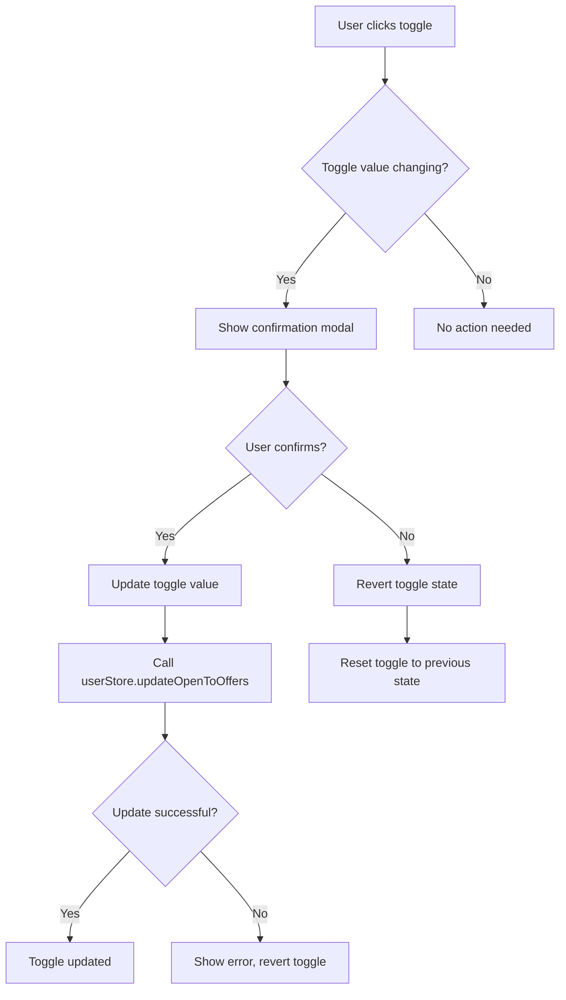
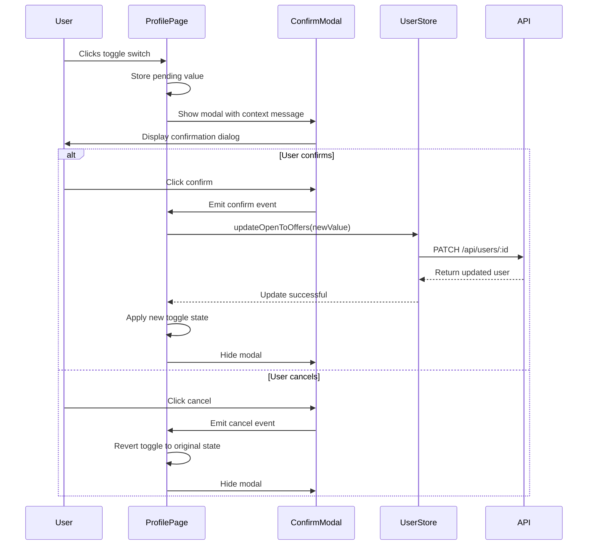

# Toggle Confirmation Modal Design

## Overview

This design adds a confirmation modal to the "Available for proposals" toggle on the specialist profile page. When a specialist changes their availability status, they will be prompted with a confirmation dialog explaining the implications of their action.

## Technology Stack & Dependencies

- **Frontend Framework**: Vue 3 with Composition API
- **UI Components**: Existing BaseModal and ConfirmDialog components
- **State Management**: Pinia store (user.ts)
- **Styling**: Tailwind CSS
- **Icons**: Heroicons (Switch component from @headlessui/vue)

## Component Architecture

### Modified Components

#### ProfilePage.vue Enhancement

The main profile page component will be enhanced to include confirmation modal logic for the "Available for proposals" toggle.



#### Toggle Confirmation Modal Component

A specialized modal component will handle the confirmation flow with context-specific messaging.

### Component Props and State

#### ProfilePage.vue State Extensions

| Property             | Type                   | Description                                |
| -------------------- | ---------------------- | ------------------------------------------ |
| `isOpenToOffers`     | `Ref<boolean>`         | Current toggle state (existing)            |
| `pendingToggleValue` | `Ref<boolean \| null>` | Pending toggle value awaiting confirmation |
| `showConfirmModal`   | `Ref<boolean>`         | Controls confirmation modal visibility     |
| `isUpdating`         | `Ref<boolean>`         | Loading state during API update            |

#### Modal Content Configuration

| Toggle Direction | Modal Title       | Modal Message                                                                                                                    | Confirm Button   |
| ---------------- | ----------------- | -------------------------------------------------------------------------------------------------------------------------------- | ---------------- |
| TRUE → FALSE     | Скрыть из поиска  | Ваша анкета специалиста не будет показана в поиске активных специалистов, но останется доступной для просмотра по прямой ссылке. | Скрыть профиль   |
| FALSE → TRUE     | Показать в поиске | Ваша анкета специалиста снова будет показана в поиске активных специалистов и станет видимой для потенциальных клиентов.         | Показать профиль |

### User Experience Flow



## Implementation Details

### Toggle Interaction Enhancement

The existing toggle watch function will be modified to show confirmation instead of immediate API calls:

```typescript
// Enhanced toggle watch with confirmation
watch(isOpenToOffers, (newValue, oldValue) => {
  // Only show confirmation if value actually changed
  if (newValue !== oldValue && oldValue !== undefined) {
    // Store the pending value and revert the toggle
    pendingToggleValue.value = newValue
    isOpenToOffers.value = oldValue
    showConfirmModal.value = true
  }
})
```

### Confirmation Modal Integration

```typescript
const handleConfirmToggle = async () => {
  if (pendingToggleValue.value === null) return

  isUpdating.value = true

  try {
    await userStore.updateOpenToOffers(pendingToggleValue.value)
    // Apply the confirmed value
    isOpenToOffers.value = pendingToggleValue.value
  } catch (error) {
    console.error('Failed to update availability status:', error)
    // Revert remains at original value
  } finally {
    isUpdating.value = false
    showConfirmModal.value = false
    pendingToggleValue.value = null
  }
}

const handleCancelToggle = () => {
  showConfirmModal.value = false
  pendingToggleValue.value = null
  // Toggle already reverted in watch function
}
```

### Dynamic Modal Content

```typescript
const modalConfig = computed(() => {
  const isBecomingAvailable = pendingToggleValue.value === true

  return {
    title: isBecomingAvailable ? 'Показать в поиске' : 'Скрыть из поиска',
    message: isBecomingAvailable
      ? 'Ваша анкета специалиста снова будет показана в поиске активных специалистов и станет видимой для потенциальных клиентов.'
      : 'Ваша анкета специалиста не будет показана в поиске активных специалистов, но останется доступной для просмотра по прямой ссылке.',
    confirmText: isBecomingAvailable ? 'Показать профиль' : 'Скрыть профиль',
    cancelText: 'Отмена',
  }
})
```

## Error Handling & User Feedback

### Error Scenarios

| Scenario          | User Feedback                         | Recovery Action                  |
| ----------------- | ------------------------------------- | -------------------------------- |
| API Request Fails | Toast notification with error message | Toggle reverts to original state |
| Network Timeout   | "Network error" message               | Retry button in error state      |
| Validation Error  | Specific validation message           | Allow user to retry              |

### Loading States

```typescript
// Disable toggle during API call
const toggleDisabled = computed(() => isUpdating.value || userStore.loading)
```

## Testing Strategy

### Unit Tests

1. **Toggle Interaction Tests**
   - Verify modal appears on toggle change
   - Verify toggle reverts when modal is cancelled
   - Verify API call only happens after confirmation

2. **Modal Content Tests**
   - Verify correct messages for TRUE/FALSE transitions
   - Verify button text changes appropriately
   - Verify modal closes on both confirm and cancel

3. **Error Handling Tests**
   - Verify toggle reverts on API failure
   - Verify error messages display correctly
   - Verify loading states work properly

### Integration Tests

1. **Full Flow Tests**
   - End-to-end toggle confirmation flow
   - API integration with mock responses
   - Error recovery scenarios

### User Experience Validation

- Accessibility testing for modal navigation
- Mobile responsiveness verification
- Keyboard navigation support
- Screen reader compatibility

## Security Considerations

- **Input Validation**: Validate toggle state before API calls
- **Rate Limiting**: Prevent rapid toggle spam
- **Authentication**: Ensure user can only modify their own profile
- **Authorization**: Verify specialist role before allowing toggle changes

## Performance Considerations

- **Debouncing**: Prevent multiple rapid toggle attempts
- **Optimistic Updates**: Consider optimistic UI updates with rollback
- **Caching**: Cache user preferences locally
- **API Efficiency**: Batch profile updates if multiple changes occur

## Accessibility Features

- **Keyboard Navigation**: Full keyboard support for modal and toggle
- **Screen Readers**: Proper ARIA labels and descriptions
- **Focus Management**: Proper focus trapping in modal
- **High Contrast**: Ensure visibility in high contrast modes
- **Reduced Motion**: Respect user's motion preferences
