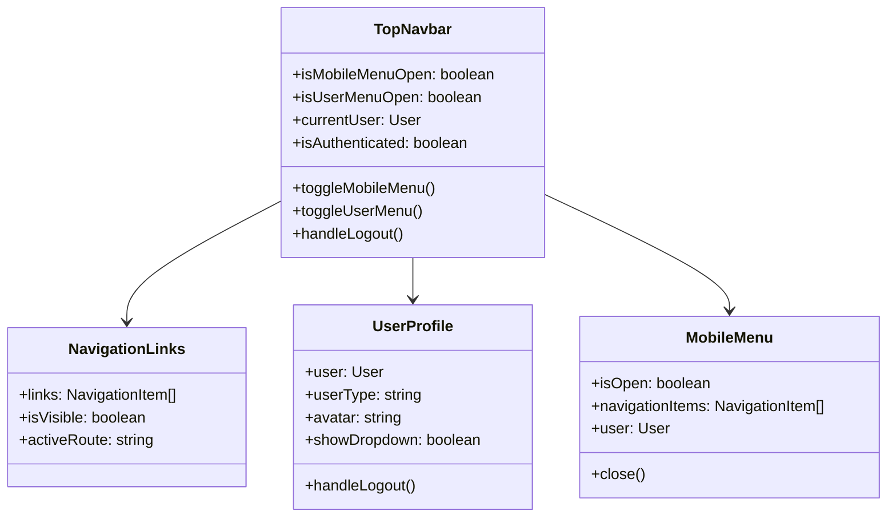
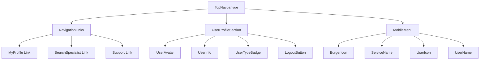
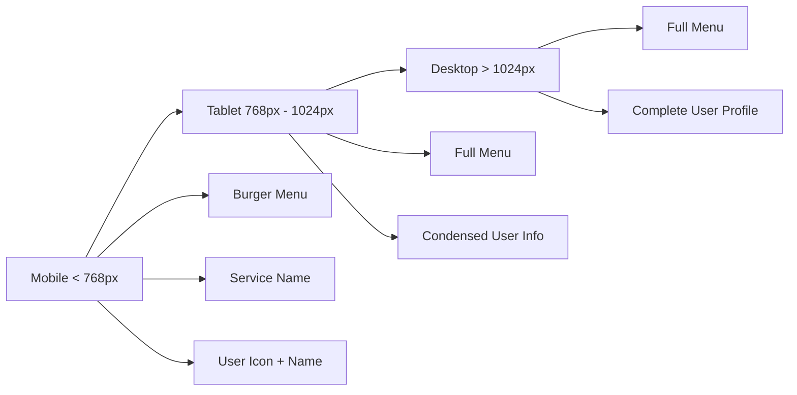
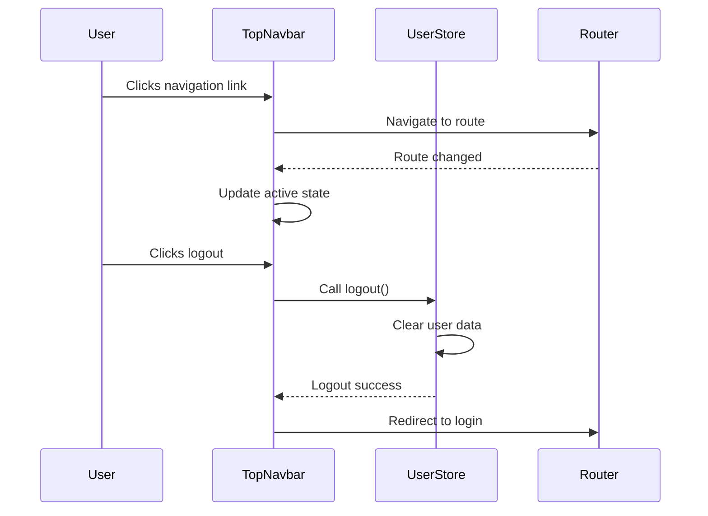
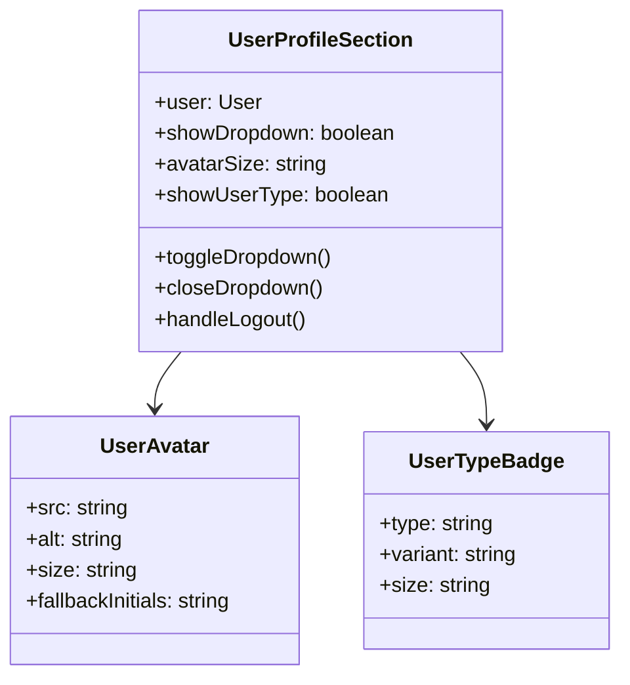
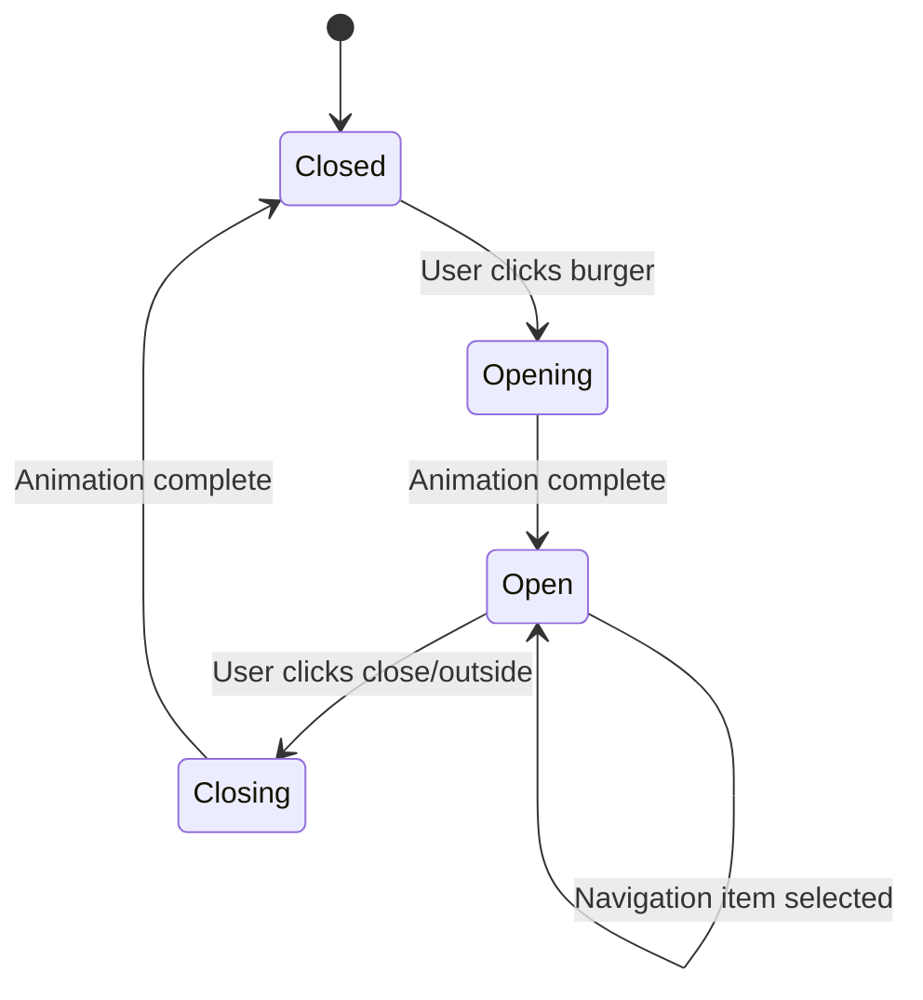

# Top Navbar Redesign

## Overview

This design document outlines the redesign of the top navigation bar for the MayaWork frontend application. The new navbar will provide improved user experience with updated navigation structure, enhanced user information display, and responsive design for all screen sizes.

## Current State Analysis

The existing navbar (`AppNavigation.vue`) contains:

- Basic navigation links (Home, About, Dashboard)
- Simple user authentication state display
- Basic responsive behavior
- Limited user profile information

## Technology Stack & Dependencies

**Frontend Framework:** Vue 3 with Composition API  
**UI Library:** Tailwind CSS (already integrated in project)  
**State Management:** Pinia for user authentication and profile data  
**Icons:** Heroicons (compatible with Tailwind CSS)  
**Responsive Design:** Tailwind CSS utility classes and breakpoints

## Component Architecture

### New TopNavbar Component Structure



### Component Hierarchy



### Props and State Management

#### TopNavbar Component Props

```typescript
interface TopNavbarProps {
  serviceName?: string
  logoUrl?: string
  theme?: 'light' | 'dark'
}
```

#### Navigation Item Interface

```typescript
interface NavigationItem {
  id: string
  label: string
  route: string
  icon?: string
  requiresAuth: boolean
}
```

#### User Profile Data

```typescript
interface UserProfile {
  id: string
  firstName: string
  lastName: string
  email: string
  avatar?: string
  userType: 'specialist' | 'client'
  isActive: boolean
}
```

## Routing & Navigation

### Navigation Structure

| Link              | Route                 | Icon                   | Description                     |
| ----------------- | --------------------- | ---------------------- | ------------------------------- |
| Мой профиль       | `/profile`            | `user-circle`          | User profile management         |
| Поиск специалиста | `/search/specialists` | `magnifying-glass`     | Specialist search functionality |
| Поддержка         | `/support`            | `question-mark-circle` | Help and support section        |

### Route Configuration

```typescript
const navigationRoutes = [
  {
    path: '/profile',
    name: 'my-profile',
    component: () => import('@/pages/ProfilePage.vue'),
    meta: { requiresAuth: true },
  },
  {
    path: '/search/specialists',
    name: 'search-specialists',
    component: () => import('@/pages/SearchSpecialistsPage.vue'),
    meta: { requiresAuth: true },
  },
  {
    path: '/support',
    name: 'support',
    component: () => import('@/pages/SupportPage.vue'),
    meta: { requiresAuth: false },
  },
]
```

## Styling Strategy

### Responsive Design Breakpoints



### Tailwind CSS Utility Classes

Instead of custom CSS variables, we'll use Tailwind's built-in design tokens:

```html
<!-- Light theme classes -->
<nav class="bg-white border-b border-gray-200 shadow-sm">
  <div class="text-gray-700 hover:text-gray-900">
    <div class="bg-gray-50">
      <span class="bg-gray-500 text-white">
        <!-- Dark theme classes (with dark: prefix) -->
        <nav class="bg-white dark:bg-gray-800 border-b border-gray-200 dark:border-gray-700">
          <div
            class="text-gray-700 dark:text-gray-300 hover:text-gray-900 dark:hover:text-gray-100"
          >
            <div class="bg-gray-50 dark:bg-gray-700"></div>
          </div></nav
      ></span>
    </div>
  </div>
</nav>
```

### Tailwind CSS Classes Structure

#### Desktop Layout (lg: breakpoint and above)

```html
<!-- Main navbar container -->
<nav class="h-16 bg-white dark:bg-gray-800 border-b border-gray-200 dark:border-gray-700 shadow-sm">
  <div class="max-w-7xl mx-auto px-4 sm:px-6 lg:px-8 h-full">
    <div class="flex justify-between items-center h-full">
      <!-- Navigation links - hidden on mobile -->
      <div class="hidden lg:flex space-x-8">
        <!-- Navigation items -->
      </div>

      <!-- User section -->
      <div class="flex items-center space-x-4">
        <!-- User profile components -->
      </div>
    </div>
  </div>
</nav>
```

#### Mobile Layout (below lg: breakpoint)

```html
<!-- Mobile navbar -->
<nav class="relative h-16 bg-white dark:bg-gray-800 border-b border-gray-200 dark:border-gray-700">
  <div class="flex justify-between items-center px-4 h-16">
    <!-- Burger menu button -->
    <button
      class="lg:hidden p-2 rounded-md text-gray-400 hover:text-gray-500 dark:text-gray-300 dark:hover:text-gray-200"
    >
      <!-- Burger icon -->
    </button>

    <!-- Service name -->
    <span class="text-lg font-semibold text-gray-900 dark:text-white"> MayaWork </span>

    <!-- Mobile user section -->
    <div class="flex items-center space-x-2">
      <!-- User icon and name -->
    </div>
  </div>
</nav>
```

## State Management

### User Store Enhancement

```typescript
interface UserStoreState {
  currentUser: UserProfile | null
  isAuthenticated: boolean
  userType: 'specialist' | 'client' | null
  loading: boolean
  error: string | null
}

interface UserStoreActions {
  login(credentials: LoginCredentials): Promise<void>
  logout(): void
  updateProfile(profile: Partial<UserProfile>): Promise<void>
  getUserType(): 'specialist' | 'client' | null
  getDisplayName(): string
}
```

### Navigation Store

```typescript
interface NavigationStoreState {
  isMobileMenuOpen: boolean
  activeRoute: string
  navigationItems: NavigationItem[]
}

interface NavigationStoreActions {
  toggleMobileMenu(): void
  closeMobileMenu(): void
  setActiveRoute(route: string): void
  getVisibleNavigationItems(): NavigationItem[]
}
```

## API Integration Layer

### User Profile API

```typescript
interface UserProfileAPI {
  getCurrentUser(): Promise<UserProfile>
  updateUserProfile(data: Partial<UserProfile>): Promise<UserProfile>
  uploadAvatar(file: File): Promise<{ avatarUrl: string }>
}
```

### Logout API

```typescript
interface AuthAPI {
  logout(): Promise<void>
  refreshToken(): Promise<{ token: string }>
}
```

## Data Models & Type System

### Enhanced User Interface

```typescript
interface User {
  id: string
  firstName: string
  lastName: string
  email: string
  avatar?: string
  userType: 'specialist' | 'client'
  role: 'admin' | 'user' | 'moderator'
  isActive: boolean
  lastLoginAt?: string
  createdAt: string
  updatedAt: string
}
```

### Navigation Types

```typescript
interface NavigationItem {
  id: string
  label: string
  route: string
  icon?: string
  badge?: string
  requiresAuth: boolean
  visible: boolean
}

interface BreadcrumbItem {
  label: string
  route?: string
  isActive: boolean
}
```

## Implementation Components

### 1. TopNavbar.vue - Main Component with Tailwind Classes

```html
<template>
  <nav
    class="h-16 bg-white dark:bg-gray-800 border-b border-gray-200 dark:border-gray-700 shadow-sm"
  >
    <div class="max-w-7xl mx-auto px-4 sm:px-6 lg:px-8 h-full">
      <div class="flex justify-between items-center h-full">
        <!-- Logo/Brand -->
        <div class="flex items-center">
          <router-link to="/" class="flex items-center space-x-2">
            <span class="text-xl font-bold text-blue-600 dark:text-blue-400"> MayaWork </span>
          </router-link>
        </div>

        <!-- Desktop Navigation -->
        <div class="hidden lg:flex space-x-8">
          <router-link
            v-for="item in navigationItems"
            :key="item.id"
            :to="item.route"
            class="px-3 py-2 text-sm font-medium text-gray-700 dark:text-gray-300 
                   hover:text-gray-900 dark:hover:text-white rounded-md 
                   hover:bg-gray-50 dark:hover:bg-gray-700 transition-colors"
            :class="{ 
              'text-blue-600 dark:text-blue-400 bg-blue-50 dark:bg-blue-900/20': isActiveRoute(item.route) 
            }"
          >
            {{ item.label }}
          </router-link>
        </div>

        <!-- User Section -->
        <div class="flex items-center space-x-4">
          <UserProfileSection :user="currentUser" />
        </div>

        <!-- Mobile Menu Button -->
        <button
          @click="toggleMobileMenu"
          class="lg:hidden p-2 rounded-md text-gray-400 hover:text-gray-500 
                 dark:text-gray-300 dark:hover:text-gray-200 hover:bg-gray-100 
                 dark:hover:bg-gray-700 transition-colors"
          :aria-expanded="isMobileMenuOpen"
        >
          <BarsIcon v-if="!isMobileMenuOpen" class="h-6 w-6" />
          <XMarkIcon v-else class="h-6 w-6" />
        </button>
      </div>
    </div>

    <!-- Mobile Menu -->
    <MobileNavigationMenu
      :is-open="isMobileMenuOpen"
      :navigation-items="navigationItems"
      :user="currentUser"
      @close="closeMobileMenu"
    />
  </nav>
</template>
```



### 2. UserProfileSection.vue - User Information Display with Tailwind Classes

```html
<template>
  <div class="relative">
    <!-- Desktop User Profile -->
    <div class="hidden lg:flex items-center space-x-3">
      <!-- User Avatar -->
      
      <div
        v-else
        class="h-8 w-8 rounded-full bg-gray-300 dark:bg-gray-600 flex items-center justify-center"
      >
        <span class="text-sm font-medium text-gray-700 dark:text-gray-300">
          {{ userInitials }}
        </span>
      </div>

      <!-- User Info -->
      <div class="flex flex-col">
        <span class="text-sm font-medium text-gray-900 dark:text-white">
          {{ userDisplayName }}
        </span>
        <span
          class="inline-flex items-center px-2 py-0.5 rounded text-xs font-medium 
                     bg-gray-100 dark:bg-gray-700 text-gray-800 dark:text-gray-200"
        >
          {{ userTypeLabel }}
        </span>
      </div>

      <!-- Logout Button -->
      <button
        @click="handleLogout"
        class="p-2 text-gray-400 hover:text-gray-500 dark:text-gray-300 
               dark:hover:text-gray-200 hover:bg-gray-100 dark:hover:bg-gray-700 
               rounded-md transition-colors"
        title="Выйти из системы"
      >
        <ArrowRightOnRectangleIcon class="h-5 w-5" />
      </button>
    </div>

    <!-- Mobile User Profile -->
    <div class="lg:hidden flex items-center space-x-2">
      <!-- User Icon -->
      
      <UserIcon v-else class="h-6 w-6 text-gray-400 dark:text-gray-300" />

      <!-- User Name -->
      <span class="text-sm font-medium text-gray-900 dark:text-white truncate max-w-20">
        {{ user?.firstName }}
      </span>
    </div>
  </div>
</template>
```



### 3. MobileNavigationMenu.vue - Mobile Menu with Tailwind Classes

```html
<template>
  <!-- Mobile menu overlay -->
  <Transition
    enter-active-class="transition-opacity duration-300"
    enter-from-class="opacity-0"
    enter-to-class="opacity-100"
    leave-active-class="transition-opacity duration-300"
    leave-from-class="opacity-100"
    leave-to-class="opacity-0"
  >
    <div
      v-if="isOpen"
      class="fixed inset-0 z-40 bg-black bg-opacity-25 lg:hidden"
      @click="$emit('close')"
    />
  </Transition>

  <!-- Mobile menu panel -->
  <Transition
    enter-active-class="transition-transform duration-300 ease-in-out"
    enter-from-class="-translate-x-full"
    enter-to-class="translate-x-0"
    leave-active-class="transition-transform duration-300 ease-in-out"
    leave-from-class="translate-x-0"
    leave-to-class="-translate-x-full"
  >
    <div
      v-if="isOpen"
      class="fixed top-0 left-0 z-50 h-full w-64 bg-white dark:bg-gray-800 
             shadow-xl transform lg:hidden"
    >
      <!-- Menu Header -->
      <div
        class="flex items-center justify-between p-4 border-b border-gray-200 dark:border-gray-700"
      >
        <span class="text-lg font-semibold text-gray-900 dark:text-white"> Меню </span>
        <button
          @click="$emit('close')"
          class="p-2 rounded-md text-gray-400 hover:text-gray-500 
                 dark:text-gray-300 dark:hover:text-gray-200 hover:bg-gray-100 
                 dark:hover:bg-gray-700 transition-colors"
        >
          <XMarkIcon class="h-5 w-5" />
        </button>
      </div>

      <!-- Navigation Items -->
      <div class="py-4">
        <router-link
          v-for="item in navigationItems"
          :key="item.id"
          :to="item.route"
          class="flex items-center px-4 py-3 text-base font-medium 
                 text-gray-700 dark:text-gray-300 hover:text-gray-900 
                 dark:hover:text-white hover:bg-gray-50 dark:hover:bg-gray-700 
                 border-l-4 border-transparent hover:border-blue-500 transition-colors"
          :class="{ 
            'text-blue-600 dark:text-blue-400 bg-blue-50 dark:bg-blue-900/20 border-blue-500': 
            isActiveRoute(item.route) 
          }"
          @click="$emit('close')"
        >
          {{ item.label }}
        </router-link>
      </div>

      <!-- User Info Section -->
      <div
        class="absolute bottom-0 left-0 right-0 p-4 border-t border-gray-200 dark:border-gray-700"
      >
        <div class="flex items-center space-x-3">
          
          <div
            v-else
            class="h-10 w-10 rounded-full bg-gray-300 dark:bg-gray-600 
                   flex items-center justify-center"
          >
            <span class="text-sm font-medium text-gray-700 dark:text-gray-300">
              {{ userInitials }}
            </span>
          </div>

          <div class="flex-1 min-w-0">
            <p class="text-sm font-medium text-gray-900 dark:text-white truncate">
              {{ userDisplayName }}
            </p>
            <span
              class="inline-flex items-center px-2 py-0.5 rounded text-xs 
                         font-medium bg-gray-100 dark:bg-gray-700 text-gray-800 
                         dark:text-gray-200"
            >
              {{ userTypeLabel }}
            </span>
          </div>

          <button
            @click="handleLogout"
            class="p-2 text-gray-400 hover:text-gray-500 dark:text-gray-300 
                   dark:hover:text-gray-200 hover:bg-gray-100 dark:hover:bg-gray-700 
                   rounded-md transition-colors"
            title="Выйти из системы"
          >
            <ArrowRightOnRectangleIcon class="h-5 w-5" />
          </button>
        </div>
      </div>
    </div>
  </Transition>
</template>
```



### 4. NavigationLinks.vue - Desktop Navigation with Tailwind Classes

```html
<template>
  <div :class="containerClasses">
    <router-link v-for="item in items" :key="item.id" :to="item.route" :class="linkClasses(item)">
      <component v-if="item.icon" :is="item.icon" class="h-4 w-4" />
      {{ item.label }}
    </router-link>
  </div>
</template>

<script setup lang="ts">
  interface NavigationLinksProps {
    items: NavigationItem[]
    activeRoute: string
    variant?: 'horizontal' | 'vertical'
  }

  const props = withDefaults(defineProps<NavigationLinksProps>(), {
    variant: 'horizontal',
  })

  const containerClasses = computed(() => {
    return props.variant === 'horizontal' ? 'flex space-x-8' : 'flex flex-col space-y-1'
  })

  const linkClasses = (item: NavigationItem) => {
    const baseClasses =
      'flex items-center px-3 py-2 text-sm font-medium rounded-md transition-colors'
    const activeClasses = 'text-blue-600 dark:text-blue-400 bg-blue-50 dark:bg-blue-900/20'
    const inactiveClasses =
      'text-gray-700 dark:text-gray-300 hover:text-gray-900 dark:hover:text-white hover:bg-gray-50 dark:hover:bg-gray-700'

    return `${baseClasses} ${isActiveRoute(item.route) ? activeClasses : inactiveClasses}`
  }
</script>
```

```typescript
interface NavigationLinksProps {
  items: NavigationItem[]
  activeRoute: string
  variant?: 'horizontal' | 'vertical'
}
```

## Testing Strategy

### Unit Tests

- Component rendering with different user states
- Navigation item click handlers
- Mobile menu toggle functionality
- User dropdown interactions
- Responsive behavior testing

### Integration Tests

- Authentication flow integration
- Route navigation testing
- User profile data display
- Logout functionality
- Cross-component communication

### Visual Regression Tests

- Navbar appearance across screen sizes
- Dark/light theme variations
- User avatar placeholder states
- Mobile menu animations

## Accessibility Considerations

### ARIA Labels and Roles

```html
<!-- Navigation landmark -->
<nav role="navigation" aria-label="Main navigation">
  <!-- Mobile menu button -->
  <button
    aria-expanded="false"
    aria-controls="mobile-menu"
    aria-label="Open main menu"
  >

  <!-- User menu button -->
  <button
    aria-expanded="false"
    aria-controls="user-menu"
    aria-label="User account menu"
  >
</nav>
```

### Keyboard Navigation

- Tab navigation through all interactive elements
- Enter/Space key activation for buttons
- Escape key to close menus
- Arrow key navigation in dropdown menus

### Screen Reader Support

- Descriptive alt text for user avatars
- Clear labeling for user type badges
- Status announcements for menu state changes
