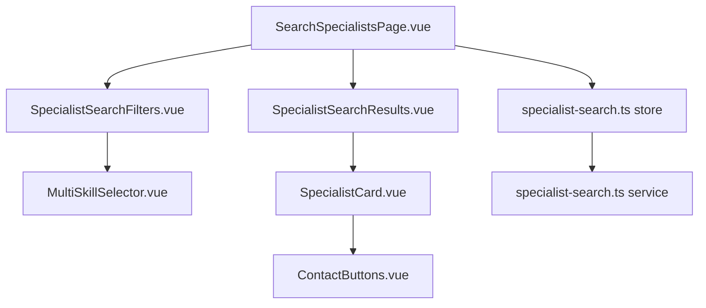
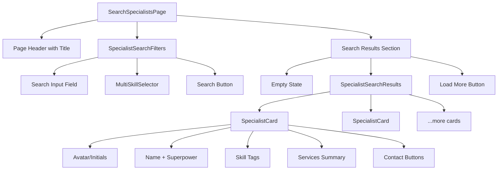

# Specialist Search Page Update Design

## Overview

This design document outlines the update to the specialist search page (`SearchSpecialistsPage.vue`) to remove existing filters, implement multiple skill selection, and display specialist cards based on neural network questionnaire data. The implementation will leverage the existing questionnaire structure and user profile data to provide relevant search results.

## Technology Stack & Dependencies

- **Frontend Framework**: Vue 3 with Composition API and TypeScript
- **Styling**: Tailwind CSS with dark theme support
- **Package Manager**: pnpm
- **State Management**: Pinia stores
- **Icons**: Heroicons
- **Data Source**: Neural Network Profile questionnaire data

## Component Architecture

### Component Hierarchy



### Component Definitions

#### 1. SearchSpecialistsPage.vue (Updated)

**Purpose**: Main search page container
**Props**: None
**State**:

- Search query
- Selected skills filter
- Loading states
- Search results

#### 2. SpecialistSearchFilters.vue (New)

**Purpose**: Search form with skill selection
**Props**:

- `onSearch`: Function to trigger search
- `loading`: Boolean for search state

#### 3. MultiSkillSelector.vue (New)

**Purpose**: Multiple skill selection component
**Props**:

- `modelValue`: Array of selected skills
- `options`: Available skills from questionnaire
- `placeholder`: String

#### 4. SpecialistSearchResults.vue (New)

**Purpose**: Container for search results
**Props**:

- `specialists`: Array of specialist profiles
- `loading`: Boolean
- `empty`: Boolean for no results

#### 5. SpecialistCard.vue (New)

**Purpose**: Individual specialist result card
**Props**:

- `specialist`: Specialist profile data

#### 6. ContactButtons.vue (New)

**Purpose**: Contact action buttons
**Props**:

- `contacts`: Contact information object

### Props and State Management

```typescript
// SearchSpecialistsPage.vue state
interface SearchState {
  searchQuery: string
  selectedSkills: string[]
  specialists: SpecialistProfile[]
  loading: boolean
  hasSearched: boolean
}

// MultiSkillSelector.vue props
interface SkillSelectorProps {
  modelValue: string[]
  options: SkillOption[]
  placeholder?: string
  maxSelections?: number
}

// SpecialistCard.vue props
interface SpecialistCardProps {
  specialist: SpecialistProfile
}
```

## Data Models & Type System

### Specialist Profile for Search Results

```typescript
// types/specialist-search.ts
interface SpecialistProfile {
  id: string
  userId: string

  // Basic info
  displayName: string
  superpower: string
  avatarUrl?: string

  // Skills and specializations (from questionnaire)
  specializations: string[]
  abilities: string[]

  // Services and pricing
  services: ServiceSummary[]

  // Contact info
  contacts: {
    telegram?: string
    email?: string
    website?: string
  }

  // Metadata
  rating?: number
  reviewCount?: number
  completedProjects?: number
  responseTime?: string
  status: 'available' | 'busy' | 'unavailable'
  lastActive: string
}

interface ServiceSummary {
  name: string
  price: number | string
  priceType: 'fixed' | 'hourly' | 'project' | 'negotiable'
}

interface SkillOption {
  key: string
  label: string
  category: 'specialization' | 'ability'
  description?: string
}
```

### Search Parameters

```typescript
interface SearchFilters {
  query?: string
  skills: string[]
  availability?: 'available' | 'all'
  priceRange?: {
    min?: number
    max?: number
  }
  // Pagination parameters
  page?: number
  limit?: number
}

interface SearchResults {
  specialists: SpecialistProfile[]
  total: number
  currentPage: number
  totalPages: number
  hasMore: boolean
  facets: {
    skills: { key: string; count: number }[]
    specializations: { key: string; count: number }[]
  }
}

// Infinite scroll state management
interface InfiniteScrollState {
  isLoadingMore: boolean
  hasReachedEnd: boolean
  currentPage: number
  pageSize: number
}
```

## State Management

### Specialist Search Store Implementation

```typescript
// stores/specialist-search.ts
import { defineStore } from 'pinia'
import { ref, computed } from 'vue'
import type {
  SearchFilters,
  SearchResults,
  SkillOption,
  SpecialistProfile,
  InfiniteScrollState,
} from '@/types/specialist-search'
import { SpecialistSearchService } from '@/services/specialist-search'

export const useSpecialistSearchStore = defineStore('specialistSearch', () => {
  // State
  const searchFilters = ref<SearchFilters>({
    query: '',
    skills: [],
    availability: 'all',
    page: 1,
    limit: 5,
  })

  const allSpecialists = ref<SpecialistProfile[]>([])
  const availableSkills = ref<SkillOption[]>([])
  const loading = ref(false)
  const skillsLoading = ref(false)
  const error = ref<string | null>(null)
  const hasSearched = ref(false)

  // Infinite scroll state
  const infiniteScrollState = ref<InfiniteScrollState>({
    isLoadingMore: false,
    hasReachedEnd: false,
    currentPage: 1,
    pageSize: 5,
  })

  // Last search results metadata
  const lastSearchResults = ref<SearchResults | null>(null)

  // Service instance
  const searchService = new SpecialistSearchService()

  // Getters
  const hasResults = computed(() => {
    return allSpecialists.value.length > 0
  })

  const selectedSkillLabels = computed(() => {
    return searchFilters.value.skills.map(skillKey => {
      const skill = availableSkills.value.find(s => s.key === skillKey)
      return skill ? skill.label : skillKey
    })
  })

  const searchSummary = computed(() => {
    if (!hasSearched.value) return ''

    const total = lastSearchResults.value?.total || 0
    const filters = []

    if (searchFilters.value.query) {
      filters.push(`"${searchFilters.value.query}"`)
    }

    if (searchFilters.value.skills.length > 0) {
      filters.push(`${searchFilters.value.skills.length} навыков`)
    }

    if (searchFilters.value.availability === 'available') {
      filters.push('доступные')
    }

    const filterText = filters.length > 0 ? ` по фильтрам: ${filters.join(', ')}` : ''
    return `Найдено ${total} специалистов${filterText}`
  })

  const availableSpecialistsCount = computed(() => {
    return allSpecialists.value.filter(s => s.status === 'available').length
  })

  const canLoadMore = computed(() => {
    return (
      !infiniteScrollState.value.hasReachedEnd &&
      !infiniteScrollState.value.isLoadingMore &&
      hasSearched.value
    )
  })

  // Actions
  const searchSpecialists = async (
    filters?: Partial<SearchFilters>,
    resetResults = true
  ): Promise<void> => {
    if (filters) {
      Object.assign(searchFilters.value, filters)
    }

    // Reset for new search
    if (resetResults) {
      allSpecialists.value = []
      infiniteScrollState.value.currentPage = 1
      infiniteScrollState.value.hasReachedEnd = false
      searchFilters.value.page = 1
    }

    loading.value = true
    error.value = null

    try {
      const results = await searchService.searchSpecialists({
        ...searchFilters.value,
        page: infiniteScrollState.value.currentPage,
      })

      if (resetResults) {
        allSpecialists.value = results.specialists
      } else {
        // Append for infinite scroll
        allSpecialists.value.push(...results.specialists)
      }

      lastSearchResults.value = results
      hasSearched.value = true

      // Update infinite scroll state
      infiniteScrollState.value.hasReachedEnd = !results.hasMore
    } catch (err) {
      error.value = err instanceof Error ? err.message : 'Ошибка поиска специалистов'
      if (resetResults) {
        allSpecialists.value = []
        lastSearchResults.value = null
      }
    } finally {
      loading.value = false
    }
  }

  const loadMoreSpecialists = async (): Promise<void> => {
    if (!canLoadMore.value) return

    infiniteScrollState.value.isLoadingMore = true
    infiniteScrollState.value.currentPage++

    try {
      await searchSpecialists(
        {
          page: infiniteScrollState.value.currentPage,
        },
        false
      ) // Don't reset results
    } catch (err) {
      // Revert page increment on error
      infiniteScrollState.value.currentPage--
      error.value =
        err instanceof Error ? err.message : 'Ошибка загрузки дополнительных результатов'
    } finally {
      infiniteScrollState.value.isLoadingMore = false
    }
  }

  const loadAvailableSkills = async (): Promise<void> => {
    if (availableSkills.value.length > 0) return // Already loaded

    skillsLoading.value = true

    try {
      const skills = await searchService.getAvailableSkills()
      availableSkills.value = skills
    } catch (err) {
      error.value = err instanceof Error ? err.message : 'Ошибка загрузки навыков'
    } finally {
      skillsLoading.value = false
    }
  }

  const updateFilters = (filters: Partial<SearchFilters>): void => {
    Object.assign(searchFilters.value, filters)
  }

  const clearSearch = (): void => {
    searchFilters.value = {
      query: '',
      skills: [],
      availability: 'all',
      page: 1,
      limit: 5,
    }
    allSpecialists.value = []
    lastSearchResults.value = null
    hasSearched.value = false
    error.value = null

    // Reset infinite scroll state
    infiniteScrollState.value = {
      isLoadingMore: false,
      hasReachedEnd: false,
      currentPage: 1,
      pageSize: 5,
    }
  }

  const addSkillFilter = (skillKey: string): void => {
    if (!searchFilters.value.skills.includes(skillKey)) {
      searchFilters.value.skills.push(skillKey)
    }
  }

  const removeSkillFilter = (skillKey: string): void => {
    const index = searchFilters.value.skills.indexOf(skillKey)
    if (index > -1) {
      searchFilters.value.skills.splice(index, 1)
    }
  }

  const toggleSkillFilter = (skillKey: string): void => {
    if (searchFilters.value.skills.includes(skillKey)) {
      removeSkillFilter(skillKey)
    } else {
      addSkillFilter(skillKey)
    }
  }

  return {
    // State
    searchFilters,
    allSpecialists,
    availableSkills,
    loading,
    skillsLoading,
    error,
    hasSearched,
    infiniteScrollState,
    lastSearchResults,

    // Getters
    hasResults,
    selectedSkillLabels,
    searchSummary,
    availableSpecialistsCount,
    canLoadMore,

    // Actions
    searchSpecialists,
    loadMoreSpecialists,
    loadAvailableSkills,
    updateFilters,
    clearSearch,
    addSkillFilter,
    removeSkillFilter,
    toggleSkillFilter,
  }
})
```

## Styling Strategy

### Tailwind CSS Implementation

```css
/* Skill selector styles */
.skill-selector {
  @apply relative;
}

.skill-dropdown {
  @apply absolute z-50 w-full mt-1 bg-white dark:bg-gray-800 
         border border-gray-300 dark:border-gray-600 rounded-md shadow-lg;
}

.skill-option {
  @apply px-4 py-2 hover:bg-gray-50 dark:hover:bg-gray-700 
         cursor-pointer text-sm;
}

.skill-tag {
  @apply inline-flex items-center px-3 py-1 text-sm font-medium 
         bg-blue-100 dark:bg-blue-900 text-blue-800 dark:text-blue-200 
         rounded-full;
}

/* Specialist card styles */
.specialist-card {
  @apply bg-white dark:bg-gray-800 border border-gray-200 dark:border-gray-700 
         rounded-lg shadow-sm hover:shadow-md transition-shadow p-6;
}

.specialist-header {
  @apply flex items-start space-x-4 mb-4;
}

.specialist-avatar {
  @apply w-16 h-16 rounded-full bg-gradient-to-r from-blue-500 to-purple-600 
         flex items-center justify-center text-white text-xl font-bold;
}

.specialist-info {
  @apply flex-1 min-w-0;
}

.specialist-name {
  @apply text-lg font-semibold text-gray-900 dark:text-white truncate;
}

.specialist-superpower {
  @apply text-sm text-gray-600 dark:text-gray-400 mt-1 line-clamp-2;
}

.specialist-skills {
  @apply flex flex-wrap gap-2 mt-3;
}

.specialist-services {
  @apply mt-4 space-y-2;
}

.specialist-contacts {
  @apply mt-4 flex space-x-2;
}
```

## API Integration Layer

### Fake Data Implementation

```typescript
// services/specialist-search.ts
class SpecialistSearchService {
  private fakeSpecialists: SpecialistProfile[] = [
    // First batch of specialists (page 1)
    {
      id: 'specialist-1',
      userId: 'user-1',
      displayName: 'Анна Иванова',
      superpower: 'Создаю AI-ассистентов для автоматизации бизнес-процессов и увеличения продаж',
      avatarUrl: undefined,
      specializations: ['Нейроассистенты (AI-боты)', 'Нейроворонки (продажи + автоматизация)'],
      abilities: ['Собираю нейроворонки (от лида до оплаты)', 'Создаю персональных AI-ассистентов'],
      services: [
        {
          name: 'Нейроассистент под ключ',
          price: 15000,
          priceType: 'fixed',
        },
        {
          name: 'Консультация по AI',
          price: 2000,
          priceType: 'hourly',
        },
      ],
      contacts: {
        telegram: '@anna_ai_expert',
        email: 'anna@example.com',
      },
      rating: 4.8,
      reviewCount: 24,
      completedProjects: 45,
      responseTime: '< 1 часа',
      status: 'available',
      lastActive: '2024-01-15T10:30:00Z',
    },
    {
      id: 'specialist-2',
      userId: 'user-2',
      displayName: 'Максим Петров',
      superpower: 'Генерирую визуальный контент через нейросети и настраиваю Reels-автоматизацию',
      avatarUrl: undefined,
      specializations: ['Визуалы (обложки, графика, Reels)', 'Контент с помощью нейросетей'],
      abilities: ['Генерирую визуалы в Midjourney/DALLE', 'Настраиваю Reels-контент с помощью AI'],
      services: [
        {
          name: 'Пакет визуалов',
          price: 5000,
          priceType: 'fixed',
        },
        {
          name: 'Настройка Reels-контента',
          price: 8000,
          priceType: 'project',
        },
      ],
      contacts: {
        telegram: '@maxim_visuals',
        website: 'https://maxim-ai-visuals.com',
      },
      rating: 4.9,
      reviewCount: 18,
      completedProjects: 32,
      responseTime: '< 2 часов',
      status: 'available',
      lastActive: '2024-01-15T09:15:00Z',
    },
    {
      id: 'specialist-3',
      userId: 'user-3',
      displayName: 'Екатерина Смирнова',
      superpower: 'Обучаю работе с нейросетями и создаю базы промптов под любые задачи',
      avatarUrl: undefined,
      specializations: ['Обучение других нейросетям', 'Базы промптов'],
      abilities: ['Провожу обучение/консультации', 'Делаю базы промптов под задачи клиента'],
      services: [
        {
          name: 'Индивидуальное обучение',
          price: 3000,
          priceType: 'hourly',
        },
        {
          name: 'База промптов',
          price: 'от 2000',
          priceType: 'negotiable',
        },
      ],
      contacts: {
        telegram: '@kate_ai_teacher',
        email: 'kate@ai-education.ru',
        website: 'https://ai-learning.ru',
      },
      rating: 5.0,
      reviewCount: 31,
      completedProjects: 67,
      responseTime: '< 30 минут',
      status: 'busy',
      lastActive: '2024-01-15T11:45:00Z',
    },
    {
      id: 'specialist-4',
      userId: 'user-4',
      displayName: 'Дмитрий Козлов',
      superpower: 'Обрабатываю видео в нейросетях и автоматизирую видеопроизводство',
      avatarUrl: undefined,
      specializations: ['Обработка аудио и видео'],
      abilities: ['Обрабатываю видео в нейросетях', 'Настраиваю Reels-контент с помощью AI'],
      services: [
        {
          name: 'Обработка видео',
          price: 1500,
          priceType: 'hourly',
        },
        {
          name: 'Автоматизация видеопроизводства',
          price: 25000,
          priceType: 'project',
        },
      ],
      contacts: {
        telegram: '@dmitry_video_ai',
      },
      rating: 4.7,
      reviewCount: 12,
      completedProjects: 28,
      responseTime: '< 3 часов',
      status: 'available',
      lastActive: '2024-01-15T08:20:00Z',
    },
    {
      id: 'specialist-5',
      userId: 'user-5',
      displayName: 'Ольга Волкова',
      superpower: 'Пишу продающие тексты с ChatGPT и настраиваю чат-ботов для продаж',
      avatarUrl: undefined,
      specializations: ['Контент с помощью нейросетей', 'Настройка чат-ботов'],
      abilities: [
        'Пишу продающие тексты с ChatGPT',
        'Автоматизирую воронки с GPT + Tilda/Telegram',
      ],
      services: [
        {
          name: 'Продающие тексты',
          price: 3000,
          priceType: 'fixed',
        },
        {
          name: 'Настройка чат-бота',
          price: 12000,
          priceType: 'project',
        },
      ],
      contacts: {
        telegram: '@olga_copywriter',
        email: 'olga@ai-copy.com',
      },
      rating: 4.6,
      reviewCount: 19,
      completedProjects: 41,
      responseTime: '< 4 часа',
      status: 'available',
      lastActive: '2024-01-15T07:30:00Z',
    },
    // Additional specialists for infinite scroll demonstration (page 2)
    {
      id: 'specialist-6',
      userId: 'user-6',
      displayName: 'Алексей Новиков',
      superpower: 'Разрабатываю комплексные нейроворонки с интеграцией CRM и автоматизацией продаж',
      avatarUrl: undefined,
      specializations: ['Нейроворонки (продажи + автоматизация)', 'Настройка чат-ботов'],
      abilities: [
        'Собираю нейроворонки (от лида до оплаты)',
        'Автоматизирую воронки с GPT + Tilda/Telegram',
      ],
      services: [
        {
          name: 'Комплексная нейроворонка',
          price: 35000,
          priceType: 'fixed',
        },
        {
          name: 'CRM интеграция',
          price: 15000,
          priceType: 'project',
        },
      ],
      contacts: {
        telegram: '@alexey_funnels',
        website: 'https://ai-funnels.pro',
      },
      rating: 4.9,
      reviewCount: 27,
      completedProjects: 38,
      responseTime: '< 2 часов',
      status: 'available',
      lastActive: '2024-01-15T12:00:00Z',
    },
    {
      id: 'specialist-7',
      userId: 'user-7',
      displayName: 'Мария Федорова',
      superpower: 'Создаю уникальные промпт-базы и обучаю эффективной работе с ChatGPT',
      avatarUrl: undefined,
      specializations: ['Базы промптов', 'Обучение других нейросетям'],
      abilities: ['Делаю базы промптов под задачи клиента', 'Провожу обучение/консультации'],
      services: [
        {
          name: 'Персональная база промптов',
          price: 4500,
          priceType: 'fixed',
        },
        {
          name: 'Групповое обучение',
          price: 1500,
          priceType: 'hourly',
        },
      ],
      contacts: {
        telegram: '@maria_prompts',
        email: 'maria@prompt-expert.ru',
      },
      rating: 4.8,
      reviewCount: 22,
      completedProjects: 55,
      responseTime: '< 1 часа',
      status: 'available',
      lastActive: '2024-01-15T11:30:00Z',
    },
    {
      id: 'specialist-8',
      userId: 'user-8',
      displayName: 'Сергей Лебедев',
      superpower: 'Специализируюсь на видео-контенте: от генерации до полной автоматизации монтажа',
      avatarUrl: undefined,
      specializations: ['Обработка аудио и видео', 'Визуалы (обложки, графика, Reels)'],
      abilities: ['Обрабатываю видео в нейросетях', 'Настраиваю Reels-контент с помощью AI'],
      services: [
        {
          name: 'AI-монтаж видео',
          price: 2000,
          priceType: 'hourly',
        },
        {
          name: 'Автоматизация контента',
          price: 20000,
          priceType: 'project',
        },
      ],
      contacts: {
        telegram: '@sergey_video_ai',
        website: 'https://video-ai-pro.com',
      },
      rating: 4.7,
      reviewCount: 15,
      completedProjects: 33,
      responseTime: '< 3 часов',
      status: 'available',
      lastActive: '2024-01-15T10:45:00Z',
    },
    // Page 3 specialists
    {
      id: 'specialist-9',
      userId: 'user-9',
      displayName: 'Наталья Соколова',
      superpower: 'Создаю AI-помощников для e-commerce и автоматизирую клиентский сервис',
      avatarUrl: undefined,
      specializations: ['Нейроассистенты (AI-боты)', 'Настройка чат-ботов'],
      abilities: [
        'Создаю персональных AI-ассистентов',
        'Автоматизирую воронки с GPT + Tilda/Telegram',
      ],
      services: [
        {
          name: 'E-commerce бот',
          price: 18000,
          priceType: 'fixed',
        },
        {
          name: 'Клиентский сервис-бот',
          price: 22000,
          priceType: 'project',
        },
      ],
      contacts: {
        telegram: '@natasha_ecom_ai',
        email: 'natasha@ecom-ai.ru',
      },
      rating: 4.9,
      reviewCount: 29,
      completedProjects: 47,
      responseTime: '< 1 часа',
      status: 'available',
      lastActive: '2024-01-15T13:15:00Z',
    },
    {
      id: 'specialist-10',
      userId: 'user-10',
      displayName: 'Владимир Морозов',
      superpower:
        'Разрабатываю сложные AI-решения для автоматизации бизнеса и интеграции с внешними API',
      avatarUrl: undefined,
      specializations: ['Нейроассистенты (AI-боты)', 'Нейроворонки (продажи + автоматизация)'],
      abilities: ['Создаю персональных AI-ассистентов', 'Собираю нейроворонки (от лида до оплаты)'],
      services: [
        {
          name: 'Комплексное AI-решение',
          price: 50000,
          priceType: 'project',
        },
        {
          name: 'API интеграция',
          price: 4000,
          priceType: 'hourly',
        },
      ],
      contacts: {
        telegram: '@vladimir_ai_dev',
        website: 'https://ai-integration.pro',
        email: 'vladimir@ai-dev.com',
      },
      rating: 5.0,
      reviewCount: 16,
      completedProjects: 25,
      responseTime: '< 4 часа',
      status: 'busy',
      lastActive: '2024-01-15T09:30:00Z',
    },
    {
      id: 'specialist-11',
      userId: 'user-11',
      displayName: 'Елена Кузнецова',
      superpower: 'Генерирую креативный контент для социальных сетей и настраиваю автопостинг с AI',
      avatarUrl: undefined,
      specializations: ['Контент с помощью нейросетей', 'Визуалы (обложки, графика, Reels)'],
      abilities: ['Пишу продающие тексты с ChatGPT', 'Генерирую визуалы в Midjourney/DALLE'],
      services: [
        {
          name: 'Контент-план на месяц',
          price: 8000,
          priceType: 'fixed',
        },
        {
          name: 'Автопостинг с AI',
          price: 12000,
          priceType: 'project',
        },
      ],
      contacts: {
        telegram: '@elena_content_ai',
        website: 'https://ai-content-creator.com',
      },
      rating: 4.6,
      reviewCount: 21,
      completedProjects: 39,
      responseTime: '< 2 часов',
      status: 'available',
      lastActive: '2024-01-15T08:45:00Z',
    },
    {
      id: 'specialist-12',
      userId: 'user-12',
      displayName: 'Игорь Васильев',
      superpower: 'Обучаю команды работе с нейросетями и внедряю AI-процессы в компаниях',
      avatarUrl: undefined,
      specializations: ['Обучение других нейросетям', 'Нейроассистенты (AI-боты)'],
      abilities: ['Провожу обучение/консультации', 'Создаю персональных AI-ассистентов'],
      services: [
        {
          name: 'Корпоративное обучение',
          price: 5000,
          priceType: 'hourly',
        },
        {
          name: 'Внедрение AI в компании',
          price: 'по договоренности',
          priceType: 'negotiable',
        },
      ],
      contacts: {
        telegram: '@igor_ai_trainer',
        email: 'igor@corporate-ai.ru',
        website: 'https://corporate-ai-training.com',
      },
      rating: 4.8,
      reviewCount: 14,
      completedProjects: 22,
      responseTime: '< 6 часов',
      status: 'available',
      lastActive: '2024-01-15T07:00:00Z',
    },
    // Page 4 specialists
    {
      id: 'specialist-13',
      userId: 'user-13',
      displayName: 'Анастасия Попова',
      superpower: 'Создаю многоязычные AI-ассистенты и автоматизирую международные продажи',
      avatarUrl: undefined,
      specializations: ['Нейроассистенты (AI-боты)', 'Нейроворонки (продажи + автоматизация)'],
      abilities: ['Создаю персональных AI-ассистентов', 'Собираю нейроворонки (от лида до оплаты)'],
      services: [
        {
          name: 'Многоязычный AI-бот',
          price: 25000,
          priceType: 'fixed',
        },
        {
          name: 'Международная воронка',
          price: 40000,
          priceType: 'project',
        },
      ],
      contacts: {
        telegram: '@nastya_multilang_ai',
        email: 'anastasia@global-ai.com',
      },
      rating: 4.9,
      reviewCount: 18,
      completedProjects: 31,
      responseTime: '< 2 часов',
      status: 'available',
      lastActive: '2024-01-15T14:20:00Z',
    },
    {
      id: 'specialist-14',
      userId: 'user-14',
      displayName: 'Павел Орлов',
      superpower: 'Специализируюсь на AI-аудио: озвучка, музыка, подкасты и аудиокниги',
      avatarUrl: undefined,
      specializations: ['Обработка аудио и видео'],
      abilities: ['Обрабатываю видео в нейросетях'],
      services: [
        {
          name: 'AI-озвучка',
          price: 500,
          priceType: 'fixed',
        },
        {
          name: 'Производство подкастов',
          price: 3000,
          priceType: 'hourly',
        },
      ],
      contacts: {
        telegram: '@pavel_audio_ai',
        website: 'https://ai-audio-studio.com',
      },
      rating: 4.7,
      reviewCount: 13,
      completedProjects: 28,
      responseTime: '< 5 часов',
      status: 'available',
      lastActive: '2024-01-15T06:30:00Z',
    },
    {
      id: 'specialist-15',
      userId: 'user-15',
      displayName: 'Светлана Белова',
      superpower: 'Автоматизирую HR-процессы с помощью AI: подбор, собеседования, онбординг',
      avatarUrl: undefined,
      specializations: ['Нейроассистенты (AI-боты)', 'Базы промптов'],
      abilities: ['Создаю персональных AI-ассистентов', 'Делаю базы промптов под задачи клиента'],
      services: [
        {
          name: 'HR-автоматизация',
          price: 30000,
          priceType: 'project',
        },
        {
          name: 'AI-рекрутер',
          price: 20000,
          priceType: 'fixed',
        },
      ],
      contacts: {
        telegram: '@svetlana_hr_ai',
        email: 'svetlana@hr-automation.ru',
      },
      rating: 4.8,
      reviewCount: 20,
      completedProjects: 35,
      responseTime: '< 3 часа',
      status: 'available',
      lastActive: '2024-01-15T12:45:00Z',
    },
  ]

  private pageSize = 5 // Items per page for infinite scroll

  private availableSkills: SkillOption[] = [
    // Specializations
    { key: 'neuralAssistants', label: 'Нейроассистенты (AI-боты)', category: 'specialization' },
    {
      key: 'neuralFunnels',
      label: 'Нейроворонки (продажи + автоматизация)',
      category: 'specialization',
    },
    { key: 'contentGeneration', label: 'Контент с помощью нейросетей', category: 'specialization' },
    { key: 'visuals', label: 'Визуалы (обложки, графика, Reels)', category: 'specialization' },
    { key: 'audioVideoProcessing', label: 'Обработка аудио и видео', category: 'specialization' },
    { key: 'promptBases', label: 'Базы промптов', category: 'specialization' },
    { key: 'chatbotSetup', label: 'Настройка чат-ботов', category: 'specialization' },
    {
      key: 'neuralNetworkTraining',
      label: 'Обучение других нейросетям',
      category: 'specialization',
    },

    // Abilities
    {
      key: 'funnelAssembly',
      label: 'Собираю нейроворонки (от лида до оплаты)',
      category: 'ability',
    },
    {
      key: 'personalAIAssistants',
      label: 'Создаю персональных AI-ассистентов',
      category: 'ability',
    },
    { key: 'sellingTextsWithGPT', label: 'Пишу продающие тексты с ChatGPT', category: 'ability' },
    { key: 'visualGeneration', label: 'Генерирую визуалы в Midjourney/DALLE', category: 'ability' },
    { key: 'reelsContentAI', label: 'Настраиваю Reels-контент с помощью AI', category: 'ability' },
    { key: 'videoProcessing', label: 'Обрабатываю видео в нейросетях', category: 'ability' },
    {
      key: 'funnelAutomation',
      label: 'Автоматизирую воронки с GPT + Tilda/Telegram',
      category: 'ability',
    },
    { key: 'promptBases', label: 'Делаю базы промптов под задачи клиента', category: 'ability' },
    { key: 'trainingConsultations', label: 'Провожу обучение/консультации', category: 'ability' },
  ]

  // Simulate API delay with loading animation
  private async simulateApiDelay(ms: number = 1500): Promise<void> {
    return new Promise(resolve => setTimeout(resolve, ms))
  }

  // Enhanced search with pagination support
  async searchSpecialists(filters: SearchFilters): Promise<SearchResults> {
    // Simulate loading delay (shorter for pagination)
    const delay = filters.page && filters.page > 1 ? 800 : 1500
    await this.simulateApiDelay(delay)

    let filteredSpecialists = [...this.fakeSpecialists]

    // Filter by query
    if (filters.query && filters.query.trim()) {
      const query = filters.query.toLowerCase()
      filteredSpecialists = filteredSpecialists.filter(
        specialist =>
          specialist.displayName.toLowerCase().includes(query) ||
          specialist.superpower.toLowerCase().includes(query) ||
          specialist.specializations.some(spec => spec.toLowerCase().includes(query)) ||
          specialist.abilities.some(ability => ability.toLowerCase().includes(query))
      )
    }

    // Filter by skills
    if (filters.skills.length > 0) {
      filteredSpecialists = filteredSpecialists.filter(specialist => {
        const skillLabels = [...specialist.specializations, ...specialist.abilities]
        return filters.skills.some(skillKey => {
          const skill = this.availableSkills.find(s => s.key === skillKey)
          return skill && skillLabels.includes(skill.label)
        })
      })
    }

    // Filter by availability
    if (filters.availability === 'available') {
      filteredSpecialists = filteredSpecialists.filter(
        specialist => specialist.status === 'available'
      )
    }

    // Pagination logic
    const page = filters.page || 1
    const limit = filters.limit || this.pageSize
    const totalItems = filteredSpecialists.length
    const totalPages = Math.ceil(totalItems / limit)
    const startIndex = (page - 1) * limit
    const endIndex = startIndex + limit
    const paginatedSpecialists = filteredSpecialists.slice(startIndex, endIndex)

    // Calculate facets (only for first page to avoid recalculation)
    const skillCounts = new Map<string, number>()
    const specializationCounts = new Map<string, number>()

    if (page === 1) {
      filteredSpecialists.forEach(specialist => {
        specialist.abilities.forEach(ability => {
          const skill = this.availableSkills.find(s => s.label === ability)
          if (skill) {
            skillCounts.set(skill.key, (skillCounts.get(skill.key) || 0) + 1)
          }
        })

        specialist.specializations.forEach(spec => {
          const specialization = this.availableSkills.find(s => s.label === spec)
          if (specialization) {
            specializationCounts.set(
              specialization.key,
              (specializationCounts.get(specialization.key) || 0) + 1
            )
          }
        })
      })
    }

    return {
      specialists: paginatedSpecialists,
      total: totalItems,
      currentPage: page,
      totalPages,
      hasMore: page < totalPages,
      facets: {
        skills: Array.from(skillCounts.entries()).map(([key, count]) => ({ key, count })),
        specializations: Array.from(specializationCounts.entries()).map(([key, count]) => ({
          key,
          count,
        })),
      },
    }
  }

  async getAvailableSkills(): Promise<SkillOption[]> {
    // Simulate loading delay
    await this.simulateApiDelay(800)
    return [...this.availableSkills]
  }
}
```

### Future Real API Implementation

```typescript
// Future implementation structure for real API
class SpecialistSearchServiceReal {
  async searchSpecialists(filters: SearchFilters): Promise<SearchResults> {
    const params = new URLSearchParams()

    if (filters.query) params.append('q', filters.query)
    if (filters.skills.length > 0) {
      filters.skills.forEach(skill => params.append('skills', skill))
    }
    if (filters.availability) params.append('availability', filters.availability)
    if (filters.priceRange?.min) params.append('priceMin', filters.priceRange.min.toString())
    if (filters.priceRange?.max) params.append('priceMax', filters.priceRange.max.toString())

    const response = await apiClient.get(`/api/specialists/search?${params}`)
    return response.data
  }

  async getAvailableSkills(): Promise<SkillOption[]> {
    const response = await apiClient.get('/api/specialists/skills')
    return response.data
  }

  async getSpecialistProfile(id: string): Promise<SpecialistProfile> {
    const response = await apiClient.get(`/api/specialists/${id}`)
    return response.data
  }
}
```

## Updated Page Structure

### SearchSpecialistsPage.vue Layout



### Skill Selection Implementation

The skill selector will aggregate options from the questionnaire structure:

**Specializations** (from Block 1):

- Нейроассистенты (AI-боты)
- Нейроворонки (продажи + автоматизация)
- Контент с помощью нейросетей
- Визуалы (обложки, графика, Reels)
- Обработка аудио и видео
- Базы промптов
- Настройка чат-ботов
- Обучение других нейросетям

**Abilities** (from Block 3):

- Собираю нейроворонки (от лида до оплаты)
- Создаю персональных AI-ассистентов
- Пишу продающие тексты с ChatGPT
- Генерирую визуалы в Midjourney/DALLE
- Настраиваю Reels-контент с помощью AI
- Обрабатываю видео в нейросетях
- Автоматизирую воронки с GPT + Tilda/Telegram
- Делаю базы промптов под задачи клиента
- Провожу обучение/консультации

### Card Information Mapping

The specialist cards will display the most important information from the questionnaire:

**Primary Info** (always visible):

- Display name (from user profile)
- Superpower text (Block 2)
- Top 3-4 selected skills
- Primary contact method
- Status indicator

**Secondary Info** (expandable/hover):

- Complete skills list
- Available services with pricing
- Response time
- Rating/reviews (if available)

**Contact Actions**:

- Primary: Telegram/preferred contact
- Secondary: Email, Website links
- Quick contact button

## Loading States & Animation Implementation

### Loading Components

```typescript
// components/ui/SkeletonCard.vue
<template>
  <div class="specialist-card animate-pulse">
    <div class="specialist-header">
      <div class="w-16 h-16 bg-gray-300 dark:bg-gray-600 rounded-full"></div>
      <div class="flex-1 space-y-2">
        <div class="h-5 bg-gray-300 dark:bg-gray-600 rounded w-3/4"></div>
        <div class="h-4 bg-gray-200 dark:bg-gray-700 rounded w-full"></div>
        <div class="h-4 bg-gray-200 dark:bg-gray-700 rounded w-5/6"></div>
      </div>
    </div>

    <div class="mt-4 space-y-2">
      <div class="flex gap-2">
        <div class="h-6 bg-gray-200 dark:bg-gray-700 rounded-full w-20"></div>
        <div class="h-6 bg-gray-200 dark:bg-gray-700 rounded-full w-24"></div>
        <div class="h-6 bg-gray-200 dark:bg-gray-700 rounded-full w-16"></div>
      </div>
    </div>

    <div class="mt-4 space-y-2">
      <div class="h-4 bg-gray-200 dark:bg-gray-700 rounded w-1/2"></div>
      <div class="h-4 bg-gray-200 dark:bg-gray-700 rounded w-1/3"></div>
    </div>

    <div class="mt-4 flex space-x-2">
      <div class="h-9 bg-gray-200 dark:bg-gray-700 rounded w-24"></div>
      <div class="h-9 bg-gray-200 dark:bg-gray-700 rounded w-20"></div>
    </div>
  </div>
</template>
```

```typescript
// components/ui/LoadingSpinner.vue
<template>
  <div :class="containerClasses">
    <div :class="spinnerClasses">
      <svg class="animate-spin" :class="iconClasses" fill="none" viewBox="0 0 24 24">
        <circle
          class="opacity-25"
          cx="12"
          cy="12"
          r="10"
          stroke="currentColor"
          stroke-width="4"
        ></circle>
        <path
          class="opacity-75"
          fill="currentColor"
          d="M4 12a8 8 0 018-8V0C5.373 0 0 5.373 0 12h4zm2 5.291A7.962 7.962 0 014 12H0c0 3.042 1.135 5.824 3 7.938l3-2.647z"
        ></path>
      </svg>
    </div>
    <span v-if="text" :class="textClasses">{{ text }}</span>
  </div>
</template>

<script setup lang="ts">
import { computed } from 'vue'

interface Props {
  size?: 'sm' | 'md' | 'lg'
  text?: string
  centered?: boolean
}

const props = withDefaults(defineProps<Props>(), {
  size: 'md',
  centered: false
})

const containerClasses = computed(() => [
  'flex items-center',
  props.centered ? 'justify-center' : '',
  props.text ? 'space-x-2' : ''
])

const spinnerClasses = computed(() => [
  'text-blue-600 dark:text-blue-400'
])

const iconClasses = computed(() => {
  const sizeClasses = {
    sm: 'w-4 h-4',
    md: 'w-6 h-6',
    lg: 'w-8 h-8'
  }
  return sizeClasses[props.size]
})

const textClasses = computed(() => [
  'text-gray-600 dark:text-gray-400',
  props.size === 'sm' ? 'text-sm' : 'text-base'
])
</script>
```

## Infinite Scroll Implementation

### Vue Composable for Infinite Scroll

```typescript
// composables/useInfiniteScroll.ts
import { ref, onMounted, onUnmounted } from 'vue'

interface UseInfiniteScrollOptions {
  root?: Element | null
  rootMargin?: string
  threshold?: number
  disabled?: boolean
}

interface UseInfiniteScrollReturn {
  isIntersecting: Readonly<Ref<boolean>>
  targetRef: Ref<Element | null>
}

export function useInfiniteScroll(
  callback: () => void,
  options: UseInfiniteScrollOptions = {}
): UseInfiniteScrollReturn {
  const targetRef = ref<Element | null>(null)
  const isIntersecting = ref(false)

  let observer: IntersectionObserver | null = null

  const createObserver = () => {
    if (typeof window === 'undefined') return

    observer = new IntersectionObserver(
      entries => {
        entries.forEach(entry => {
          isIntersecting.value = entry.isIntersecting

          if (entry.isIntersecting && !options.disabled) {
            callback()
          }
        })
      },
      {
        root: options.root || null,
        rootMargin: options.rootMargin || '100px',
        threshold: options.threshold || 0.1,
      }
    )

    if (targetRef.value) {
      observer.observe(targetRef.value)
    }
  }

  const destroyObserver = () => {
    if (observer) {
      observer.disconnect()
      observer = null
    }
  }

  onMounted(() => {
    createObserver()
  })

  onUnmounted(() => {
    destroyObserver()
  })

  // Watch for target element changes
  watch(
    targetRef,
    (newTarget, oldTarget) => {
      if (observer) {
        if (oldTarget) observer.unobserve(oldTarget)
        if (newTarget) observer.observe(newTarget)
      }
    },
    { flush: 'post' }
  )

  return {
    isIntersecting: readonly(isIntersecting),
    targetRef,
  }
}
```

### Enhanced Search Results with Infinite Scroll

```typescript
// Implementation in SpecialistSearchResults.vue
<template>
  <div class="search-results">
    <!-- Loading State -->
    <div v-if="loading" class="space-y-6">
      <div class="flex items-center justify-center py-8">
        <LoadingSpinner size="lg" text="Поиск специалистов..." centered />
      </div>

      <!-- Skeleton Cards -->
      <div class="grid grid-cols-1 md:grid-cols-2 gap-6">
        <SkeletonCard v-for="i in 4" :key="i" />
      </div>
    </div>

    <!-- Results State -->
    <div v-else-if="hasResults" class="space-y-6">
      <!-- Results Summary -->
      <div class="flex items-center justify-between">
        <h3 class="text-lg font-medium text-gray-900 dark:text-white">
          {{ searchSummary }}
        </h3>
        <div class="text-sm text-gray-500 dark:text-gray-400">
          {{ availableCount }} доступны сейчас
        </div>
      </div>

      <!-- Specialist Cards with Stagger Animation -->
      <div class="grid grid-cols-1 md:grid-cols-2 gap-6" ref="resultsContainer">
        <SpecialistCard
          v-for="(specialist, index) in specialists"
          :key="specialist.id"
          :specialist="specialist"
          :class="`animate-fade-in-up`"
          :style="{ animationDelay: `${index * 100}ms` }"
        />
      </div>

      <!-- Load More Loading State -->
      <div v-if="isLoadingMore" class="flex justify-center py-8">
        <LoadingSpinner size="md" text="Загрузка ещё..." centered />
      </div>

      <!-- Infinite Scroll Trigger -->
      <div
        ref="infiniteScrollTrigger"
        v-if="canLoadMore && !isLoadingMore"
        class="h-20 flex items-center justify-center"
      >
        <div class="text-sm text-gray-500 dark:text-gray-400">
          Прокрутите вниз для загрузки ещё...
        </div>
      </div>

      <!-- End of Results Indicator -->
      <div v-if="hasReachedEnd && specialists.length > pageSize" class="text-center py-8">
        <div class="inline-flex items-center px-4 py-2 rounded-lg bg-gray-100 dark:bg-gray-800">
          <CheckCircleIcon class="w-5 h-5 text-green-600 dark:text-green-400 mr-2" />
          <span class="text-sm text-gray-600 dark:text-gray-400">
            Все специалисты загружены
          </span>
        </div>
      </div>
    </div>

    <!-- Empty State -->
    <div v-else-if="hasSearched && !hasResults" class="text-center py-12">
      <UserGroupIcon class="mx-auto h-12 w-12 text-gray-400" />
      <h3 class="mt-2 text-sm font-medium text-gray-900 dark:text-white">
        Специалисты не найдены
      </h3>
      <p class="mt-1 text-sm text-gray-500 dark:text-gray-400">
        Попробуйте изменить параметры поиска
      </p>
    </div>

    <!-- Initial State -->
    <div v-else class="text-center py-12">
      <MagnifyingGlassIcon class="mx-auto h-12 w-12 text-gray-400" />
      <h3 class="mt-2 text-sm font-medium text-gray-900 dark:text-white">
        Найдите нужного специалиста
      </h3>
      <p class="mt-1 text-sm text-gray-500 dark:text-gray-400">
        Используйте поиск или выберите навыки для фильтрации
      </p>
    </div>
  </div>
</template>

<script setup lang="ts">
import { computed, watch } from 'vue'
import { useSpecialistSearchStore } from '@/stores/specialist-search'
import { useInfiniteScroll } from '@/composables/useInfiniteScroll'
import { CheckCircleIcon, UserGroupIcon, MagnifyingGlassIcon } from '@heroicons/vue/24/outline'
import SpecialistCard from './SpecialistCard.vue'
import LoadingSpinner from '@/components/ui/LoadingSpinner.vue'
import SkeletonCard from '@/components/ui/SkeletonCard.vue'

const store = useSpecialistSearchStore()

// Computed properties
const specialists = computed(() => store.allSpecialists)
const loading = computed(() => store.loading)
const hasResults = computed(() => store.hasResults)
const hasSearched = computed(() => store.hasSearched)
const searchSummary = computed(() => store.searchSummary)
const availableCount = computed(() => store.availableSpecialistsCount)
const canLoadMore = computed(() => store.canLoadMore)
const isLoadingMore = computed(() => store.infiniteScrollState.isLoadingMore)
const hasReachedEnd = computed(() => store.infiniteScrollState.hasReachedEnd)
const pageSize = computed(() => store.infiniteScrollState.pageSize)

// Infinite scroll setup
const { targetRef: infiniteScrollTrigger } = useInfiniteScroll(
  () => {
    if (canLoadMore.value) {
      store.loadMoreSpecialists()
    }
  },
  {
    rootMargin: '100px',
    threshold: 0.1,
    disabled: computed(() => !canLoadMore.value || isLoadingMore.value)
  }
)
</script>
```

### Manual Load More Button (Alternative)

```typescript
// Alternative implementation with manual Load More button
<template>
  <!-- ... existing results ... -->

  <!-- Manual Load More Button -->
  <div v-if="canLoadMore" class="text-center py-8">
    <button
      @click="loadMore"
      :disabled="isLoadingMore"
      class="inline-flex items-center px-6 py-3 border border-transparent text-base font-medium rounded-md text-white bg-blue-600 hover:bg-blue-700 focus:outline-none focus:ring-2 focus:ring-offset-2 focus:ring-blue-500 disabled:opacity-50 disabled:cursor-not-allowed transition-colors"
    >
      <span v-if="!isLoadingMore">
        Загрузить ещё {{ pageSize }} специалистов
      </span>
      <span v-else class="flex items-center">
        <LoadingSpinner size="sm" class="mr-2" />
        Загрузка...
      </span>
    </button>
  </div>
</template>

<script setup lang="ts">
const loadMore = async () => {
  await store.loadMoreSpecialists()
}
</script>
```

### Animation CSS Classes

```css
/* Add to global styles or component */
@keyframes fade-in-up {
  from {
    opacity: 0;
    transform: translateY(20px);
  }
  to {
    opacity: 1;
    transform: translateY(0);
  }
}

.animate-fade-in-up {
  animation: fade-in-up 0.6s ease-out forwards;
  opacity: 0;
}

/* Pulse animation for skeleton loading */
@keyframes pulse {
  0%,
  100% {
    opacity: 1;
  }
  50% {
    opacity: 0.5;
  }
}

.animate-pulse {
  animation: pulse 2s cubic-bezier(0.4, 0, 0.6, 1) infinite;
}
```

## Testing Strategy

### Unit Testing Requirements

1. **Component Tests**:
   - MultiSkillSelector option selection and deselection
   - SpecialistCard data display and contact button functionality
   - Loading states and skeleton components
   - Search filter state management

2. **Store Tests**:
   - Fake data search with various filter combinations
   - Skill loading and caching
   - Loading state management
   - Error handling simulation

3. **Integration Tests**:
   - End-to-end search flow with fake data
   - Skill filter interaction with results
   - Loading animations and state transitions
   - Contact button actions

### Test File Structure

```
tests/
├── components/
│   ├── specialist-search/
│   │   ├── MultiSkillSelector.test.ts
│   │   ├── SpecialistCard.test.ts
│   │   ├── SpecialistSearchResults.test.ts
│   │   └── SkeletonCard.test.ts
│   └── ui/
│       └── LoadingSpinner.test.ts
├── stores/
│   └── specialist-search.test.ts
├── services/
│   └── specialist-search.test.ts
└── pages/
    └── SearchSpecialistsPage.test.ts
```

### Fake Data Testing Examples

```typescript
// tests/services/specialist-search.test.ts
import { describe, it, expect, vi } from 'vitest'
import { SpecialistSearchService } from '@/services/specialist-search'

describe('SpecialistSearchService', () => {
  it('should return fake specialists data', async () => {
    const service = new SpecialistSearchService()
    const results = await service.searchSpecialists({ query: '', skills: [], page: 1, limit: 5 })

    expect(results.specialists).toHaveLength(5)
    expect(results.specialists[0]).toHaveProperty('displayName')
    expect(results.specialists[0]).toHaveProperty('superpower')
    expect(results.total).toBe(15) // Total fake specialists
    expect(results.hasMore).toBe(true)
  })

  it('should filter specialists by query', async () => {
    const service = new SpecialistSearchService()
    const results = await service.searchSpecialists({
      query: 'Анна',
      skills: [],
      page: 1,
      limit: 5,
    })

    expect(results.specialists).toHaveLength(1)
    expect(results.specialists[0].displayName).toContain('Анна')
  })

  it('should handle pagination correctly', async () => {
    const service = new SpecialistSearchService()

    // First page
    const page1 = await service.searchSpecialists({
      query: '',
      skills: [],
      page: 1,
      limit: 5,
    })

    // Second page
    const page2 = await service.searchSpecialists({
      query: '',
      skills: [],
      page: 2,
      limit: 5,
    })

    expect(page1.specialists).toHaveLength(5)
    expect(page2.specialists).toHaveLength(5)
    expect(page1.specialists[0].id).not.toBe(page2.specialists[0].id)
    expect(page1.currentPage).toBe(1)
    expect(page2.currentPage).toBe(2)
  })

  it('should simulate API delay', async () => {
    const service = new SpecialistSearchService()
    const startTime = Date.now()

    await service.searchSpecialists({ query: '', skills: [], page: 1, limit: 5 })

    const duration = Date.now() - startTime
    expect(duration).toBeGreaterThan(1000) // Should take at least 1 second for first page
  })

  it('should have shorter delay for subsequent pages', async () => {
    const service = new SpecialistSearchService()
    const startTime = Date.now()

    await service.searchSpecialists({ query: '', skills: [], page: 2, limit: 5 })

    const duration = Date.now() - startTime
    expect(duration).toBeGreaterThan(700) // Shorter delay for pagination
    expect(duration).toBeLessThan(1200)
  })
})

// tests/stores/specialist-search.test.ts
import { describe, it, expect, beforeEach } from 'vitest'
import { setActivePinia, createPinia } from 'pinia'
import { useSpecialistSearchStore } from '@/stores/specialist-search'

describe('SpecialistSearchStore', () => {
  beforeEach(() => {
    setActivePinia(createPinia())
  })

  it('should handle infinite scroll loading', async () => {
    const store = useSpecialistSearchStore()

    // Initial search
    await store.searchSpecialists()

    expect(store.allSpecialists).toHaveLength(5)
    expect(store.infiniteScrollState.currentPage).toBe(1)
    expect(store.canLoadMore).toBe(true)

    // Load more
    await store.loadMoreSpecialists()

    expect(store.allSpecialists).toHaveLength(10)
    expect(store.infiniteScrollState.currentPage).toBe(2)
  })

  it('should reset pagination on new search', async () => {
    const store = useSpecialistSearchStore()

    // Initial search and load more
    await store.searchSpecialists()
    await store.loadMoreSpecialists()

    expect(store.allSpecialists).toHaveLength(10)

    // New search should reset
    await store.searchSpecialists({ query: 'Максим' })

    expect(store.allSpecialists).toHaveLength(1)
    expect(store.infiniteScrollState.currentPage).toBe(1)
  })

  it('should handle end of results', async () => {
    const store = useSpecialistSearchStore()

    // Search with filter to get fewer results
    await store.searchSpecialists({ query: 'Наталья' })

    expect(store.allSpecialists).toHaveLength(1)
    expect(store.canLoadMore).toBe(false)
    expect(store.infiniteScrollState.hasReachedEnd).toBe(true)
  })
})

// tests/composables/useInfiniteScroll.test.ts
import { describe, it, expect, vi, beforeEach, afterEach } from 'vitest'
import { ref } from 'vue'
import { useInfiniteScroll } from '@/composables/useInfiniteScroll'

// Mock IntersectionObserver
const mockIntersectionObserver = vi.fn()
mockIntersectionObserver.mockReturnValue({
  observe: vi.fn(),
  unobserve: vi.fn(),
  disconnect: vi.fn(),
})

Object.defineProperty(window, 'IntersectionObserver', {
  writable: true,
  configurable: true,
  value: mockIntersectionObserver,
})

describe('useInfiniteScroll', () => {
  beforeEach(() => {
    mockIntersectionObserver.mockClear()
  })

  it('should call callback when intersecting', () => {
    const callback = vi.fn()
    const { targetRef } = useInfiniteScroll(callback)

    // Simulate element assignment
    const mockElement = document.createElement('div')
    targetRef.value = mockElement

    expect(mockIntersectionObserver).toHaveBeenCalled()
  })

  it('should not call callback when disabled', () => {
    const callback = vi.fn()
    useInfiniteScroll(callback, { disabled: true })

    expect(mockIntersectionObserver).toHaveBeenCalled()
    // Observer should be created but callback shouldn't be called when disabled
  })
})
```
