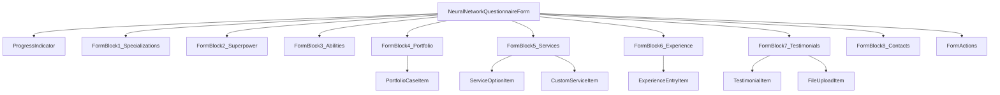
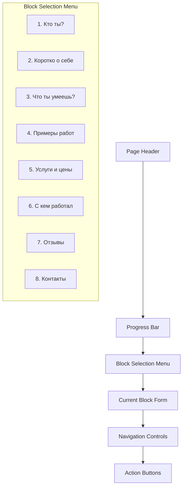

# User Profile JSON Schema Design

## Overview

This document defines the JSON schema structure for a specialized neural network/AI specialist user profile questionnaire for the MayaWork. The schema supports a comprehensive 8-block questionnaire format specifically designed for AI and neural network specialists.

## Technology Stack & Dependencies

- **Framework**: Vue 3 with TypeScript
- **State Management**: Pinia
- **Styling**: Tailwind CSS
- **Validation**: Custom validation logic
- **Build Tool**: Vite
- **Package Manager**: pnpm (required)
- **Component Architecture**: Single File Components with `<script setup>` syntax

### Development Environment Setup

```bash
# Install dependencies
pnpm install

# Start development server
pnpm dev

# Build for production
pnpm build

# Type checking
pnpm type-check

# Run tests
pnpm test

# Lint code
pnpm lint
```

**Important**: This project requires pnpm as the package manager. Using npm or yarn may cause compatibility issues.

## JSON Schema Architecture

### Core Schema Structure

```mermaid
graph TD
    A[NeuralNetworkProfile] --> B[Block1: Specializations]
    A --> C[Block2: Superpower]
    A --> D[Block3: Abilities]
    A --> E[Block4: Portfolio]
    A --> F[Block5: Services]
    A --> G[Block6: Experience]
    A --> H[Block7: Testimonials]
    A --> I[Block8: Contacts]

    B --> B1[neuralAssistants]
    B --> B2[neuralFunnels]
    B --> B3[contentGeneration]
    B --> B4[visuals]
    B --> B5[audioVideoProcessing]
    B --> B6[promptBases]
    B --> B7[chatbotSetup]
    B --> B8[neuralNetworkTraining]

    D --> D1[funnelAssembly]
    D --> D2[personalAIAssistants]
    D --> D3[sellingTextsWithGPT]
    D --> D4[visualGeneration]
    D --> D5[reelsContentAI]
    D --> D6[videoProcessing]
    D --> D7[funnelAutomation]
    D --> D8[promptBases]
    D --> D9[trainingConsultations]
```



### Data Models

#### Main Profile Schema

```typescript
interface NeuralNetworkProfileSchema {
  id: string
  userId: string
  profileType: 'neural-network'
  version: string
  metadata: ProfileMetadata

  // Block 1: Who are you?
  specializations: SpecializationBlock

  // Block 2: Brief about yourself
  superpower: SuperpowerBlock

  // Block 3: What can you do?
  abilities: AbilitiesBlock

  // Block 4: Portfolio examples
  portfolio: PortfolioBlock

  // Block 5: Services and pricing
  services: ServicesBlock

  // Block 6: Work experience
  experience: ExperienceBlock

  // Block 7: Testimonials
  testimonials: TestimonialsBlock

  // Block 8: Contact information
  contacts: ContactsBlock

  // System fields
  status: 'draft' | 'pending' | 'approved' | 'rejected'
  profileCompleted: boolean
  createdAt: string
  updatedAt: string
}
```

#### Block 1: Specializations

```typescript
interface SpecializationBlock {
  title: 'Я специализируюсь на:'
  description: 'Выберите области вашей экспертизы'
  data: {
    neuralAssistants: boolean // Нейроассистенты (AI-боты)
    neuralFunnels: boolean // Нейроворонки (продажи + автоматизация)
    contentGeneration: boolean // Контент с помощью нейросетей
    visuals: boolean // Визуалы (обложки, графика, Reels)
    audioVideoProcessing: boolean // Обработка аудио и видео
    promptBases: boolean // Базы промптов
    chatbotSetup: boolean // Настройка чат-ботов
    neuralNetworkTraining: boolean // Обучение других нейросетям
    customSpecializations?: string[] // Дополнительные специализации
  }
  validation: {
    required: true
    minSelected: 1
    maxSelected: 8
  }
}
```

#### Block 2: Superpower

```typescript
interface SuperpowerBlock {
  title: 'Коротко о себе (до 200 символов)'
  description: 'Твоя суперспособность или фишка'
  placeholder: 'Создаю нейроассистентов, которые отвечают вместо вас и приносят клиентов на автопилоте.'
  data: {
    text: string
  }
  validation: {
    required: true
    minLength: 10
    maxLength: 200
    characterCount: true
  }
}
```

#### Block 3: Abilities

```typescript
interface AbilitiesBlock {
  title: 'Что ты умеешь?'
  description: 'Отметь то, что делаешь, чтобы клиенту было понятно'
  data: {
    funnelAssembly: boolean // Собираю нейроворонки (от лида до оплаты)
    personalAIAssistants: boolean // Создаю персональных AI-ассистентов
    sellingTextsWithGPT: boolean // Пишу продающие тексты с ChatGPT
    visualGeneration: boolean // Генерирую визуалы в Midjourney/DALLE
    reelsContentAI: boolean // Настраиваю Reels-контент с помощью AI
    videoProcessing: boolean // Обрабатываю видео в нейросетях
    funnelAutomation: boolean // Автоматизирую воронки с GPT + Tilda/Telegram
    promptBases: boolean // Делаю базы промптов под задачи клиента
    trainingConsultations: boolean // Провожу обучение/консультации
    customAbilities?: string[] // Дополнительные навыки
  }
  validation: {
    required: true
    minSelected: 1
  }
}
```

#### Block 4: Portfolio

```typescript
interface PortfolioBlock {
  title: 'Примеры работ / портфолио'
  description: 'Залей ссылки или прикрепи визуалы'
  data: PortfolioCase[]
  validation: {
    required: false
    maxItems: 10
  }
}

interface PortfolioCase {
  id: string
  title: string // Кейс #1, Кейс #2, etc.
  description: string // Описание кейса
  type: 'text' | 'link' | 'visual' | 'bot' | 'landing'
  content: string | FileReference // Текст, ссылка или файл
  result?: string // Результат работы
  tools?: string[] // Использованные инструменты
  createdAt: string
}

interface FileReference {
  url: string
  filename: string
  size: number
  mimeType: string
}
```

#### Block 5: Services and Pricing

```typescript
interface ServicesBlock {
  title: 'Твои услуги и цены'
  description: 'Можно выбрать или вписать свои'
  data: {
    predefinedServices: {
      neuralAssistantTurnkey: ServiceOption // Нейроассистент под ключ — от 15 000 руб
      neuralSalesFunnel: ServiceOption // Нейроворонка для продаж — от 25 000 руб
      promptBase: ServiceOption // База промптов — от 3 000 руб
      trainingConsultation: ServiceOption // Обучение/консультация — от 2 000 руб
    }
    customServices: CustomService[] // Дополнительные услуги
  }
  validation: {
    required: false
  }
}

interface ServiceOption {
  selected: boolean
  name: string
  basePrice: number
  customPrice?: number
  description?: string
}

interface CustomService {
  id: string
  name: string
  description: string
  price: number | string // Может быть "по договоренности"
  priceType: 'fixed' | 'hourly' | 'project' | 'negotiable'
}
```

#### Block 6: Work Experience

```typescript
interface ExperienceBlock {
  title: 'С кем работал и что делал?'
  description: 'Опиши свой опыт работы с клиентами'
  data: ExperienceEntry[]
  validation: {
    required: false
    maxItems: 20
  }
}

interface ExperienceEntry {
  id: string
  client: string // Клиент
  task: string // Что делал
  tools: string[] // Инструменты
  result: string // Результат
  duration?: string // Длительность проекта
  year?: string // Год выполнения
}
```

#### Block 7: Testimonials

```typescript
interface TestimonialsBlock {
  title: 'Отзывы/рекомендации'
  description: 'Вы можете прикрепить ссылку на диск, сайт или другой ресурс с файлами'
  data: {
    textTestimonials: TestimonialEntry[] // Текстовые отзывы
    externalLinks: string[] // Ссылки на внешние ресурсы
    files: FileReference[] // Прикрепленные файлы
  }
  validation: {
    required: false
    maxTextTestimonials: 10
    maxExternalLinks: 5
    maxFiles: 20
  }
}

interface TestimonialEntry {
  id: string
  clientName: string
  clientPosition?: string
  testimonialText: string
  rating?: number
  projectType?: string
  date?: string
}
```

#### Block 8: Contacts

```typescript
interface ContactsBlock {
  title: 'Как тебе можно написать?'
  description: 'Укажите удобные способы связи'
  data: {
    telegram: string // Telegram: @username
    email?: string // Почта
    website?: string // Сайт
    phone?: string // Телефон (опционально)
    whatsapp?: string // WhatsApp (опционально)
    discord?: string // Discord (опционально)
    linkedin?: string // LinkedIn (опционально)
  }
  validation: {
    required: true
    atLeastOne: ['telegram', 'email', 'website']
    emailFormat: true
    websiteFormat: true
    telegramFormat: true
  }
}
```

### Supporting Types

#### Profile Metadata

```typescript
interface ProfileMetadata {
  completionPercentage: number
  lastModifiedBlock: string
  validationErrors: ValidationError[]
  isDraft: boolean
  submissionAttempts: number
  moderationNotes?: string[]
}

interface ValidationError {
  blockId: string
  fieldId: string
  errorMessage: string
  errorType: 'required' | 'format' | 'length' | 'custom'
}
```

### Form State Management

```typescript
interface NeuralNetworkFormState {
  // Form data
  specializations: SpecializationBlock['data']
  superpower: string
  abilities: AbilitiesBlock['data']
  portfolio: PortfolioCase[]
  services: ServicesBlock['data']
  experience: ExperienceEntry[]
  testimonials: TestimonialsBlock['data']
  contacts: ContactsBlock['data']

  // Form state
  currentBlock: number
  completedBlocks: Set<number>
  validationErrors: Record<string, string[]>
  isDirty: boolean
  autoSaveEnabled: boolean
  lastAutoSave?: string
}
```

## Component Architecture

### Form Component Hierarchy



### Data Validation Rules

```typescript
interface ValidationRules {
  specializations: {
    required: true
    minSelected: 1
    validator: (data: SpecializationBlock['data']) => boolean
  }

  superpower: {
    required: true
    minLength: 10
    maxLength: 200
    validator: (text: string) => boolean
  }

  abilities: {
    required: true
    minSelected: 1
    validator: (data: AbilitiesBlock['data']) => boolean
  }

  portfolio: {
    required: false
    maxItems: 10
    itemValidator: (item: PortfolioCase) => boolean
  }

  services: {
    required: false
    customServiceValidator: (service: CustomService) => boolean
  }

  experience: {
    required: false
    maxItems: 20
    itemValidator: (entry: ExperienceEntry) => boolean
  }

  testimonials: {
    required: false
    maxTextTestimonials: 10
    maxExternalLinks: 5
    maxFiles: 20
    linkValidator: (url: string) => boolean
  }

  contacts: {
    required: true
    atLeastOneRequired: ['telegram', 'email', 'website']
    emailValidator: (email: string) => boolean
    websiteValidator: (url: string) => boolean
    telegramValidator: (username: string) => boolean
  }
}
```

### API Integration Patterns

```typescript
interface NeuralNetworkProfileAPI {
  // Profile CRUD operations
  createProfile(data: NeuralNetworkProfileSchema): Promise<ApiResponse<string>>
  updateProfile(id: string, data: Partial<NeuralNetworkProfileSchema>): Promise<ApiResponse<void>>
  getProfile(id: string): Promise<ApiResponse<NeuralNetworkProfileSchema>>
  deleteProfile(id: string): Promise<ApiResponse<void>>

  // Draft management
  saveDraft(data: Partial<NeuralNetworkProfileSchema>): Promise<ApiResponse<void>>
  loadDraft(userId: string): Promise<ApiResponse<Partial<NeuralNetworkProfileSchema>>>

  // File operations
  uploadPortfolioFile(file: File): Promise<ApiResponse<FileReference>>
  uploadTestimonialFile(file: File): Promise<ApiResponse<FileReference>>
  deleteFile(fileUrl: string): Promise<ApiResponse<void>>

  // Validation
  validateProfile(data: NeuralNetworkProfileSchema): Promise<ApiResponse<ValidationResult>>

  // Submission
  submitForReview(id: string): Promise<ApiResponse<void>>
}
```

### Development Dependencies

```json
{
  "devDependencies": {
    "@vue/test-utils": "^2.4.0",
    "@vitest/ui": "^1.0.0",
    "jsdom": "^23.0.0",
    "typescript": "~5.8.0",
    "vue-tsc": "^2.0.0",
    "vitest": "^1.0.0"
  },
  "packageManager": "pnpm@8.0.0"
}
```

**Installation Note**: Before starting development, ensure pnpm is installed globally:

```bash
# Install pnpm globally if not already installed
npm install -g pnpm

# Verify installation
pnpm --version

# Install project dependencies
pnpm install
```

### State Management Integration

```typescript
interface NeuralNetworkProfileStore {
  // State
  currentProfile: NeuralNetworkProfileSchema | null
  formState: NeuralNetworkFormState
  validationErrors: ValidationError[]
  isLoading: boolean
  isSaving: boolean

  // Actions
  initializeForm(existingProfile?: NeuralNetworkProfileSchema): void
  updateFormField(blockId: string, fieldId: string, value: any): void
  validateBlock(blockId: string): ValidationError[]
  validateCompleteForm(): ValidationError[]
  saveProfile(): Promise<void>
  saveDraft(): Promise<void>
  submitProfile(): Promise<void>
  resetForm(): void

  // Getters
  getCompletionPercentage(): number
  getNextIncompleteBlock(): number | null
  getBlockValidationStatus(blockId: string): boolean
  canSubmitProfile(): boolean
}
```

## Page Design & User Interface

### Page Layout Structure



### Block 1: Specialization Selection

```typescript
interface Block1Component {
  template: `
    <div class="specialization-block">
      <h2>Блок 1. Кто ты?</h2>
      <h3>Я специализируюсь на:</h3>
      
      <div class="specialization-grid">
        <label v-for="spec in specializations" :key="spec.key" class="specialization-item">
          <input 
            type="checkbox" 
            v-model="formData.specializations[spec.key]"
            @change="validateBlock"
          />
          <span class="checkmark"></span>
          <span class="label">{{ spec.label }}</span>
        </label>
      </div>
      
      <div v-if="validationErrors.specializations" class="error-message">
        {{ validationErrors.specializations }}
      </div>
    </div>
  `

  data: {
    specializations: [
      { key: 'neuralAssistants'; label: 'Нейроассистенты (AI-боты)' },
      { key: 'neuralFunnels'; label: 'Нейроворонки (продажи + автоматизация)' },
      { key: 'contentGeneration'; label: 'Контент с помощью нейросетей' },
      { key: 'visuals'; label: 'Визуалы (обложки, графика, Reels)' },
      { key: 'audioVideoProcessing'; label: 'Обработка аудио и видео' },
      { key: 'promptBases'; label: 'Базы промптов' },
      { key: 'chatbotSetup'; label: 'Настройка чат-ботов' },
      { key: 'neuralNetworkTraining'; label: 'Обучение других нейросетям' },
    ]
  }
}
```

### Block 2: Superpower Description

```typescript
interface Block2Component {
  template: `
    <div class="superpower-block">
      <h2>Блок 2. Коротко о себе (до 200 символов)</h2>
      <h3>Твоя суперспособность или фишка</h3>
      
      <div class="example-text">
        Пример: Создаю нейроассистентов, которые отвечают вместо вас и приносят клиентов на автопилоте.
      </div>
      
      <div class="textarea-container">
        <textarea 
          v-model="formData.superpower"
          :maxlength="200"
          @input="validateBlock"
          placeholder="Опишите вашу суперспособность или уникальную особенность..."
          class="superpower-textarea"
        ></textarea>
        
        <div class="character-counter">
          {{ formData.superpower.length }}/200
        </div>
      </div>
      
      <div v-if="validationErrors.superpower" class="error-message">
        {{ validationErrors.superpower }}
      </div>
    </div>
  `
}
```

### Block 3: Abilities Checklist

```typescript
interface Block3Component {
  template: `
    <div class="abilities-block">
      <h2>Блок 3. Что ты умеешь?</h2>
      <p>Отметь то, что делаешь, чтобы клиенту было понятно:</p>
      
      <div class="abilities-list">
        <label v-for="ability in abilities" :key="ability.key" class="ability-item">
          <input 
            type="checkbox" 
            v-model="formData.abilities[ability.key]"
            @change="validateBlock"
          />
          <span class="checkmark"></span>
          <span class="label">{{ ability.label }}</span>
        </label>
      </div>
      
      <div v-if="validationErrors.abilities" class="error-message">
        {{ validationErrors.abilities }}
      </div>
    </div>
  `

  data: {
    abilities: [
      { key: 'funnelAssembly'; label: 'Собираю нейроворонки (от лида до оплаты)' },
      { key: 'personalAIAssistants'; label: 'Создаю персональных AI-ассистентов' },
      { key: 'sellingTextsWithGPT'; label: 'Пишу продающие тексты с ChatGPT' },
      { key: 'visualGeneration'; label: 'Генерирую визуалы в Midjourney/DALLE' },
      { key: 'reelsContentAI'; label: 'Настраиваю Reels-контент с помощью AI' },
      { key: 'videoProcessing'; label: 'Обрабатываю видео в нейросетях' },
      { key: 'funnelAutomation'; label: 'Автоматизирую воронки с GPT + Tilda/Telegram' },
      { key: 'promptBases'; label: 'Делаю базы промптов под задачи клиента' },
      { key: 'trainingConsultations'; label: 'Провожу обучение/консультации' },
    ]
  }
}
```

### Block 4: Portfolio Examples

```typescript
interface Block4Component {
  template: `
    <div class="portfolio-block">
      <h2>Блок 4. Примеры работ / портфолио</h2>
      <p>Залей ссылки или прикрепи визуалы</p>
      
      <div class="portfolio-cases">
        <div v-for="(portfolioCase, index) in formData.portfolio" :key="portfolioCase.id" class="portfolio-case">
          <div class="case-header">
            <h4>Кейс #{{ index + 1 }}</h4>
            <button @click="removePortfolioCase(index)" class="remove-btn">×</button>
          </div>
          
          <div class="case-form">
            <input 
              v-model="portfolioCase.title"
              placeholder="Название кейса"
              class="case-title"
            />
            
            <textarea 
              v-model="portfolioCase.description"
              placeholder="Описание проекта"
              class="case-description"
            ></textarea>
            
            <div class="case-type-selector">
              <label v-for="type in caseTypes" :key="type.value">
                <input 
                  type="radio" 
                  :value="type.value"
                  v-model="portfolioCase.type"
                />
                {{ type.label }}
              </label>
            </div>
            
            <div v-if="portfolioCase.type === 'text'" class="case-content">
              <textarea 
                v-model="portfolioCase.content"
                placeholder="Текст результата"
                class="case-result"
              ></textarea>
            </div>
            
            <div v-else-if="portfolioCase.type === 'link'" class="case-content">
              <input 
                v-model="portfolioCase.content"
                placeholder="Ссылка на визуал/бота/лендинг"
                class="case-link"
              />
            </div>
            
            <div v-else-if="portfolioCase.type === 'visual'" class="case-content">
              <FileUpload 
                @upload="handleFileUpload($event, portfolioCase)"
                accept="image/*"
                placeholder="Загрузить изображение"
              />
            </div>
            
            <input 
              v-model="portfolioCase.result"
              placeholder="Результат работы"
              class="case-result-text"
            />
          </div>
        </div>
        
        <button @click="addPortfolioCase" class="add-case-btn">
          + Добавить кейс
        </button>
      </div>
    </div>
  `

  data: {
    caseTypes: [
      { value: 'text'; label: 'Текст' },
      { value: 'link'; label: 'Ссылка' },
      { value: 'visual'; label: 'Визуал' },
    ]
  }
}
```

### Block 5: Services and Pricing

```typescript
interface Block5Component {
  template: `
    <div class="services-block">
      <h2>Блок 5. Твои услуги и цены</h2>
      <p>Можно выбрать или вписать свои</p>
      
      <div class="predefined-services">
        <h3>Готовые услуги:</h3>
        
        <div v-for="service in predefinedServices" :key="service.key" class="service-option">
          <label class="service-checkbox">
            <input 
              type="checkbox" 
              v-model="formData.services.predefinedServices[service.key].selected"
            />
            <span class="checkmark"></span>
            <span class="service-name">{{ service.name }}</span>
            <span class="service-price">— {{ service.basePrice }}</span>
          </label>
          
          <div v-if="formData.services.predefinedServices[service.key].selected" class="custom-price">
            <input 
              v-model="formData.services.predefinedServices[service.key].customPrice"
              :placeholder="'от ' + service.basePrice"
              class="price-input"
            />
          </div>
        </div>
      </div>
      
      <div class="custom-services">
        <h3>Дополнительные услуги:</h3>
        
        <div v-for="(service, index) in formData.services.customServices" :key="service.id" class="custom-service">
          <input 
            v-model="service.name"
            placeholder="Название услуги"
            class="service-name-input"
          />
          
          <textarea 
            v-model="service.description"
            placeholder="Описание услуги"
            class="service-description"
          ></textarea>
          
          <div class="price-section">
            <select v-model="service.priceType" class="price-type">
              <option value="fixed">Фиксированная цена</option>
              <option value="hourly">Почасовая оплата</option>
              <option value="project">За проект</option>
              <option value="negotiable">По договоренности</option>
            </select>
            
            <input 
              v-if="service.priceType !== 'negotiable'"
              v-model="service.price"
              placeholder="Цена"
              class="price-input"
            />
          </div>
          
          <button @click="removeCustomService(index)" class="remove-btn">Удалить</button>
        </div>
        
        <button @click="addCustomService" class="add-service-btn">
          + Добавить услугу
        </button>
      </div>
    </div>
  `

  data: {
    predefinedServices: [
      {
        key: 'neuralAssistantTurnkey'
        name: 'Нейроассистент под ключ'
        basePrice: 'от 15 000 руб'
      },
      { key: 'neuralSalesFunnel'; name: 'Нейроворонка для продаж'; basePrice: 'от 25 000 руб' },
      { key: 'promptBase'; name: 'База промптов'; basePrice: 'от 3 000 руб' },
      { key: 'trainingConsultation'; name: 'Обучение/консультация'; basePrice: 'от 2 000 руб' },
    ]
  }
}
```

### Block 6: Work Experience

```typescript
interface Block6Component {
  template: `
    <div class="experience-block">
      <h2>Блок 6. С кем работал и что делал?</h2>
      
      <div class="experience-entries">
        <div v-for="(experience, index) in formData.experience" :key="experience.id" class="experience-entry">
          <div class="entry-header">
            <h4>Опыт работы #{{ index + 1 }}</h4>
            <button @click="removeExperience(index)" class="remove-btn">×</button>
          </div>
          
          <div class="entry-form">
            <div class="form-row">
              <label>Клиент:</label>
              <input 
                v-model="experience.client"
                placeholder="Название компании или имя клиента"
                class="client-input"
              />
            </div>
            
            <div class="form-row">
              <label>Что делал:</label>
              <textarea 
                v-model="experience.task"
                placeholder="Описание выполненных задач"
                class="task-input"
              ></textarea>
            </div>
            
            <div class="form-row">
              <label>Инструменты:</label>
              <input 
                v-model="experience.toolsString"
                @input="updateTools(experience, $event)"
                placeholder="ChatGPT, Midjourney, Telegram Bot API (через запятую)"
                class="tools-input"
              />
            </div>
            
            <div class="form-row">
              <label>Результат:</label>
              <textarea 
                v-model="experience.result"
                placeholder="Достигнутый результат"
                class="result-input"
              ></textarea>
            </div>
            
            <div class="form-row">
              <label>Длительность (опционально):</label>
              <input 
                v-model="experience.duration"
                placeholder="2 недели, 1 месяц, и т.д."
                class="duration-input"
              />
            </div>
          </div>
        </div>
        
        <button @click="addExperience" class="add-experience-btn">
          + Добавить опыт работы
        </button>
      </div>
    </div>
  `
}
```

### Block 7: Testimonials

```typescript
interface Block7Component {
  template: `
    <div class="testimonials-block">
      <h2>Блок 7. Отзывы/рекомендации</h2>
      <p>*Вы можете прикрепить ссылку на диск, сайт или другой ресурс с файлами</p>
      
      <div class="testimonials-section">
        <h3>Текстовые отзывы:</h3>
        <div v-for="(testimonial, index) in formData.testimonials.textTestimonials" :key="testimonial.id" class="testimonial-item">
          <div class="testimonial-header">
            <input 
              v-model="testimonial.clientName"
              placeholder="Имя клиента"
              class="client-name"
            />
            <input 
              v-model="testimonial.clientPosition"
              placeholder="Должность (опционально)"
              class="client-position"
            />
            <button @click="removeTestimonial(index)" class="remove-btn">×</button>
          </div>
          
          <textarea 
            v-model="testimonial.testimonialText"
            placeholder="Текст отзыва"
            class="testimonial-text"
          ></textarea>
          
          <div class="testimonial-meta">
            <select v-model="testimonial.rating" class="rating-select">
              <option value="">Оценка (опционально)</option>
              <option value="5">⭐⭐⭐⭐⭐ 5</option>
              <option value="4">⭐⭐⭐⭐ 4</option>
              <option value="3">⭐⭐⭐ 3</option>
              <option value="2">⭐⭐ 2</option>
              <option value="1">⭐ 1</option>
            </select>
            
            <input 
              v-model="testimonial.projectType"
              placeholder="Тип проекта (опционально)"
              class="project-type"
            />
          </div>
        </div>
        
        <button @click="addTestimonial" class="add-testimonial-btn">
          + Добавить отзыв
        </button>
      </div>
      
      <div class="external-links-section">
        <h3>Ссылки на внешние ресурсы:</h3>
        <div v-for="(link, index) in formData.testimonials.externalLinks" :key="index" class="link-item">
          <input 
            v-model="formData.testimonials.externalLinks[index]"
            placeholder="https://drive.google.com/folder/..."
            class="link-input"
          />
          <button @click="removeExternalLink(index)" class="remove-btn">×</button>
        </div>
        
        <button @click="addExternalLink" class="add-link-btn">
          + Добавить ссылку
        </button>
      </div>
      
      <div class="files-section">
        <h3>Прикрепленные файлы:</h3>
        <FileUpload 
          @upload="handleFileUpload"
          multiple
          accept=".pdf,.doc,.docx,.jpg,.png,.zip"
          placeholder="Перетащите файлы или нажмите для выбора"
        />
        
        <div v-if="formData.testimonials.files.length > 0" class="uploaded-files">
          <div v-for="(file, index) in formData.testimonials.files" :key="index" class="file-item">
            <span class="file-name">{{ file.filename }}</span>
            <span class="file-size">({{ formatFileSize(file.size) }})</span>
            <button @click="removeFile(index)" class="remove-btn">×</button>
          </div>
        </div>
      </div>
    </div>
  `
}
```

### Block 8: Contact Information

```typescript
interface Block8Component {
  template: `
    <div class="contacts-block">
      <h2>Блок 8. Как тебе можно написать?</h2>
      
      <div class="contacts-form">
        <div class="primary-contacts">
          <h3>Основные контакты:</h3>
          
          <div class="contact-item">
            <label>• Telegram:</label>
            <div class="telegram-input">
              <span class="telegram-prefix">@</span>
              <input 
                v-model="formData.contacts.telegram"
                placeholder="username"
                @input="validateContacts"
                class="telegram-username"
              />
            </div>
          </div>
          
          <div class="contact-item">
            <label>• Почта/сайт (если есть):</label>
            <input 
              v-model="formData.contacts.email"
              placeholder="email@example.com или https://website.com"
              @input="validateContacts"
              class="email-input"
            />
          </div>
        </div>
        
        <div class="additional-contacts">
          <h3>Дополнительные контакты (опционально):</h3>
          
          <div class="contact-item">
            <label>WhatsApp:</label>
            <input 
              v-model="formData.contacts.whatsapp"
              placeholder="+7 (xxx) xxx-xx-xx"
              class="phone-input"
            />
          </div>
          
          <div class="contact-item">
            <label>Сайт:</label>
            <input 
              v-model="formData.contacts.website"
              placeholder="https://yourwebsite.com"
              class="website-input"
            />
          </div>
          
          <div class="contact-item">
            <label>Discord:</label>
            <input 
              v-model="formData.contacts.discord"
              placeholder="username#1234"
              class="discord-input"
            />
          </div>
          
          <div class="contact-item">
            <label>LinkedIn:</label>
            <input 
              v-model="formData.contacts.linkedin"
              placeholder="https://linkedin.com/in/username"
              class="linkedin-input"
            />
          </div>
        </div>
        
        <div v-if="validationErrors.contactsGlobal" class="error-message">
          {{ validationErrors.contactsGlobal }}
        </div>
        
        <div v-if="Object.keys(validationErrors.contacts).length > 0" class="contact-errors">
          <div v-for="(error, field) in validationErrors.contacts" :key="field" class="field-error">
            {{ error }}
          </div>
        </div>
      </div>
    </div>
  `
}
```

### Main Questionnaire Page Component

```typescript
interface NeuralNetworkQuestionnairePage {
  template: `
    <div class="questionnaire-page">
      <!-- Page Header -->
      <div class="page-header">
        <h1>Анкета специалиста по нейросетям</h1>
        <div class="progress-container">
          <div class="progress-info">
            <span>Заполнено: {{ completionPercentage }}%</span>
            <span>Блок {{ currentBlock }} из 8</span>
          </div>
          <div class="progress-bar">
            <div 
              class="progress-fill" 
              :style="{ width: completionPercentage + '%' }"
            ></div>
          </div>
        </div>
      </div>
      
      <!-- Block Navigation -->
      <div class="block-navigation">
        <div 
          v-for="(block, index) in blocks" 
          :key="index"
          @click="goToBlock(index + 1)"
          :class="{
            'block-nav-item': true,
            'active': currentBlock === index + 1,
            'completed': completedBlocks.has(index + 1),
            'has-errors': blockErrors[index + 1]?.length > 0
          }"
        >
          <div class="block-number">{{ index + 1 }}</div>
          <div class="block-title">{{ block.title }}</div>
          <div class="block-status">
            <span v-if="completedBlocks.has(index + 1)" class="completed-icon">✓</span>
            <span v-else-if="blockErrors[index + 1]?.length > 0" class="error-icon">!</span>
          </div>
        </div>
      </div>
      
      <!-- Current Block Content -->
      <div class="block-content">
        <component 
          :is="currentBlockComponent"
          v-model="formData"
          :validation-errors="validationErrors"
          @validate="validateCurrentBlock"
        />
      </div>
      
      <!-- Navigation Controls -->
      <div class="form-navigation">
        <button 
          @click="previousBlock"
          :disabled="currentBlock === 1"
          class="nav-btn prev-btn"
        >
          ← Назад
        </button>
        
        <div class="center-actions">
          <button @click="saveDraft" class="draft-btn">
            Сохранить черновик
          </button>
          
          <button 
            v-if="currentBlock === 8 && isFormValid"
            @click="submitForm"
            class="submit-btn"
          >
            Отправить на модерацию
          </button>
        </div>
        
        <button 
          @click="nextBlock"
          :disabled="currentBlock === 8"
          class="nav-btn next-btn"
        >
          Далее →
        </button>
      </div>
    </div>
  `

  data: {
    blocks: [
      { title: 'Кто ты?'; component: 'Block1Specializations' },
      { title: 'Коротко о себе'; component: 'Block2Superpower' },
      { title: 'Что ты умеешь?'; component: 'Block3Abilities' },
      { title: 'Примеры работ'; component: 'Block4Portfolio' },
      { title: 'Услуги и цены'; component: 'Block5Services' },
      { title: 'С кем работал'; component: 'Block6Experience' },
      { title: 'Отзывы'; component: 'Block7Testimonials' },
      { title: 'Контакты'; component: 'Block8Contacts' },
    ]
  }
}
```

### Styling Architecture

```scss
// Main questionnaire styles
.questionnaire-page {
  @apply max-w-4xl mx-auto p-6;

  .page-header {
    @apply bg-white rounded-lg border border-gray-200 p-6 mb-6;

    h1 {
      @apply text-3xl font-bold text-gray-900 mb-4;
    }

    .progress-container {
      .progress-info {
        @apply flex justify-between text-sm text-gray-600 mb-2;
      }

      .progress-bar {
        @apply w-full bg-gray-200 rounded-full h-3;

        .progress-fill {
          @apply bg-purple-600 h-3 rounded-full transition-all duration-300;
        }
      }
    }
  }

  .block-navigation {
    @apply grid grid-cols-2 md:grid-cols-4 gap-3 mb-6;

    .block-nav-item {
      @apply bg-white border border-gray-200 rounded-lg p-4 cursor-pointer transition-all;
      @apply hover:border-purple-300 hover:shadow-md;

      &.active {
        @apply border-purple-500 bg-purple-50;
      }

      &.completed {
        @apply border-green-500 bg-green-50;
      }

      &.has-errors {
        @apply border-red-500 bg-red-50;
      }

      .block-number {
        @apply w-8 h-8 rounded-full bg-gray-100 flex items-center justify-center text-sm font-bold mb-2;
      }

      .block-title {
        @apply text-sm font-medium text-gray-700 mb-1;
      }

      .block-status {
        @apply text-right;

        .completed-icon {
          @apply text-green-600 font-bold;
        }

        .error-icon {
          @apply text-red-600 font-bold;
        }
      }
    }
  }

  .block-content {
    @apply bg-white rounded-lg border border-gray-200 p-6 mb-6 min-h-96;
  }

  .form-navigation {
    @apply flex justify-between items-center bg-white rounded-lg border border-gray-200 p-4;

    .nav-btn {
      @apply px-6 py-2 rounded-lg font-medium transition-colors;
      @apply disabled:opacity-50 disabled:cursor-not-allowed;

      &.prev-btn {
        @apply bg-gray-100 text-gray-700 hover:bg-gray-200;
      }

      &.next-btn {
        @apply bg-purple-600 text-white hover:bg-purple-700;
      }
    }

    .center-actions {
      @apply flex space-x-4;

      .draft-btn {
        @apply px-4 py-2 border border-gray-300 rounded-lg text-gray-700 hover:bg-gray-50;
      }

      .submit-btn {
        @apply px-6 py-2 bg-green-600 text-white rounded-lg hover:bg-green-700;
      }
    }
  }
}

// Block-specific styles
.specialization-block,
.abilities-block {
  .specialization-grid,
  .abilities-list {
    @apply grid grid-cols-1 md:grid-cols-2 gap-4;

    .specialization-item,
    .ability-item {
      @apply flex items-center p-4 border border-gray-200 rounded-lg cursor-pointer;
      @apply hover:border-purple-300 hover:bg-purple-50 transition-colors;

      input[type='checkbox'] {
        @apply hidden;
      }

      .checkmark {
        @apply w-5 h-5 border-2 border-gray-300 rounded mr-3 flex-shrink-0;
        @apply transition-colors;
      }

      input:checked + .checkmark {
        @apply bg-purple-600 border-purple-600;

        &::after {
          content: '✓';
          @apply text-white text-sm flex items-center justify-center;
        }
      }

      .label {
        @apply text-gray-700 font-medium;
      }
    }
  }
}

.superpower-block {
  .example-text {
    @apply text-gray-600 italic mb-4 p-3 bg-gray-50 rounded-lg border-l-4 border-purple-500;
  }

  .textarea-container {
    @apply relative;

    .superpower-textarea {
      @apply w-full p-4 border border-gray-300 rounded-lg resize-none;
      @apply focus:outline-none focus:ring-2 focus:ring-purple-500 focus:border-transparent;
      min-height: 120px;
    }

    .character-counter {
      @apply absolute bottom-3 right-3 text-sm text-gray-500;
    }
  }
}

.portfolio-block {
  .portfolio-case {
    @apply border border-gray-200 rounded-lg p-4 mb-4;

    .case-header {
      @apply flex justify-between items-center mb-4;

      h4 {
        @apply text-lg font-semibold text-gray-900;
      }

      .remove-btn {
        @apply w-8 h-8 bg-red-100 text-red-600 rounded-full hover:bg-red-200;
      }
    }

    .case-form {
      @apply space-y-4;

      .case-title,
      .case-description,
      .case-link,
      .case-result-text {
        @apply w-full p-3 border border-gray-300 rounded-lg;
        @apply focus:outline-none focus:ring-2 focus:ring-purple-500;
      }

      .case-type-selector {
        @apply flex space-x-6;

        label {
          @apply flex items-center cursor-pointer;

          input {
            @apply mr-2;
          }
        }
      }
    }
  }

  .add-case-btn {
    @apply w-full py-3 border-2 border-dashed border-gray-300 rounded-lg;
    @apply text-gray-600 hover:border-purple-300 hover:text-purple-600 transition-colors;
  }
}

.contacts-block {
  .contacts-form {
    @apply space-y-6;

    .primary-contacts,
    .additional-contacts {
      h3 {
        @apply text-lg font-semibold text-gray-900 mb-4;
      }
    }

    .contact-item {
      @apply mb-4;

      label {
        @apply block text-sm font-medium text-gray-700 mb-2;
      }

      .telegram-input {
        @apply flex items-center;

        .telegram-prefix {
          @apply bg-gray-100 border border-r-0 border-gray-300 px-3 py-2 rounded-l-lg;
        }

        .telegram-username {
          @apply flex-1 p-2 border border-gray-300 rounded-r-lg;
          @apply focus:outline-none focus:ring-2 focus:ring-purple-500;
        }
      }

      input:not(.telegram-username) {
        @apply w-full p-3 border border-gray-300 rounded-lg;
        @apply focus:outline-none focus:ring-2 focus:ring-purple-500;
      }
    }
  }
}

.error-message {
  @apply text-red-600 text-sm mt-2 p-2 bg-red-50 rounded-lg border border-red-200;
}
```

## Testing Strategy

### Unit Testing Components

```typescript
// Test specializations block
describe('FormBlock1_Specializations', () => {
  it('should validate minimum selection requirement', () => {
    // Test validation rules
  })

  it('should update form state correctly', () => {
    // Test state management
  })

  it('should display validation errors', () => {
    // Test error display
  })
})

// Test portfolio block
describe('FormBlock4_Portfolio', () => {
  it('should handle file uploads', () => {
    // Test file upload functionality
  })

  it('should validate portfolio items', () => {
    // Test item validation
  })

  it('should support different content types', () => {
    // Test text, link, visual content types
  })
})
```

### Integration Testing

```typescript
describe('NeuralNetworkQuestionnaireForm Integration', () => {
  it('should complete full form workflow', () => {
    // Test complete form submission
  })

  it('should handle draft saving and loading', () => {
    // Test draft functionality
  })

  it('should validate cross-block dependencies', () => {
    // Test form-wide validation
  })
})
```

### JSON Schema Validation

```typescript
describe('JSON Schema Validation', () => {
  it('should validate complete profile schema', () => {
    // Test against JSON schema
  })

  it('should reject invalid data structures', () => {
    // Test schema enforcement
  })

  it('should handle version compatibility', () => {
    // Test schema versioning
  })
})
```
