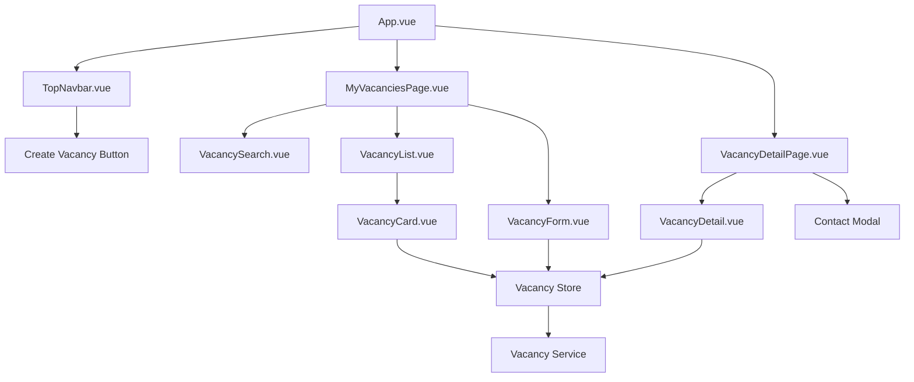
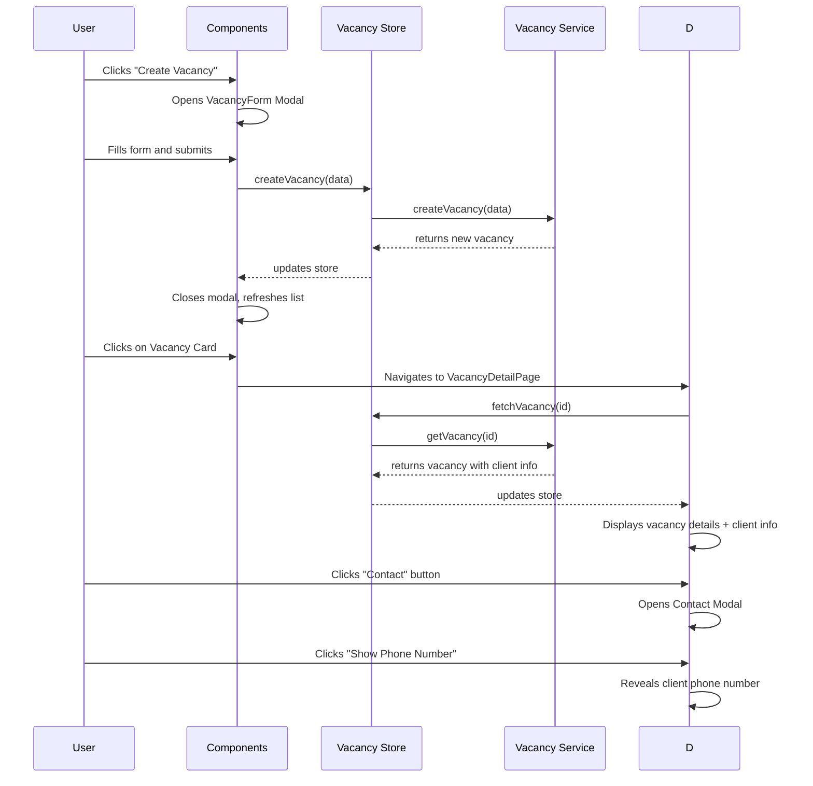

# Vacancy Creation and Details Implementation

## Overview

This document outlines the implementation plan for enhancing the vacancy functionality in the Maya Platform. The enhancements include:

1. Creating and editing vacancies for clients
2. Detailed vacancy view with client contact information
3. Removing response statistics from vacancies
4. Adding a harmonious create vacancy button in the header

## Architecture

The implementation will follow the existing Vue.js + Pinia architecture pattern used throughout the application:

- Components for UI presentation
- Pinia stores for state management
- Services for API interactions
- TypeScript types for data modeling
- Tailwind CSS for styling
- pnpm as the package manager

### Component Structure

```
src/
├── components/
│   ├── vacancies/
│   │   ├── VacancyCard.vue          (modified)
│   │   ├── VacancyDetail.vue        (modified)
│   │   ├── VacancyForm.vue          (new)
│   │   ├── VacancyList.vue          (modified)
│   │   └── VacancySearch.vue        (existing)
├── pages/
│   ├── MyVacanciesPage.vue          (modified)
│   └── VacancyDetailPage.vue        (new)
├── stores/
│   └── vacancy.ts                   (modified)
├── services/
│   └── vacancy.ts                   (modified)
└── types/
    └── vacancy.ts                   (modified)
```

## Component Architecture

### New Components

#### VacancyForm.vue

A form component for creating and editing vacancies with the following features:

- Title input field (max 100 characters)
- Description text area (max 2000 characters)
- Status selection (draft, published, closed)
- Save and cancel actions
- Form validation with user-friendly error messages
- Responsive design using Tailwind CSS for all screen sizes

#### VacancyDetailPage.vue

A dedicated page for viewing vacancy details with:

- Full vacancy information display
- Client contact information section
- Contact action button that opens modal with phone number
- Breadcrumb navigation for better UX
- Loading states for better perceived performance
- Consistent content area sizing matching profile pages

### Modified Components

#### VacancyCard.vue

- Remove response count display
- Remove "Responses" button
- Simplify UI to focus on vacancy information
- Maintain existing Tailwind CSS styling for status badges
- Keep edit and delete functionality
- Improve responsive layout using Tailwind CSS

#### VacancyDetail.vue

- Remove statistics section (responses, views, favorites)
- Add client information section with name and contact button
- Add contact button that triggers modal
- Maintain existing Tailwind CSS styling for status badges
- Improve spacing and typography hierarchy using Tailwind CSS
- Add loading states for better UX

#### MyVacanciesPage.vue

- Add create vacancy button with harmonious Tailwind CSS color scheme
- Integrate vacancy form modal
- Improve responsive layout using Tailwind CSS
- Add empty state when no vacancies exist
- Maintain existing search functionality
- Use consistent content area sizing matching profile pages

#### VacancyList.vue

- Update to work with modified VacancyCard component
- Maintain existing filtering functionality
- Improve responsive grid layout using Tailwind CSS
- Add loading and error states

### Updated Types

#### Vacancy Interface

The Vacancy interface will be extended to include client information:

```typescript
export interface Vacancy {
  id: string
  title: string
  description: string
  status: 'draft' | 'published' | 'closed'
  createdAt: string
  updatedAt: string
  clientId: string
  clientName: string // New field
  clientPhone: string // New field
}
```

All components will be styled using Tailwind CSS classes following the existing design patterns in the application.

## UI/UX Design

### Content Area Sizing

The vacancy pages will use the same content area width as the profile pages for consistency:

- Maximum width of 7xl (Tailwind's max-w-7xl)
- Responsive padding with px-4 on mobile, sm:px-6 on tablets, and lg:px-8 on desktop
- Consistent vertical spacing with py-8

### Header Button Design

The create vacancy button in the header will use a harmonious color scheme:

- Primary color: Purple (bg-purple-600) for consistency with existing design
- Hover state: Slightly darker purple (hover:bg-purple-700)
- Text color: White (text-white)
- Rounded corners (rounded-md) for modern look
- Icon: Plus icon for visual clarity
- Position: Right side of the header, next to user profile

### Contact Information Modal

When users click the "Contact" button on a vacancy detail page:

1. A modal will appear showing the client's name
2. A "Show Phone Number" button will be displayed
3. Clicking this button will reveal the client's phone number
4. The modal will have a clean, minimal design consistent with the rest of the application
5. Includes a close button in the top-right corner
6. Clicking outside the modal will close it
7. Phone number will be displayed in a prominent, easy-to-copy format

### Vacancy Form

The form for creating/editing vacancies will include:

- Title input with validation (required, max 100 characters)
- Description text area with character limit (max 2000 characters)
- Status dropdown (draft, published, closed)
- Save and cancel buttons
- Real-time character counters for title and description
- Clear error messaging for validation failures
- Responsive layout using Tailwind CSS grid and flex utilities
- Loading state during form submission

## Data Flow

### Creating a Vacancy

1. User clicks "Create Vacancy" button in header or on MyVacanciesPage
2. VacancyForm modal appears with empty fields
3. User fills in form fields
4. Real-time validation provides feedback as user types
5. User clicks "Save"
6. Form performs final validation
7. If valid, loading state is shown and vacancy is sent to vacancy service
8. Service creates vacancy with client information and returns new vacancy object
9. Store updates with new vacancy
10. Success message is displayed
11. Form is closed and list is refreshed
12. If validation fails, specific error messages are shown

### Editing a Vacancy

1. User clicks "Edit" button on vacancy card or detail view
2. VacancyForm modal appears with existing data pre-filled
3. User modifies form fields
4. Real-time validation provides feedback as user types
5. User clicks "Save"
6. Form performs final validation
7. If valid, loading state is shown and updated data is sent to vacancy service
8. Service updates vacancy and returns updated object
9. Store updates with modified vacancy
10. Success message is displayed
11. Form is closed and view is refreshed
12. If validation fails, specific error messages are shown

### Viewing Vacancy Details

1. User clicks on a vacancy card
2. User is navigated to VacancyDetailPage
3. Loading state is shown while page fetches data
4. Page fetches full vacancy details including client information
5. Client information is displayed in a dedicated section
6. Contact button triggers modal with client phone number
7. If data loading fails, error message is displayed with retry option

## API Integration

### Vacancy Service Enhancements

The VacancyService will be updated to:

1. Include client information when creating/updating vacancies
2. Return client information when fetching vacancies
3. Maintain backward compatibility with existing methods
4. Add error handling for network failures
5. Implement proper loading states during API calls
6. Add caching mechanism for better performance

### Mock Data Updates

For development and testing, mock data will be updated to include:

1. Client name for each vacancy
2. Client phone number for each vacancy
3. Proper client-user type identification
4. Realistic client data based on current user
5. Different phone number formats for testing
6. Various vacancy statuses for comprehensive testing

All development will use pnpm as the package manager for installing dependencies and managing the project.

## State Management

### Vacancy Store Updates

The vacancy store will be enhanced to:

1. Handle client information in vacancy objects
2. Manage the vacancy form modal state (open/closed)
3. Handle contact information modal state (open/closed)
4. Track loading states for different operations
5. Manage error states and messages
6. Implement proper state reset functionality
7. Add computed properties for filtered vacancy lists

### User Store Integration

The user store will be used to:

1. Identify the current user as a client
2. Pre-populate client information when creating vacancies
3. Validate user permissions for editing vacancies
4. Provide client contact information for the contact modal
5. Handle authentication state for accessing vacancy features
6. Manage user profile updates related to vacancies

## Testing Strategy

### Unit Tests

- Test vacancy form validation with various input scenarios (empty, too long, special characters)
- Test vacancy creation and editing workflows with success and error cases
- Test client contact modal functionality including phone number reveal
- Test header button integration and responsive behavior
- Test vacancy store actions and mutations
- Test vacancy service methods with mock data

### Component Tests

- Test VacancyForm component with valid and invalid inputs
- Test VacancyDetail component with and without client information
- Test VacancyCard component without response statistics
- Test header button component with different user states
- Test contact modal component with various client data
- Test responsive behavior of all components

### Integration Tests

- Test end-to-end vacancy creation flow from form to store to UI
- Test end-to-end vacancy editing flow with data persistence
- Test contact information display flow with modal interactions
- Test navigation between vacancy list and detail views
- Test error handling and loading states
- Test user authentication requirements for vacancy features

## Implementation Steps

1. Update Vacancy type definition to include client information
2. Modify VacancyService to handle client information
3. Update VacancyStore to manage client information
4. Create VacancyForm component for creating/editing vacancies using Tailwind CSS
5. Create VacancyDetailPage for detailed vacancy view with consistent content area sizing
6. Modify VacancyCard to remove response statistics
7. Modify VacancyDetail to show client information
8. Add create vacancy button to header with harmonious Tailwind CSS styling
9. Implement contact information modal
10. Update MyVacanciesPage to integrate new components with consistent layout
11. Write unit and integration tests
12. Perform end-to-end testing

## Component Structure Diagram



## Data Flow Diagram



## Error Handling and Edge Cases

### Network Failures

- Implement retry mechanisms for API calls
- Show user-friendly error messages
- Provide offline capability where possible
- Handle timeout scenarios gracefully

### Invalid States

- Handle cases where vacancy data is corrupted
- Manage scenarios where client information is missing
- Deal with concurrent modifications by multiple users
- Handle cases where user loses authentication during editing

### User Experience

- Provide clear feedback for all actions
- Show loading states during long operations
- Implement proper form reset after submission
- Handle browser refresh during form editing

## Security Considerations

- Client phone numbers should only be visible to authorized users
- Implement proper validation for all user inputs
- Ensure vacancy editing is restricted to the owning client
- Sanitize all text inputs to prevent XSS attacks
- Implement rate limiting for API calls
- Use proper authentication checks for all operations

## Performance Considerations

- Implement pagination for vacancy lists
- Use virtual scrolling for large lists
- Cache frequently accessed vacancy data
- Optimize images and assets
- Implement lazy loading for non-critical components
- Use proper debouncing for search inputs
- Minimize re-renders through proper component design

## Accessibility Considerations

- Ensure proper color contrast for all UI elements
- Implement keyboard navigation for all interactive components
- Add appropriate ARIA labels and roles
- Support screen readers with proper semantic HTML
- Ensure form inputs have proper labels and error messaging
- Implement focus management for modals
- Test with various accessibility tools

## Browser Compatibility

- Ensure compatibility with latest versions of Chrome, Firefox, Safari, and Edge
- Test responsive design on various screen sizes
- Verify functionality on mobile browsers
- Check compatibility with older browser versions as needed

## Package Management

- Use pnpm as the package manager for all dependency management
- Install new dependencies using `pnpm add [package-name]`
- Install all dependencies using `pnpm install`
- Run development server using `pnpm dev`
- Run tests using `pnpm test`
