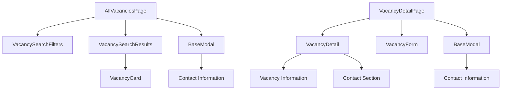

# Vacancy Page Adjustments Design Document

## 1. Overview

This document outlines the design for implementing adjustments to the vacancy listing and detail pages. The changes include:

1. Implementing fake data for vacancy details when clicking on a vacancy
2. Creating a paginated list with 7 records per page using infinite scroll
3. Adding fake contact data in the contact modal

## 2. Architecture

The implementation will modify the existing vacancy components to use fake data instead of API calls until the backend is connected. The structure will maintain the existing component hierarchy while adding mock data functionality.

### Component Structure



## 3. Component Modifications

### 3.1 Vacancy List Page (AllVacanciesPage.vue)

#### Current Implementation

- Uses real API calls to fetch vacancies
- Implements infinite scroll with the `useInfiniteScroll` composable
- Displays vacancies in a grid using `VacancyCard` components
- Shows contact information in a modal when "Связаться" button is clicked

#### Required Changes

1. Replace API service calls with fake data implementation
2. Configure pagination to show 7 records per page
3. Implement infinite scroll with fake data loading
4. Ensure contact modal displays fake contact information

### 3.2 Vacancy Detail Page (VacancyDetailPage.vue)

#### Current Implementation

- Fetches specific vacancy details from the store
- Displays vacancy information in the `VacancyDetail` component
- Shows contact information in a modal when "Связаться" button is clicked

#### Required Changes

1. Replace API service calls with fake data implementation
2. Ensure vacancy detail page displays consistent fake data
3. Update contact modal to show fake contact information including phone, Telegram, and WhatsApp

## 4. Data Models

### 4.1 Vacancy Model

```typescript
interface Vacancy {
  id: string
  title: string
  description: string
  status: 'draft' | 'published' | 'closed'
  createdAt: string
  updatedAt: string
  clientId: string
  clientName: string
  clientPhone: string
}
```

### 4.2 Fake Data Implementation

Fake data will be generated for:

- 20 sample vacancies with realistic titles and descriptions
- Client information including name and phone number
- Contact information including phone, Telegram, and WhatsApp details

## 5. Business Logic

### 5.1 Pagination Implementation

- Display 7 vacancies per page initially
- Implement infinite scroll using the existing `useInfiniteScroll` composable
- Load 7 more vacancies each time the user scrolls to the bottom
- Show loading indicators during data fetching

### 5.2 Fake Data Generation

- Create a set of 20 fake vacancies with realistic data
- Implement a service that returns paginated fake data
- Ensure consistent data across the application session

### 5.3 Contact Information

- Add Telegram and WhatsApp fields to the contact modal
- Display all contact methods (Phone, Telegram, WhatsApp) when "Связаться" is clicked
- Use fake but realistic contact information

## 6. UI/UX Considerations

### 6.1 Loading States

- Show loading spinner when fetching initial vacancy list
- Display loading indicator at the bottom when loading more vacancies
- Maintain existing error handling patterns

### 6.2 Contact Modal

- Update modal to show multiple contact methods:
  - Phone number
  - Telegram handle
  - WhatsApp number
- Maintain existing styling and interaction patterns

### 6.3 Responsive Design

- Ensure grid layout works properly on all screen sizes
- Maintain existing responsive behavior for cards and modals

## 7. Implementation Details

### 7.1 Fake Data Service

Create a new fake data service that generates vacancy data:

```typescript
// src/services/fakeVacancyService.ts

interface FakeContactInfo {
  phone: string
  telegram: string
  whatsapp: string
}

interface FakeVacancy extends Vacancy {
  contactInfo: FakeContactInfo
}

const generateFakeVacancies = (count: number): FakeVacancy[] => {
  // Implementation to generate fake vacancies
  // Each vacancy will include contact information
}

const getPaginatedVacancies = (
  page: number,
  limit: number = 7
): {
  vacancies: FakeVacancy[]
  total: number
  hasMore: boolean
} => {
  // Implementation to return paginated fake data
}

export { generateFakeVacancies, getPaginatedVacancies, FakeVacancy, FakeContactInfo }
```

### 7.2 Store Modifications

Update the vacancy store to use fake data:

```typescript
// src/stores/vacancy.ts

// Add import for fake data service
import { getPaginatedVacancies } from '@/services/fakeVacancyService'

// Modify searchVacancies action to use fake data
const searchVacancies = async (filters?: Partial<VacancySearchFilters>, resetResults = true) => {
  if (filters) {
    Object.assign(searchFilters.value, filters)
  }

  // Reset for new search
  if (resetResults) {
    allVacancies.value = []
    currentPage.value = 1
    hasMoreVacancies.value = true
    searchFilters.value.page = 1
  }

  loading.value = true
  error.value = null

  try {
    // Use fake data instead of real API
    const results = getPaginatedVacancies(currentPage.value, 7)

    if (resetResults) {
      allVacancies.value = results.vacancies
    } else {
      // Append for infinite scroll
      allVacancies.value.push(...results.vacancies)
    }

    lastSearchResults.value = results as unknown as VacancyPaginationResponse
    hasSearched.value = true
    hasMoreVacancies.value = results.hasMore
  } catch (err) {
    error.value = err instanceof Error ? err.message : 'Failed to search vacancies'
    if (resetResults) {
      allVacancies.value = []
      lastSearchResults.value = null
    }
  } finally {
    loading.value = false
  }
}
```

### 7.3 Contact Modal Updates

Update the contact modal in both AllVacanciesPage.vue and VacancyDetailPage.vue:

```vue
<!-- Template section for contact modal -->
<template #body>
  <div v-if="selectedVacancy" class="space-y-4">
    <div>
      <label class="block text-sm font-medium text-gray-700 dark:text-gray-300"> Компания </label>
      <p class="mt-1 text-sm text-gray-900 dark:text-white">
        {{ selectedVacancy.clientName }}
      </p>
    </div>
    <div>
      <label class="block text-sm font-medium text-gray-700 dark:text-gray-300">
        Телефон для связи
      </label>
      <p class="mt-1 text-sm text-gray-900 dark:text-white">
        {{ selectedVacancy.contactInfo?.phone || selectedVacancy.clientPhone }}
      </p>
    </div>
    <div v-if="selectedVacancy.contactInfo?.telegram">
      <label class="block text-sm font-medium text-gray-700 dark:text-gray-300"> Telegram </label>
      <p class="mt-1 text-sm text-gray-900 dark:text-white">
        {{ selectedVacancy.contactInfo.telegram }}
      </p>
    </div>
    <div v-if="selectedVacancy.contactInfo?.whatsapp">
      <label class="block text-sm font-medium text-gray-700 dark:text-gray-300"> WhatsApp </label>
      <p class="mt-1 text-sm text-gray-900 dark:text-white">
        {{ selectedVacancy.contactInfo.whatsapp }}
      </p>
    </div>
    <div>
      <label class="block text-sm font-medium text-gray-700 dark:text-gray-300"> Информация </label>
      <p class="mt-1 text-sm text-gray-900 dark:text-white">
        Свяжитесь с представителем компании по указанным контактам для получения дополнительной
        информации о вакансии.
      </p>
    </div>
  </div>
</template>
```

### 7.4 Infinite Scroll Implementation

The infinite scroll functionality is already implemented using the `useInfiniteScroll` composable. We need to ensure it works correctly with our fake data implementation:

1. The composable is already set up in `VacancySearchResults.vue`
2. We need to ensure the `loadMoreVacancies` action in the store correctly fetches the next page of fake data
3. The `canLoadMore` computed property should correctly determine when more data is available

```typescript
// In vacancy store
const loadMoreVacancies = async () => {
  if (!canLoadMore.value) return
  currentPage.value++
  await searchVacancies(
    {
      page: currentPage.value,
    },
    false // Don't reset results
  )
}
```

### 7.5 Vacancy Detail Page Implementation

For the vacancy detail page, we need to implement fake data retrieval that matches the vacancy selected from the list:

```typescript
// In VacancyDetailPage.vue
const loadVacancy = async () => {
  loading.value = true
  error.value = null

  try {
    const vacancyId = route.params.id as string
    // Use fake data service to get specific vacancy
    const fakeVacancies = getPaginatedVacancies(1, 20) // Get all fake vacancies
    const foundVacancy = fakeVacancies.vacancies.find(v => v.id === vacancyId)

    if (foundVacancy) {
      vacancy.value = foundVacancy
    } else {
      // If not found, create a fake vacancy with the requested ID
      const fakeVacancy = generateFakeVacancyWithId(vacancyId)
      vacancy.value = fakeVacancy
    }
  } catch (err) {
    error.value = err instanceof Error ? err.message : 'Ошибка загрузки вакансии'
  } finally {
    loading.value = false
  }
}
```

## 8. Testing Strategy

### 8.1 Unit Tests

- Test fake data generation functions
- Verify pagination logic with different page sizes
- Test infinite scroll trigger conditions

### 8.2 Integration Tests

- Test vacancy list rendering with fake data
- Verify contact modal displays correct information
- Test navigation between list and detail pages

### 8.3 UI Tests

- Verify responsive grid layout
- Test loading and error states
- Confirm contact modal functionality
