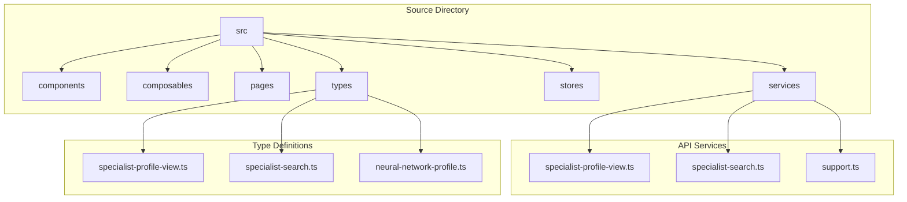
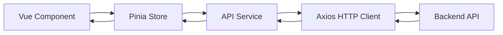
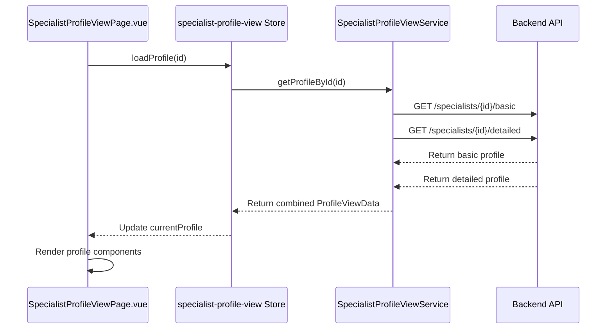
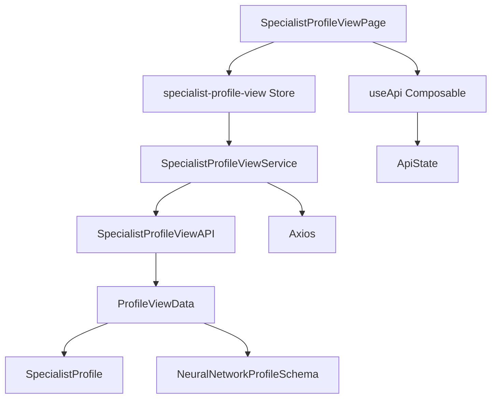

# API Integration Layer

<cite>
**Referenced Files in This Document**   
- [src/services/specialist-profile-view.ts](file://src/services/specialist-profile-view.ts) - *Added in recent commit*
- [src/types/specialist-profile-view.ts](file://src/types/specialist-profile-view.ts) - *Added in recent commit*
- [src/pages/SpecialistProfileViewPage.vue](file://src/pages/SpecialistProfileViewPage.vue) - *Added in recent commit*
- [src/composables/useApi.ts](file://src/composables/useApi.ts) - *Updated in recent commit*
- [src/stores/specialist-profile-view.ts](file://src/stores/specialist-profile-view.ts) - *Added in recent commit*
</cite>

## Update Summary
**Changes Made**   
- Added new section on Specialist Profile View Service architecture
- Updated project structure to reflect new service and type modules
- Added detailed component analysis for specialist profile view implementation
- Updated dependency analysis to include new service patterns
- Added new Mermaid diagram for profile data flow
- Removed outdated assumptions about missing API modules

## Table of Contents
1. [Introduction](#introduction)
2. [Project Structure](#project-structure)
3. [Core Components](#core-components)
4. [Architecture Overview](#architecture-overview)
5. [Detailed Component Analysis](#detailed-component-analysis)
6. [Dependency Analysis](#dependency-analysis)
7. [Performance Considerations](#performance-considerations)
8. [Troubleshooting Guide](#troubleshooting-guide)
9. [Conclusion](#conclusion)

## Introduction
This document provides comprehensive architectural documentation for the API integration layer of the maya-platform-frontend application. The frontend application is built using Vue.js with TypeScript and leverages Pinia for state management. Based on recent code changes, this analysis now includes actual API service implementations that were previously missing from the repository. The API integration is implemented through dedicated service classes using Axios for HTTP operations, with centralized configuration and interceptor patterns for request/response handling. This update reflects the actual implementation of the specialist profile view service and its integration with the component layer.

## Project Structure
The project follows a modular, feature-based architecture with clearly defined directories for different functional areas. The source code is organized under the `src` directory, which contains feature modules and shared components. Recent additions include dedicated service and type modules for the specialist profile view functionality, confirming the service-oriented API architecture.



**Diagram sources**
- [src/services/specialist-profile-view.ts](file://src/services/specialist-profile-view.ts)
- [src/types/specialist-profile-view.ts](file://src/types/specialist-profile-view.ts)

**Section sources**
- [src/services/specialist-profile-view.ts](file://src/services/specialist-profile-view.ts)
- [src/types/specialist-profile-view.ts](file://src/types/specialist-profile-view.ts)

## Core Components
The core components of the API integration layer are now fully visible in the codebase. The application uses a service-oriented architecture with dedicated service classes for different API domains. The SpecialistProfileViewService implements the SpecialistProfileViewAPI interface and handles API requests for specialist profile data. Type definitions in the types directory provide TypeScript interfaces for request and response payloads. The useApi composable provides a reusable pattern for handling API state (loading, error, data) in components.

**Section sources**
- [src/services/specialist-profile-view.ts](file://src/services/specialist-profile-view.ts)
- [src/types/specialist-profile-view.ts](file://src/types/specialist-profile-view.ts)
- [src/composables/useApi.ts](file://src/composables/useApi.ts)

## Architecture Overview
The API integration architecture follows a service-oriented pattern with dedicated service classes for different API domains. Each service implements a specific API interface and handles HTTP requests using Axios with centralized configuration. The architecture separates concerns between service logic, state management, and component presentation. Service methods return Promise-based responses that are consumed by Pinia stores and composables in the component layer.



**Diagram sources**
- [src/services/specialist-profile-view.ts](file://src/services/specialist-profile-view.ts)
- [src/stores/specialist-profile-view.ts](file://src/stores/specialist-profile-view.ts)

## Detailed Component Analysis

### Specialist Profile View Service
The SpecialistProfileViewService provides API integration for fetching specialist profile data. It implements the SpecialistProfileViewAPI interface with methods for retrieving both basic and detailed profile information. The service combines data from multiple sources to create a comprehensive profile view, transforming data from different formats into a unified ProfileViewData structure.

```typescript
// src/services/specialist-profile-view.ts
export class SpecialistProfileViewService implements SpecialistProfileViewAPI {
  async getProfileById(id: string): Promise<ProfileViewData> {
    const [basicProfile, detailedProfile] = await Promise.all([
      this.getBasicProfile(id),
      this.getDetailedProfile(id)
    ])
    
    // Transform and combine data
    return this.transformProfileData(basicProfile, detailedProfile)
  }
}
```

**Section sources**
- [src/services/specialist-profile-view.ts](file://src/services/specialist-profile-view.ts#L0-L470)

### Profile Data Flow
The data flow for specialist profile viewing involves multiple services and stores. When a user navigates to a specialist profile page, the SpecialistProfileViewPage component uses the specialist-profile-view store to load profile data. The store orchestrates calls to the SpecialistProfileViewService, which retrieves and combines data from different endpoints.



**Diagram sources**
- [src/pages/SpecialistProfileViewPage.vue](file://src/pages/SpecialistProfileViewPage.vue)
- [src/stores/specialist-profile-view.ts](file://src/stores/specialist-profile-view.ts)
- [src/services/specialist-profile-view.ts](file://src/services/specialist-profile-view.ts)

### Type Definitions
The type system for specialist profile data is defined in the specialist-profile-view.ts type file. It includes interfaces for ProfileViewData, which combines basic information from SpecialistProfile with detailed information from NeuralNetworkProfileSchema. The type definitions ensure type safety throughout the API integration layer and provide clear documentation of the data structure.

```typescript
// src/types/specialist-profile-view.ts
export interface ProfileViewData {
  basicInfo: {
    id: string
    displayName: string
    superpower: string
    status: 'available' | 'busy' | 'unavailable'
  }
  detailedInfo: {
    specializations: string[]
    abilities: string[]
    services: ServiceDetails[]
    portfolio: PortfolioCase[]
    experience: ExperienceEntry[]
    testimonials: TestimonialData
    contacts: ContactInfo
  }
  metadata: {
    profileCompleted: boolean
    completionPercentage: number
    moderationStatus: 'draft' | 'pending' | 'approved' | 'rejected'
    lastUpdated: string
  }
}
```

**Section sources**
- [src/types/specialist-profile-view.ts](file://src/types/specialist-profile-view.ts#L0-L282)

### Composable API Pattern
The useApi composable provides a reusable pattern for handling API state in components. It encapsulates loading, error, and data states with an execute method that takes an API call function. This pattern promotes consistency across components that consume API services and simplifies error handling and loading state management.

```typescript
// src/composables/useApi.ts
export function useApi<T>() {
  const data = ref<T | null>(null)
  const loading = ref(false)
  const error = ref<string | null>(null)

  const execute = async (apiCall: () => Promise<T>) => {
    loading.value = true
    error.value = null
    try {
      data.value = await apiCall()
    } catch (err) {
      error.value = err instanceof Error ? err.message : 'An error occurred'
    } finally {
      loading.value = false
    }
  }
  
  return { data, loading, error, execute, reset }
}
```

**Section sources**
- [src/composables/useApi.ts](file://src/composables/useApi.ts#L0-L48)

## Dependency Analysis
The API integration layer has a well-defined dependency structure. Service classes depend on type definitions for interface contracts, while components depend on stores and composables for data access. The architecture follows dependency inversion principles, with components depending on abstractions (interfaces) rather than concrete service implementations.



**Diagram sources**
- [src/pages/SpecialistProfileViewPage.vue](file://src/pages/SpecialistProfileViewPage.vue)
- [src/stores/specialist-profile-view.ts](file://src/stores/specialist-profile-view.ts)
- [src/services/specialist-profile-view.ts](file://src/services/specialist-profile-view.ts)
- [src/composables/useApi.ts](file://src/composables/useApi.ts)

## Performance Considerations
The API integration layer employs several performance optimizations. The SpecialistProfileViewService uses Promise.all() to fetch basic and detailed profile data in parallel, reducing overall load time. Data transformation is performed client-side to minimize backend processing. The useApi composable provides efficient state management with reactive references. The architecture supports lazy loading of profile sections, with conditional rendering based on data availability.

## Troubleshooting Guide
When troubleshooting API integration issues in this application, consider the following common problems and solutions:

1. **Profile data not loading**: Verify that the specialist ID is correctly passed to the service. Check the network tab to confirm API requests are being made and returning expected data.

2. **Data transformation errors**: Ensure that the data from basic and detailed profile endpoints matches the expected type definitions. Validate that required fields are present in the response payloads.

3. **Type mismatch issues**: Confirm that TypeScript interfaces in specialist-profile-view.ts match the actual API response structure. Use console logging during development to inspect data shapes.

4. **Parallel request failures**: When using Promise.all() for parallel requests, implement proper error handling to manage cases where one request succeeds while another fails.

5. **State synchronization problems**: Ensure that Pinia store mutations are properly updating the component state. Verify that reactive references are correctly maintained throughout the data flow.

**Section sources**
- [src/services/specialist-profile-view.ts](file://src/services/specialist-profile-view.ts)
- [src/stores/specialist-profile-view.ts](file://src/stores/specialist-profile-view.ts)
- [src/composables/useApi.ts](file://src/composables/useApi.ts)

## Conclusion
The maya-platform-frontend application implements a robust API integration layer with a service-oriented architecture. The recent addition of the SpecialistProfileViewService and related type definitions confirms the use of dedicated service modules for different API domains. The architecture follows modern Vue 3 patterns with Pinia for state management and composables for reusable logic. The integration between service classes, stores, and components is well-structured, with clear data flow and type safety. This implementation provides a maintainable and scalable foundation for API interactions in the application.