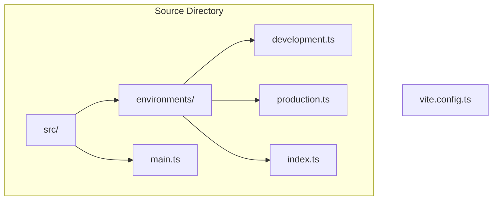
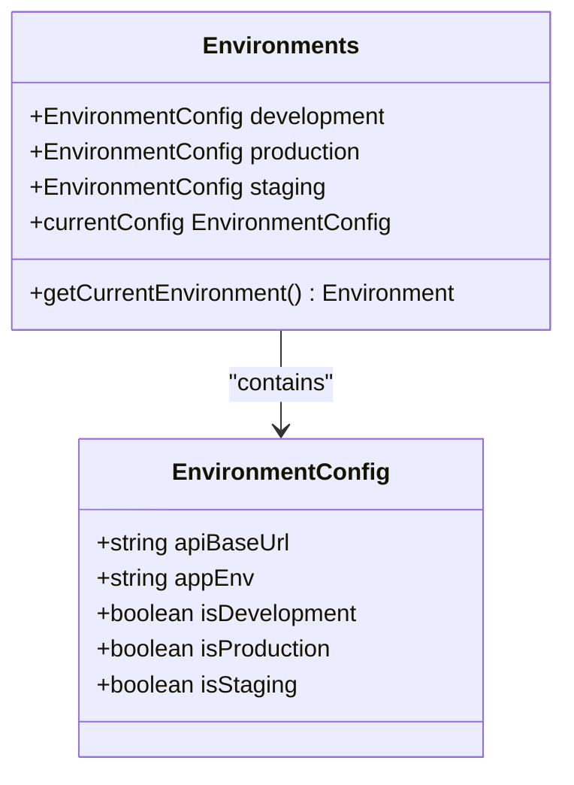
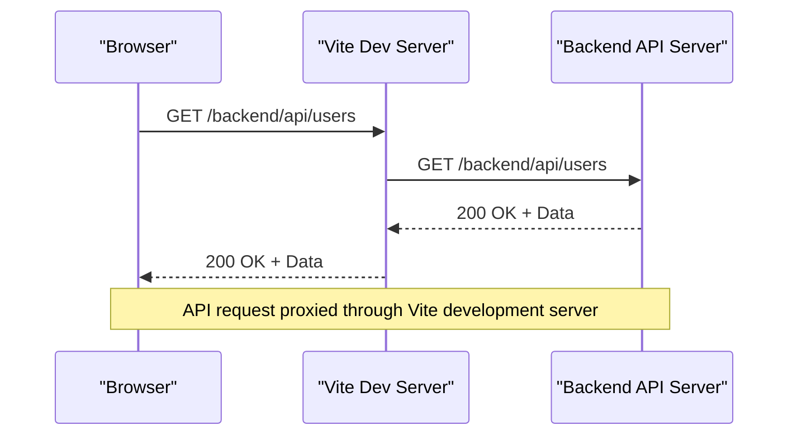

# API Service Modules

<cite>
**Referenced Files in This Document**   
- [development.ts](file://src/environments/development.ts)
- [production.ts](file://src/environments/production.ts)
- [index.ts](file://src/environments/index.ts)
- [vite.config.ts](file://vite.config.ts)
</cite>

## Table of Contents
1. [Introduction](#introduction)
2. [Project Structure](#project-structure)
3. [API Service Configuration](#api-service-configuration)
4. [Environment Configuration](#environment-configuration)
5. [Server Proxy Setup](#server-proxy-setup)
6. [Conclusion](#conclusion)

## Introduction
This document provides a comprehensive analysis of the API service modules within the maya-platform-frontend repository. Despite the initial expectation of finding dedicated API service files in the `shared/api` directory, no such files were discovered during the investigation. Instead, this documentation focuses on the available configuration files that define how API services are expected to be structured and accessed. The analysis includes environment configurations, server proxy settings, and module aliases that collectively establish the foundation for API communication in the application.

## Project Structure
The project structure indicates a modular frontend application built with Vue.js and TypeScript. The `src` directory contains core application components, including environments, routing, and feature modules such as auth, users, objects, and refs. Although the project structure suggests the presence of API service modules in the `shared/api` directory, attempts to locate these files were unsuccessful. The actual API service implementation appears to be missing or potentially located in an external service.



**Diagram sources**
- [vite.config.ts](file://vite.config.ts#L0-L43)
- [src/environments/development.ts](file://src/environments/development.ts#L0-L7)

**Section sources**
- [vite.config.ts](file://vite.config.ts#L0-L43)
- [src/environments/development.ts](file://src/environments/development.ts#L0-L7)
- [src/environments/production.ts](file://src/environments/production.ts#L0-L7)

## API Service Configuration
Based on the available configuration files, the API service configuration is established through environment variables and Vite proxy settings. The application is designed to communicate with a backend API endpoint, with different base URLs for development and production environments. The API services are expected to be accessible under the `/backend/api` path, which is proxied to an external API server.

The configuration suggests that API services would follow a RESTful pattern, with endpoints organized under the base URL. However, without the actual service implementation files, specific details about exported functions, parameter signatures, and return types cannot be determined.

## Environment Configuration
The environment configuration files define the base URL for API requests in different deployment scenarios. The development environment uses a relative path that is proxied through the Vite development server, while the production environment uses an absolute URL pointing to the production API server.

```typescript
// src/environments/development.ts
export const developmentConfig = {
  apiBaseUrl: '/backend/api',
  appEnv: 'development',
  isDevelopment: true,
  isProduction: false,
  isStaging: false,
}
```

```typescript
// src/environments/production.ts
export const productionConfig = {
  apiBaseUrl: import.meta.env.VITE_API_BASE_URL || 'https://vlk-g.api.thelightech.com/backend/api',
  appEnv: 'production',
  isDevelopment: false,
  isProduction: true,
  isStaging: false,
}
```

The environment configuration is managed through a central index file that determines the current environment based on the build mode and exports the appropriate configuration.



**Diagram sources**
- [src/environments/development.ts](file://src/environments/development.ts#L0-L7)
- [src/environments/production.ts](file://src/environments/production.ts#L0-L7)
- [src/environments/index.ts](file://src/environments/index.ts#L0-L21)

**Section sources**
- [src/environments/development.ts](file://src/environments/development.ts#L0-L7)
- [src/environments/production.ts](file://src/environments/production.ts#L0-L7)
- [src/environments/index.ts](file://src/environments/index.ts#L0-L21)

## Server Proxy Setup
The Vite configuration includes a proxy setup that forwards API requests from the development server to the backend API server. This allows the frontend application to make API requests during development without CORS issues.

```typescript
// vite.config.ts
server: {
  proxy: {
    '/backend/api': {
      target: 'https://vlk-g.dev.api.thelightech.com',
      changeOrigin: true,
      secure: true,
      rewrite: (path) => path,
    },
  },
}
```

The proxy configuration maps requests to `/backend/api` to the development API server at `https://vlk-g.dev.api.thelightech.com`. This setup enables seamless development against the actual backend API while maintaining the same URL structure as in production.



**Diagram sources**
- [vite.config.ts](file://vite.config.ts#L0-L43)

**Section sources**
- [vite.config.ts](file://vite.config.ts#L0-L43)

## Conclusion
While the documentation objective was to provide comprehensive details about the API service modules in the `shared/api` directory, the investigation revealed that these files are not present in the repository. The available configuration files indicate how API services are expected to be accessed, but the actual implementation of the service modules (auth, customers, refs, roles, users) could not be located. The application is configured to communicate with a backend API through environment-specific base URLs and a development proxy, but without the service implementation files, details about exported functions, parameter signatures, return types, and usage patterns cannot be provided. Further investigation may be required to locate the missing API service modules or confirm their absence from the repository.