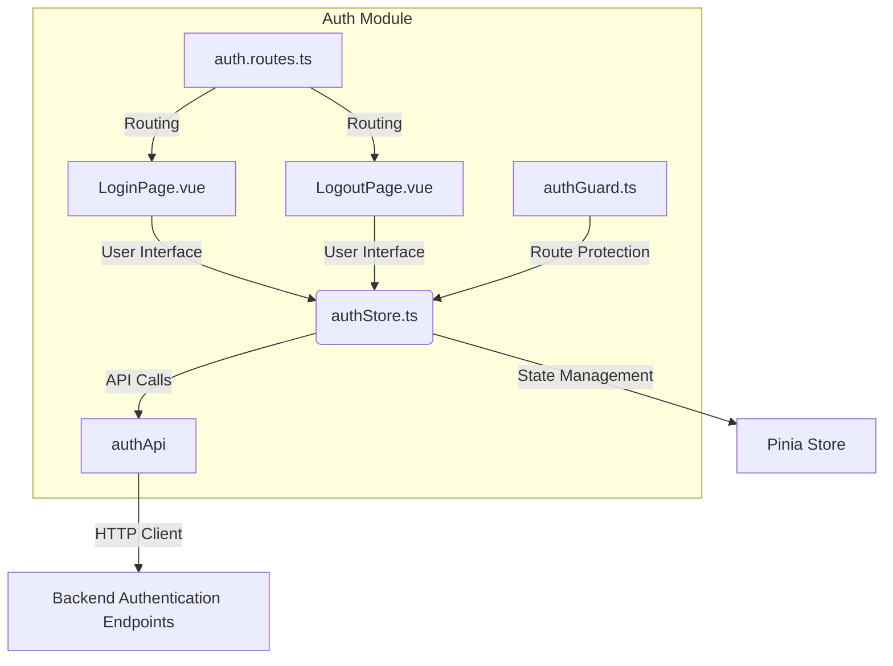
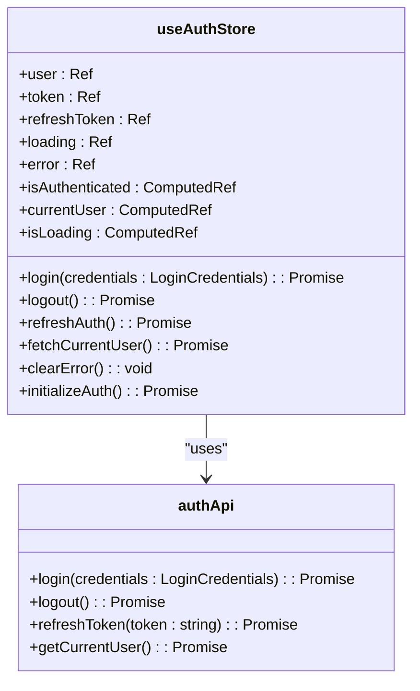
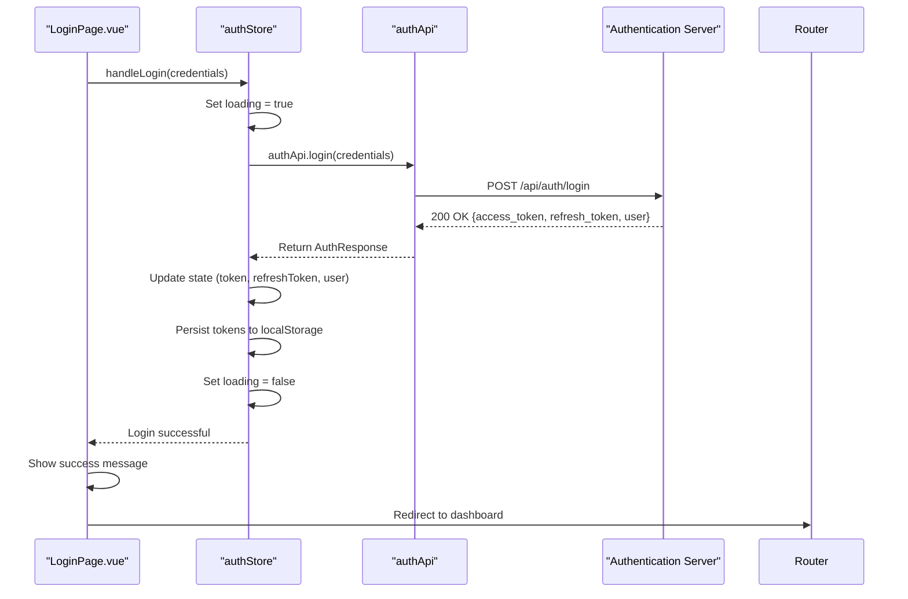
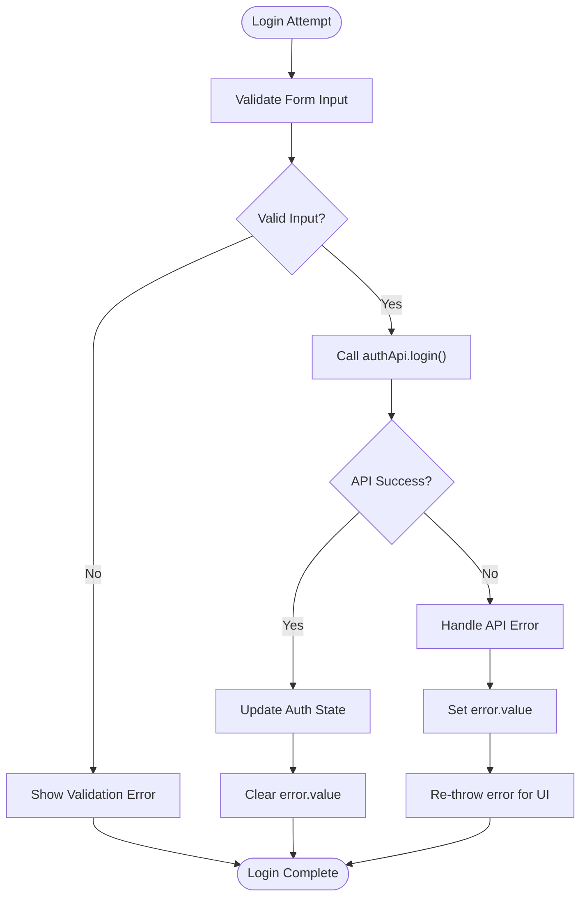

# Authentication API Service

<cite>
**Referenced Files in This Document**   
- [authStore.ts](file://src/root/auth/store/authStore.ts#L1-L154)
- [LoginPage.vue](file://src/root/auth/pages/LoginPage.vue#L1-L102)
- [LogoutPage.vue](file://src/root/auth/pages/LogoutPage.vue#L1-L81)
- [authGuard.ts](file://src/root/auth/guards/authGuard.ts#L1-L45)
- [auth.routes.ts](file://src/root/auth/routes/auth.routes.ts#L1-L21)
- [authApi](file://src/shared/services/authApi) *(import reference only)*
</cite>

## Table of Contents
1. [Introduction](#introduction)
2. [Project Structure](#project-structure)
3. [Core Components](#core-components)
4. [Authentication API Service Overview](#authentication-api-service-overview)
5. [Detailed Component Analysis](#detailed-component-analysis)
6. [Authentication Flow Sequence](#authentication-flow-sequence)
7. [Token Handling and Security](#token-handling-and-security)
8. [Error Handling Patterns](#error-handling-patterns)
9. [Integration with HTTP Client](#integration-with-http-client)
10. [Usage Examples](#usage-examples)
11. [Security Considerations](#security-considerations)

## Introduction
The Authentication API Service is a core component of the MayaWork frontend application, responsible for managing user authentication, session state, and secure token handling. This documentation provides a comprehensive overview of the authentication system, including its architecture, implementation details, and integration patterns. The service enables users to securely log in, maintain authenticated sessions, and log out, while synchronizing state across the application through a centralized store.

**Section sources**
- [authStore.ts](file://src/root/auth/store/authStore.ts#L1-L154)

## Project Structure
The authentication module is organized within the `src/root/auth` directory, following a feature-based structure that groups related components, routes, guards, and state management logic. This modular approach enhances maintainability and separation of concerns.



**Diagram sources**
- [authStore.ts](file://src/root/auth/store/authStore.ts#L1-L154)
- [LoginPage.vue](file://src/root/auth/pages/LoginPage.vue#L1-L102)
- [LogoutPage.vue](file://src/root/auth/pages/LogoutPage.vue#L1-L81)
- [authGuard.ts](file://src/root/auth/guards/authGuard.ts#L1-L45)

## Core Components
The authentication system consists of several key components that work together to provide a secure and user-friendly authentication experience:

- **authStore.ts**: Centralized state management using Pinia, handling authentication state, tokens, and user data
- **LoginPage.vue**: User interface for authentication with form validation and submission
- **LogoutPage.vue**: Confirmation dialog for user logout with error handling
- **authGuard.ts**: Navigation guard that protects routes based on authentication status
- **auth.routes.ts**: Route configuration for authentication pages

These components follow the Vue 3 Composition API pattern with TypeScript, ensuring type safety and reactivity throughout the authentication flow.

**Section sources**
- [authStore.ts](file://src/root/auth/store/authStore.ts#L1-L154)
- [LoginPage.vue](file://src/root/auth/pages/LoginPage.vue#L1-L102)
- [LogoutPage.vue](file://src/root/auth/pages/LogoutPage.vue#L1-L81)
- [authGuard.ts](file://src/root/auth/guards/authGuard.ts#L1-L45)

## Authentication API Service Overview
The Authentication API Service provides a set of functions for handling user authentication operations. These functions are accessed through the `authApi` object imported into the `authStore`. The service abstracts HTTP communication with the backend authentication endpoints, providing a clean interface for login, logout, token refresh, and user data retrieval.

### Exported Functions
The following authentication operations are available through the service:

**login(credentials: LoginCredentials): Promise<AuthResponse>**
- **Parameters**: 
  - credentials: Object containing email and password
- **Return Type**: 
  - AuthResponse with access_token, refresh_token, and user data
- **Functionality**: Authenticates user credentials and returns authentication tokens

**logout(): Promise<void>**
- **Parameters**: None
- **Return Type**: Promise<void>
- **Functionality**: Invalidates the current session on the server

**refreshToken(refreshToken: string): Promise<TokenResponse>**
- **Parameters**: 
  - refreshToken: Current refresh token
- **Return Type**: 
  - TokenResponse with new access_token and optional refresh_token
- **Functionality**: Obtains a new access token using the refresh token

**getCurrentUser(): Promise<User>**
- **Parameters**: None
- **Return Type**: 
  - User object with current user data
- **Functionality**: Retrieves current user information from the server

**Section sources**
- [authStore.ts](file://src/root/auth/store/authStore.ts#L24-L25)
- [authStore.ts](file://src/root/auth/store/authStore.ts#L50-L51)
- [authStore.ts](file://src/root/auth/store/authStore.ts#L77-L78)
- [authStore.ts](file://src/root/auth/store/authStore.ts#L99-L100)

## Detailed Component Analysis

### authStore.ts Analysis
The `authStore` is implemented as a Pinia store, providing reactive state management for authentication data. It encapsulates all authentication logic and serves as the single source of truth for authentication state.



**Diagram sources**
- [authStore.ts](file://src/root/auth/store/authStore.ts#L1-L154)

#### State Management
The store maintains the following reactive state variables:
- **user**: Current authenticated user data
- **token**: Access token for API authorization
- **refreshToken**: Token used to obtain new access tokens
- **loading**: Boolean flag indicating ongoing authentication operations
- **error**: Error message from failed authentication attempts

#### Getters
Computed properties provide derived state:
- **isAuthenticated**: Returns true if both token and user are present
- **currentUser**: Returns the current user object
- **isLoading**: Returns the current loading state

#### Actions
The store exposes several actions for authentication operations:
- **login**: Handles user authentication with credential validation and token storage
- **logout**: Clears authentication state and removes tokens from localStorage
- **refreshAuth**: Refreshes authentication tokens using the refresh token
- **fetchCurrentUser**: Retrieves current user data from the API
- **initializeAuth**: Initializes authentication state from localStorage on application startup

**Section sources**
- [authStore.ts](file://src/root/auth/store/authStore.ts#L1-L154)

## Authentication Flow Sequence
The authentication process follows a well-defined sequence of operations, ensuring secure and reliable user authentication.



**Diagram sources**
- [LoginPage.vue](file://src/root/auth/pages/LoginPage.vue#L55-L102)
- [authStore.ts](file://src/root/auth/store/authStore.ts#L24-L38)

## Token Handling and Security
The authentication system implements secure token handling practices to protect user sessions and prevent unauthorized access.

### Token Storage
Tokens are stored in localStorage for persistence across browser sessions:
- **auth_token**: Access token stored under 'auth_token' key
- **refresh_token**: Refresh token stored under 'refresh_token' key

This approach allows users to remain authenticated between visits, while providing a mechanism for token refresh without requiring re-authentication.

### Token Refresh Mechanism
The system implements a token refresh mechanism to maintain active sessions:
1. When an access token expires, the refresh token is used to obtain a new access token
2. The refreshAuth method calls the refreshToken endpoint with the current refresh token
3. If successful, new tokens are stored and the user session continues seamlessly
4. If refresh fails, the user is automatically logged out

### Session Initialization
On application startup, the initializeAuth method checks for existing tokens in localStorage and attempts to restore the authentication state:
1. If a token exists, fetchCurrentUser is called to retrieve user data
2. If this fails, refreshAuth is attempted to obtain a new access token
3. If refresh also fails, the user is logged out and state is cleared

**Section sources**
- [authStore.ts](file://src/root/auth/store/authStore.ts#L6-L8)
- [authStore.ts](file://src/root/auth/store/authStore.ts#L75-L88)
- [authStore.ts](file://src/root/auth/store/authStore.ts#L135-L154)

## Error Handling Patterns
The authentication system implements comprehensive error handling to provide a robust user experience and graceful degradation when issues occur.

### Login Error Handling


**Diagram sources**
- [authStore.ts](file://src/root/auth/store/authStore.ts#L26-L37)

### Logout Error Handling
The logout process implements resilient error handling:
- Server logout failure does not prevent local state clearance
- Authentication state is always cleared locally, even if API call fails
- Errors are logged to console but do not block the logout process

```typescript
try {
  if (token.value) {
    await authApi.logout()
  }
} catch (err) {
  console.error('Logout API error:', err)
} finally {
  // Clear state regardless of API success
  user.value = null
  token.value = null
  refreshToken.value = null
  localStorage.removeItem('auth_token')
  localStorage.removeItem('refresh_token')
}
```

**Section sources**
- [authStore.ts](file://src/root/auth/store/authStore.ts#L44-L65)

## Integration with HTTP Client
The authentication service integrates with the HTTP client through the `authApi` object, which handles request configuration and response processing.

### Header Configuration
The HTTP client automatically includes authentication tokens in requests through interceptors. When a valid access token exists, it is added to the Authorization header as a Bearer token.

### Response Interception
The system uses response interceptors to handle authentication-related responses:
- 401 Unauthorized responses trigger token refresh attempts
- Failed refresh operations result in automatic logout
- Authentication errors are normalized and exposed through the store's error property

### Request Flow
1. Authentication requests are made through the authApi service
2. The HTTP client sends requests with appropriate headers
3. Responses are processed and transformed as needed
4. Authentication state is updated based on response data
5. Errors are caught and handled according to the operation type

**Section sources**
- [authStore.ts](file://src/root/auth/store/authStore.ts#L3)
- [authStore.ts](file://src/root/auth/store/authStore.ts#L24)
- [authStore.ts](file://src/root/auth/store/authStore.ts#L50)

## Usage Examples

### LoginPage.vue Implementation
The login page provides a user-friendly interface for authentication:

```vue
<template>
  <form @submit.prevent="handleLogin">
    <NInput v-model:value="loginForm.email" type="email" placeholder="Email" required />
    <NInput v-model:value="loginForm.password" type="password" placeholder="Password" required />
    <NButton type="primary" :loading="loading" :disabled="!isFormValid" @click="handleLogin">
      Login
    </NButton>
  </form>
</template>

<script setup>
const authStore = useAuthStore()
const loginForm = ref({ email: '', password: '' })

const handleLogin = async () => {
  try {
    await authStore.login(loginForm.value)
    // Redirect on success
  } catch (error) {
    // Display error message
  }
}
</script>
```

**Section sources**
- [LoginPage.vue](file://src/root/auth/pages/LoginPage.vue#L1-L102)

### LogoutPage.vue Implementation
The logout page provides a confirmation dialog before ending the session:

```vue
<template>
  <div>
    <NText>Are you sure you want to log out?</NText>
    <NButton @click="handleLogout">Yes, log out</NButton>
    <NButton @click="handleCancel">Cancel</NButton>
  </div>
</template>

<script setup>
const authStore = useAuthStore()

const handleLogout = async () => {
  try {
    await authStore.logout()
    // Redirect to login
  } catch (error) {
    // Handle error
  }
}
</script>
```

**Section sources**
- [LogoutPage.vue](file://src/root/auth/pages/LogoutPage.vue#L50-L81)

## Security Considerations
The authentication system implements several security best practices to protect user data and prevent common vulnerabilities.

### Secure Token Storage
- Tokens are stored in localStorage rather than cookies to prevent CSRF attacks
- No sensitive information is stored in plain text
- Tokens are cleared immediately on logout

### Transmission Security
- All authentication requests must use HTTPS in production
- Passwords are never stored locally
- Access tokens have limited lifespan and are refreshed regularly

### Session Management
- Refresh tokens are rotated on each use when supported by the backend
- Failed refresh attempts result in complete session termination
- Authentication state is validated on application startup

### Error Handling Security
- Generic error messages are shown to users to avoid information disclosure
- Detailed error information is only available in console logs
- Authentication failures do not reveal whether email or password was incorrect

### Additional Security Measures
- Route guards prevent access to protected routes without authentication
- Automatic logout after session expiration
- Loading states prevent multiple concurrent authentication requests

**Section sources**
- [authStore.ts](file://src/root/auth/store/authStore.ts#L6-L8)
- [authStore.ts](file://src/root/auth/store/authStore.ts#L44-L65)
- [authGuard.ts](file://src/root/auth/guards/authGuard.ts#L1-L45)