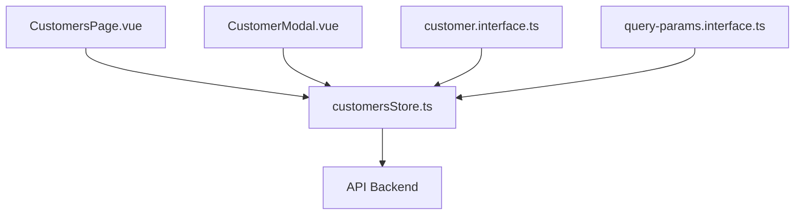
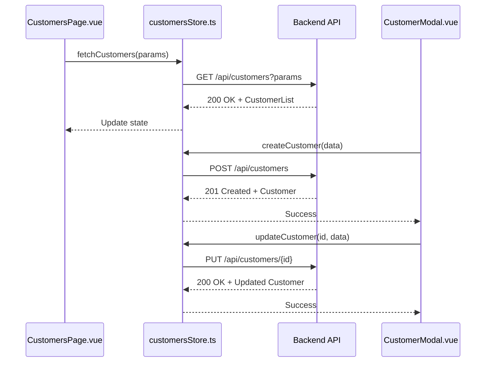
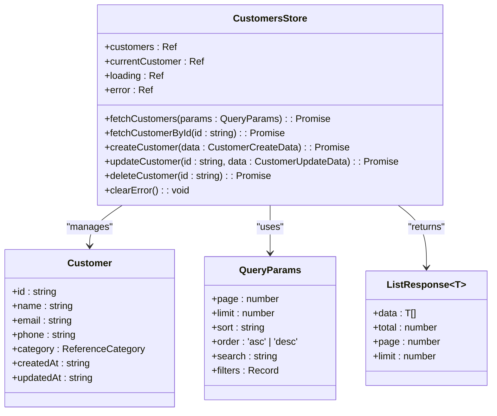
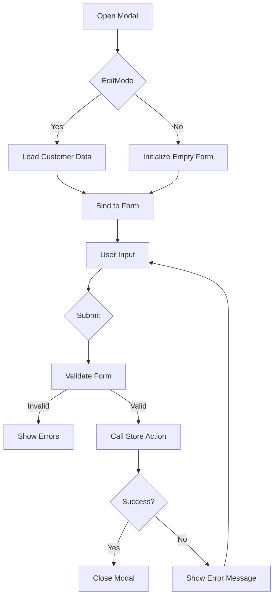
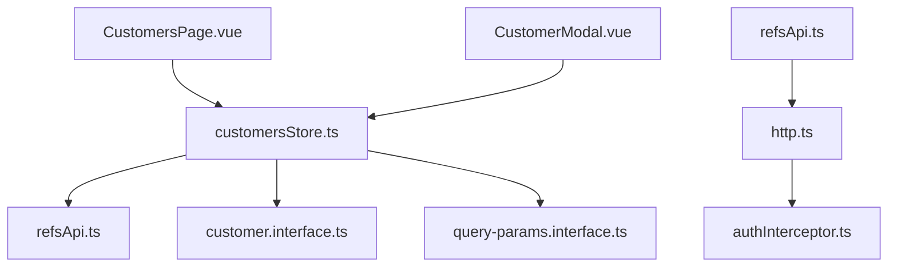

# Customers API Service

<cite>
**Referenced Files in This Document**  
- [customersStore.ts](file://src/root/refs/store/customersStore.ts)
- [CustomerModal.vue](file://src/root/refs/components/CustomerModal.vue)
- [CustomersPage.vue](file://src/root/refs/pages/CustomersPage.vue)
- [customer.interface.ts](file://src/root/shared/model/interface/refs/customer.interface.ts)
- [query-params.interface.ts](file://src/root/shared/model/interface/query-params.interface.ts)
</cite>

## Table of Contents
1. [Introduction](#introduction)
2. [Project Structure](#project-structure)
3. [Core Components](#core-components)
4. [Architecture Overview](#architecture-overview)
5. [Detailed Component Analysis](#detailed-component-analysis)
6. [Dependency Analysis](#dependency-analysis)
7. [Performance Considerations](#performance-considerations)
8. [Troubleshooting Guide](#troubleshooting-guide)
9. [Conclusion](#conclusion)

## Introduction
The Customers API Service is responsible for managing customer data within the Maya Platform frontend application. It provides a comprehensive set of operations for retrieving, creating, updating, and deleting customer records through a well-defined interface. This documentation details the service's functionality, integration points, and usage patterns across the application, focusing on its implementation in the Pinia store, interaction with UI components, and adherence to query parameter standards.

## Project Structure
The customer management module is organized under the `refs` (references) feature domain, which handles master data entities. The key components are located in the following directories:
- `src/root/refs/pages/CustomersPage.vue` - Main UI for customer list and navigation
- `src/root/refs/components/CustomerModal.vue` - Form component for CRUD operations
- `src/root/refs/store/customersStore.ts` - State management and API interaction logic
- `src/root/shared/model/interface/refs/customer.interface.ts` - Customer data structure definition
- `src/root/shared/model/interface/query-params.interface.ts` - Standardized query parameters for filtering and pagination

**Diagram sources**
- [CustomersPage.vue](file://src/root/refs/pages/CustomersPage.vue)
- [CustomerModal.vue](file://src/root/refs/components/CustomerModal.vue)
- [customersStore.ts](file://src/root/refs/store/customersStore.ts)

**Section sources**
- [customersStore.ts](file://src/root/refs/store/customersStore.ts)
- [customer.interface.ts](file://src/root/shared/model/interface/refs/customer.interface.ts)

## Core Components
The core functionality of the Customers API Service is implemented in the `customersStore.ts` module, which uses Pinia for state management. The store exposes actions for all CRUD operations and maintains reactive state for customer data, loading status, and error conditions. Key exported functions include:
- `fetchCustomers()` - Retrieves paginated list of customers with filtering
- `fetchCustomerById(id)` - Gets a specific customer by ID
- `createCustomer(data)` - Creates a new customer record
- `updateCustomer(id, data)` - Updates an existing customer
- `deleteCustomer(id)` - Removes a customer record

The service integrates with the global error handling system and provides consistent loading states for UI components.

**Section sources**
- [customersStore.ts](file://src/root/refs/store/customersStore.ts)
- [CustomerModal.vue](file://src/root/refs/components/CustomerModal.vue)

## Architecture Overview
The Customers API Service follows a clean architecture pattern with clear separation between presentation, state management, and data access layers. The Vue components interact with the Pinia store, which handles API communication and state persistence. All API requests are made through a centralized HTTP client with authentication interceptors.

**Diagram sources**
- [customersStore.ts](file://src/root/refs/store/customersStore.ts)
- [CustomersPage.vue](file://src/root/refs/pages/CustomersPage.vue)
- [CustomerModal.vue](file://src/root/refs/components/CustomerModal.vue)

## Detailed Component Analysis

### Customers Store Analysis
The `customersStore.ts` implements the business logic for customer management using Pinia's store pattern. It maintains reactive state and provides async actions for API interactions.

**Diagram sources**
- [customersStore.ts](file://src/root/refs/store/customersStore.ts)
- [customer.interface.ts](file://src/root/shared/model/interface/refs/customer.interface.ts)
- [query-params.interface.ts](file://src/root/shared/model/interface/query-params.interface.ts)

**Section sources**
- [customersStore.ts](file://src/root/refs/store/customersStore.ts)

### Customer Modal Integration
The `CustomerModal.vue` component provides a form interface for creating and editing customer records. It integrates with the customers store to handle form submission and validation.

**Diagram sources**
- [CustomerModal.vue](file://src/root/refs/components/CustomerModal.vue)
- [customersStore.ts](file://src/root/refs/store/customersStore.ts)

**Section sources**
- [CustomerModal.vue](file://src/root/refs/components/CustomerModal.vue)

## Dependency Analysis
The Customers API Service has well-defined dependencies on shared modules and external services. The dependency graph shows a clean separation of concerns with no circular dependencies.

**Diagram sources**
- [customersStore.ts](file://src/root/refs/store/customersStore.ts)
- [refsApi.ts](file://src/root/shared/api/refsApi.ts)
- [http.ts](file://src/root/core/api/http.ts)

**Section sources**
- [customersStore.ts](file://src/root/refs/store/customersStore.ts)

## Performance Considerations
The Customers API Service implements several performance optimizations:
- **Pagination**: All list queries use pagination with configurable limits to prevent excessive data loading
- **Caching**: Customer details are cached in the store to avoid redundant API calls when navigating between views
- **Debounced Search**: Search operations use debouncing to limit API requests during typing
- **Lazy Loading**: Related data (like reference categories) is loaded only when needed
- **Optimistic Updates**: For create/update operations, the UI is updated immediately with the new data before the API response

These patterns ensure responsive user experience even with large datasets.

## Troubleshooting Guide
Common issues and their solutions when working with the Customers API Service:

**Section sources**
- [customersStore.ts](file://src/root/refs/store/customersStore.ts)
- [CustomerModal.vue](file://src/root/refs/components/CustomerModal.vue)

### Error: "Customer not found"
- **Cause**: Attempting to load a customer with an invalid or deleted ID
- **Solution**: Ensure the customer ID exists and handle 404 responses gracefully in the UI

### Error: "Validation failed"
- **Cause**: Required fields missing or data format incorrect
- **Solution**: Check the error response for specific validation messages and highlight invalid fields in the form

### Error: "Duplicate customer email"
- **Cause**: Trying to create a customer with an email that already exists
- **Solution**: Implement real-time email availability check and display appropriate message

### Loading State Issues
- **Symptom**: Loading spinner persists after operation completes
- **Solution**: Ensure all async operations are properly wrapped in try-finally blocks to reset loading state

### Pagination Not Working
- **Cause**: Incorrect query parameters or backend not supporting pagination
- **Solution**: Verify the `QueryParams` interface matches backend requirements and check API response format

## Conclusion
The Customers API Service provides a robust and well-structured solution for customer data management in the Maya Platform. By following the repository's established patterns for state management, API interaction, and component design, it ensures consistency and maintainability. The service effectively handles all CRUD operations with proper error handling, loading states, and integration with UI components. Its adherence to standardized query parameters enables consistent filtering, sorting, and pagination across the application.