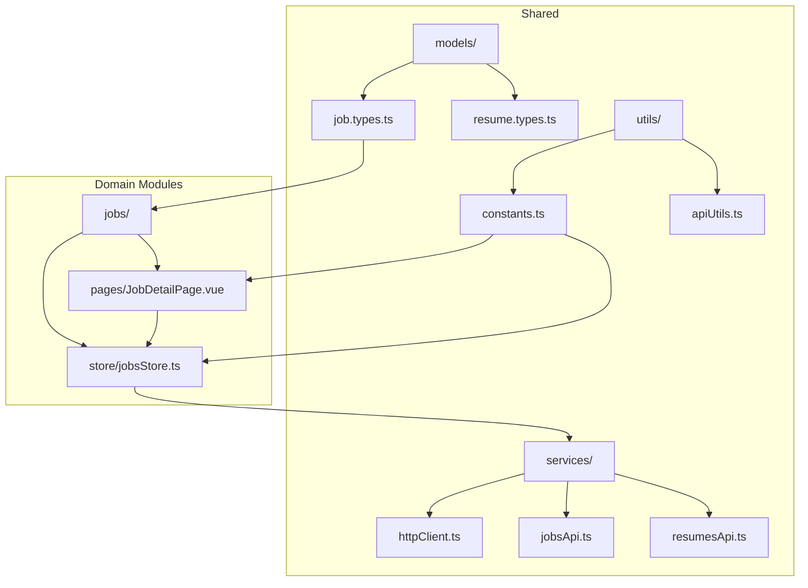
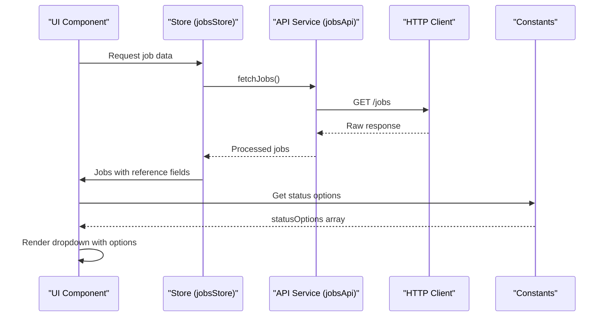
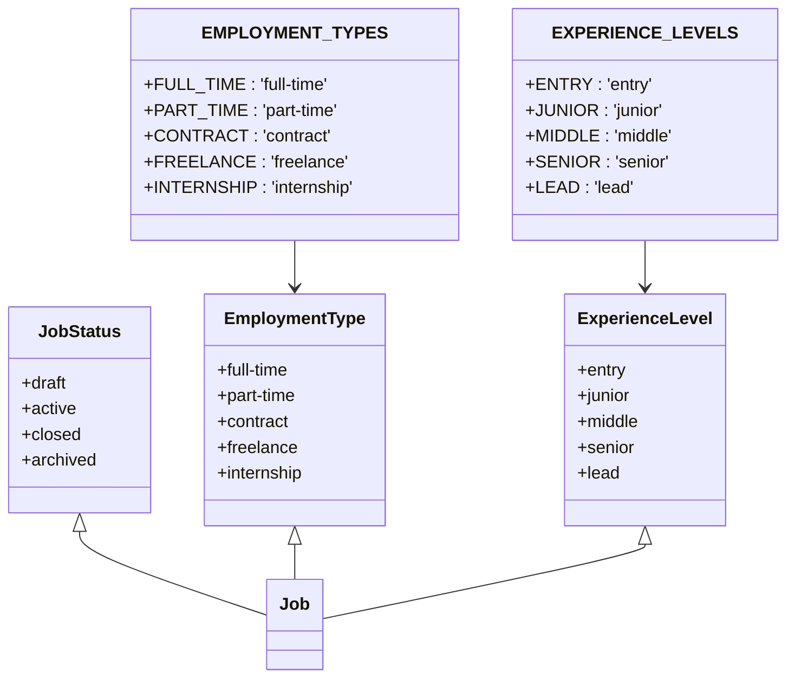
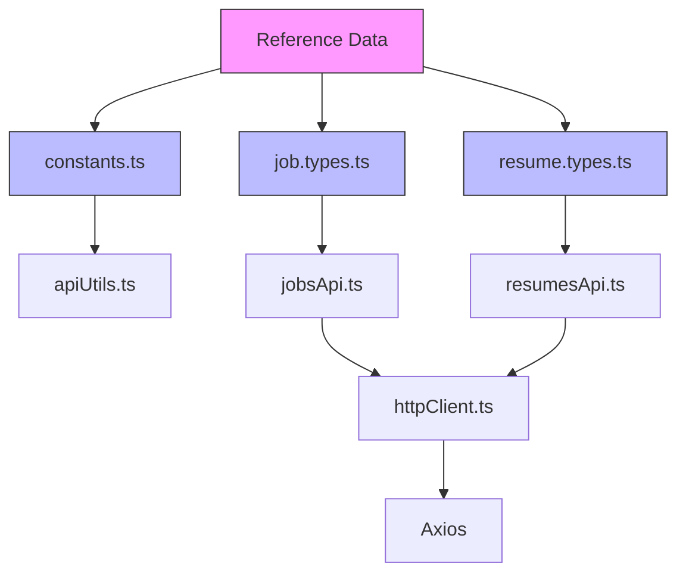

# References API Service

<cite>
**Referenced Files in This Document**   
- [httpClient.ts](file://src/root/shared/services/httpClient.ts)
- [apiUtils.ts](file://src/root/shared/utils/apiUtils.ts)
- [constants.ts](file://src/root/shared/utils/constants.ts)
- [jobsApi.ts](file://src/root/shared/services/jobsApi.ts)
- [resumesApi.ts](file://src/root/shared/services/resumesApi.ts)
- [job.types.ts](file://src/root/shared/models/job.types.ts)
- [resume.types.ts](file://src/root/shared/models/resume.types.ts)
</cite>

## Table of Contents
1. [Introduction](#introduction)
2. [Project Structure](#project-structure)
3. [Core Components](#core-components)
4. [Architecture Overview](#architecture-overview)
5. [Detailed Component Analysis](#detailed-component-analysis)
6. [Dependency Analysis](#dependency-analysis)
7. [Performance Considerations](#performance-considerations)
8. [Troubleshooting Guide](#troubleshooting-guide)
9. [Conclusion](#conclusion)

## Introduction
The References API Service is responsible for managing reference data such as categories, lookup values, and metadata used across the application for forms, dropdowns, and UI components. Although no dedicated `refsApi.ts` or `refsStore.ts` was found in the codebase, reference data functionality is embedded within existing services and models. This documentation analyzes how reference data is structured, accessed, and utilized throughout the system, focusing on hierarchical structures, caching strategies, internationalization, and integration with components like dropdowns and form fields.

## Project Structure
The project follows a modular architecture with domain-specific modules under the `src/root` directory. Reference data management is not isolated into a dedicated module but is distributed across shared services and models. The key locations for reference data include:

- `src/root/shared/services/`: Contains API service definitions
- `src/root/shared/models/`: Defines data interfaces with reference fields
- `src/root/shared/utils/`: Includes utilities for formatting and handling reference values
- `src/root/shared/constants.ts`: Centralizes static reference values and options



**Diagram sources**
- [job.types.ts](file://src/root/shared/models/job.types.ts)
- [constants.ts](file://src/root/shared/utils/constants.ts)
- [jobsApi.ts](file://src/root/shared/services/jobsApi.ts)

**Section sources**
- [project_structure](file://.)
- [constants.ts](file://src/root/shared/utils/constants.ts)

## Core Components
The core components for reference data management are:

1. **API Client (`httpClient.ts`)**: Provides standardized HTTP methods for data retrieval
2. **Constants (`constants.ts`)**: Stores static reference values and option lists
3. **Type Definitions (`job.types.ts`, `resume.types.ts`)**: Define reference fields with strict typing
4. **Utility Functions (`apiUtils.ts`)**: Handle formatting and transformation of reference data

These components work together to provide a consistent mechanism for managing reference data without a dedicated service module.

**Section sources**
- [httpClient.ts](file://src/root/shared/services/httpClient.ts)
- [constants.ts](file://src/root/shared/utils/constants.ts)
- [job.types.ts](file://src/root/shared/models/job.types.ts)

## Architecture Overview
The reference data architecture relies on compile-time constants and type definitions rather than runtime API calls for static reference values. Dynamic reference data (if any) would use the shared HTTP client, but the current implementation shows that most reference data is hardcoded in constants and transformed via utility functions.



**Diagram sources**
- [jobsApi.ts](file://src/root/shared/services/jobsApi.ts)
- [httpClient.ts](file://src/root/shared/services/httpClient.ts)
- [JobsListPage.vue](file://src/root/jobs/pages/JobsListPage.vue)

## Detailed Component Analysis

### Reference Data Implementation
The system implements reference data through TypeScript constants and enums defined in `constants.ts`. These are consumed directly by UI components to populate dropdowns and form controls.



**Diagram sources**
- [constants.ts](file://src/root/shared/utils/constants.ts)
- [job.types.ts](file://src/root/shared/models/job.types.ts)

### API Service Integration
The API services use the HTTP client to retrieve data that includes reference fields. The response is normalized and used alongside static reference data to provide complete information.

```typescript
// Example from jobsApi.ts
async searchJobs(query: string, filters: {
  status?: JobStatus
  location?: string
  employmentType?: EmploymentType
}): Promise<Job[]> {
  const searchParams = { q: query, ...filters }
  const queryString = createQueryString(searchParams)
  return api.get<Job[]>(`${API_ENDPOINTS.JOBS.SEARCH}${queryString}`)
}
```

This pattern shows how reference values are used as filter parameters in API requests, with the actual option lists coming from constants.

**Section sources**
- [jobsApi.ts](file://src/root/shared/services/jobsApi.ts)
- [apiUtils.ts](file://src/root/shared/utils/apiUtils.ts)

### UI Component Integration
UI components like `JobsListPage.vue` combine API data with reference constants to create interactive interfaces.

```typescript
// In JobsListPage.vue
const statusOptions = [
  { label: 'Active', value: 'active' },
  { label: 'Draft', value: 'draft' },
  { label: 'Closed', value: 'closed' },
  { label: 'Archived', value: 'archived' }
]

const locationOptions = computed(() => {
  const locations = [...new Set(jobs.value.map(job => job.location))]
  return locations.map(location => ({ label: location, value: location }))
})
```

This demonstrates a hybrid approach: static status options from reference data and dynamic location options derived from API results.

**Section sources**
- [JobsListPage.vue](file://src/root/jobs/pages/JobsListPage.vue)

## Dependency Analysis
The reference data system has minimal dependencies, relying primarily on the core TypeScript types and shared utilities.



**Diagram sources**
- [constants.ts](file://src/root/shared/utils/constants.ts)
- [job.types.ts](file://src/root/shared/models/job.types.ts)
- [httpClient.ts](file://src/root/shared/services/httpClient.ts)

## Performance Considerations
The current implementation provides excellent performance characteristics:

- **No additional API calls** for reference data since values are compiled into the bundle
- **Type safety** ensures correct usage of reference values
- **Minimal bundle impact** as constants are tree-shakeable
- **Fast rendering** of dropdowns and forms due to synchronous access to options

For dynamic reference data, consider implementing caching at the service level using localStorage or in-memory stores.

## Troubleshooting Guide
Common issues and solutions for reference data:

1. **Missing translation in UI**: Check that labels are properly mapped from values using utility functions
2. **Type errors with reference values**: Ensure correct import of types from `job.types.ts` or `resume.types.ts`
3. **Options not appearing in dropdown**: Verify that the options array is properly defined in the component
4. **Filtering not working**: Confirm that API parameters match the expected reference value format

```typescript
// Example of proper error handling
try {
  const jobs = await jobsApi.searchJobs(query, { status: 'active' })
} catch (error) {
  console.error('Failed to load jobs:', getErrorMessage(error))
}
```

**Section sources**
- [apiUtils.ts](file://src/root/shared/utils/apiUtils.ts)
- [jobsApi.ts](file://src/root/shared/services/jobsApi.ts)

## Conclusion
The References API Service pattern in this application demonstrates a lightweight, type-safe approach to reference data management. By leveraging TypeScript constants and enums, the system avoids unnecessary API calls while maintaining data consistency. The integration with UI components is straightforward, combining static reference data with dynamic API results. For future enhancements, consider adding a dedicated reference service for truly dynamic reference data with caching and synchronization capabilities.