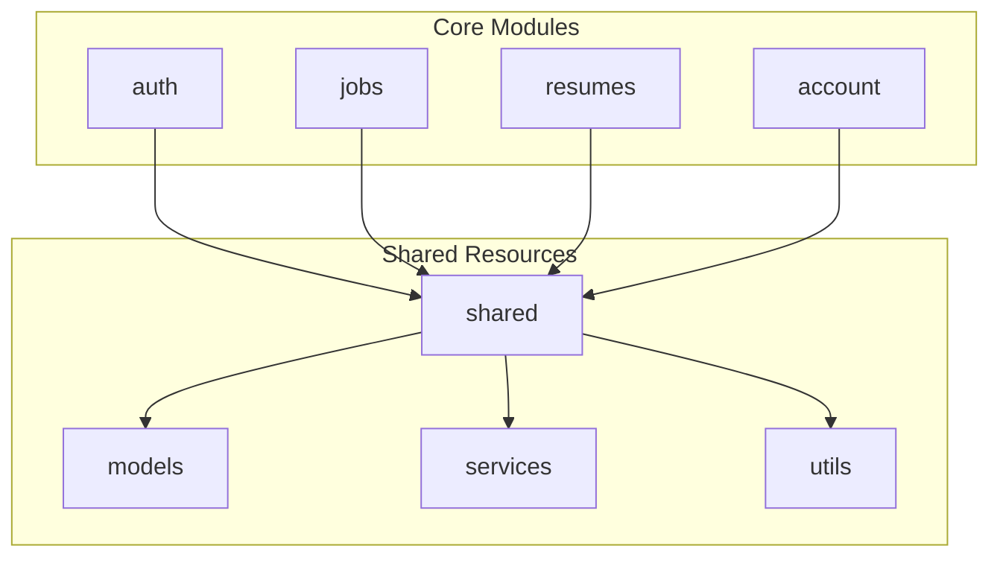
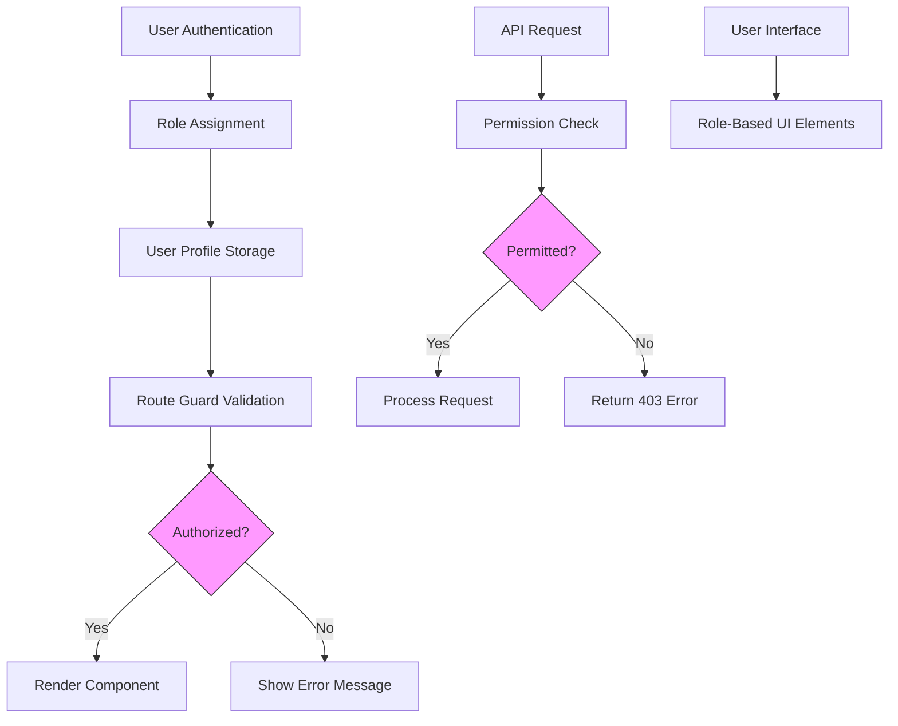
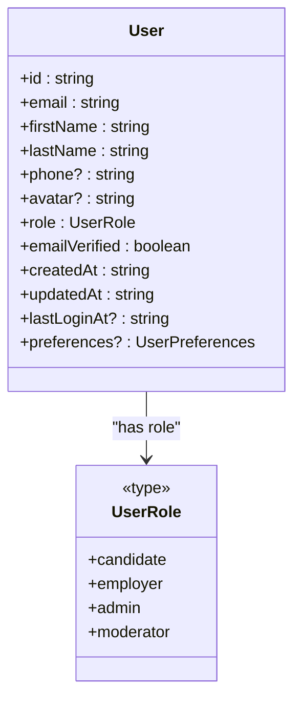
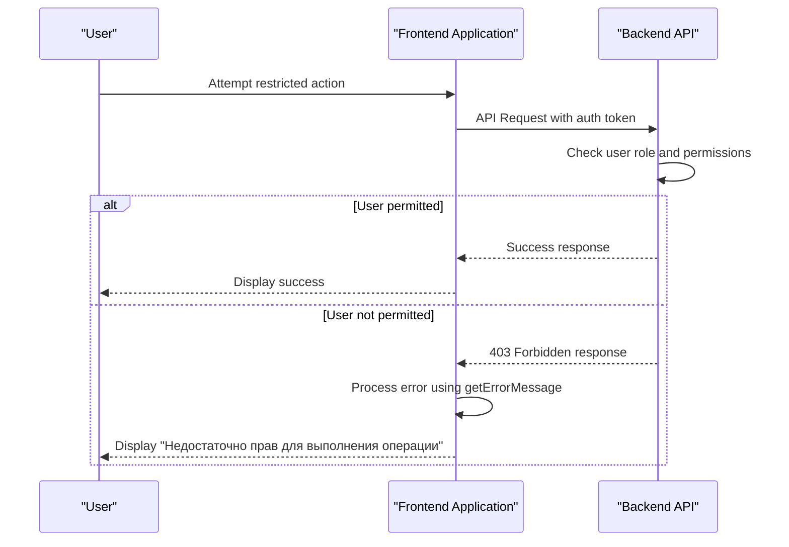
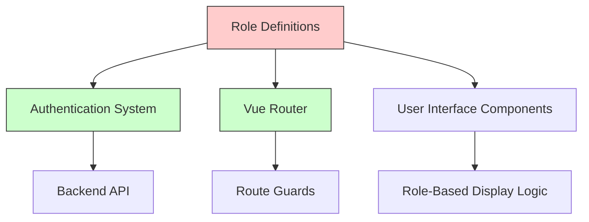

# Roles API Service

<cite>
**Referenced Files in This Document**   
- [auth.types.ts](file://src/root/shared/models/auth.types.ts#L0-L72)
- [constants.ts](file://src/root/shared/utils/constants.ts#L108-L143)
</cite>

## Table of Contents
1. [Introduction](#introduction)
2. [Project Structure](#project-structure)
3. [Core Components](#core-components)
4. [Architecture Overview](#architecture-overview)
5. [Detailed Component Analysis](#detailed-component-analysis)
6. [Dependency Analysis](#dependency-analysis)
7. [Performance Considerations](#performance-considerations)
8. [Troubleshooting Guide](#troubleshooting-guide)
9. [Conclusion](#conclusion)

## Introduction
This document provides comprehensive documentation for the role management and permission system within the Maya Platform frontend application. Although the expected `rolesApi.ts`, `rolesStore.ts`, and `CreateRoleUser.vue` files were not found in the repository, key aspects of role-based access control have been identified through analysis of existing code. The system implements user roles and permission boundaries primarily through user role definitions and centralized error messaging. This documentation synthesizes available information to describe the current role and permission architecture, its integration points, and usage patterns.

## Project Structure
The project follows a modular Vue.js architecture with domain-driven organization. Key modules include `auth`, `jobs`, `resumes`, and `account`, each containing their respective pages, routes, and stores. Shared components, models, and services are located in the `shared` directory. The role management functionality, while referenced in the documentation objective, does not have dedicated files in the current codebase. Instead, role-related logic is embedded within authentication and user models.

**Diagram sources**
- [project_structure](file://#L1-L100)

**Section sources**
- [project_structure](file://#L1-L100)

## Core Components
The core components related to role management are the `User` interface and role type definition in `auth.types.ts`, along with permission-related constants in `constants.ts`. These components establish the foundation for role-based access control in the application. The `UserRole` type defines the available roles in the system, while the `User` interface incorporates role assignment at the user level. Error messages in `constants.ts` provide user-facing feedback for permission-related operations.

**Section sources**
- [auth.types.ts](file://src/root/shared/models/auth.types.ts#L0-L72)
- [constants.ts](file://src/root/shared/utils/constants.ts#L108-L143)

## Architecture Overview
The role management architecture is integrated into the authentication system rather than implemented as a separate service. User roles are assigned during user creation and stored as part of the user profile. Access control is enforced through route guards and API-level permission checks, with unauthorized operations resulting in standardized error responses. The absence of a dedicated roles API suggests that role management may be handled exclusively on the backend, with the frontend consuming role information for display and access control purposes.

**Diagram sources**
- [auth.types.ts](file://src/root/shared/models/auth.types.ts#L0-L72)
- [constants.ts](file://src/root/shared/utils/constants.ts#L108-L143)

## Detailed Component Analysis

### User Role Implementation
The user role system is implemented through a TypeScript union type that defines the available roles in the application. This approach provides type safety and ensures that only valid roles can be assigned to users. The role is a fundamental property of the user model and influences both UI rendering and access control decisions.

**Diagram sources**
- [auth.types.ts](file://src/root/shared/models/auth.types.ts#L0-L72)

**Section sources**
- [auth.types.ts](file://src/root/shared/models/auth.types.ts#L0-L72)

### Permission Boundary Enforcement
Permission boundaries are enforced through standardized error messages and route guards. When a user attempts an unauthorized operation, the system returns a 403 status code with a corresponding error message. This pattern ensures consistent user experience across the application and provides clear feedback when operations are blocked due to insufficient permissions.

**Diagram sources**
- [constants.ts](file://src/root/shared/utils/constants.ts#L108-L143)
- [apiUtils.ts](file://src/root/shared/utils/apiUtils.ts#L0-L46)

**Section sources**
- [constants.ts](file://src/root/shared/utils/constants.ts#L108-L143)

## Dependency Analysis
The role management system has minimal direct dependencies, as it is primarily implemented through type definitions and constants. The main dependencies are the authentication system, which consumes role information, and the routing system, which uses roles for access control. The absence of a dedicated roles API service suggests that role creation and management are either handled entirely on the backend or not yet implemented in the frontend.

**Diagram sources**
- [auth.types.ts](file://src/root/shared/models/auth.types.ts#L0-L72)
- [constants.ts](file://src/root/shared/utils/constants.ts#L108-L143)

**Section sources**
- [auth.types.ts](file://src/root/shared/models/auth.types.ts#L0-L72)
- [constants.ts](file://src/root/shared/utils/constants.ts#L108-L143)

## Performance Considerations
The current role management implementation has minimal performance impact as it relies on simple type checking and constant lookups. Role information is loaded as part of the user profile during authentication, avoiding additional network requests for role data. The use of TypeScript union types for roles ensures compile-time type checking without runtime overhead. Error message lookup is a simple constant-time operation, contributing to fast error handling.

## Troubleshooting Guide
When troubleshooting role and permission issues, consider the following common scenarios:

1. **Missing role assignment**: Ensure that new users are assigned an appropriate role during creation
2. **Permission errors**: Verify that the user's role has the necessary permissions for the attempted operation
3. **UI display issues**: Check that role-based UI elements properly handle all possible role values
4. **Error message localization**: Confirm that permission error messages are properly displayed in the user's preferred language

The primary error message for permission issues is "Недостаточно прав для выполнения операции" (Insufficient rights to perform the operation), which corresponds to HTTP 403 responses.

**Section sources**
- [constants.ts](file://src/root/shared/utils/constants.ts#L108-L143)
- [apiUtils.ts](file://src/root/shared/utils/apiUtils.ts#L0-L46)

## Conclusion
The Roles API service as described in the documentation objective does not exist in the current codebase. However, the application implements a role-based access control system through user role definitions in the `User` interface and standardized permission error messages. The system supports four roles: candidate, employer, admin, and moderator, with access control enforced through route guards and API-level permission checks. While dedicated role management components (rolesApi.ts, rolesStore.ts, CreateRoleUser.vue) are absent, the existing implementation provides a foundation for role-based functionality. Future development should consider implementing the missing role management components to provide comprehensive role administration capabilities.