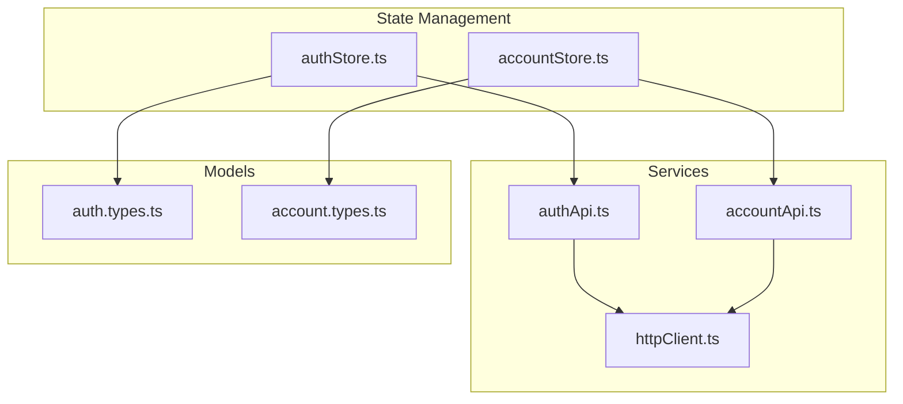
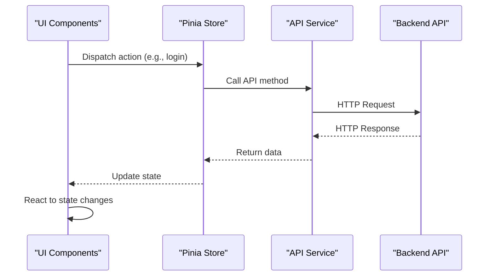
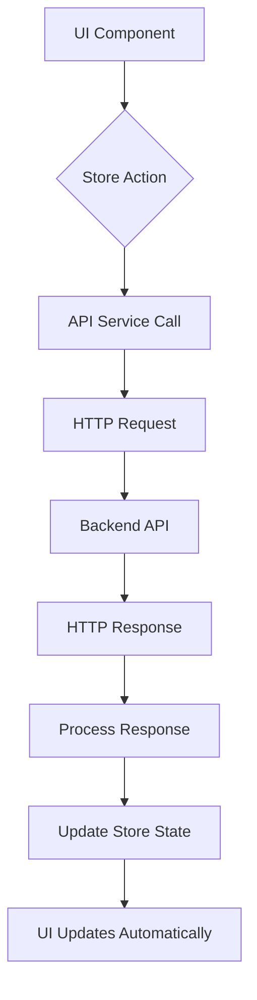

# Users API Service

<cite>
**Referenced Files in This Document**   
- [authApi.ts](file://src/root/shared/services/authApi.ts)
- [accountApi.ts](file://src/root/shared/services/accountApi.ts)
- [auth.types.ts](file://src/root/shared/models/auth.types.ts)
- [account.types.ts](file://src/root/shared/models/account.types.ts)
- [authStore.ts](file://src/root/auth/store/authStore.ts)
- [accountStore.ts](file://src/root/account/store/accountStore.ts)
- [httpClient.ts](file://src/root/shared/services/httpClient.ts)
- [constants.ts](file://src/root/shared/utils/constants.ts)
- [apiUtils.ts](file://src/root/shared/utils/apiUtils.ts)
</cite>

## Table of Contents
1. [Introduction](#introduction)
2. [Project Structure](#project-structure)
3. [Core Components](#core-components)
4. [Architecture Overview](#architecture-overview)
5. [Detailed Component Analysis](#detailed-component-analysis)
6. [User Management Operations](#user-management-operations)
7. [Data Validation and Error Handling](#data-validation-and-error-handling)
8. [Security Considerations](#security-considerations)
9. [Integration with UI Components](#integration-with-ui-components)
10. [Troubleshooting Guide](#troubleshooting-guide)

## Introduction
The Users API Service provides a comprehensive interface for managing user accounts within the MayaWork. This documentation details the available endpoints, data structures, authentication mechanisms, and integration patterns for user management operations. The service supports core functionalities including user authentication, profile management, preferences configuration, and account security features.

**Section sources**
- [authApi.ts](file://src/root/shared/services/authApi.ts#L0-L82)
- [accountApi.ts](file://src/root/shared/services/accountApi.ts#L0-L106)

## Project Structure
The user management functionality is organized within the shared services and models directories of the root module. The architecture follows a modular pattern with clear separation between API services, data models, and state management.



**Diagram sources**
- [authApi.ts](file://src/root/shared/services/authApi.ts)
- [accountApi.ts](file://src/root/shared/services/accountApi.ts)
- [auth.types.ts](file://src/root/shared/models/auth.types.ts)
- [account.types.ts](file://src/root/shared/models/account.types.ts)
- [authStore.ts](file://src/root/auth/store/authStore.ts)
- [accountStore.ts](file://src/root/account/store/accountStore.ts)

## Core Components
The user management system consists of several core components that work together to provide a seamless user experience:

- **authApi**: Handles authentication-related operations including login, registration, and token management
- **accountApi**: Manages user profile data, preferences, and account settings
- **authStore**: Centralized state management for authentication state using Pinia
- **accountStore**: Manages account-related state and operations
- **httpClient**: Base HTTP client configuration with interceptors and error handling

**Section sources**
- [authApi.ts](file://src/root/shared/services/authApi.ts#L0-L82)
- [accountApi.ts](file://src/root/shared/services/accountApi.ts#L0-L106)
- [authStore.ts](file://src/root/auth/store/authStore.ts#L0-L154)
- [accountStore.ts](file://src/root/account/store/accountStore.ts#L0-L69)

## Architecture Overview
The user management architecture follows a service-oriented pattern with clear separation of concerns. API services handle HTTP communication, models define data structures, and stores manage application state.



**Diagram sources**
- [authApi.ts](file://src/root/shared/services/authApi.ts#L0-L82)
- [authStore.ts](file://src/root/auth/store/authStore.ts#L0-L154)

## Detailed Component Analysis

### Authentication Service Analysis
The authentication service provides methods for user authentication and session management.

```mermaid
classDiagram
class authApi {
+login(credentials) : Promise~AuthResponse~
+logout() : Promise~void~
+refreshToken(token) : Promise~RefreshTokenResponse~
+getCurrentUser() : Promise~User~
+register(userData) : Promise~AuthResponse~
+requestPasswordReset(email) : Promise~{message : string}~
+resetPassword(token, password) : Promise~{message : string}~
+verifyEmail(token) : Promise~{message : string}~
+resendEmailVerification() : Promise~{message : string}~
}
class AuthResponse {
+user : User
+access_token : string
+refresh_token? : string
+expires_in : number
+token_type : 'Bearer'
}
class User {
+id : string
+email : string
+firstName : string
+lastName : string
+phone? : string
+avatar? : string
+role : UserRole
+emailVerified : boolean
+createdAt : string
+updatedAt : string
+lastLoginAt? : string
+preferences? : UserPreferences
}
authApi --> AuthResponse
authApi --> User
```

**Diagram sources**
- [authApi.ts](file://src/root/shared/services/authApi.ts#L0-L82)
- [auth.types.ts](file://src/root/shared/models/auth.types.ts#L0-L72)

### Account Service Analysis
The account service handles user profile management and account settings.

```mermaid
classDiagram
class accountApi {
+updateProfile(profileData) : Promise~User~
+changePassword(passwordData) : Promise~{message : string}~
+uploadAvatar(file) : Promise~string~
+deleteAvatar() : Promise~{message : string}~
+getAccountStats() : Promise~AccountStats~
+updatePreferences(preferences) : Promise~{message : string}~
+getPreferences() : Promise~UserPreferences~
+deactivateAccount(reason?) : Promise~{message : string}~
+exportData() : Promise~Blob~
}
class UpdateProfileData {
+firstName? : string
+lastName? : string
+phone? : string
+bio? : string
+location? : string
+website? : string
+linkedin? : string
+github? : string
}
class ChangePasswordData {
+currentPassword : string
+newPassword : string
}
class AccountStats {
+resumesCount : number
+jobsCount : number
+applicationsCount : number
+profileCompleteness : number
+accountAge : number
+lastLoginDaysAgo : number
}
accountApi --> UpdateProfileData
accountApi --> ChangePasswordData
accountApi --> AccountStats
```

**Diagram sources**
- [accountApi.ts](file://src/root/shared/services/accountApi.ts#L0-L106)
- [account.types.ts](file://src/root/shared/models/account.types.ts#L0-L60)

## User Management Operations

### Authentication Operations
The authentication API provides the following endpoints:

**Login**
- **Endpoint**: `POST /auth/login`
- **Request Body**: 
```json
{
  "email": "user@example.com",
  "password": "password123",
  "rememberMe": true
}
```
- **Response**: 
```json
{
  "user": { /* user object */ },
  "access_token": "jwt_token",
  "refresh_token": "refresh_token",
  "expires_in": 3600,
  "token_type": "Bearer"
}
```

**Registration**
- **Endpoint**: `POST /auth/register`
- **Request Body**: 
```json
{
  "email": "user@example.com",
  "password": "password123",
  "firstName": "John",
  "lastName": "Doe",
  "phone": "+1234567890",
  "role": "candidate",
  "termsAccepted": true
}
```

**Password Reset**
- **Request Reset**: `POST /auth/password-reset-request`
- **Complete Reset**: `POST /auth/password-reset`

**Section sources**
- [authApi.ts](file://src/root/shared/services/authApi.ts#L0-L82)
- [auth.types.ts](file://src/root/shared/models/auth.types.ts#L0-L72)

### Profile Management Operations
The account API provides comprehensive profile management capabilities:

**Update Profile**
- **Endpoint**: `PUT /account/profile`
- **Request Body**: 
```json
{
  "firstName": "John",
  "lastName": "Doe",
  "phone": "+1234567890",
  "bio": "Software developer with 5 years of experience",
  "location": "New York, NY",
  "website": "https://johndoe.com",
  "linkedin": "linkedin.com/in/johndoe",
  "github": "github.com/johndoe"
}
```

**Change Password**
- **Endpoint**: `PUT /account/password`
- **Request Body**: 
```json
{
  "currentPassword": "old_password",
  "newPassword": "new_password123"
}
```

**Upload Avatar**
- **Endpoint**: `POST /account/avatar`
- **Request**: Multipart form data with file

**Section sources**
- [accountApi.ts](file://src/root/shared/services/accountApi.ts#L0-L53)
- [account.types.ts](file://src/root/shared/models/account.types.ts#L0-L60)

## Data Validation and Error Handling

### Validation Rules
The system implements comprehensive validation for user data:

- **Email**: Must be valid email format, unique across system
- **Password**: Minimum 8 characters, requires uppercase, lowercase, number, and special character
- **Profile Fields**: 
  - Name fields: 2-50 characters, alphanumeric with spaces
  - Phone: Valid international format
  - URLs: Valid URL format for website, LinkedIn, GitHub

### Error Responses
The API returns standardized error responses:

```json
{
  "message": "Error description",
  "code": "error_code",
  "field": "field_name",
  "details": {}
}
```

Common error codes:
- **400**: Invalid request data
- **401**: Authentication required
- **403**: Insufficient permissions
- **404**: Resource not found
- **409**: Conflict (e.g., duplicate email)
- **422**: Validation error
- **500**: Internal server error

Error messages are localized and user-friendly, with technical details available for debugging.

**Section sources**
- [apiUtils.ts](file://src/root/shared/utils/apiUtils.ts#L0-L46)
- [auth.types.ts](file://src/root/shared/models/auth.types.ts#L130-L152)

## Security Considerations
The user management system implements several security measures:

- **Password Security**: Passwords are hashed using bcrypt with salt
- **Token Management**: JWT tokens with expiration, refresh tokens with rotation
- **Rate Limiting**: Protection against brute force attacks
- **Input Sanitization**: Protection against XSS and injection attacks
- **HTTPS**: All API calls require secure connections
- **CORS**: Restricted to trusted domains
- **CSRF Protection**: Implemented for state-changing operations

Sensitive operations like password changes and account deletion require re-authentication.

**Section sources**
- [authApi.ts](file://src/root/shared/services/authApi.ts#L0-L82)
- [accountApi.ts](file://src/root/shared/services/accountApi.ts#L0-L106)

## Integration with UI Components

### State Management Integration
The Pinia stores provide a reactive interface between the UI and API services:



**Diagram sources**
- [authStore.ts](file://src/root/auth/store/authStore.ts#L0-L154)
- [accountStore.ts](file://src/root/account/store/accountStore.ts#L0-L69)

### Data Synchronization
The system implements real-time data synchronization through:

- **Automatic Token Refresh**: When access token expires
- **Profile Updates**: Immediate store updates after successful API calls
- **Error Handling**: User-friendly error messages with recovery options
- **Loading States**: Visual feedback during API operations

The stores maintain loading and error states to provide appropriate UI feedback.

**Section sources**
- [authStore.ts](file://src/root/auth/store/authStore.ts#L0-L154)
- [accountStore.ts](file://src/root/account/store/accountStore.ts#L0-L69)

## Troubleshooting Guide

### Common Issues and Solutions

**Authentication Failures**
- **Cause**: Incorrect credentials or expired session
- **Solution**: Verify email/password, check if email is verified, try password reset

**Profile Update Errors**
- **Cause**: Validation errors or network issues
- **Solution**: Check field requirements, verify internet connection, retry operation

**Token Refresh Issues**
- **Cause**: Invalid or expired refresh token
- **Solution**: Re-login to obtain new tokens

**Avatar Upload Problems**
- **Cause**: File size or format restrictions
- **Solution**: Ensure file is under 5MB and in JPG, PNG, or GIF format

### Debugging Tips
- Check browser console for JavaScript errors
- Verify network requests in developer tools
- Ensure proper authentication headers are sent
- Validate request payloads against API documentation
- Check for CORS errors in browser console

**Section sources**
- [authStore.ts](file://src/root/auth/store/authStore.ts#L0-L154)
- [accountStore.ts](file://src/root/account/store/accountStore.ts#L0-L69)
- [apiUtils.ts](file://src/root/shared/utils/apiUtils.ts#L0-L46)