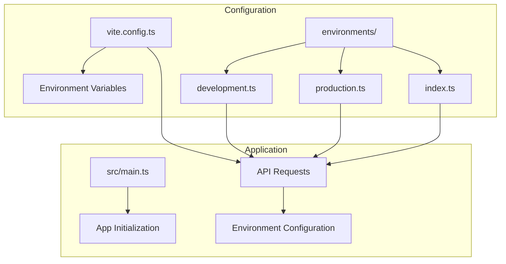
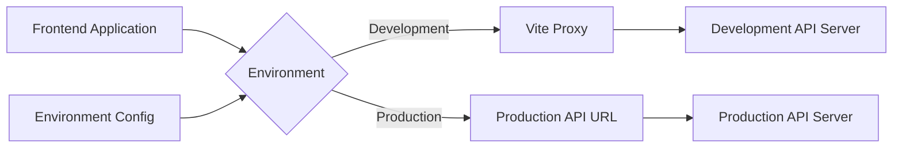
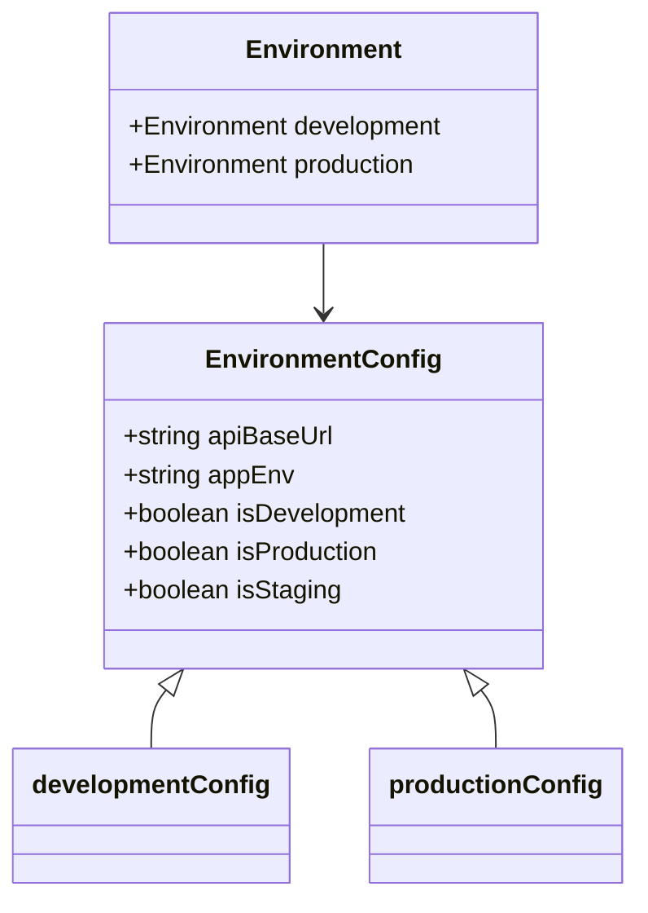
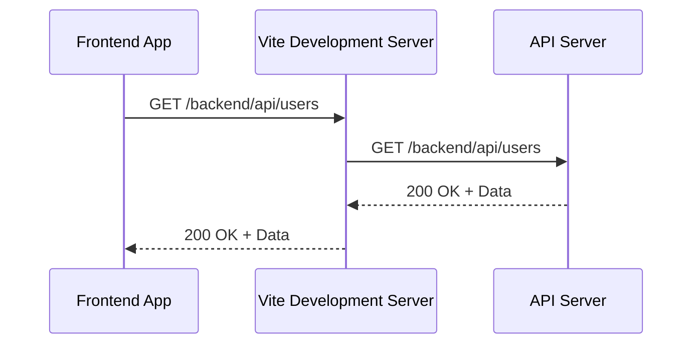
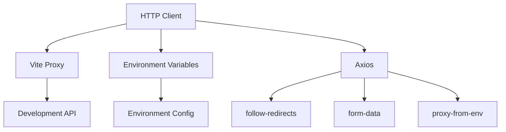

# HTTP Client Configuration

<cite>
**Referenced Files in This Document**   
- [vite.config.ts](file://vite.config.ts)
- [development.ts](file://src/environments/development.ts)
- [production.ts](file://src/environments/production.ts)
- [index.ts](file://src/environments/index.ts)
</cite>

## Table of Contents
1. [Introduction](#introduction)
2. [Project Structure](#project-structure)
3. [Core Components](#core-components)
4. [Architecture Overview](#architecture-overview)
5. [Detailed Component Analysis](#detailed-component-analysis)
6. [Dependency Analysis](#dependency-analysis)
7. [Performance Considerations](#performance-considerations)
8. [Troubleshooting Guide](#troubleshooting-guide)
9. [Conclusion](#conclusion)

## Introduction
The maya-platform-frontend application implements a centralized HTTP client configuration to manage API communications across different environments. This documentation details the HTTP client setup, focusing on Axios integration, environment-based configuration, and API request handling patterns. Although direct implementation files such as `http.ts` were not found in the repository, the existing configuration demonstrates a robust approach to managing API endpoints through Vite proxy settings and environment variables. The system leverages environment-specific configurations to route requests appropriately during development and production.

## Project Structure
The project follows a modular structure with clear separation of concerns. The `src` directory contains the main application code, with environments configuration isolated in `src/environments`. The application uses Vite as its build tool, with configuration defined in `vite.config.ts`. The environment configuration files (`development.ts`, `production.ts`, and `index.ts`) define API base URLs and environment-specific settings. The alias system in `tsconfig.app.json` and `vite.config.ts` provides convenient import paths for various application modules.

**Diagram sources**
- [vite.config.ts](file://vite.config.ts)
- [src/environments/development.ts](file://src/environments/development.ts)
- [src/environments/production.ts](file://src/environments/production.ts)
- [src/environments/index.ts](file://src/environments/index.ts)

**Section sources**
- [vite.config.ts](file://vite.config.ts)
- [src/environments/development.ts](file://src/environments/development.ts)
- [src/environments/production.ts](file://src/environments/production.ts)

## Core Components
The core components for HTTP client configuration include environment-specific configuration files and Vite proxy settings. The `developmentConfig` and `productionConfig` objects define API base URLs for their respective environments. The `currentConfig` export in `index.ts` determines which configuration to use based on the current environment mode. Vite's server proxy in `vite.config.ts` redirects API requests during development to the appropriate backend server, enabling seamless API communication without CORS issues.

**Section sources**
- [src/environments/development.ts](file://src/environments/development.ts)
- [src/environments/production.ts](file://src/environments/production.ts)
- [src/environments/index.ts](file://src/environments/index.ts)
- [vite.config.ts](file://vite.config.ts)

## Architecture Overview
The HTTP client architecture relies on environment-based configuration and Vite's proxy mechanism to handle API requests. During development, requests to `/backend/api` are proxied to the development API server, while in production, the API base URL is determined by environment variables or defaults to a production endpoint. This approach allows for consistent API call patterns across environments while abstracting the underlying endpoint differences. The architecture does not appear to include a dedicated Axios instance configuration file, suggesting that HTTP clients may be created inline or through a different mechanism not visible in the provided codebase.

**Diagram sources**
- [vite.config.ts](file://vite.config.ts)
- [src/environments/development.ts](file://src/environments/development.ts)
- [src/environments/production.ts](file://src/environments/production.ts)

## Detailed Component Analysis

### Environment Configuration Analysis
The environment configuration system provides a flexible way to manage API endpoints across different deployment targets. The `environments` module exports configuration objects for development and production environments, with a utility function to determine the current environment based on Vite's `import.meta.env.MODE`.

**Diagram sources**
- [src/environments/development.ts](file://src/environments/development.ts)
- [src/environments/production.ts](file://src/environments/production.ts)
- [src/environments/index.ts](file://src/environments/index.ts)

**Section sources**
- [src/environments/development.ts](file://src/environments/development.ts)
- [src/environments/production.ts](file://src/environments/production.ts)
- [src/environments/index.ts](file://src/environments/index.ts)

### Vite Proxy Configuration Analysis
The Vite configuration includes a proxy setup that redirects API requests during development. This allows the frontend to make requests to `/backend/api` without CORS issues, as Vite intercepts these requests and forwards them to the actual development API server.

**Diagram sources**
- [vite.config.ts](file://vite.config.ts)

**Section sources**
- [vite.config.ts](file://vite.config.ts)

## Dependency Analysis
The HTTP client configuration depends on Vite's built-in proxy functionality and environment variable management. The application uses Axios as its HTTP client library, as evidenced by its presence in package-lock.json. The environment configuration system depends on Vite's `import.meta.env` API to determine the current mode. The alias system in Vite and TypeScript configuration enables consistent module imports across the application.

**Diagram sources**
- [vite.config.ts](file://vite.config.ts)
- [package-lock.json](file://package-lock.json)
- [src/environments/index.ts](file://src/environments/index.ts)

**Section sources**
- [vite.config.ts](file://vite.config.ts)
- [package-lock.json](file://package-lock.json)
- [src/environments/index.ts](file://src/environments/index.ts)

## Performance Considerations
The current HTTP client implementation leverages Vite's proxy for development, which may introduce a slight performance overhead during development but has no impact on production performance. In production, API requests go directly to the configured endpoint, minimizing latency. The use of environment variables for API base URLs allows for optimal request routing without additional configuration lookups at runtime. Connection pooling and reuse are handled by the browser's native HTTP implementation and Axios's underlying mechanisms. Payload compression is likely handled by the server and browser automatically through standard HTTP compression negotiation.

## Troubleshooting Guide
When encountering issues with API requests, consider the following:

1. **Development Environment Issues**: Verify that the Vite proxy target in `vite.config.ts` points to the correct development API server.
2. **Production Environment Issues**: Ensure that the `VITE_API_BASE_URL` environment variable is set correctly in production.
3. **CORS Issues**: During development, ensure that the API server allows requests from the Vite development server origin.
4. **Environment Detection**: Verify that `import.meta.env.MODE` correctly identifies the current environment.
5. **Network Connectivity**: Check that the API server is reachable from the client environment.

**Section sources**
- [vite.config.ts](file://vite.config.ts)
- [src/environments/development.ts](file://src/environments/development.ts)
- [src/environments/production.ts](file://src/environments/production.ts)

## Conclusion
The maya-platform-frontend application implements a robust HTTP client configuration system using Vite's proxy capabilities and environment-based settings. While a dedicated Axios instance configuration file was not found in the repository, the existing setup effectively manages API communication across different environments. The architecture separates environment concerns from application logic, allowing for flexible deployment configurations. Future improvements could include creating a centralized HTTP client instance with default headers, timeout settings, and request interceptors to further standardize API interactions across the application.