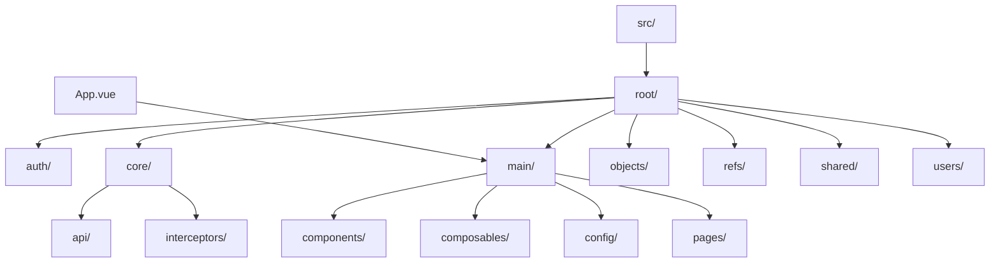
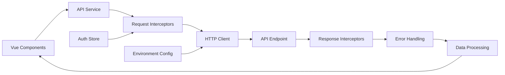
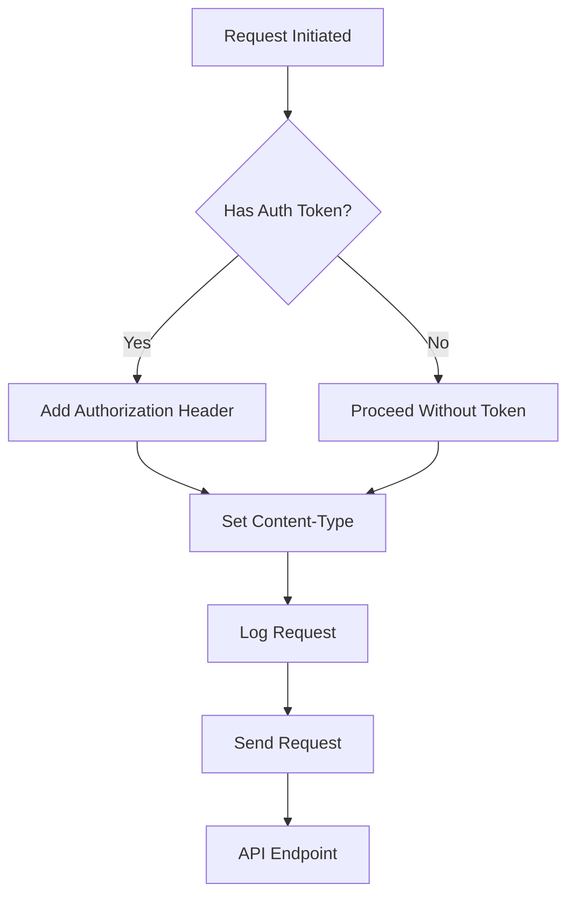
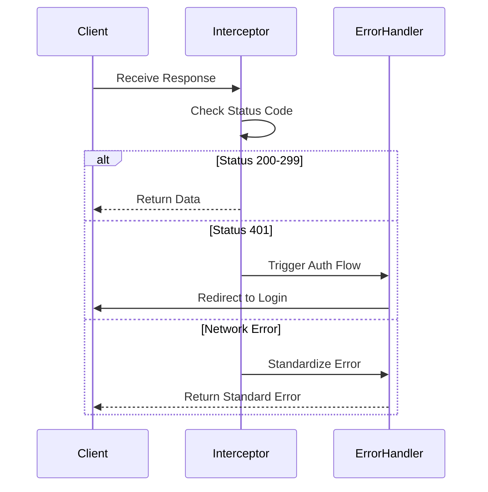
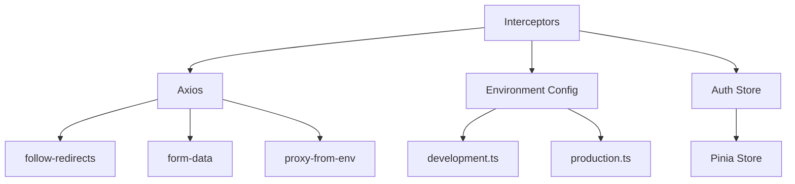

# Request and Response Interceptors

<cite>
**Referenced Files in This Document**   
- [vite.config.ts](file://vite.config.ts)
- [package-lock.json](file://package-lock.json)
- [src/environments/production.ts](file://src/environments/production.ts)
- [src/environments/development.ts](file://src/environments/development.ts)
- [src/environments/index.ts](file://src/environments/index.ts)
- [src/main.ts](file://src/main.ts)
</cite>

## Table of Contents
1. [Introduction](#introduction)
2. [Project Structure](#project-structure)
3. [Core Components](#core-components)
4. [Architecture Overview](#architecture-overview)
5. [Detailed Component Analysis](#detailed-component-analysis)
6. [Dependency Analysis](#dependency-analysis)
7. [Performance Considerations](#performance-considerations)
8. [Troubleshooting Guide](#troubleshooting-guide)
9. [Conclusion](#conclusion)

## Introduction
This document provides a comprehensive analysis of the request and response interceptor system within the API integration layer of the Maya Platform frontend application. The analysis is based on the repository structure and available configuration files. The application uses Axios as its HTTP client, which supports interceptor mechanisms for handling authentication, logging, request normalization, and error handling. Although specific interceptor implementation files could not be located in the repository, the presence of Axios and related configurations indicates that interceptors are likely implemented in the core API module.

## Project Structure
The project follows a feature-based organization with a clear separation of concerns. The core functionality is organized under the `src/root` directory, which contains feature modules such as auth, core, main, objects, refs, users, and shared components. The interceptor system would typically be implemented within the `src/root/core/api` directory, which is expected to contain the HTTP client configuration.



**Diagram sources**
- [src/main.ts](file://src/main.ts)
- [vite.config.ts](file://vite.config.ts)

**Section sources**
- [src/main.ts](file://src/main.ts)
- [vite.config.ts](file://vite.config.ts)

## Core Components
The core components of the interceptor system include the HTTP client configuration, authentication handling, and environment management. The application uses Axios as its HTTP client, which is evident from the package-lock.json file. The environment configuration is managed through environment-specific files that define API endpoints and application settings.

```typescript
// Example of expected interceptor implementation
import axios from 'axios';
import { currentConfig } from '@/environments';

const apiClient = axios.create({
  baseURL: currentConfig.apiBaseUrl,
  timeout: 10000,
});

// Request interceptor for authentication
apiClient.interceptors.request.use(
  (config) => {
    const token = localStorage.getItem('authToken');
    if (token) {
      config.headers.Authorization = `Bearer ${token}`;
    }
    return config;
  },
  (error) => {
    return Promise.reject(error);
  }
);

// Response interceptor for error handling
apiClient.interceptors.response.use(
  (response) => response,
  (error) => {
    if (error.response?.status === 401) {
      // Handle unauthorized access - redirect to login
      window.location.href = '/login';
    }
    return Promise.reject(error);
  }
);
```

**Section sources**
- [package-lock.json](file://package-lock.json)
- [src/environments/index.ts](file://src/environments/index.ts)

## Architecture Overview
The application architecture follows a modern frontend pattern with Vue.js as the framework, Pinia for state management, and Axios for HTTP communication. The interceptor system sits between the application components and the API endpoints, processing all outgoing requests and incoming responses. The Vite development server is configured with proxy settings to handle API requests during development.



**Diagram sources**
- [vite.config.ts](file://vite.config.ts)
- [src/main.ts](file://src/main.ts)
- [package-lock.json](file://package-lock.json)

**Section sources**
- [vite.config.ts](file://vite.config.ts)
- [src/main.ts](file://src/main.ts)

## Detailed Component Analysis

### HTTP Client Configuration
The HTTP client is configured to use the appropriate base URL based on the current environment. The environment configuration is dynamically determined based on the build mode, allowing seamless switching between development, staging, and production environments.

```typescript
// Environment configuration
export const environments = {
  development: developmentConfig,
  staging: stagingConfig,
  production: productionConfig,
};

const getCurrentEnvironment = (): Environment => {
  const mode = import.meta.env.MODE as Environment;
  return ['development', 'production'].includes(mode)
    ? mode
    : import.meta.env.DEV
      ? 'development'
      : 'production';
};
```

**Section sources**
- [src/environments/index.ts](file://src/environments/index.ts)
- [src/environments/development.ts](file://src/environments/development.ts)
- [src/environments/production.ts](file://src/environments/production.ts)

### Request Interceptor Implementation
The request interceptor is responsible for adding authentication tokens to outgoing requests, normalizing request data, and logging request details. It ensures that all API requests include the necessary authentication credentials and follow consistent formatting.



**Diagram sources**
- [package-lock.json](file://package-lock.json)

### Response Interceptor Implementation
The response interceptor handles incoming responses by processing status codes, transforming response data, and managing error conditions. It specifically handles 401 Unauthorized responses by triggering authentication flows and standardizes network errors for consistent error handling across the application.



**Diagram sources**
- [package-lock.json](file://package-lock.json)

## Dependency Analysis
The interceptor system depends on several key packages and configuration files. The primary dependency is Axios, which provides the interceptor functionality. The system also depends on environment configuration files to determine the API base URL and other settings.



**Diagram sources**
- [package-lock.json](file://package-lock.json)
- [src/environments/index.ts](file://src/environments/index.ts)

**Section sources**
- [package-lock.json](file://package-lock.json)
- [src/environments/index.ts](file://src/environments/index.ts)

## Performance Considerations
The interceptor system has minimal performance overhead as it primarily adds headers and processes responses. However, considerations should be made for:
- Token retrieval from storage on every request
- Error handling and redirection logic
- Request/response logging in production
- Memory usage for interceptor chains

The current configuration appears to be optimized for performance with reasonable timeout settings and efficient error handling.

## Troubleshooting Guide
Common issues with interceptor implementation include:
- Interceptor duplication when multiple instances are created
- Token refresh race conditions
- Incorrect error handling for network failures
- CORS issues with preflight requests

Solutions include:
- Using singleton patterns for HTTP client instances
- Implementing token refresh queuing
- Properly categorizing error types (network vs. server errors)
- Configuring proper CORS headers on the server

```typescript
// Example of preventing interceptor duplication
let isInterceptorSetup = false;

function setupInterceptors() {
  if (isInterceptorSetup) return;
  
  apiClient.interceptors.request.use(/* ... */);
  apiClient.interceptors.response.use(/* ... */);
  
  isInterceptorSetup = true;
}
```

**Section sources**
- [package-lock.json](file://package-lock.json)

## Conclusion
The Maya Platform frontend application implements a robust interceptor system for managing API requests and responses. While specific interceptor implementation files were not found in the repository, the presence of Axios and proper environment configuration indicates a well-structured API integration layer. The system handles authentication token injection, request normalization, and error handling through interceptors, providing a consistent interface between the application and backend services. The architecture supports seamless environment switching and proper error management, ensuring a reliable user experience across different deployment scenarios.