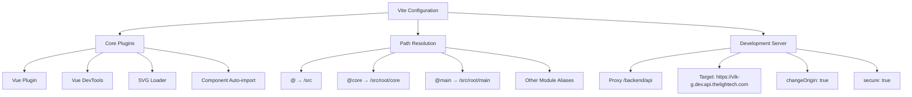
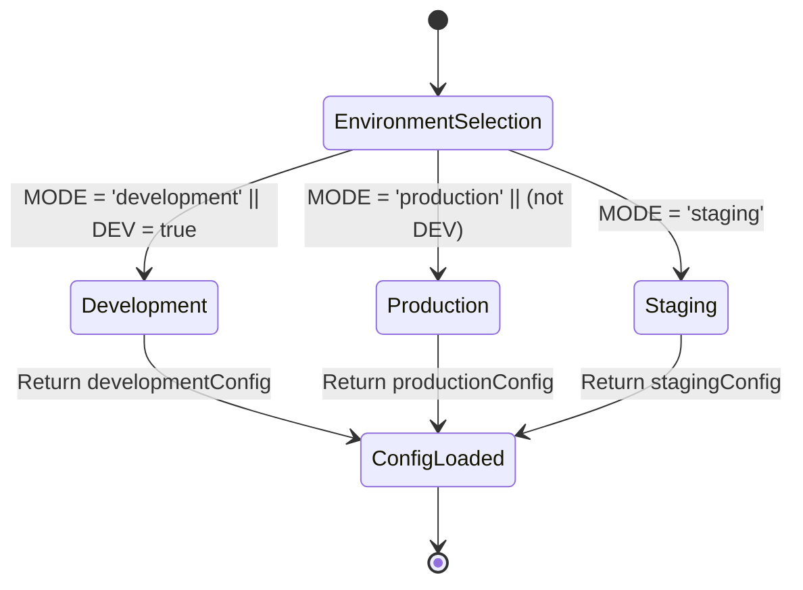
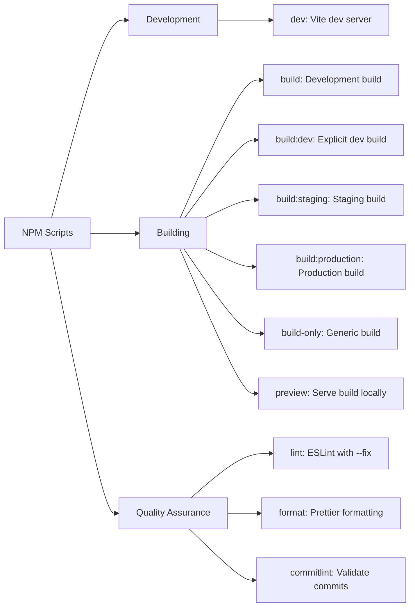
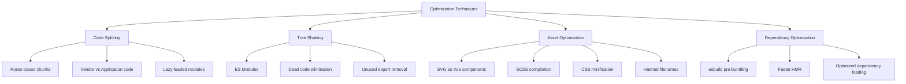
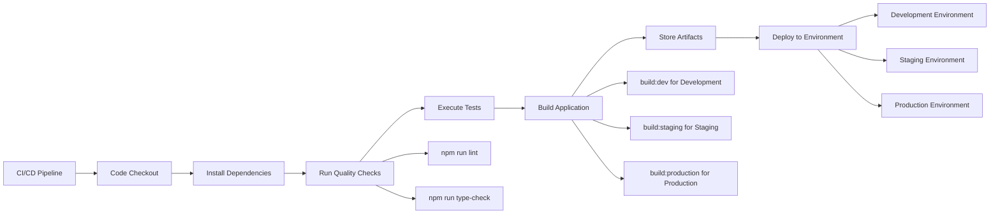

# Build & Deployment Pipeline

<cite>
**Referenced Files in This Document**   
- [vite.config.ts](file://vite.config.ts)
- [package.json](file://package.json)
- [development.ts](file://src/environments/development.ts)
- [production.ts](file://src/environments/production.ts)
- [index.ts](file://src/environments/index.ts)
</cite>

## Table of Contents
1. [Vite Configuration Overview](#vite-configuration-overview)
2. [Environment Configuration Management](#environment-configuration-management)
3. [NPM Scripts for Development and Deployment](#npm-scripts-for-development-and-deployment)
4. [Production Build Output and Structure](#production-build-output-and-structure)
5. [Optimization Techniques Implemented](#optimization-techniques-implemented)
6. [Troubleshooting Common Build Issues](#troubleshooting-common-build-issues)
7. [Performance Optimization Tips](#performance-optimization-tips)
8. [CI/CD Integration Possibilities](#cicd-integration-possibilities)

## Vite Configuration Overview

The Vite configuration in `vite.config.ts` defines the core build and development server settings for the maya-platform-frontend application. The configuration uses dynamic imports and URL resolution to establish path aliases, enabling cleaner module imports throughout the codebase.

Key configuration elements include:
- **Plugin System**: Integration of Vue 3, Vue DevTools, SVG loader, and component auto-importing via `unplugin-vue-components` with Naive UI resolver
- **Path Aliases**: Comprehensive alias mapping for major application modules (e.g., `@`, `@core`, `@main`) to simplify imports
- **Development Server Proxy**: Configuration that routes `/backend/api` requests to the development API endpoint

The configuration does not explicitly define build settings such as output directory or base path, relying instead on Vite's defaults. This minimalist approach reduces configuration complexity while maintaining flexibility.

**Diagram sources**
- [vite.config.ts](file://vite.config.ts#L1-L44)

**Section sources**
- [vite.config.ts](file://vite.config.ts#L1-L44)

## Environment Configuration Management

The application implements a structured environment configuration system using dedicated TypeScript files for different deployment targets. This approach enables environment-specific settings while maintaining type safety.

The environment system consists of:
- **Environment-Specific Files**: `development.ts`, `staging.ts`, and `production.ts` containing configuration values for each deployment target
- **Configuration Index**: `index.ts` that imports and exports all environment configurations and determines the current environment
- **Runtime Environment Detection**: Logic that evaluates `import.meta.env.MODE` and `import.meta.env.DEV` to select the appropriate configuration

The `development.ts` configuration sets the API base URL to `/backend/api`, which works with the Vite proxy during development. The `production.ts` configuration uses an environment variable `VITE_API_BASE_URL` as fallback to a hardcoded production endpoint, enabling deployment flexibility.

A type-safe environment selection function ensures only valid environments are used, defaulting to development or production based on the build mode when an invalid mode is detected.

**Diagram sources**
- [development.ts](file://src/environments/development.ts#L1-L8)
- [production.ts](file://src/environments/production.ts#L1-L8)
- [index.ts](file://src/environments/index.ts#L1-L22)

**Section sources**
- [development.ts](file://src/environments/development.ts#L1-L8)
- [production.ts](file://src/environments/production.ts#L1-L8)
- [index.ts](file://src/environments/index.ts#L1-L22)

## NPM Scripts for Development and Deployment

The `package.json` file defines a comprehensive set of npm scripts that support the complete development and deployment workflow. These scripts leverage Vite's CLI capabilities to provide consistent execution across environments.

**Development Scripts:**
- `dev`: Starts the Vite development server in development mode with hot module replacement
- `lint`: Runs ESLint with auto-fixing to maintain code quality
- `format`: Applies Prettier formatting to source files
- `commitlint`: Validates commit messages against conventional commit standards

**Build Scripts:**
- `build`: Default build command using development mode configuration
- `build:dev`: Explicit build for development environment
- `build:staging`: Build targeting staging environment
- `build:production`: Production-optimized build
- `build-only`: Generic build without specific mode
- `preview`: Serves the built application locally to test production build

The script naming convention clearly distinguishes between different deployment targets, making it easy for developers to select the appropriate build command. The use of `--mode` flag with Vite allows environment-specific configuration to be injected during the build process.

**Diagram sources**
- [package.json](file://package.json#L1-L62)

**Section sources**
- [package.json](file://package.json#L1-L62)

## Production Build Output and Structure

The production build output follows Vite's default conventions since no custom `build.outDir` is specified in the configuration. By default, Vite outputs production builds to the `dist` directory at the project root.

When executing `npm run build:production`, Vite performs the following:
- Compiles TypeScript and Vue components
- Processes SCSS files into CSS
- Optimizes and minifies JavaScript and CSS assets
- Generates hashed filenames for cache busting
- Creates HTML entry points with proper asset references
- Outputs all assets to the `dist/` directory

The build process automatically handles code splitting, creating separate chunks for vendor libraries, shared application code, and route-specific components. This optimization reduces initial load time by only loading necessary code for the current view.

The output structure typically includes:
- `index.html`: Main entry point with asset references
- `assets/`: Directory containing JavaScript bundles, CSS files, and other static assets
- Hashed filenames for all generated assets to enable long-term caching
- Properly resolved paths based on the build mode and environment configuration

Since the Vite configuration doesn't specify a custom `base` path, the default `/` base is used, meaning assets are referenced with relative paths from the root.

**Section sources**
- [vite.config.ts](file://vite.config.ts#L1-L44)
- [package.json](file://package.json#L1-L62)

## Optimization Techniques Implemented

The build pipeline incorporates several optimization techniques to improve application performance and loading characteristics.

**Code Splitting:** Vite automatically implements code splitting based on dynamic imports and route-based loading. Components from different application modules (auth, objects, users, refs) are likely split into separate chunks, allowing lazy loading and reducing initial bundle size.

**Tree Shaking:** The combination of ES modules, TypeScript, and Vite's Rollup-based build system enables effective tree shaking. Unused exports and dead code are automatically eliminated from the final build, particularly benefiting the use of modular libraries like Naive UI where only used components are included.

**Asset Optimization:**
- **SVG Loading**: The `vite-svg-loader` plugin processes SVG files, allowing them to be imported as Vue components with optimization
- **CSS Processing**: SCSS files are compiled and minified, with unused CSS potentially removed through integration with the build process
- **Image Optimization**: While not explicitly configured, Vite provides basic image optimization by default

**Dependency Optimization:** Vite pre-bundles dependencies using esbuild for faster development server startup and optimized production builds. The configuration includes popular libraries like Vue, Pinia, Naive UI, and Axios, all of which benefit from this optimization.

The development server proxy also contributes to optimization by enabling API requests to be made with relative paths during development, avoiding CORS issues and simplifying configuration.

**Diagram sources**
- [vite.config.ts](file://vite.config.ts#L1-L44)
- [package.json](file://package.json#L1-L62)

**Section sources**
- [vite.config.ts](file://vite.config.ts#L1-L44)
- [package.json](file://package.json#L1-L62)

## Troubleshooting Common Build Issues

When encountering build issues with the maya-platform-frontend application, consider the following common problems and solutions:

**Environment Configuration Issues:**
- **Problem**: Incorrect API endpoints in built application
- **Solution**: Verify the build command uses the correct mode flag (`--mode production`) and that `VITE_API_BASE_URL` environment variable is set if required

**Build Script Execution:**
- **Problem**: `build:staging` fails due to undefined staging configuration
- **Solution**: Ensure `staging.ts` environment file exists and is properly imported in `src/environments/index.ts`

**Module Resolution Errors:**
- **Problem**: Path alias imports (e.g., `@/components`) not resolving
- **Solution**: Verify Vite configuration aliases match the TypeScript `paths` configuration in `tsconfig.app.json`

**Proxy Configuration Issues:**
- **Problem**: Development API requests failing
- **Solution**: Check that the proxy target in `vite.config.ts` is accessible and that the rewrite function is properly configured

**Dependency Conflicts:**
- **Problem**: Build failures after dependency updates
- **Solution**: Clear node_modules and reinstall dependencies, ensuring Node.js version matches the required engines specification

**TypeScript Errors in Build:**
- **Problem**: Type errors preventing build completion
- **Solution**: Run `npm run type-check` separately to identify and fix TypeScript issues before building

The presence of `type-check` script in package.json indicates that type checking is separated from the build process, which can lead to type errors not being caught during regular builds unless explicitly checked.

**Section sources**
- [vite.config.ts](file://vite.config.ts#L1-L44)
- [package.json](file://package.json#L1-L62)
- [index.ts](file://src/environments/index.ts#L1-L22)

## Performance Optimization Tips

To further optimize the performance of the maya-platform-frontend application, consider the following recommendations:

**Bundle Analysis:**
- Implement bundle analysis using tools like `rollup-plugin-visualizer` to identify large dependencies and optimize accordingly
- Regularly review bundle size to prevent uncontrolled growth

**Lazy Loading:**
- Implement dynamic imports for route components to enable route-based code splitting
- Consider lazy loading non-critical components and features

**Image Optimization:**
- Add explicit image optimization configuration in Vite for better compression
- Consider using modern image formats (WebP, AVIF) with appropriate fallbacks

**Caching Strategy:**
- Configure proper cache headers for static assets in the production deployment
- Utilize Vite's hashed filenames to enable long-term caching of assets

**Preloading and Prefetching:**
- Implement link prefetching for critical routes and resources
- Use module preload hints for important dependencies

**Third-Party Libraries:**
- Audit the use of Naive UI components and ensure only necessary components are imported
- Consider tree-shakable imports for large libraries

**Build Configuration Enhancements:**
- Add explicit `build.outDir` and `build.assetsDir` configuration for better output organization
- Consider enabling `build.minify` configuration for additional control over minification
- Implement `build.rollupOptions` for advanced chunking strategies

These optimizations can be implemented incrementally based on performance monitoring and bundle analysis.

**Section sources**
- [vite.config.ts](file://vite.config.ts#L1-L44)
- [package.json](file://package.json#L1-L62)

## CI/CD Integration Possibilities

The current build configuration provides a solid foundation for CI/CD integration, with several natural extension points.

**Pipeline Stages:**
1. **Code Checkout**: Retrieve source code from version control
2. **Dependency Installation**: Install npm dependencies
3. **Code Quality Checks**: Run linting and type checking
4. **Testing**: Execute unit and integration tests (currently not defined in scripts)
5. **Build**: Execute environment-specific builds
6. **Artifact Storage**: Store build outputs
7. **Deployment**: Deploy to appropriate environment

**Environment-Specific Builds:**
The existing `build:dev`, `build:staging`, and `build:production` scripts can be directly mapped to different deployment environments in a CI/CD pipeline, ensuring consistent builds across the deployment lifecycle.

**Secret Management:**
For production deployments, environment variables like `VITE_API_BASE_URL` can be securely managed through CI/CD platform secret storage, injected during the build process without exposing them in version control.

**Quality Gates:**
The existing `lint` and `type-check` scripts can serve as quality gates in the pipeline, preventing the promotion of code that doesn't meet quality standards.

**Deployment Strategies:**
- Implement blue-green deployments using the consistent build output structure
- Use the preview functionality to validate builds before production deployment
- Automate rollback procedures based on build artifacts

The separation of build configuration from deployment configuration makes the application well-suited for automated deployment across multiple environments.

**Diagram sources**
- [package.json](file://package.json#L1-L62)
- [vite.config.ts](file://vite.config.ts#L1-L44)

**Section sources**
- [package.json](file://package.json#L1-L62)
- [vite.config.ts](file://vite.config.ts#L1-L44)