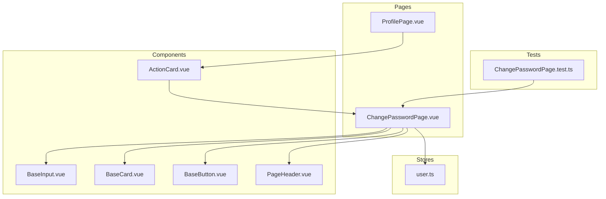
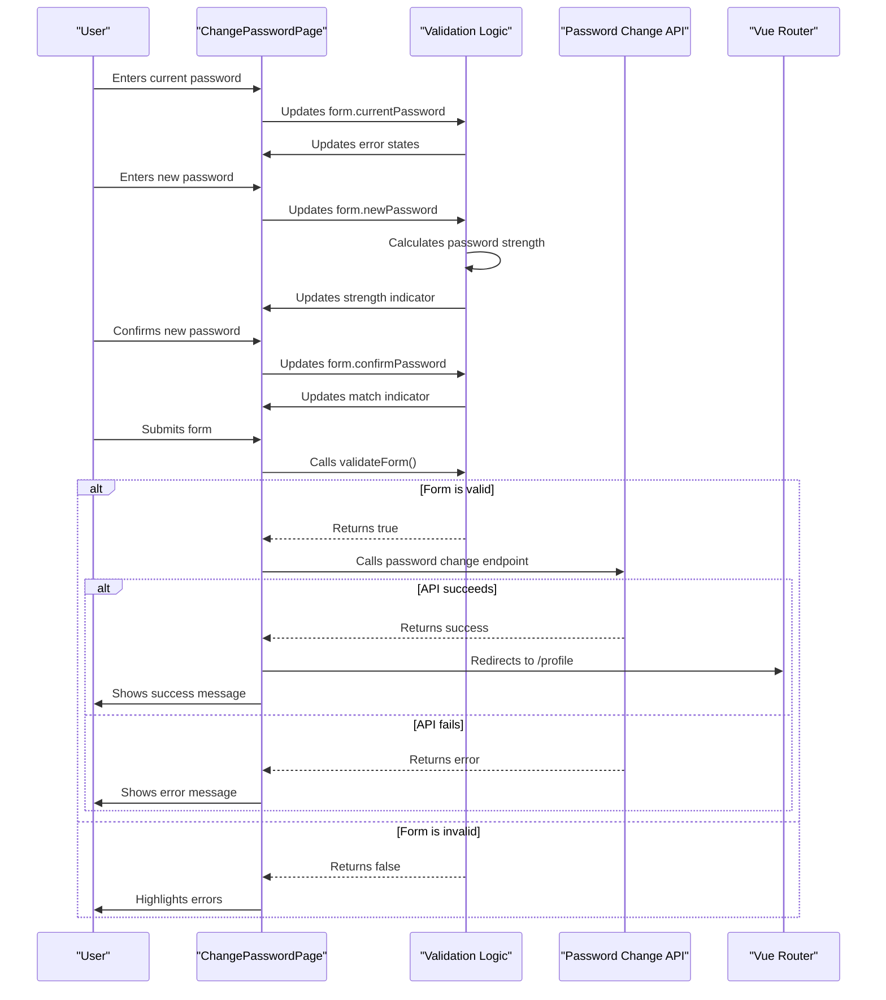
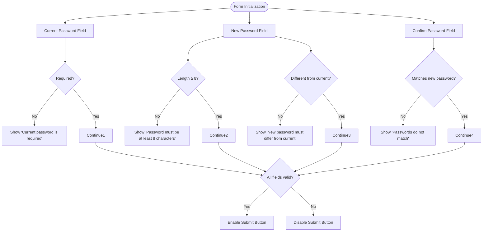
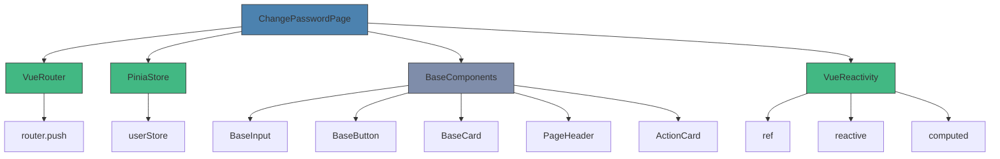
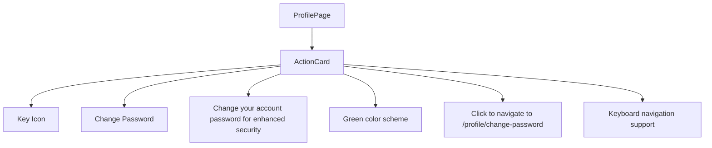

# Change Password Flow

<cite>
**Referenced Files in This Document**   
- [ChangePasswordPage.vue](file://src/pages/ChangePasswordPage.vue) - *Updated in recent commit*
- [ProfilePage.vue](file://src/pages/ProfilePage.vue) - *Updated in recent commit*
- [ActionCard.vue](file://src/components/ui/ActionCard.vue) - *Updated in recent commit*
- [user.ts](file://src/stores/user.ts) - *Updated in recent commit*
- [ChangePasswordPage.test.ts](file://tests/pages/ChangePasswordPage.test.ts) - *Updated in recent commit*
</cite>

## Update Summary
**Changes Made**   
- Added integration details between Profile Page and Change Password feature
- Updated documentation to reflect new ActionCard implementation for password change access
- Enhanced UI/UX guidelines with accessibility considerations for the ActionCard component
- Added new section on Profile Page integration and navigation flow
- Updated source references to include newly modified files

## Table of Contents
1. [Introduction](#introduction)
2. [Project Structure](#project-structure)
3. [Core Components](#core-components)
4. [Architecture Overview](#architecture-overview)
5. [Detailed Component Analysis](#detailed-component-analysis)
6. [Dependency Analysis](#dependency-analysis)
7. [Performance Considerations](#performance-considerations)
8. [Troubleshooting Guide](#troubleshooting-guide)
9. [Profile Page Integration](#profile-page-integration)
10. [Conclusion](#conclusion)

## Introduction
This document provides comprehensive documentation for the Change Password feature in the MayaWork frontend application. The feature allows authenticated users to update their account password with real-time validation, password strength assessment, and confirmation matching. The implementation includes client-side validation, user experience considerations, accessibility features, and integration with the application's routing and state management systems.

## Project Structure
The Change Password feature is implemented as a dedicated page component within the Vue.js application structure. The project follows a component-based architecture with clear separation of concerns between UI components, business logic, and state management.



**Diagram sources**
- [ChangePasswordPage.vue](file://src/pages/ChangePasswordPage.vue)
- [user.ts](file://src/stores/user.ts)
- [ChangePasswordPage.test.ts](file://tests/pages/ChangePasswordPage.test.ts)
- [ProfilePage.vue](file://src/pages/ProfilePage.vue)
- [ActionCard.vue](file://src/components/ui/ActionCard.vue)

**Section sources**
- [ChangePasswordPage.vue](file://src/pages/ChangePasswordPage.vue)

## Core Components
The Change Password feature consists of several core components that work together to provide a seamless user experience:

- **ChangePasswordPage.vue**: Main page component that orchestrates the password change flow
- **BaseInput.vue**: Reusable input component with error state visualization
- **BaseButton.vue**: Reusable button component with loading state support
- **PageHeader.vue**: Standardized header component for page titles and subtitles
- **BaseCard.vue**: Container component that provides visual grouping
- **ActionCard.vue**: Interactive card component for profile actions including password change

The implementation uses Vue 3's Composition API with TypeScript, providing type safety and reactivity through Vue's `ref`, `reactive`, and `computed` functions.

**Section sources**
- [ChangePasswordPage.vue](file://src/pages/ChangePasswordPage.vue)
- [ActionCard.vue](file://src/components/ui/ActionCard.vue)

## Architecture Overview
The Change Password feature follows a unidirectional data flow pattern typical of Vue.js applications. User interactions trigger updates to reactive state, which in turn updates the UI and validation states.



**Diagram sources**
- [ChangePasswordPage.vue](file://src/pages/ChangePasswordPage.vue)

## Detailed Component Analysis

### Change Password Page Analysis
The ChangePasswordPage.vue component implements a complete password change workflow with multiple validation layers and user feedback mechanisms.

#### Form Structure and Validation
The form contains three password fields with comprehensive client-side validation:



**Diagram sources**
- [ChangePasswordPage.vue](file://src/pages/ChangePasswordPage.vue)

#### Password Strength Logic
The password strength calculation uses a point-based system that evaluates multiple criteria:

```mermaid
classDiagram
class PasswordStrengthCalculator {
+form.newPassword string
+passwordStrength computed number
+passwordStrengthText computed string
+passwordStrengthWidth computed string
+passwordStrengthClasses computed string
+passwordStrengthTextClasses computed string
}
PasswordStrengthCalculator --> "Length ≥ 8" : +25 points
PasswordStrengthCalculator --> "Length ≥ 12" : +25 points
PasswordStrengthCalculator --> "Contains lowercase" : +12.5 points
PasswordStrengthCalculator --> "Contains uppercase" : +12.5 points
PasswordStrengthCalculator --> "Contains digits" : +12.5 points
PasswordStrengthCalculator --> "Contains special chars" : +12.5 points
```

The strength meter provides visual feedback with color-coded indicators:
- **Weak (0-24%)**: Red indicator, "Weak" text
- **Fair (25-49%)**: Yellow indicator, "Fair" text  
- **Good (50-74%)**: Blue indicator, "Good" text
- **Excellent (75-100%)**: Green indicator, "Excellent" text

**Section sources**
- [ChangePasswordPage.vue](file://src/pages/ChangePasswordPage.vue)

## Dependency Analysis
The Change Password feature depends on several core application components and services:



**Diagram sources**
- [ChangePasswordPage.vue](file://src/pages/ChangePasswordPage.vue)
- [user.ts](file://src/stores/user.ts)
- [ActionCard.vue](file://src/components/ui/ActionCard.vue)

## Performance Considerations
The Change Password implementation includes several performance optimizations:

- **Computed properties**: Password strength calculations are memoized using Vue's computed properties, ensuring they only recalculate when the new password value changes
- **Event delegation**: Form submission uses preventDefault() with a single submit handler rather than individual event listeners
- **Minimal re-renders**: The component uses Vue's reactivity system efficiently, with updates only occurring when relevant data changes
- **Async handling**: The submission process properly handles asynchronous operations with loading states to prevent duplicate submissions

The password strength calculation has O(1) time complexity as it performs a fixed number of regular expression tests regardless of password length.

## Troubleshooting Guide
Common issues and their solutions for the Change Password feature:

**Section sources**
- [ChangePasswordPage.vue](file://src/pages/ChangePasswordPage.vue)
- [ChangePasswordPage.test.ts](file://tests/pages/ChangePasswordPage.test.ts)

### Form Validation Issues
- **Symptom**: Submit button remains disabled even with valid input
- **Cause**: One of the validation rules is failing
- **Solution**: Check console for error messages and verify all three password fields meet requirements

### Password Strength Not Updating
- **Symptom**: Strength indicator doesn't change as user types
- **Cause**: Reactive dependency not properly tracked
- **Solution**: Ensure form.newPassword is properly bound to the input field

### Dark Theme Display Issues
- **Symptom**: Components don't properly display in dark mode
- **Cause**: Missing dark:* Tailwind CSS classes
- **Solution**: Verify all color classes have corresponding dark mode variants

### Test Failures
The existing test suite covers key functionality:
- Form validation rules
- Password strength calculation
- Password confirmation matching
- Dark theme styling
- Form reset functionality
- Submission flow

## Profile Page Integration
The Change Password feature is now integrated into the user profile page through a dedicated ActionCard component, providing users with easy access to password management functionality.

### Action Card Implementation
The ActionCard component on the ProfilePage.vue provides a visually distinct entry point for the password change functionality:



**Diagram sources**
- [ProfilePage.vue](file://src/pages/ProfilePage.vue)
- [ActionCard.vue](file://src/components/ui/ActionCard.vue)

### UI/UX Guidelines
The ActionCard implementation follows specific design principles:

- **Visual Design**: Uses green color theme to indicate security-related actions
- **Accessibility**: Fully keyboard navigable with proper ARIA labels and focus states
- **Interaction**: Smooth hover effects with scale transformation and shadow enhancement
- **Content**: Clear title and descriptive text explaining the action's purpose
- **Navigation**: Direct routing to the change password page with proper URL structure

### Accessibility Considerations
The ActionCard component includes several accessibility features:

- **Keyboard Navigation**: Supports both Enter and Space keys to trigger navigation
- **Focus Management**: Visible focus ring with proper contrast ratios
- **ARIA Attributes**: Proper role="button" and descriptive aria-label
- **Semantic HTML**: Proper heading structure and content hierarchy
- **Color Contrast**: Meets WCAG 2.1 AA standards for text and interactive elements

**Section sources**
- [ProfilePage.vue](file://src/pages/ProfilePage.vue)
- [ActionCard.vue](file://src/components/ui/ActionCard.vue)

## Conclusion
The Change Password feature provides a secure and user-friendly interface for updating account passwords. The implementation includes comprehensive validation, real-time feedback through password strength and confirmation indicators, and proper loading states during submission. While the current implementation uses simulated API calls (with TODO comments indicating where real integration should occur), the architecture is sound and ready for backend integration. Future improvements should replace the alert-based notifications with toast notifications and implement the actual password change API endpoint.

The component follows Vue 3 best practices with the Composition API, TypeScript typing, and proper separation of concerns. The test coverage is adequate for the current functionality, though additional tests for error handling scenarios would be beneficial once the real API integration is implemented. The recent enhancement integrating the feature with the ProfilePage via ActionCard improves user discoverability and maintains consistent UI patterns across the application.