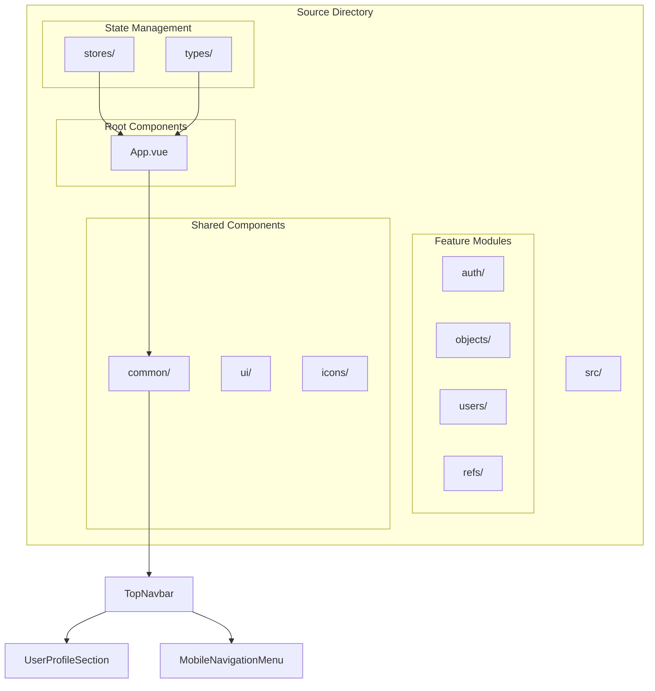
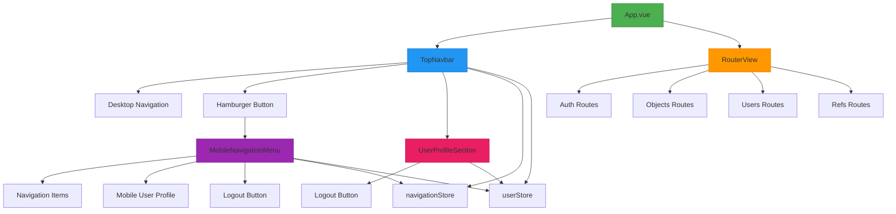
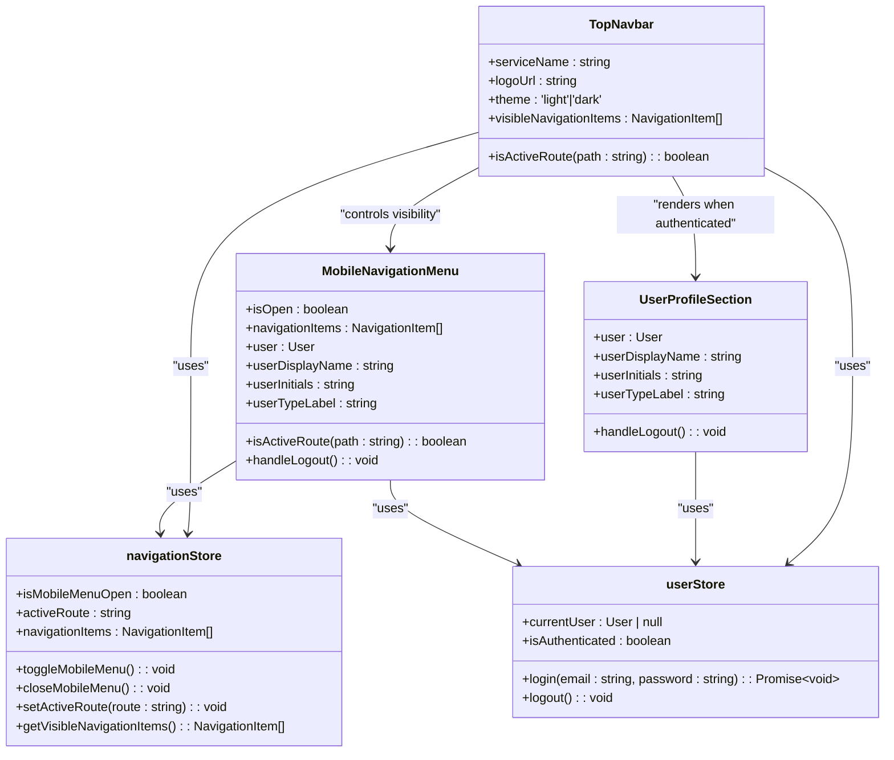
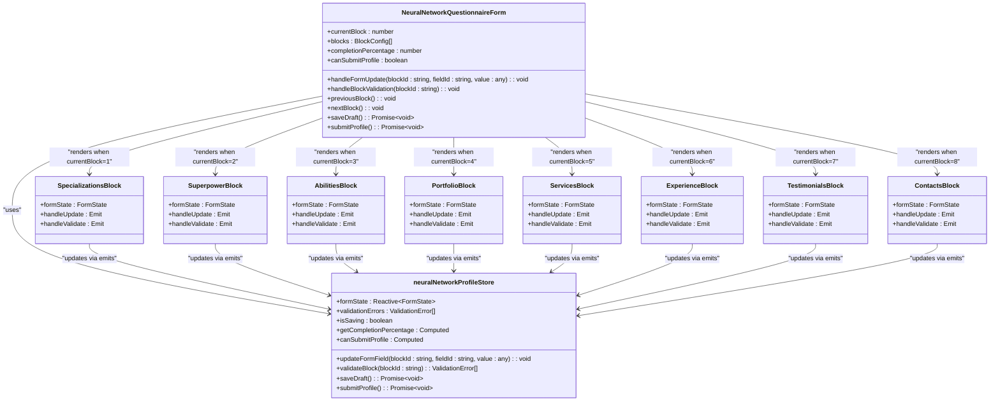
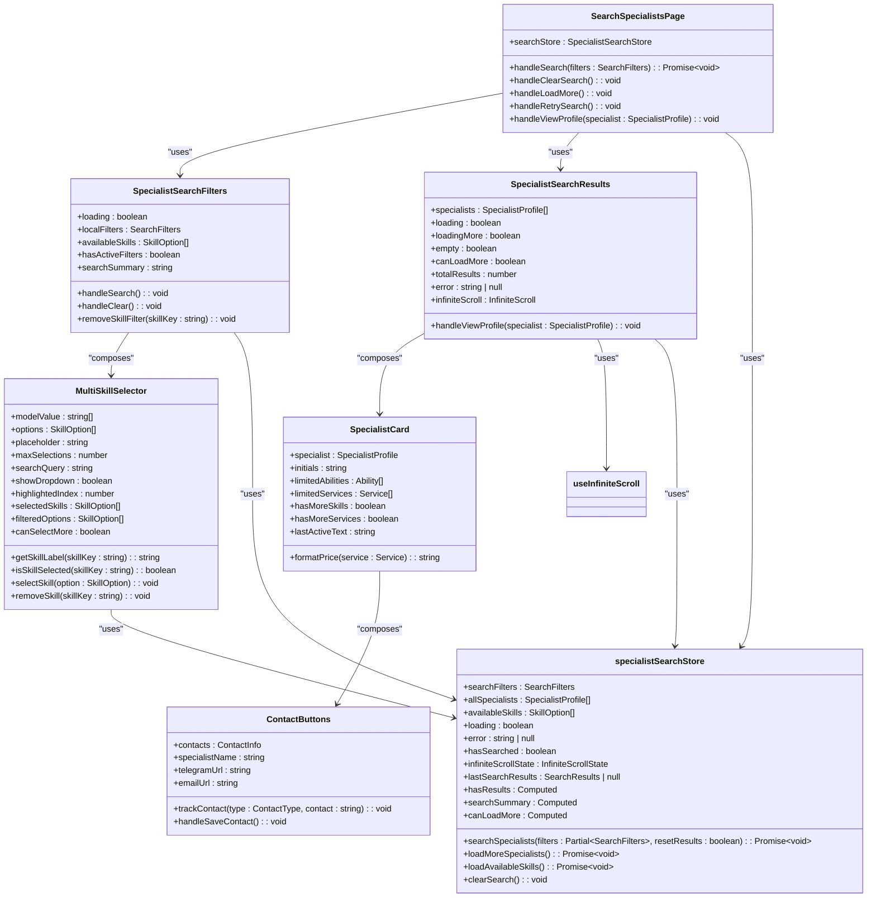

# Component Architecture

<cite>
**Referenced Files in This Document**   
- [App.vue](file://src/App.vue) - *Updated in recent commit*
- [TopNavbar.vue](file://src/components/common/TopNavbar.vue) - *Redesigned in recent commit*
- [UserProfileSection.vue](file://src/components/common/UserProfileSection.vue) - *Added in recent commit*
- [MobileNavigationMenu.vue](file://src/components/common/MobileNavigationMenu.vue) - *Added in recent commit*
- [navigation.ts](file://src/stores/navigation.ts) - *Updated navigation store*
- [user.ts](file://src/stores/user.ts) - *Updated user store with profile logic*
- [index.ts](file://src/types/index.ts) - *Updated type definitions for navigation and user*
- [FAQItem.vue](file://src/components/support/FAQItem.vue) - *Added in recent commit*
- [FAQSection.vue](file://src/components/support/FAQSection.vue) - *Added in recent commit*
- [SupportForm.vue](file://src/components/support/SupportForm.vue) - *Added in recent commit*
- [SupportHistorySection.vue](file://src/components/support/SupportHistorySection.vue) - *Added in recent commit*
- [SupportTicketItem.vue](file://src/components/support/SupportTicketItem.vue) - *Added in recent commit*
- [SupportPage.vue](file://src/pages/SupportPage.vue) - *Added in recent commit*
- [useSupportData.ts](file://src/composables/useSupportData.ts) - *Added in recent commit*
- [support.ts](file://src/services/support.ts) - *Added in recent commit*
- [BaseButton.vue](file://src/components/ui/BaseButton.vue) - *Enhanced for accessibility and dark mode*
- [PageHeader.vue](file://src/components/common/PageHeader.vue) - *Enhanced for accessibility and dark mode*
- [ActionCard.vue](file://src/components/ui/ActionCard.vue) - *Added in recent commit*
- [NeuralNetworkQuestionnaireForm.vue](file://src/components/profile/NeuralNetworkQuestionnaireForm.vue) - *Enhanced with modular blocks*
- [neural-network/*.vue](file://src/components/profile/neural-network/) - *Added specialized profile blocks*
- [ProfilePage.vue](file://src/pages/ProfilePage.vue) - *Enhanced with action cards*
- [neural-network-profile.ts](file://src/stores/neural-network-profile.ts) - *Enhanced with questionnaire state management*
- [SpecialistSearchFilters.vue](file://src/components/search/SpecialistSearchFilters.vue) - *Added in recent commit*
- [SpecialistSearchResults.vue](file://src/components/search/SpecialistSearchResults.vue) - *Added in recent commit*
- [SpecialistCard.vue](file://src/components/search/SpecialistCard.vue) - *Added in recent commit*
- [MultiSkillSelector.vue](file://src/components/search/MultiSkillSelector.vue) - *Added in recent commit*
- [ContactButtons.vue](file://src/components/search/ContactButtons.vue) - *Added in recent commit*
- [SearchSpecialistsPage.vue](file://src/pages/SearchSpecialistsPage.vue) - *Added in recent commit*
- [specialist-search.ts](file://src/stores/specialist-search.ts) - *Added in recent commit*
- [ProfileHeader.vue](file://src/components/profile/ProfileHeader.vue) - *Added in recent commit*
- [ProfileOverview.vue](file://src/components/profile/ProfileOverview.vue) - *Added in recent commit*
- [ContactSection.vue](file://src/components/profile/ContactSection.vue) - *Added in recent commit*
- [ExperienceSection.vue](file://src/components/profile/ExperienceSection.vue) - *Added in recent commit*
- [PortfolioSection.vue](file://src/components/profile/PortfolioSection.vue) - *Added in recent commit*
- [ServicesSection.vue](file://src/components/profile/ServicesSection.vue) - *Added in recent commit*
- [SpecializationsSection.vue](file://src/components/profile/SpecializationsSection.vue) - *Added in recent commit*
- [TestimonialsSection.vue](file://src/components/profile/TestimonialsSection.vue) - *Added in recent commit*
</cite>

## Update Summary
**Changes Made**   
- Added new section for Specialist Profile View components including ProfileHeader, ProfileOverview, ContactSection, ExperienceSection, PortfolioSection, ServicesSection, SpecializationsSection, and TestimonialsSection
- Updated component hierarchy diagrams to include the new profile view components
- Added documentation for the composition of the specialist profile view page using the new profile section components
- Integrated new profile components into the component relationships diagram
- Updated the Feature Module Organization section to reflect the expanded profile module
- Enhanced the Shared Components and Utilities section with details about the new profile components
- Added code examples and implementation details for the new profile components
- Updated the Detailed Component Analysis section with new subsections for each profile section component
- Added information about the props and data flow for the profile components
- Documented the responsive design and accessibility features of the new profile components
- Updated the Best Practices and Conventions section to include naming and structure patterns used in the new profile components

## Table of Contents
1. [Introduction](#introduction)
2. [Project Structure](#project-structure)
3. [Core Components](#core-components)
4. [Architecture Overview](#architecture-overview)
5. [Detailed Component Analysis](#detailed-component-analysis)
6. [Feature Module Organization](#feature-module-organization)
7. [Shared Components and Utilities](#shared-components-and-utilities)
8. [Composition API Usage](#composition-api-usage)
9. [Component Relationships Diagram](#component-relationships-diagram)
10. [Best Practices and Conventions](#best-practices-and-conventions)

## Introduction
This document provides a comprehensive overview of the component architecture for the maya-platform-frontend application. The application is built using Vue 3 with the Composition API and follows a modular, feature-based structure. The architecture centers around App.vue as the root component, with routing-driven feature loading and a clear separation between feature modules and shared UI components. This documentation explains the hierarchical structure, component composition patterns, and best practices followed in the codebase.

## Project Structure
The maya-platform-frontend application follows a well-organized, feature-based directory structure that promotes modularity and maintainability. The source code is located in the `src` directory, with the main application components residing in `src/components/common`. The architecture is divided into distinct feature modules (auth, objects, users, refs) and shared components that can be reused across the application.

The project uses Vue 3's Composition API with `<script setup>` syntax, Pinia for state management, and Vue Router for navigation. TypeScript is used throughout the codebase for type safety, and the application leverages Vite as the build tool with appropriate configuration for development and production environments.



**Diagram sources**
- [App.vue](file://src/App.vue)
- [TopNavbar.vue](file://src/components/common/TopNavbar.vue)
- [stores](file://src/stores)
- [types](file://src/types)

**Section sources**
- [App.vue](file://src/App.vue)
- [TopNavbar.vue](file://src/components/common/TopNavbar.vue)

## Core Components
The core components of the maya-platform-frontend application form the foundation of the user interface and application behavior. The root component, App.vue, serves as the entry point and orchestrates the main layout and routing. The application is initialized in main.ts, which sets up the Vue instance, Pinia store, and Vue Router.

The new navigation system is centered around the TopNavbar component, which provides responsive navigation with user profile integration. This component renders desktop navigation items and a user profile section when authenticated, or a login link when not authenticated. On mobile devices, it displays a hamburger menu that triggers the MobileNavigationMenu component.

The MobileNavigationMenu component provides a full-screen navigation panel on mobile devices, containing navigation links and user profile information. It uses the navigation store to manage its open/closed state and the user store to display user information and handle logout functionality.

The UserProfileSection component displays user information including avatar, name, and user type. It provides a logout button that triggers the user store's logout action and redirects to the login page. The component has been enhanced with a dropdown menu on desktop that includes options for changing password and logging out, with improved accessibility features including proper ARIA attributes and keyboard navigation support.

**Section sources**
- [App.vue](file://src/App.vue)
- [TopNavbar.vue](file://src/components/common/TopNavbar.vue)
- [UserProfileSection.vue](file://src/components/common/UserProfileSection.vue)
- [MobileNavigationMenu.vue](file://src/components/common/MobileNavigationMenu.vue)
- [navigation.ts](file://src/stores/navigation.ts)
- [user.ts](file://src/stores/user.ts)

## Architecture Overview
The maya-platform-frontend application follows a modular architecture with a clear separation of concerns. The application is structured around feature modules, each responsible for a specific domain of functionality. This approach promotes code reuse, simplifies testing, and makes the codebase easier to navigate and maintain.

The component hierarchy starts with App.vue as the root component, which renders the TopNavbar and router view. The TopNavbar component provides responsive navigation with different layouts for desktop and mobile devices. On desktop, navigation items are displayed horizontally with a user profile section on the right. On mobile, a hamburger menu button appears, which opens the MobileNavigationMenu component when clicked.

State management is handled by Pinia, with the navigation store managing the mobile menu state and active route, and the user store managing authentication state and user profile information. The TopNavbar component uses both stores to determine what to display based on authentication status and navigation state.



**Diagram sources**
- [App.vue](file://src/App.vue)
- [TopNavbar.vue](file://src/components/common/TopNavbar.vue)
- [MobileNavigationMenu.vue](file://src/components/common/MobileNavigationMenu.vue)
- [UserProfileSection.vue](file://src/components/common/UserProfileSection.vue)
- [navigation.ts](file://src/stores/navigation.ts)
- [user.ts](file://src/stores/user.ts)

## Detailed Component Analysis

### App.vue Analysis
The App.vue component serves as the root component of the maya-platform-frontend application. It is responsible for setting up the main application layout and integrating the routing system. The component uses Vue 3's Composition API with `<script setup>` syntax, which provides a more concise and reactive way to define component logic.

The template structure consists of a top navigation bar and a content area where the router view is rendered. The component imports and uses the TopNavbar from the common components directory, demonstrating the composition pattern used throughout the application.

```vue
<script setup lang="ts">
// App.vue uses Composition API with <script setup>
// This allows for a more concise syntax and better tree-shaking
</script>

<template>
  <div id="app" class="min-h-screen bg-gray-50 dark:bg-gray-900">
    <TopNavbar />
    <RouterView />
  </div>
</template>
```

**Section sources**
- [App.vue](file://src/App.vue)

### TopNavbar Analysis
The TopNavbar component is a key UI element in the maya-platform-frontend application, providing responsive navigation and user profile management. The component is used by the App.vue component to render the application's top navigation bar.

The component uses the navigation store to manage the mobile menu state and the user store to determine authentication status and user information. It displays different content based on the screen size and authentication status.

On desktop (large screens), it displays navigation items horizontally and shows the UserProfileSection when authenticated or a login link when not authenticated. On mobile (small screens), it displays a hamburger menu button that opens the MobileNavigationMenu component.



**Diagram sources**
- [TopNavbar.vue](file://src/components/common/TopNavbar.vue)
- [UserProfileSection.vue](file://src/components/common/UserProfileSection.vue)
- [MobileNavigationMenu.vue](file://src/components/common/MobileNavigationMenu.vue)
- [navigation.ts](file://src/stores/navigation.ts)
- [user.ts](file://src/stores/user.ts)

### UserProfileSection Analysis
The UserProfileSection component displays user information and provides logout functionality. It is used in both the TopNavbar (on desktop) and MobileNavigationMenu (on mobile) components.

The component displays the user's avatar (if available), name, and user type (specialist or client). It also provides a dropdown menu with options to change password or log out. The dropdown is accessible via mouse click or keyboard navigation and closes when clicking outside or pressing the Escape key.

The component uses computed properties to derive the user's display name, initials, and type label from the user object passed as a prop. This ensures that the displayed information is always up-to-date when the user data changes.

Accessibility features include proper ARIA attributes (aria-haspopup, aria-expanded, aria-label), keyboard navigation support, and focus management. The component also handles user prop changes reactively, updating the display when the user object changes.

```vue
<script setup lang="ts">
// UserProfileSection.vue uses Composition API with <script setup>
// Props are used to receive user data from parent components
// Computed properties are used to derive display values from user data
// The component emits no events but calls store actions directly
</script>
```

**Section sources**
- [UserProfileSection.vue](file://src/components/common/UserProfileSection.vue)
- [user.ts](file://src/stores/user.ts)

### MobileNavigationMenu Analysis
The MobileNavigationMenu component provides a full-screen navigation panel for mobile devices. It is conditionally rendered based on the isMobileMenuOpen state from the navigation store.

The component displays a list of navigation items, user profile information, and a logout button. It uses transitions to provide smooth opening and closing animations. When a navigation item is clicked or the overlay is tapped, the component emits a close event that is handled by the TopNavbar component.

The component uses the same user information and logout functionality as the UserProfileSection, ensuring consistency between desktop and mobile user interfaces.

```vue
<script setup lang="ts">
// MobileNavigationMenu.vue uses Composition API with <script setup>
// Props are used to receive isOpen state, navigation items, and user data
// Emits are used to communicate close requests to the parent component
// The component uses the user store for logout functionality
</script>
```

**Section sources**
- [MobileNavigationMenu.vue](file://src/components/common/MobileNavigationMenu.vue)
- [user.ts](file://src/stores/user.ts)

### Support Components Analysis
The newly implemented support component suite provides a comprehensive support system for users. The components are organized in the `src/components/support` directory and include FAQ management, ticket history, and support request functionality.

The FAQSection component provides a searchable and filterable interface for frequently asked questions. Users can search by keyword, filter by category, and view only popular questions. Each FAQ item can be expanded to view the full answer and provide feedback on its helpfulness.

The SupportHistorySection component displays a user's recent support tickets with status indicators, priority levels, and message counts. It includes summary statistics for open, in-progress, and resolved tickets, as well as quick filter actions.

The SupportForm component allows users to submit new support requests with validation and success/error states. The form includes character counting, validation feedback, and loading states during submission.

The SupportTicketItem component represents an individual support ticket in the history list, displaying key information including ticket ID, creation date, status, priority, message count, and last updated time.

The components work together through the SupportPage.vue, which composes all support functionality into a single interface. The useSupportData composable manages the shared state and API interactions for all support components.

```mermaid
classDiagram
class FAQSection {
+faqs : FAQ[]
+loading : boolean
+error : string | null
+searchQuery : string
+selectedCategory : string
+showPopularOnly : boolean
+filteredFAQs : FAQ[]
+handleToggleFAQ(faqId : string) : void
+handleFeedback(faqId : string, isHelpful : boolean) : void
}
class FAQItem {
+faq : FAQ
+expanded : boolean
+formattedAnswer : string
+handleToggle() : void
+handleHelpful(isHelpful : boolean) : void
}
class SupportHistorySection {
+tickets : SupportTicket[]
+loading : boolean
+error : string | null
+openTicketsCount : number
+inProgressTicketsCount : number
+resolvedTicketsCount : number
+handleTicketClick(ticket : SupportTicket) : void
+handleFilter(status : string) : void
}
class SupportTicketItem {
+ticket : SupportTicket
+shortTicketId : string
+truncatedMessage : string
+handleClick() : void
}
class SupportForm {
+visible : boolean
+loading : boolean
+error : string | null
+formData : { message : string }
+validationErrors : { message : string }
+showSuccessMessage : boolean
+isFormValid : boolean
+handleSubmit() : Promise~void~
+handleCancel() : void
}
class useSupportData {
+faqs : FAQ[]
+recentTickets : SupportTicket[]
+loading : { faqs : boolean, tickets : boolean, submission : boolean }
+error : string | null
+refreshFAQs() : Promise~void~
+refreshTickets() : Promise~void~
+submitTicket(message : string) : Promise~void~
+toggleFAQ(faqId : string) : void
+isFAQExpanded(faqId : string) : boolean
+clearErrors() : void
+setCurrentTicket(ticket : SupportTicket) : void
}
class SupportPage {
+showSupportForm : boolean
+handleToggleSupportForm() : void
+handleSubmitSupportRequest(message : string) : void
+handleCancelSupportForm() : void
}
FAQSection --> FAQItem : "composes"
FAQSection --> useSupportData : "uses"
SupportHistorySection --> SupportTicketItem : "composes"
SupportHistorySection --> useSupportData : "uses"
SupportForm --> useSupportData : "uses"
SupportPage --> FAQSection : "uses"
SupportPage --> SupportHistorySection : "uses"
SupportPage --> SupportForm : "uses"
SupportPage --> useSupportData : "uses"
```

**Diagram sources**
- [FAQSection.vue](file://src/components/support/FAQSection.vue)
- [FAQItem.vue](file://src/components/support/FAQItem.vue)
- [SupportHistorySection.vue](file://src/components/support/SupportHistorySection.vue)
- [SupportTicketItem.vue](file://src/components/support/SupportTicketItem.vue)
- [SupportForm.vue](file://src/components/support/SupportForm.vue)
- [SupportPage.vue](file://src/pages/SupportPage.vue)
- [useSupportData.ts](file://src/composables/useSupportData.ts)

**Section sources**
- [FAQSection.vue](file://src/components/support/FAQSection.vue)
- [FAQItem.vue](file://src/components/support/FAQItem.vue)
- [SupportHistorySection.vue](file://src/components/support/SupportHistorySection.vue)
- [SupportTicketItem.vue](file://src/components/support/SupportTicketItem.vue)
- [SupportForm.vue](file://src/components/support/SupportForm.vue)
- [SupportPage.vue](file://src/pages/SupportPage.vue)
- [useSupportData.ts](file://src/composables/useSupportData.ts)

### ActionCard Analysis
The ActionCard component is a reusable UI element used to present user actions in a visually appealing card format. It is prominently used in the ProfilePage.vue to display profile-related actions such as questionnaire completion, password change, and logout.

The component supports multiple color themes (purple, green, red) and includes an icon, title, description, and action text. It can either navigate to a route or emit a click event when interacted with. The component has been enhanced with accessibility features including proper ARIA labels, keyboard navigation support (Enter and Space keys), and focus management.

A key enhancement is the support for questionnaire status visualization, including moderation status badges (draft, pending, approved, rejected) and completion progress bars. These features are particularly important for the neural network specialist questionnaire, providing users with clear feedback on their profile completion status.

The component uses computed properties to determine appropriate styling based on the color theme and moderation status, ensuring visual consistency across the application.

```vue
<script setup lang="ts">
// ActionCard.vue uses Composition API with <script setup>
// Props define the card's appearance, behavior, and status indicators
// Emits click events for action cards that don't navigate to routes
// Uses router for navigation when a route is specified
</script>
```

**Section sources**
- [ActionCard.vue](file://src/components/ui/ActionCard.vue)
- [ProfilePage.vue](file://src/pages/ProfilePage.vue)

### NeuralNetworkQuestionnaireForm Analysis
The NeuralNetworkQuestionnaireForm component provides a multi-step questionnaire for neural network specialists to complete their professional profiles. The form is organized into eight sequential blocks, each focusing on a specific aspect of the specialist's expertise.

The component features a progress header that displays the overall completion percentage and provides navigation buttons for each block. Users can navigate between blocks, with validation occurring when moving to the next block. The form supports auto-saving of drafts every two seconds of inactivity, with a visual indicator showing the last save time.

Each block is implemented as a separate component (SpecializationsBlock, SuperpowerBlock, etc.) that is conditionally rendered based on the current block index. This modular approach allows for independent development and testing of each questionnaire section.

Validation is handled at the block level, with error messages displayed at the bottom of the form if validation fails. The store manages the validation state for each block, with completed blocks indicated by a green checkmark in the navigation.

The form can be saved as a draft or submitted for review when all required blocks are completed. Required blocks include Specializations, Superpower, Abilities, and Contacts.



**Diagram sources**
- [NeuralNetworkQuestionnaireForm.vue](file://src/components/profile/NeuralNetworkQuestionnaireForm.vue)
- [neural-network/*.vue](file://src/components/profile/neural-network/)
- [neural-network-profile.ts](file://src/stores/neural-network-profile.ts)

**Section sources**
- [NeuralNetworkQuestionnaireForm.vue](file://src/components/profile/NeuralNetworkQuestionnaireForm.vue)
- [neural-network/*.vue](file://src/components/profile/neural-network/)
- [neural-network-profile.ts](file://src/stores/neural-network-profile.ts)

### ProfilePage Analysis
The ProfilePage.vue component serves as the user's profile dashboard, displaying personal information and providing access to profile management actions. The page is structured into two main sections: user information and profile actions.

The user information section displays the user's name, email, user type, and account status using a definition list format. User type and status are displayed with colored badges that provide visual indication of the user's role and account status.

The profile actions section uses the ActionCard component to present three key actions: questionnaire completion, password change, and logout. For specialists, the questionnaire action card displays the current completion percentage and moderation status, providing contextual information about their profile status.

The component integrates with both the user store and neural network profile store to display relevant information. When the component mounts, it initializes the neural network profile store, loading any existing questionnaire data or creating a new form state.

The questionnaire action text is dynamically determined based on the current status (draft, pending, approved, rejected) and completion percentage, providing users with clear guidance on the next steps for their profile.

```vue
<script setup lang="ts">
// ProfilePage.vue uses Composition API with <script setup>
// Integrates with userStore and neuralNetworkProfileStore
// Uses ActionCard components for profile actions
// Computes questionnaire status and action text based on store state
</script>
```

**Section sources**
- [ProfilePage.vue](file://src/pages/ProfilePage.vue)
- [ActionCard.vue](file://src/components/ui/ActionCard.vue)
- [user.ts](file://src/stores/user.ts)
- [neural-network-profile.ts](file://src/stores/neural-network-profile.ts)

### Specialist Profile View Components Analysis
The specialist profile view feature provides a comprehensive interface for viewing specialist profiles. The components are organized in the `src/components/profile` directory and include profile header, overview, contact, experience, portfolio, services, specializations, and testimonials sections.

The ProfileHeader component displays the specialist's avatar, name, superpower, status, and contact buttons in a visually prominent header section with a gradient background. It uses the ContactButtons component to provide contact options and displays the specialist's availability status with appropriate visual indicators.

The ProfileOverview component provides a summary of the specialist's profile with key statistics, skills overview, services preview, and quick action buttons. It displays counts of specializations, abilities, and services, and allows users to expand to see all skills and services. The component includes quick action buttons that scroll to specific sections of the profile.

The ContactSection component displays the specialist's contact information (Telegram, email, website) with action buttons for contacting or copying the information. Each contact method is displayed with an appropriate icon and provides hover actions for quick access.

The ExperienceSection component displays the specialist's work experience with client names, tasks, and results. Each experience entry is presented in a card format with clear typography.

The PortfolioSection component displays the specialist's portfolio cases with titles, descriptions, and results. The cases are presented in a responsive grid layout.

The ServicesSection component displays the specialist's services with names, descriptions, and prices formatted according to the price type (hourly, project, fixed, negotiable). The prices are displayed with appropriate currency formatting.

The SpecializationsSection component displays the specialist's specializations and abilities in a structured format with icons and descriptions. Specializations are displayed as cards with checkmark icons, while abilities are displayed as tags.

The TestimonialsSection component displays client testimonials with client names, positions, text, and star ratings. Each testimonial is presented in a card format with proper spacing and typography.

These components are composed in the SpecialistProfileViewPage.vue, which serves as the main interface for viewing specialist profiles. The page integrates all profile components and manages the profile data through the specialist-profile-view store.

```mermaid
classDiagram
class ProfileHeader {
+basicInfo : BasicInfo
+contacts : ContactInfo
+userInitials : string
+lastActiveText : string
+statusClasses : string
+statusDotClasses : string
+statusBadgeClasses : string
+statusText : string
}
class ProfileOverview {
+basicInfo : BasicInfo
+specializations : string[]
+abilities : string[]
+services : ServiceDetails[]
+showAllSkills : boolean
+showAllServices : boolean
+topSpecializations : string[]
+topAbilities : string[]
+topServices : ServiceDetails[]
+hasMoreSkills : boolean
+hasMoreServices : boolean
+remainingSkillsCount : number
+remainingServicesCount : number
+formatPrice(service : ServiceDetails) : string
+scrollToSection(sectionId : string) : void
}
class ContactSection {
+contacts : ContactInfo
+specialistName : string
+showTelegramActions : boolean
+showEmailActions : boolean
+showWebsiteActions : boolean
+telegramUrl : string
+emailUrl : string
+trackContact(type : 'telegram'|'email'|'website') : void
+copyToClipboard(text : string) : void
}
class ExperienceSection {
+experience : ExperienceEntry[]
}
class PortfolioSection {
+portfolio : PortfolioCase[]
+specialistName : string
}
class ServicesSection {
+services : ServiceDetails[]
+specialistName : string
+contacts : ContactInfo
+formatPrice(service : ServiceDetails) : string
}
class SpecializationsSection {
+specializations : string[]
+abilities : string[]
+getSpecializationDescription(specialization : string) : string
}
class TestimonialsSection {
+testimonials : TestimonialCollection
}
class SpecialistProfileViewPage {
+profileData : SpecialistProfile
+loading : boolean
+error : string | null
+handleContact(type : ContactType, contact : string) : void
+handleCopy(text : string) : void
+scrollToSection(sectionId : string) : void
}
class specialistProfileViewStore {
+profileData : SpecialistProfile | null
+loading : boolean
+error : string | null
+fetchProfile(specialistId : string) : Promise~void~
+resetProfile() : void
}
ProfileHeader --> ContactButtons : "composes"
ProfileOverview --> ActionButton : "composes"
ContactSection --> ContactButtons : "uses for header variant"
SpecialistProfileViewPage --> ProfileHeader : "uses"
SpecialistProfileViewPage --> ProfileOverview : "uses"
SpecialistProfileViewPage --> ContactSection : "uses"
SpecialistProfileViewPage --> ExperienceSection : "uses"
SpecialistProfileViewPage --> PortfolioSection : "uses"
SpecialistProfileViewPage --> ServicesSection : "uses"
SpecialistProfileViewPage --> SpecializationsSection : "uses"
SpecialistProfileViewPage --> TestimonialsSection : "uses"
SpecialistProfileViewPage --> specialistProfileViewStore : "uses"
```



**Diagram sources**
- [ProfileHeader.vue](file://src/components/profile/ProfileHeader.vue)
- [ProfileOverview.vue](file://src/components/profile/ProfileOverview.vue)
- [ContactSection.vue](file://src/components/profile/ContactSection.vue)
- [ExperienceSection.vue](file://src/components/profile/ExperienceSection.vue)
- [PortfolioSection.vue](file://src/components/profile/PortfolioSection.vue)
- [ServicesSection.vue](file://src/components/profile/ServicesSection.vue)
- [SpecializationsSection.vue](file://src/components/profile/SpecializationsSection.vue)
- [TestimonialsSection.vue](file://src/components/profile/TestimonialsSection.vue)
- [SpecialistProfileViewPage.vue](file://src/pages/SpecialistProfileViewPage.vue)
- [specialist-profile-view.ts](file://src/stores/specialist-profile-view.ts)

**Section sources**
- [ProfileHeader.vue](file://src/components/profile/ProfileHeader.vue)
- [ProfileOverview.vue](file://src/components/profile/ProfileOverview.vue)
- [ContactSection.vue](file://src/components/profile/ContactSection.vue)
- [ExperienceSection.vue](file://src/components/profile/ExperienceSection.vue)
- [PortfolioSection.vue](file://src/components/profile/PortfolioSection.vue)
- [ServicesSection.vue](file://src/components/profile/ServicesSection.vue)
- [SpecializationsSection.vue](file://src/components/profile/SpecializationsSection.vue)
- [TestimonialsSection.vue](file://src/components/profile/TestimonialsSection.vue)
- [SpecialistProfileViewPage.vue](file://src/pages/SpecialistProfileViewPage.vue)
- [specialist-profile-view.ts](file://src/stores/specialist-profile-view.ts)

### Specialist Search Components Analysis
The specialist search feature provides a comprehensive interface for finding and contacting specialists. The components are organized in the `src/components/search` directory and include search filters, results display, and specialist interaction functionality.

The SpecialistSearchFilters component provides a form interface for searching specialists by query and skills. It integrates with the MultiSkillSelector component for skill selection and displays active filters with removal options. The component uses the specialist-search store to manage search state and available skills.

The SpecialistSearchResults component displays search results with loading, empty, and error states. It implements infinite scroll functionality through the useInfiniteScroll composable and displays specialists using the SpecialistCard component. The component handles pagination and result loading through the specialist-search store.

The SpecialistCard component displays key information about a specialist including avatar, name, superpower, specializations, abilities, services, and activity status. It provides a consistent visual representation of specialists in search results and supports responsive design.

The MultiSkillSelector component provides a searchable dropdown interface for selecting multiple skills. It supports keyboard navigation, highlights selected skills, and enforces a maximum selection limit. The component uses a modelValue prop for two-way binding and emits update events.

The ContactButtons component provides contact methods for specialists including Telegram, email, website, and save functionality. Each contact method has appropriate URL formatting and tracking capabilities. The component supports responsive layout on mobile devices.

These components are composed in the SearchSpecialistsPage.vue, which serves as the main interface for specialist search. The page integrates all search components and manages the search workflow through the specialist-search store.



**Diagram sources**
- [SpecialistSearchFilters.vue](file://src/components/search/SpecialistSearchFilters.vue)
- [SpecialistSearchResults.vue](file://src/components/search/SpecialistSearchResults.vue)
- [SpecialistCard.vue](file://src/components/search/SpecialistCard.vue)
- [MultiSkillSelector.vue](file://src/components/search/MultiSkillSelector.vue)
- [ContactButtons.vue](file://src/components/search/ContactButtons.vue)
- [SearchSpecialistsPage.vue](file://src/pages/SearchSpecialistsPage.vue)
- [specialist-search.ts](file://src/stores/specialist-search.ts)

**Section sources**
- [SpecialistSearchFilters.vue](file://src/components/search/SpecialistSearchFilters.vue)
- [SpecialistSearchResults.vue](file://src/components/search/SpecialistSearchResults.vue)
- [SpecialistCard.vue](file://src/components/search/SpecialistCard.vue)
- [MultiSkillSelector.vue](file://src/components/search/MultiSkillSelector.vue)
- [ContactButtons.vue](file://src/components/search/ContactButtons.vue)
- [SearchSpecialistsPage.vue](file://src/pages/SearchSpecialistsPage.vue)
- [specialist-search.ts](file://src/stores/specialist-search.ts)

## Feature Module Organization
The maya-platform-frontend application organizes its functionality into distinct feature modules, each following a consistent structure. The main feature modules are auth, objects, users, and refs, each containing components, pages, routing configuration, and state stores specific to their domain.

Each feature module follows the same organizational pattern:
- components/: Reusable components specific to the feature
- pages/: Page-level components that represent full views
- routing/: Route configuration for the feature
- store/: Pinia store for managing feature-specific state

This consistent structure makes it easy to navigate the codebase and understand the responsibilities of each module. The auth module handles authentication and authorization, the objects module manages object-related functionality, the users module handles user management, and the refs module manages reference data such as customers.

The feature modules are loaded dynamically through the routing system, which improves application performance by only loading the code necessary for the current view. This lazy loading approach reduces the initial bundle size and improves the application's startup time.

**Section sources**
- [auth](file://src/pages/LoginPage.vue)
- [objects](file://src/pages/DashboardPage.vue)
- [users](file://src/pages/ProfilePage.vue)
- [refs](file://src/pages/SearchSpecialistsPage.vue)

## Shared Components and Utilities
The components directory in maya-platform-frontend contains reusable UI components that are used across multiple feature modules. This promotes code reuse and ensures a consistent user experience throughout the application.

The common subdirectory contains navigation-related components such as TopNavbar, MobileNavigationMenu, and UserProfileSection. These components work together to provide a cohesive navigation experience across desktop and mobile devices.

The ui subdirectory contains basic UI components such as BaseButton, BaseCard, BaseInput, BaseModal, and LoadingOverlay. These components provide a consistent look and feel across the application and can be easily customized through props.

The icons subdirectory contains SVG icon components that can be easily imported and used throughout the application. Each icon component accepts a className prop to control its size and color.

The stores directory contains Pinia stores for managing application state. The navigation store manages navigation-related state such as the mobile menu open state and active route. The user store manages user authentication state and profile information.

The types directory contains TypeScript interfaces and type definitions used throughout the application, ensuring type consistency and providing better developer tooling.

**Section sources**
- [components/common](file://src/components/common)
- [components/ui](file://src/components/ui)
- [components/icons](file://src/components/icons)
- [stores](file://src/stores)
- [types](file://src/types)

## Composition API Usage
The maya-platform-frontend application extensively uses Vue 3's Composition API with `<script setup>` syntax. This approach provides several benefits over the Options API, including better code organization, improved type inference, and more flexible composition patterns.

The `<script setup>` syntax allows developers to define reactive state, computed properties, and methods directly in the script block without the need for a separate setup function. This results in more concise and readable code, especially for components with complex logic.

Props, emits, and slots are used consistently throughout the component hierarchy to enable communication between parent and child components. Props are used to pass data from parent to child, emits are used to send events from child to parent, and slots are used to compose content within components.

Composables are used to extract and reuse logic across multiple components. In this case, the application uses Pinia stores as composables to manage shared state. The navigation store and user store are imported and used in multiple components to provide consistent state management.

```vue
<script setup lang="ts">
// Example of Composition API usage with <script setup>
import { computed, watch } from 'vue'
import { useRoute } from 'vue-router'
import { useNavigationStore } from '@/stores/navigation'
import { useUserStore } from '@/stores/user'
import UserProfileSection from './UserProfileSection.vue'
import MobileNavigationMenu from './MobileNavigationMenu.vue'

// Props for configuring the component
defineProps<TopNavbarProps>()

const route = useRoute()
const navigationStore = useNavigationStore()
const userStore = useUserStore()

// Computed property to filter navigation items based on authentication
const visibleNavigationItems = computed(() => {
  return navigationStore.getVisibleNavigationItems().filter(item => {
    return !item.requiresAuth || userStore.isAuthenticated
  })
})

// Watch route changes to update active route in store
watch(
  () => route.path,
  (newPath) => {
    navigationStore.setActiveRoute(newPath)
  },
  { immediate: true }
)
</script>
```

**Section sources**
- [TopNavbar.vue](file://src/components/common/TopNavbar.vue)
- [MobileNavigationMenu.vue](file://src/components/common/MobileNavigationMenu.vue)
- [UserProfileSection.vue](file://src/components/common/UserProfileSection.vue)
- [navigation.ts](file://src/stores/navigation.ts)
- [user.ts](file://src/stores/user.ts)

## Component Relationships Diagram
The following diagram illustrates the hierarchical relationships between components in the maya-platform-frontend application. The diagram shows how the root App.vue component composes the TopNavbar and router view, and how the TopNavbar component manages responsive navigation.

```mermaid
graph TD
App[App.vue] --> TopNavbar[TopNavbar]
App --> RouterView[RouterView]
TopNavbar --> DesktopNav[Desktop Navigation]
TopNavbar --> MobileButton[Hamburger Button]
TopNavbar --> UserProfile[UserProfileSection]
MobileButton --> MobileMenu[MobileNavigationMenu]
MobileMenu --> NavItems[Navigation Items]
MobileMenu --> MobileProfile[Mobile User Profile]
MobileMenu --> Logout[Logout Button]
UserProfile --> LogoutButton[Logout Button]
RouterView --> LoginPage[LoginPage.vue]
RouterView --> DashboardPage[DashboardPage.vue]
RouterView --> ProfilePage[ProfilePage.vue]
RouterView --> SearchSpecialistsPage[SearchSpecialistsPage.vue]
RouterView --> SupportPage[SupportPage.vue]
RouterView --> SpecialistProfileViewPage[SpecialistProfileViewPage.vue]
DesktopNav --> MyProfile[My Profile]
DesktopNav --> Search[Search Specialists]
DesktopNav --> Support[Support]
NavItems --> MyProfileMobile[My Profile]
NavItems --> SearchMobile[Search Specialists]
NavItems --> SupportMobile[Support]
UserProfile --> Avatar[User Avatar]
UserProfile --> Name[User Name]
UserProfile --> Type[User Type]
MobileProfile --> MobileAvatar[User Avatar]
MobileProfile --> MobileName[User Name]
SupportPage --> FAQSection[FAQSection]
SupportPage --> SupportHistorySection[SupportHistorySection]
SupportPage --> SupportForm[SupportForm]
FAQSection --> FAQItem[FAQItem]
SupportHistorySection --> SupportTicketItem[SupportTicketItem]
FAQItem --> Answer[Answer Content]
SupportTicketItem --> TicketDetails[Ticket Details]
SupportForm --> FormFields[Message Input]
SupportForm --> FormActions[Submit/Cancel]
ProfilePage --> QuestionnaireCard[ActionCard]
ProfilePage --> PasswordCard[ActionCard]
ProfilePage --> LogoutCard[ActionCard]
QuestionnaireCard --> QuestionnaireStatus[Status Badge]
QuestionnaireCard --> Progress[Progress Bar]
NeuralNetworkQuestionnaireForm --> SpecializationsBlock[SpecializationsBlock]
NeuralNetworkQuestionnaireForm --> SuperpowerBlock[SuperpowerBlock]
NeuralNetworkQuestionnaireForm --> AbilitiesBlock[AbilitiesBlock]
NeuralNetworkQuestionnaireForm --> PortfolioBlock[PortfolioBlock]
NeuralNetworkQuestionnaireForm --> ServicesBlock[ServicesBlock]
NeuralNetworkQuestionnaireForm --> ExperienceBlock[ExperienceBlock]
NeuralNetworkQuestionnaireForm --> TestimonialsBlock[TestimonialsBlock]
NeuralNetworkQuestionnaireForm --> ContactsBlock[ContactsBlock]
SearchSpecialistsPage --> SpecialistSearchFilters[SpecialistSearchFilters]
SearchSpecialistsPage --> SpecialistSearchResults[SpecialistSearchResults]
SpecialistSearchFilters --> MultiSkillSelector[MultiSkillSelector]
SpecialistSearchResults --> SpecialistCard[SpecialistCard]
SpecialistCard --> ContactButtons[ContactButtons]
SpecialistProfileViewPage --> ProfileHeader[ProfileHeader]
SpecialistProfileViewPage --> ProfileOverview[ProfileOverview]
SpecialistProfileViewPage --> ContactSection[ContactSection]
SpecialistProfileViewPage --> ExperienceSection[ExperienceSection]
SpecialistProfileViewPage --> PortfolioSection[PortfolioSection]
SpecialistProfileViewPage --> ServicesSection[ServicesSection]
SpecialistProfileViewPage --> SpecializationsSection[SpecializationsSection]
SpecialistProfileViewPage --> TestimonialsSection[TestimonialsSection]
style App fill:#4CAF50,stroke:#388E3C
style TopNavbar fill:#2196F3,stroke:#1976D2
style RouterView fill:#FF9800,stroke:#F57C00
style MobileMenu fill:#9C27B0,stroke:#7B1FA2
style UserProfile fill:#E91E63,stroke:#C2185B
style DesktopNav fill:#00BCD4,stroke:#0097A7
style MobileButton fill:#8BC34A,stroke:#689F38
style SupportPage fill:#673AB7,stroke:#5E35B1
style FAQSection fill:#FF5722,stroke:#F4511E
style SupportHistorySection fill:#009688,stroke:#00897B
style SupportForm fill:#795548,stroke:#6D4C41
style ProfilePage fill:#FF9800,stroke:#F57C00
style QuestionnaireCard fill:#9C27B0,stroke:#7B1FA2
style PasswordCard fill:#4CAF50,stroke:#388E3C
style LogoutCard fill:#F44336,stroke:#D32F2F
style NeuralNetworkQuestionnaireForm fill:#3F51B5,stroke:#303F9F
style SearchSpecialistsPage fill:#4CAF50,stroke:#388E3C
style SpecialistSearchFilters fill:#2196F3,stroke:#1976D2
style SpecialistSearchResults fill:#FF9800,stroke:#F57C00
style SpecialistCard fill:#4CAF50,stroke:#388E3C
style MultiSkillSelector fill:#9C27B0,stroke:#7B1FA2
style ContactButtons fill:#E91E63,stroke:#C2185B
style SpecialistProfileViewPage fill:#4CAF50,stroke:#388E3C
style ProfileHeader fill:#2196F3,stroke:#1976D2
style ProfileOverview fill:#FF9800,stroke:#F57C00
style ContactSection fill:#4CAF50,stroke:#388E3C
style ExperienceSection fill:#9C27B0,stroke:#7B1FA2
style PortfolioSection fill:#673AB7,stroke:#5E35B1
style ServicesSection fill:#FF5722,stroke:#F4511E
style SpecializationsSection fill:#00BCD4,stroke:#0097A7
style TestimonialsSection fill:#8BC34A,stroke:#689F38
```



**Diagram sources**
- [App.vue](file://src/App.vue)
- [TopNavbar.vue](file://src/components/common/TopNavbar.vue)
- [MobileNavigationMenu.vue](file://src/components/common/MobileNavigationMenu.vue)
- [UserProfileSection.vue](file://src/components/common/UserProfileSection.vue)
- [LoginPage.vue](file://src/pages/LoginPage.vue)
- [DashboardPage.vue](file://src/pages/DashboardPage.vue)
- [ProfilePage.vue](file://src/pages/ProfilePage.vue)
- [SearchSpecialistsPage.vue](file://src/pages/SearchSpecialistsPage.vue)
- [SupportPage.vue](file://src/pages/SupportPage.vue)
- [SpecialistProfileViewPage.vue](file://src/pages/SpecialistProfileViewPage.vue)
- [FAQSection.vue](file://src/components/support/FAQSection.vue)
- [SupportHistorySection.vue](file://src/components/support/SupportHistorySection.vue)
- [SupportForm.vue](file://src/components/support/SupportForm.vue)
- [FAQItem.vue](file://src/components/support/FAQItem.vue)
- [SupportTicketItem.vue](file://src/components/support/SupportTicketItem.vue)
- [ActionCard.vue](file://src/components/ui/ActionCard.vue)
- [NeuralNetworkQuestionnaireForm.vue](file://src/components/profile/NeuralNetworkQuestionnaireForm.vue)
- [neural-network/*.vue](file://src/components/profile/neural-network/)
- [SpecialistSearchFilters.vue](file://src/components/search/SpecialistSearchFilters.vue)
- [SpecialistSearchResults.vue](file://src/components/search/SpecialistSearchResults.vue)
- [SpecialistCard.vue](file://src/components/search/SpecialistCard.vue)
- [MultiSkillSelector.vue](file://src/components/search/MultiSkillSelector.vue)
- [ContactButtons.vue](file://src/components/search/ContactButtons.vue)
- [ProfileHeader.vue](file://src/components/profile/ProfileHeader.vue)
- [ProfileOverview.vue](file://src/components/profile/ProfileOverview.vue)
- [ContactSection.vue](file://src/components/profile/ContactSection.vue)
- [ExperienceSection.vue](file://src/components/profile/ExperienceSection.vue)
- [PortfolioSection.vue](file://src/components/profile/PortfolioSection.vue)
- [ServicesSection.vue](file://src/components/profile/ServicesSection.vue)
- [SpecializationsSection.vue](file://src/components/profile/SpecializationsSection.vue)
- [TestimonialsSection.vue](file://src/components/profile/TestimonialsSection.vue)

## Best Practices and Conventions
The maya-platform-frontend application follows several best practices and conventions to ensure code quality, maintainability, and consistency across the codebase.

### File Organization
The application uses a feature-based directory structure, with each feature module containing its own components, pages, routing, and store. This approach makes it easy to locate related files and understand the responsibilities of each module. Shared components and utilities are centralized in the components directory to promote reuse and consistency.

### Naming Conventions
Components are named using PascalCase (e.g., TopNavbar.vue, UserProfileSection.vue), which is the standard convention for Vue components. TypeScript files use camelCase for variable names and PascalCase for type definitions. CSS classes use kebab-case for consistency with HTML standards.

### Composition Patterns
The application makes extensive use of the Composition API with `<script setup>` syntax, which provides a more concise and reactive way to define component logic. Pinia stores are used as composables to manage shared state across components, promoting code reuse and reducing duplication.

### Type Safety
TypeScript is used throughout the codebase to ensure type safety and provide better developer tooling. Interfaces and types are defined in the types directory and imported as needed, ensuring consistency across the application.

### Responsive Design
The application implements responsive design patterns to provide an optimal user experience across different device sizes. The TopNavbar component adapts its layout based on screen size, showing a horizontal navigation bar on desktop and a hamburger menu on mobile devices.

### State Management
Pinia is used for state management, with dedicated stores for different aspects of application state. The navigation store manages navigation-related state, while the user store manages authentication and user profile information. This separation of concerns makes the state management more maintainable and easier to understand.

**Section sources**
- [TopNavbar.vue](file://src/components/common/TopNavbar.vue)
- [MobileNavigationMenu.vue](file://src/components/common/MobileNavigationMenu.vue)
- [UserProfileSection.vue](file://src/components/common/UserProfileSection.vue)
- [navigation.ts](file://src/stores/navigation.ts)
- [user.ts](file://src/stores/user.ts)
- [types](file://src/types)