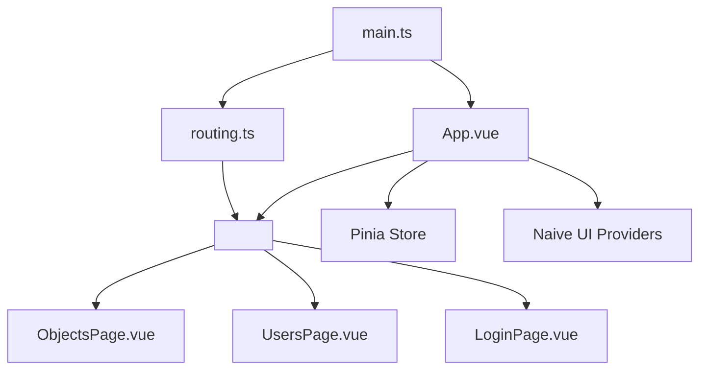
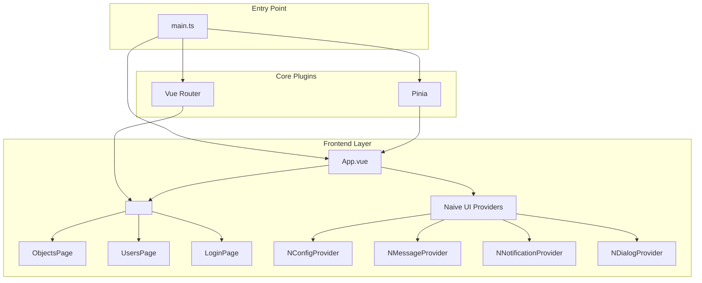
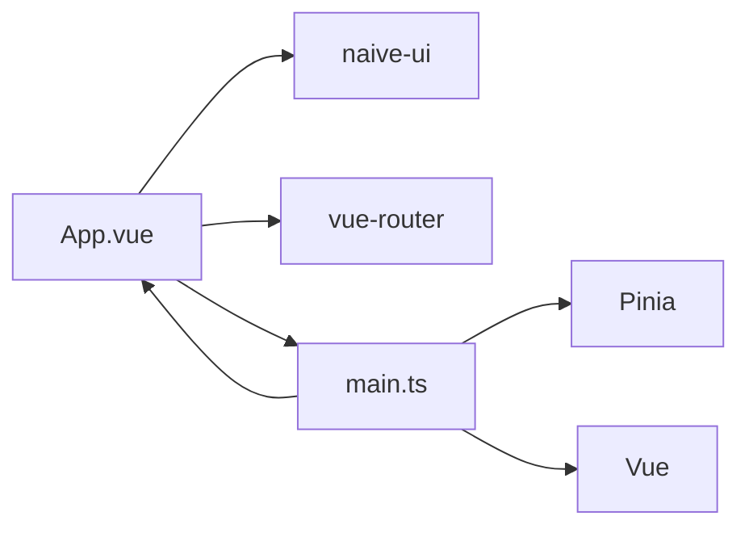

# App.vue Root Component

<cite>
**Referenced Files in This Document**   
- [App.vue](file://src/root/App.vue#L1-L38)
- [main.ts](file://src/main.ts#L1-L13)
- [routing.ts](file://src/root/routing.ts#L1-L20)
</cite>

## Table of Contents
1. [Introduction](#introduction)
2. [Project Structure](#project-structure)
3. [Core Components](#core-components)
4. [Architecture Overview](#architecture-overview)
5. [Detailed Component Analysis](#detailed-component-analysis)
6. [Dependency Analysis](#dependency-analysis)
7. [Performance Considerations](#performance-considerations)
8. [Troubleshooting Guide](#troubleshooting-guide)
9. [Conclusion](#conclusion)

## Introduction
The `App.vue` file serves as the root component of the maya-platform-frontend application. It is responsible for initializing the Vue application structure, integrating core plugins such as Vue Router and Pinia, and providing a consistent UI layout across all routes. This document provides a comprehensive analysis of `App.vue`, detailing its role in rendering dynamic views, managing global state, and applying theme configurations using Naive UI. The integration with `main.ts` and route definitions in `routing.ts` is also examined to illustrate how feature pages like `ObjectsPage`, `UsersPage`, and `LoginPage` are dynamically loaded.

## Project Structure
The project follows a modular, feature-based architecture where components are grouped by domain (e.g., `auth`, `objects`, `users`). The `App.vue` component resides in the `src/root/` directory, acting as the top-level container for all views. It leverages Vue 3's Composition API and is bootstrapped via `main.ts`, which imports and mounts the app instance.



**Diagram sources**
- [App.vue](file://src/root/App.vue#L1-L38)
- [main.ts](file://src/main.ts#L1-L13)
- [routing.ts](file://src/root/routing.ts#L1-L20)

**Section sources**
- [App.vue](file://src/root/App.vue#L1-L38)
- [main.ts](file://src/main.ts#L1-L13)

## Core Components
The `App.vue` component is minimal but essential, serving as the shell that wraps all routed content. It uses Naive UI’s provider components (`NConfigProvider`, `NMessageProvider`, etc.) to enable global UI behaviors such as notifications, dialogs, and theme management. The `<router-view />` directive dynamically renders the appropriate page component based on the current route.

Key responsibilities include:
- Injecting the application theme (light/dark mode)
- Providing global UI context via Naive UI providers
- Mounting routed components dynamically

**Section sources**
- [App.vue](file://src/root/App.vue#L1-L38)

## Architecture Overview
The application architecture centers around Vue Router for navigation and Pinia for state management. `App.vue` acts as the layout host, while individual feature modules define their own routes and components.



**Diagram sources**
- [App.vue](file://src/root/App.vue#L1-L38)
- [main.ts](file://src/main.ts#L1-L13)

## Detailed Component Analysis

### App.vue Template Structure
The template section of `App.vue` uses a nested provider pattern from Naive UI to ensure consistent UI behavior across the app. The `<router-view />` is placed inside these providers so that all routed components inherit the same configuration.

```vue
<template>
  <div id="app">
    <NConfigProvider :theme="theme">
      <NMessageProvider>
        <NNotificationProvider>
          <NDialogProvider>
            <router-view />
          </NDialogProvider>
        </NNotificationProvider>
      </NMessageProvider>
    </NConfigProvider>
  </div>
</template>
```

This structure ensures that:
- Messages, notifications, and dialogs are globally available
- Theme settings (light/dark) are applied consistently
- No additional wrappers are needed in child components

**Section sources**
- [App.vue](file://src/root/App.vue#L1-L10)

### Script Setup and Theme Management
The script section uses Vue 3’s `setup` syntax with TypeScript. It imports necessary components from Naive UI and initializes a reactive `theme` reference. Currently, the theme is set to `null` (light mode), but can be switched to `darkTheme` for dark mode support.

```ts
<script setup lang="ts">
import { ref } from 'vue'
import {
  NConfigProvider,
  NMessageProvider,
  NNotificationProvider,
  NDialogProvider,
  darkTheme
} from 'naive-ui'

const theme = ref(null) // null = light, darkTheme = dark
</script>
```

This setup allows for future extension, such as user-controlled theme toggling or persistence via localStorage.

**Section sources**
- [App.vue](file://src/root/App.vue#L12-L25)

### Style Definitions
The style block applies basic layout constraints to ensure the app fills the viewport.

```css
<style scoped>
#app {
  width: 100%;
  min-height: 100vh;
}
</style>
```

The `scoped` attribute ensures these styles do not leak to other components. The full width and minimum height guarantee a seamless user experience across devices.

**Section sources**
- [App.vue](file://src/root/App.vue#L27-L32)

### Integration with main.ts
The `main.ts` file is the entry point that creates the Vue application instance and mounts `App.vue`. It also installs Pinia and Vue Router.

```ts
import { createApp } from 'vue'
import { createPinia } from 'pinia'
import App from '@/root/App.vue'
import router from '@/root/routing'

const app = createApp(App)
app.use(createPinia())
app.use(router)
app.mount('#app')
```

This sequence ensures:
- Global state is available via Pinia
- Routing is enabled through Vue Router
- The root component is attached to the DOM

**Section sources**
- [main.ts](file://src/main.ts#L1-L13)

### Route Configuration in routing.ts
Although the full content of `routing.ts` is not accessible, its import in `main.ts` confirms it defines the application’s routes. Based on the project structure, it likely includes routes such as:

- `/objects` → `ObjectsPage.vue`
- `/users` → `UsersPage.vue`
- `/login` → `LoginPage.vue`

These routes are resolved dynamically by `<router-view />` within `App.vue`.

**Section sources**
- [routing.ts](file://src/root/routing.ts#L1-L20)

## Dependency Analysis
`App.vue` depends on several key libraries and internal modules:



**Diagram sources**
- [App.vue](file://src/root/App.vue#L1-L38)
- [main.ts](file://src/main.ts#L1-L13)

## Performance Considerations
- The use of `scoped` styles prevents unnecessary re-renders due to style conflicts.
- Lazy loading of route components (if implemented in `routing.ts`) would improve initial load time.
- Theme state is reactive but minimal, avoiding performance overhead.
- Naive UI providers are mounted once at the root level, reducing redundant initialization.

## Troubleshooting Guide
Common issues and solutions related to `App.vue`:

| Issue | Cause | Solution |
|------|-------|----------|
| Blank screen on load | Missing route match | Verify `routing.ts` includes a default route |
| UI components not themed | Theme not applied | Ensure `NConfigProvider` wraps all content |
| Notifications/dialogs not working | Missing providers | Confirm all `N*Provider` components are present |
| App not mounting | DOM element missing | Check that `#app` exists in `index.html` |

**Section sources**
- [App.vue](file://src/root/App.vue#L1-L38)
- [main.ts](file://src/main.ts#L1-L13)

## Conclusion
`App.vue` plays a pivotal role as the foundation of the maya-platform-frontend application. It orchestrates the integration of Vue Router, Pinia, and Naive UI to deliver a cohesive, theme-aware user interface. Its simplicity allows for scalability, while its structure supports advanced features like global state, dynamic routing, and extensible theming. Future enhancements could include persistent theme preferences, loading states, and layout variations for authenticated vs. unauthenticated users.