# Component Hierarchy

<cite>
**Referenced Files in This Document**   
- [App.vue](file://src/App.vue) - *Updated in recent commit*
- [TopNavbar.vue](file://src/components/common/TopNavbar.vue) - *Added in recent commit*
- [UserProfileSection.vue](file://src/components/common/UserProfileSection.vue) - *Added in recent commit*
- [MobileNavigationMenu.vue](file://src/components/common/MobileNavigationMenu.vue) - *Added in recent commit*
- [user.ts](file://src/stores/user.ts) - *Used for user state management*
- [navigation.ts](file://src/stores/navigation.ts) - *Used for navigation state management*
</cite>

## Update Summary
**Changes Made**   
- Updated documentation to reflect the new top navigation architecture
- Added detailed analysis of the TopNavbar component and its child components
- Removed outdated references to SidebarComponent and HeaderComponent
- Added new diagrams reflecting the current component hierarchy
- Updated code examples to match the current implementation
- Corrected file paths to match the actual project structure

## Table of Contents
1. [Introduction](#introduction)
2. [Project Structure](#project-structure)
3. [Core Components](#core-components)
4. [Architecture Overview](#architecture-overview)
5. [Detailed Component Analysis](#detailed-component-analysis)
6. [Component Communication Patterns](#component-communication-patterns)
7. [Dynamic Routing and Navigation](#dynamic-routing-and-navigation)
8. [Render Tree and Layout Composition](#render-tree-and-layout-composition)
9. [Conclusion](#conclusion)

## Introduction
This document provides a comprehensive analysis of the component hierarchy in the maya-platform-frontend application. It explains how the root App.vue component orchestrates the application structure through Vue Router, manages global layout, and coordinates interactions between layout components and feature-specific pages. The documentation details parent-child relationships, data flow patterns, and integration mechanisms between shared and feature-encapsulated components.

## Project Structure
The maya-platform-frontend application follows a feature-based modular architecture, organizing components, pages, routing, and state management by domain. The root directory contains core application files, while feature modules are organized under the `src` directory.


**Diagram sources**
- [App.vue](file://src/App.vue)
- [TopNavbar.vue](file://src/components/common/TopNavbar.vue)

**Section sources**
- [App.vue](file://src/App.vue)
- [TopNavbar.vue](file://src/components/common/TopNavbar.vue)

## Core Components
The application's core components establish the foundation for UI rendering and state management. App.vue serves as the root component, initializing the Vue application and mounting the router. The main.ts file configures the Vue instance with Pinia for state management and Vue Router for navigation.


**Diagram sources**
- [main.ts](file://main.ts#L1-L13)
- [App.vue](file://src/App.vue)
- [TopNavbar.vue](file://src/components/common/TopNavbar.vue)

**Section sources**
- [main.ts](file://main.ts#L1-L13)

## Architecture Overview
The application architecture follows a hierarchical component model where App.vue serves as the root, coordinating routing and global layout. Feature modules encapsulate their own components and business logic, while shared components provide reusable UI elements across the application.


**Diagram sources**
- [App.vue](file://src/App.vue)
- [TopNavbar.vue](file://src/components/common/TopNavbar.vue)
- [user.ts](file://src/stores/user.ts)
- [navigation.ts](file://src/stores/navigation.ts)

## Detailed Component Analysis

### App.vue Analysis
App.vue serves as the root component that initializes the application layout and routing system. It renders the main application shell and uses RouterView to dynamically load feature pages based on the current route.

```vue
<template>
  <div id="app" class="min-h-screen bg-gray-50 dark:bg-gray-900">
    <TopNavbar />
    <RouterView />
  </div>
</template>

<script setup lang="ts">
import { RouterView } from 'vue-router'
import TopNavbar from '@/components/common/TopNavbar.vue'
</script>
```

**Section sources**
- [App.vue](file://src/App.vue)

### Layout Components Analysis
Layout components provide the consistent UI structure across the application. The TopNavbar component is mounted within the main layout and provides navigation and global controls.

#### TopNavbar Component Structure

```mermaid
classDiagram
class TopNavbar {
+isMobileMenuOpen : boolean
+userStore : UserStore
+navigationStore : NavigationStore
+visibleNavigationItems : Array
+isActiveRoute() : boolean
+toggleMobileMenu()
+closeMobileMenu()
+setActiveRoute()
}
class UserProfileSection {
+user : User
+userDisplayName : string
+userInitials : string
+userTypeLabel : string
+handleLogout()
}
class MobileNavigationMenu {
+isOpen : boolean
+navigationItems : Array
+user : User
+isActiveRoute() : boolean
+handleLogout()
}
TopNavbar --> UserProfileSection : "contains"
TopNavbar --> MobileNavigationMenu : "contains"
TopNavbar --> userStore : "uses"
TopNavbar --> navigationStore : "uses"
UserProfileSection --> userStore : "gets user data"
MobileNavigationMenu --> navigationStore : "gets navigation items"
```


**Diagram sources**
- [TopNavbar.vue](file://src/components/common/TopNavbar.vue)
- [UserProfileSection.vue](file://src/components/common/UserProfileSection.vue)
- [MobileNavigationMenu.vue](file://src/components/common/MobileNavigationMenu.vue)
- [user.ts](file://src/stores/user.ts)
- [navigation.ts](file://src/stores/navigation.ts)

#### UserProfileSection Component


**Diagram sources**
- [UserProfileSection.vue](file://src/components/common/UserProfileSection.vue)
- [user.ts](file://src/stores/user.ts)

#### MobileNavigationMenu Component


**Diagram sources**
- [MobileNavigationMenu.vue](file://src/components/common/MobileNavigationMenu.vue)
- [navigation.ts](file://src/stores/navigation.ts)

## Component Communication Patterns
The application employs standard Vue component communication patterns to manage data flow between parent and child components.

### Props and Emits Pattern
Parent components pass data to children through props, while children communicate events back to parents using emits.


**Diagram sources**
- [TopNavbar.vue](file://src/components/common/TopNavbar.vue)
- [MobileNavigationMenu.vue](file://src/components/common/MobileNavigationMenu.vue)

### State Management Pattern
The application uses Pinia stores to manage global state, allowing components to access and modify shared data.


**Diagram sources**
- [TopNavbar.vue](file://src/components/common/TopNavbar.vue)
- [user.ts](file://src/stores/user.ts)
- [navigation.ts](file://src/stores/navigation.ts)

## Dynamic Routing and Navigation
The application uses Vue Router to manage navigation between feature pages, with routes configured in the router module and navigation state managed by Pinia.

```mermaid
flowchart TD
A[Navigation Request] --> B{Route Exists?}
B --> |Yes| C[Check Authentication]
C --> D{Authenticated?}
D --> |No| E[Redirect to Login]
D --> |Yes| F[Update Active Route]
F --> G[navigationStore.setActiveRoute()]
G --> H[Render Component in RouterView]
H --> I[Component Lifecycle]
I --> J[Render Complete]
B --> |No| K[Redirect to 404]
```

**Diagram sources**
- [TopNavbar.vue](file://src/components/common/TopNavbar.vue)
- [navigation.ts](file://src/stores/navigation.ts)
- [user.ts](file://src/stores/user.ts)

## Render Tree and Layout Composition
The component render tree begins with App.vue and branches into layout and feature components based on the current route.


**Diagram sources**
- [App.vue](file://src/App.vue)
- [TopNavbar.vue](file://src/components/common/TopNavbar.vue)
- [user.ts](file://src/stores/user.ts)
- [navigation.ts](file://src/stores/navigation.ts)

## Conclusion
The maya-platform-frontend application demonstrates a well-structured component hierarchy with clear separation of concerns. App.vue serves as the central orchestrator, managing global layout and routing. The new TopNavbar component replaces the previous sidebar and header components, providing a responsive navigation experience across desktop and mobile devices. The application leverages Pinia stores for global state management, allowing components to access user and navigation state. Feature modules encapsulate their own components and business logic, while shared components provide reusable UI elements. This architecture enables maintainable code organization and scalable feature development.