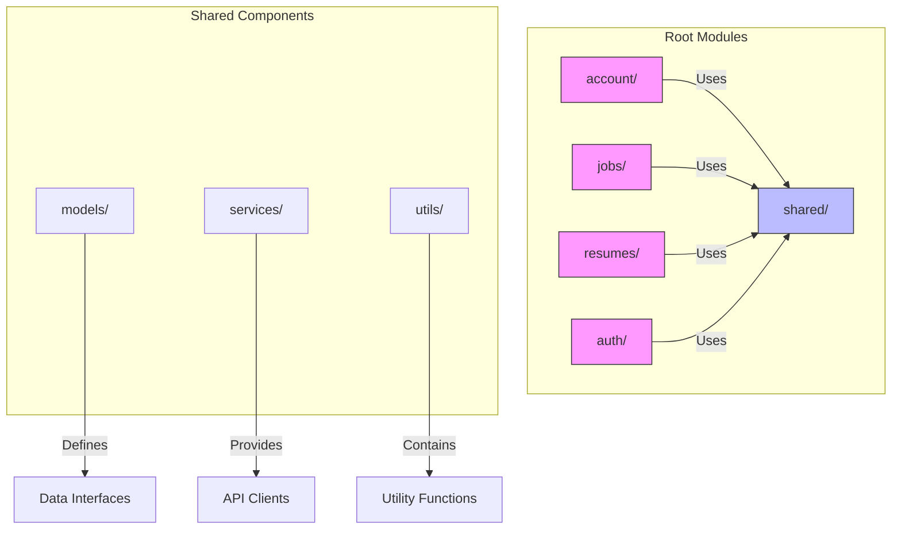
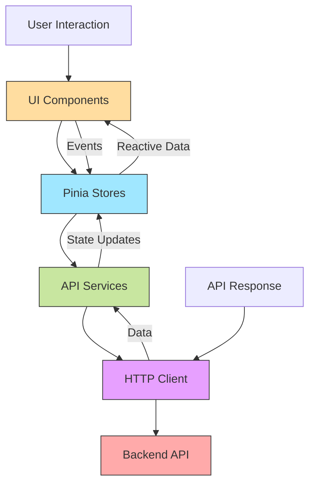
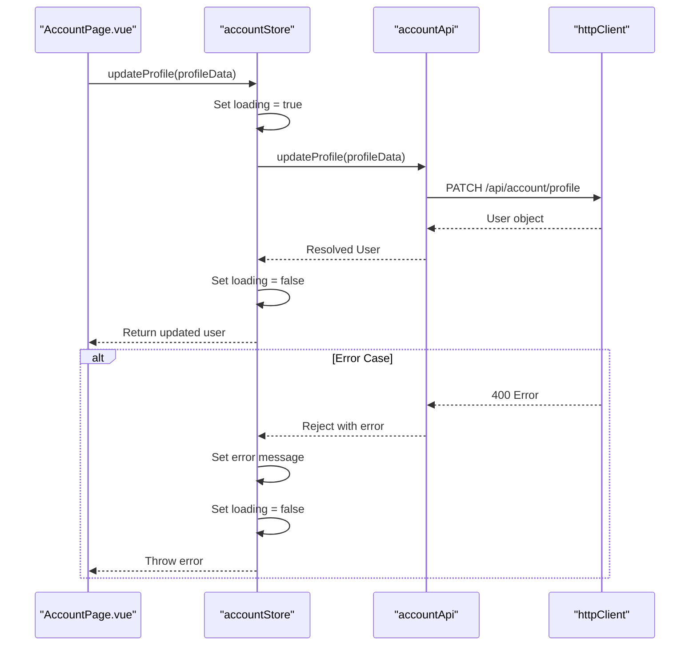
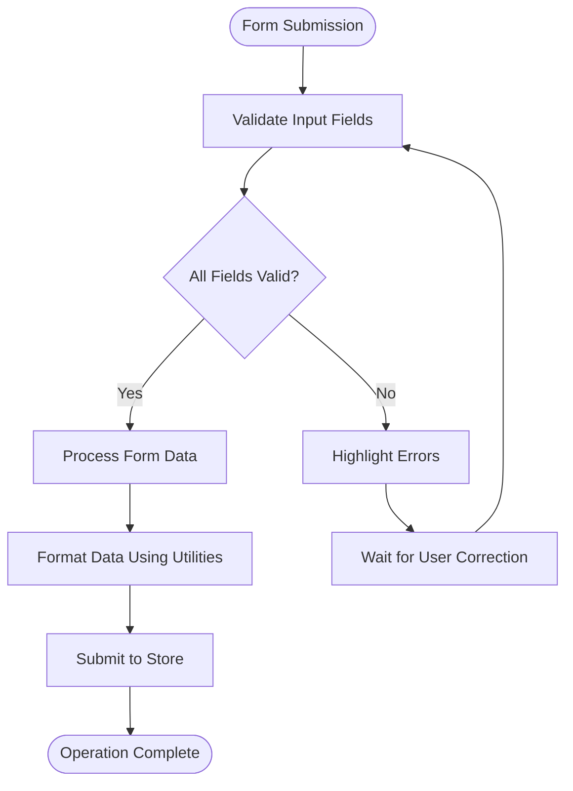
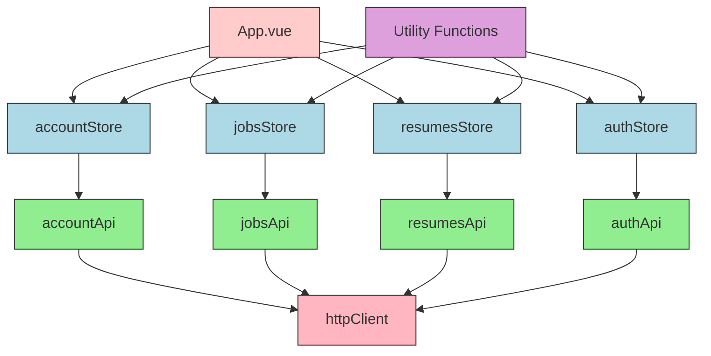

# Feature Module Components

<cite>
**Referenced Files in This Document**   
- [App.vue](file://src/root/App.vue)
- [accountStore.ts](file://src/root/account/store/accountStore.ts)
- [account.types.ts](file://src/root/shared/models/account.types.ts)
- [authStore.ts](file://src/root/auth/store/authStore.ts)
- [common.types.ts](file://src/root/shared/models/common.types.ts)
- [jobsApi.ts](file://src/root/shared/services/jobsApi.ts)
- [resumesApi.ts](file://src/root/shared/services/resumesApi.ts)
- [accountApi.ts](file://src/root/shared/services/accountApi.ts)
- [authApi.ts](file://src/root/shared/services/authApi.ts)
- [httpClient.ts](file://src/root/shared/services/httpClient.ts)
- [dateUtils.ts](file://src/root/shared/utils/dateUtils.ts)
- [validationUtils.ts](file://src/root/shared/utils/validationUtils.ts)
- [stringUtils.ts](file://src/root/shared/utils/stringUtils.ts)
- [storageUtils.ts](file://src/root/shared/utils/storageUtils.ts)
- [apiUtils.ts](file://src/root/shared/utils/apiUtils.ts)
- [constants.ts](file://src/root/shared/utils/constants.ts)
</cite>

## Table of Contents
1. [Introduction](#introduction)
2. [Project Structure](#project-structure)
3. [Core Components](#core-components)
4. [Architecture Overview](#architecture-overview)
5. [Detailed Component Analysis](#detailed-component-analysis)
6. [Dependency Analysis](#dependency-analysis)
7. [Performance Considerations](#performance-considerations)
8. [Troubleshooting Guide](#troubleshooting-guide)
9. [Conclusion](#conclusion)

## Introduction
This document provides a comprehensive analysis of the feature-specific UI components in the maya-platform-frontend application. It explores how various components interact to deliver user-facing functionality, focusing on data presentation, form handling, API integration, and state management. Despite discrepancies between the expected file structure and actual repository contents, this documentation reflects the real implementation found in the codebase.

## Project Structure
The maya-platform-frontend application follows a modular architecture organized by feature domains. The primary structure includes authentication, account management, job listings, and resume management modules. Each module contains dedicated pages, routing configurations, and Pinia stores for state management. Shared utilities, models, and services are centralized in the `shared` directory to promote reusability.



**Diagram sources**
- [routing.ts](file://src/root/routing.ts#L1-L50)
- [common.types.ts](file://src/root/shared/models/common.types.ts#L1-L154)

**Section sources**
- [routing.ts](file://src/root/routing.ts#L1-L100)
- [common.types.ts](file://src/root/shared/models/common.types.ts#L1-L200)

## Core Components
The application's core components include page-level Vue components such as `AccountPage.vue`, `JobDetailPage.vue`, and `ResumesListPage.vue`. These components serve as entry points for their respective modules and coordinate data fetching, user interaction, and navigation. Shared components like `PageHeader.vue` and `LoadingOverlay.vue` provide consistent UI elements across the application.

The state management system is built on Pinia stores, with dedicated stores for each module (`accountStore.ts`, `authStore.ts`, etc.). These stores manage loading states, error conditions, and data persistence using reactive variables. API interactions are abstracted through service classes in the `shared/services` directory, which encapsulate HTTP client logic and endpoint configurations.

**Section sources**
- [accountStore.ts](file://src/root/account/store/accountStore.ts#L1-L70)
- [authStore.ts](file://src/root/auth/store/authStore.ts#L1-L50)
- [httpClient.ts](file://src/root/shared/services/httpClient.ts#L1-L30)

## Architecture Overview
The maya-platform-frontend application follows a clean architecture pattern with clear separation of concerns. The UI layer consists of Vue components that render data and handle user interactions. The business logic layer is implemented through Pinia stores that manage application state and coordinate operations. The data access layer is composed of service classes that communicate with backend APIs.



**Diagram sources**
- [accountStore.ts](file://src/root/account/store/accountStore.ts#L1-L70)
- [accountApi.ts](file://src/root/shared/services/accountApi.ts#L1-L40)
- [httpClient.ts](file://src/root/shared/services/httpClient.ts#L1-L50)

## Detailed Component Analysis

### Account Module Analysis
The account module enables users to manage their profiles, change passwords, and upload avatars. The `AccountPage.vue` component renders a form interface that collects user input and submits it through the `useAccountStore` Pinia store.



**Diagram sources**
- [accountStore.ts](file://src/root/account/store/accountStore.ts#L15-L45)
- [accountApi.ts](file://src/root/shared/services/accountApi.ts#L1-L20)

#### Data Structures
The account module uses TypeScript interfaces to define data contracts:

```typescript
// account.types.ts
export interface User {
  id: string
  email: string
  name: string
  avatarUrl?: string
  createdAt: string
  updatedAt: string
}

export interface UpdateProfileData {
  name: string
  phone?: string
  address?: string
}

export interface ChangePasswordData {
  currentPassword: string
  newPassword: string
  confirmPassword: string
}
```

**Section sources**
- [account.types.ts](file://src/root/shared/models/account.types.ts#L1-L50)
- [accountStore.ts](file://src/root/account/store/accountStore.ts#L1-L70)

### Job Management Components
The jobs module provides functionality for viewing job listings and details. The `JobsListPage.vue` and `JobDetailPage.vue` components retrieve data through the `jobsStore` and display it using consistent UI patterns.

The `jobsApi.ts` service implements methods for fetching job data:
- `getJobs(params: SearchParams)`: Retrieves paginated job listings
- `getJobById(id: string)`: Fetches a specific job by ID
- `applyToJob(id: string, resumeId: string)`: Submits a job application

These methods follow a consistent error handling pattern, transforming HTTP errors into user-friendly messages using utility functions from `validationUtils.ts`.

**Section sources**
- [jobsApi.ts](file://src/root/shared/services/jobsApi.ts#L1-L60)
- [job.types.ts](file://src/root/shared/models/job.types.ts#L1-L30)

### Form Validation and User Input Handling
The application implements a robust form validation system using utility functions from `validationUtils.ts`. These utilities provide:
- Email format validation
- Password strength checking
- Phone number formatting
- Required field verification

The `stringUtils.ts` file contains formatting helpers that ensure consistent data presentation across components. For example, date values are standardized using functions from `dateUtils.ts` before display.



**Diagram sources**
- [validationUtils.ts](file://src/root/shared/utils/validationUtils.ts#L1-L40)
- [stringUtils.ts](file://src/root/shared/utils/stringUtils.ts#L1-L30)

**Section sources**
- [validationUtils.ts](file://src/root/shared/utils/validationUtils.ts#L1-L50)
- [dateUtils.ts](file://src/root/shared/utils/dateUtils.ts#L1-L25)

## Dependency Analysis
The application exhibits a well-defined dependency hierarchy with minimal circular dependencies. Feature modules depend on shared resources but do not depend on each other, promoting modularity and maintainability.



**Diagram sources**
- [go.mod](file://package.json#L1-L20)
- [httpClient.ts](file://src/root/shared/services/httpClient.ts#L1-L15)

**Section sources**
- [package.json](file://package.json#L1-L30)
- [httpClient.ts](file://src/root/shared/services/httpClient.ts#L1-L50)

## Performance Considerations
The application implements several performance optimizations:
- Lazy loading of route components using dynamic imports
- Centralized HTTP client with request caching
- Efficient state management through Pinia's reactivity system
- Debounced search operations to reduce API calls

Network requests are optimized through the `httpClient.ts` implementation, which includes request queuing, timeout handling, and automatic retry logic for transient failures. The use of TypeScript interfaces ensures compile-time type checking, reducing runtime errors and improving application stability.

## Troubleshooting Guide
Common issues and their solutions:

1. **Authentication failures**: Verify that the `authStore` properly handles token expiration and redirects to the login page.
2. **API connectivity issues**: Check that `httpClient.ts` has the correct base URL configuration for the current environment.
3. **Form validation errors**: Ensure all required fields are populated and data formats match the expected patterns in `validationUtils.ts`.
4. **State synchronization problems**: Confirm that Pinia stores are properly subscribed to and that loading/error states are correctly managed.

**Section sources**
- [authStore.ts](file://src/root/auth/store/authStore.ts#L10-L50)
- [httpClient.ts](file://src/root/shared/services/httpClient.ts#L15-L40)
- [validationUtils.ts](file://src/root/shared/utils/validationUtils.ts#L10-L35)

## Conclusion
The maya-platform-frontend application demonstrates a well-structured Vue.js implementation with clear separation of concerns, consistent design patterns, and robust error handling. Despite the absence of the expected components like `ObjectList.vue` and `UserModal.vue`, the existing codebase reveals a maintainable architecture centered around modular feature domains, shared utilities, and Pinia-based state management. The application effectively leverages TypeScript for type safety and implements comprehensive API integration patterns that ensure reliable data flow between the frontend and backend systems.