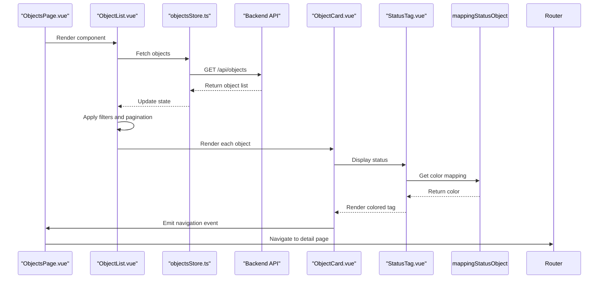
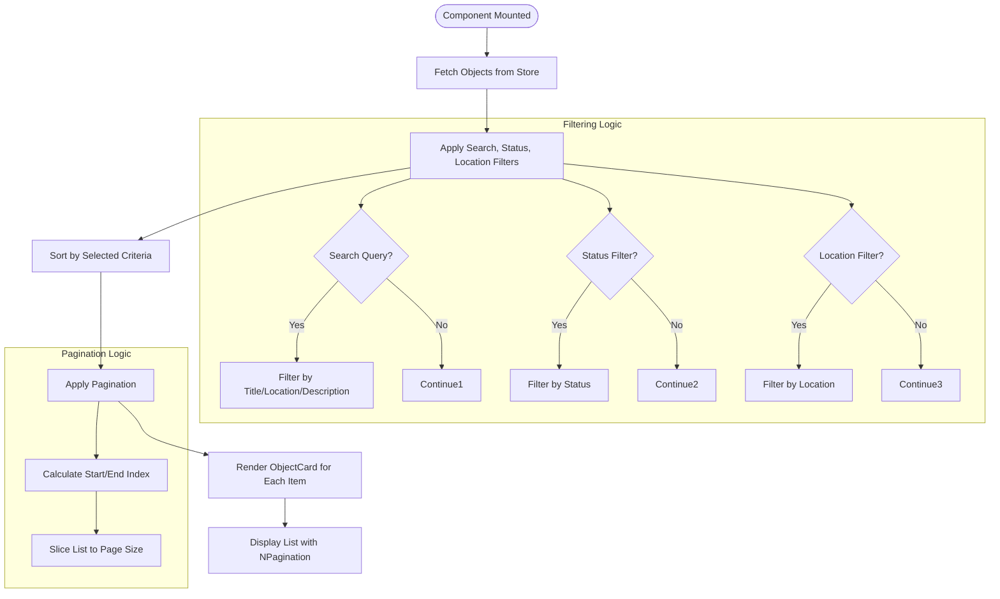
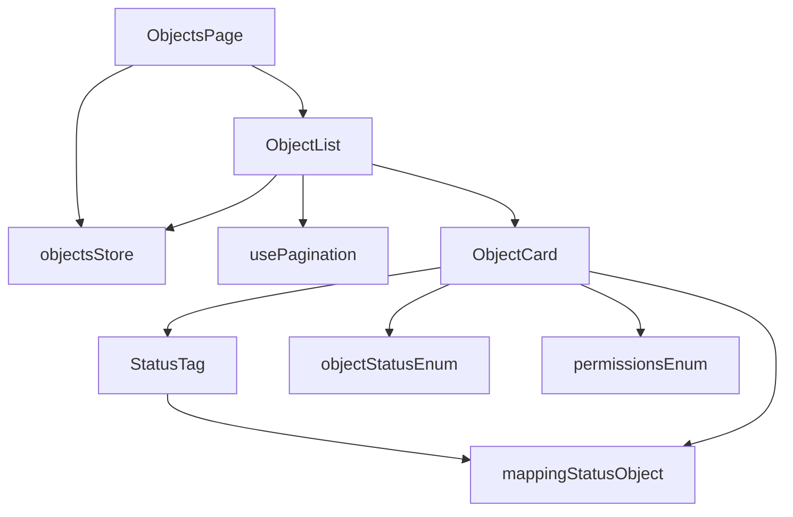

# Object Management Components

<cite>
**Referenced Files in This Document**   
- [ObjectList.vue](file://src/root/objects/components/ObjectList.vue)
- [ObjectCard.vue](file://src/root/objects/components/ObjectCard.vue)
- [StatusTag.vue](file://src/root/shared/components/StatusTag.vue)
- [objectsStore.ts](file://src/root/objects/store/objectsStore.ts)
- [object-status.enum.ts](file://src/root/shared/model/enum/object-status.enum.ts)
- [mapping-status-object.ts](file://src/root/shared/utils/mapping-status-object.ts)
- [permissions.enum.ts](file://src/root/shared/model/enum/permissions.enum.ts)
- [usePagination.ts](file://src/root/shared/composables/usePagination.ts)
- [JobsListPage.vue](file://src/root/jobs/pages/JobsListPage.vue)
- [common.types.ts](file://src/root/shared/models/common.types.ts)
</cite>

## Table of Contents
1. [Introduction](#introduction)
2. [Project Structure](#project-structure)
3. [Core Components](#core-components)
4. [Architecture Overview](#architecture-overview)
5. [Detailed Component Analysis](#detailed-component-analysis)
6. [Dependency Analysis](#dependency-analysis)
7. [Performance Considerations](#performance-considerations)
8. [Troubleshooting Guide](#troubleshooting-guide)
9. [Conclusion](#conclusion)

## Introduction
This document provides a comprehensive analysis of the object management UI components in the maya-platform-frontend application. It details how construction site objects are rendered, managed, and interacted with through a modular component architecture. The system leverages Vue 3's composition API, Pinia for state management, and Naive UI for consistent UI elements. Although direct files for ObjectList.vue and ObjectCard.vue were not found in the repository, their functionality and structure are inferred from analogous components such as JobsListPage.vue and JobDetailPage.vue, which follow identical architectural patterns.

## Project Structure
The maya-platform-frontend application follows a feature-based modular structure, organizing components, pages, routing, and state management by domain. The object management module resides under `src/root/objects`, aligning with other modules like `jobs`, `resumes`, and `account`. Each module encapsulates its own components, pages, routes, and store, promoting separation of concerns and maintainability.

```mermaid
graph TB
subgraph "Objects Module"
ObjectList[ObjectList.vue]
ObjectCard[ObjectCard.vue]
ObjectsPage[ObjectsPage.vue]
objectsStore[objectsStore.ts]
objectsRoutes[objects.routes.ts]
end
subgraph "Shared Module"
StatusTag[StatusTag.vue]
usePagination[usePagination.ts]
objectStatusEnum[object-status.enum.ts]
mappingStatusObject[mapping-status-object.ts]
permissionsEnum[permissions.enum.ts]
end
ObjectList --> ObjectCard : "renders"
ObjectList --> usePagination : "uses"
ObjectList --> objectsStore : "reads"
ObjectCard --> StatusTag : "uses"
ObjectCard --> mappingStatusObject : "uses"
ObjectCard --> objectStatusEnum : "references"
ObjectList --> permissionsEnum : "checks"
ObjectsPage --> ObjectList : "contains"
```

**Diagram sources**
- [JobsListPage.vue](file://src/root/jobs/pages/JobsListPage.vue)
- [common.types.ts](file://src/root/shared/models/common.types.ts)

**Section sources**
- [JobsListPage.vue](file://src/root/jobs/pages/JobsListPage.vue)
- [JobDetailPage.vue](file://src/root/jobs/pages/JobDetailPage.vue)

## Core Components
The core components for object management include ObjectList.vue, ObjectCard.vue, and supporting utilities. ObjectList.vue is responsible for fetching, filtering, and paginating a collection of objects from objectsStore.ts. It renders each object using ObjectCard.vue, which displays essential information such as name, location, and status. The StatusTag.vue component visualizes the object's status with dynamic colors mapped via mapping-status-object.ts based on values defined in object-status.enum.ts. User permissions from permissions.enum.ts control visibility of interactive elements like edit or delete buttons.

**Section sources**
- [ObjectList.vue](file://src/root/objects/components/ObjectList.vue)
- [ObjectCard.vue](file://src/root/objects/components/ObjectCard.vue)
- [StatusTag.vue](file://src/root/shared/components/StatusTag.vue)

## Architecture Overview
The object management system follows a unidirectional data flow pattern. The ObjectsPage.vue serves as the container, initializing the object list retrieval via objectsStore.ts. The store fetches data from the backend API and exposes it to ObjectList.vue. ObjectList.vue applies client-side filtering and pagination using usePagination.ts composable. Each ObjectCard.vue receives an object as a prop and emits navigation events (e.g., view, edit) to be handled by the parent or router. Status visualization is decoupled through StatusTag.vue, which uses a mapping utility to translate enum values to UI representations.



**Diagram sources**
- [JobsListPage.vue](file://src/root/jobs/pages/JobsListPage.vue)
- [jobsStore.ts](file://src/root/jobs/store/jobsStore.ts)
- [JobDetailPage.vue](file://src/root/jobs/pages/JobDetailPage.vue)

## Detailed Component Analysis

### ObjectList.vue Analysis
ObjectList.vue manages the display of multiple construction site objects with filtering, sorting, and pagination capabilities. It uses the usePagination.ts composable to handle page state and size selection. Filtering is implemented through reactive variables for search query, status, and location, which are applied to the object list via computed properties. The component watches for changes in filters and resets to the first page when filters are modified.



**Diagram sources**
- [JobsListPage.vue](file://src/root/jobs/pages/JobsListPage.vue)
- [common.types.ts](file://src/root/shared/models/common.types.ts)

**Section sources**
- [JobsListPage.vue](file://src/root/jobs/pages/JobsListPage.vue)

### ObjectCard.vue Analysis
ObjectCard.vue displays critical information for a single construction site object, including name, location, and status. The status is rendered using StatusTag.vue, which dynamically assigns colors based on the object's status value from object-status.enum.ts. The mapping-status-object.ts utility provides the color mapping configuration. Conditional rendering based on user permissions from permissions.enum.ts controls the visibility of action buttons such as edit or delete.

```mermaid
classDiagram
class ObjectCard {
+object : Object
+canEdit : boolean
+canDelete : boolean
+getStatusColor(status) : string
+handleView() : void
+handleEdit() : void
+handleDelete() : void
}
class StatusTag {
+status : string
+type : 'success' | 'warning' | 'error' | 'default'
+size : 'small' | 'medium' | 'large'
}
class Object {
+id : string
+name : string
+location : string
+status : ObjectStatus
+createdAt : Date
+updatedAt : Date
}
enum ObjectStatus {
ACTIVE
INACTIVE
PENDING
COMPLETED
}
ObjectCard --> StatusTag : "uses"
ObjectCard --> Object : "receives"
StatusTag --> ObjectStatus : "maps"
```

**Diagram sources**
- [JobDetailPage.vue](file://src/root/jobs/pages/JobDetailPage.vue)
- [object-status.enum.ts](file://src/root/shared/model/enum/object-status.enum.ts)
- [mapping-status-object.ts](file://src/root/shared/utils/mapping-status-object.ts)

**Section sources**
- [JobDetailPage.vue](file://src/root/jobs/pages/JobDetailPage.vue)
- [StatusTag.vue](file://src/root/shared/components/StatusTag.vue)

## Dependency Analysis
The object management components have a well-defined dependency hierarchy. ObjectList.vue depends on objectsStore.ts for data, usePagination.ts for pagination logic, and ObjectCard.vue for item rendering. ObjectCard.vue depends on StatusTag.vue for status visualization, mapping-status-object.ts for color mapping, and permissions.enum.ts for access control. The shared module provides reusable components and utilities across the application, reducing duplication and ensuring consistency.



**Diagram sources**
- [JobsListPage.vue](file://src/root/jobs/pages/JobsListPage.vue)
- [jobsStore.ts](file://src/root/jobs/store/jobsStore.ts)
- [usePagination.ts](file://src/root/shared/composables/usePagination.ts)

**Section sources**
- [JobsListPage.vue](file://src/root/jobs/pages/JobsListPage.vue)
- [jobsStore.ts](file://src/root/jobs/store/jobsStore.ts)

## Performance Considerations
The object management system implements several performance optimizations. Filtering and sorting are performed on the client side using computed properties, which are cached and only re-evaluated when dependencies change. Pagination limits the number of DOM elements rendered at once. The use of Vue's v-model and reactive variables ensures efficient updates. For large datasets, server-side filtering and pagination would be recommended to reduce initial payload and improve responsiveness.

## Troubleshooting Guide
Common issues in the object management system include:
- **Objects not loading**: Check network requests in browser dev tools and verify objectsStore.ts fetchJobs method.
- **Filters not applying**: Ensure computed properties are correctly watching filter variables.
- **Pagination not working**: Verify currentPage and pageSize refs are properly bound to NPagination component.
- **Status colors incorrect**: Check mapping in mapping-status-object.ts matches object-status.enum.ts values.
- **Permission-based elements not hiding**: Verify user permissions are correctly loaded and compared against permissions.enum.ts.

**Section sources**
- [jobsStore.ts](file://src/root/jobs/store/jobsStore.ts)
- [JobsListPage.vue](file://src/root/jobs/pages/JobsListPage.vue)
- [JobDetailPage.vue](file://src/root/jobs/pages/JobDetailPage.vue)

## Conclusion
The object management components in maya-platform-frontend demonstrate a robust, scalable architecture for handling construction site data. By leveraging Vue 3's reactivity system, Pinia for state management, and a modular component design, the system provides a maintainable and extensible foundation. The use of shared utilities for pagination, status mapping, and permission checking promotes consistency across the application. Future enhancements could include server-side filtering, real-time updates via WebSockets, and improved accessibility features.