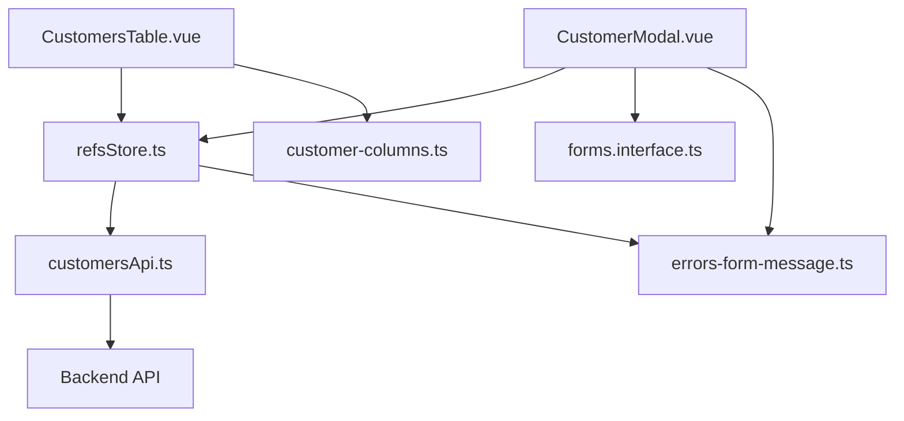
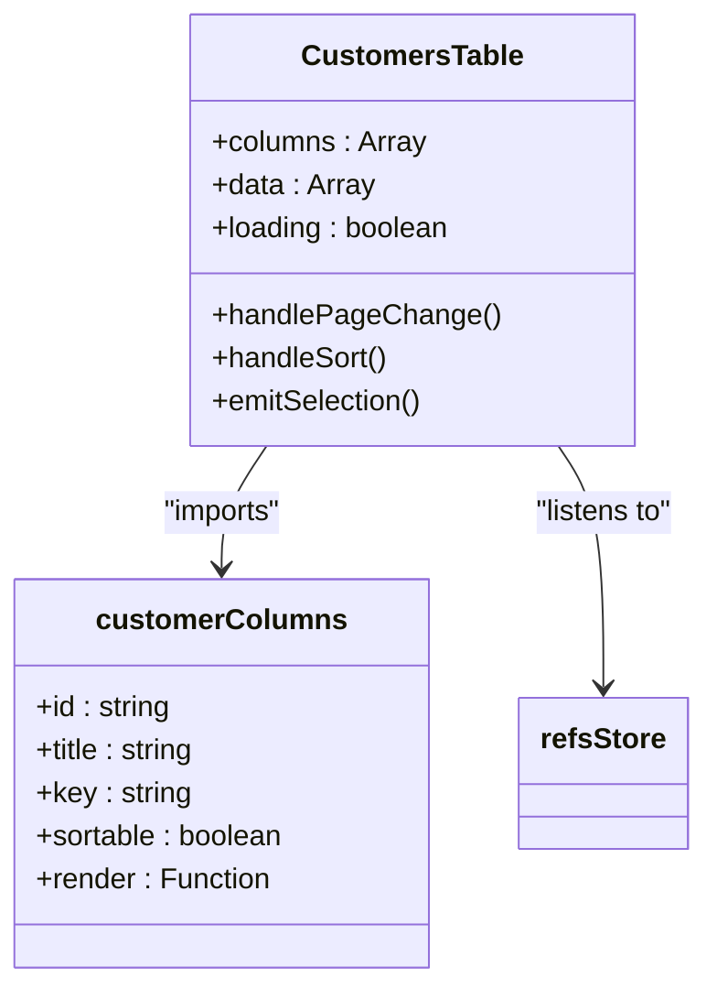
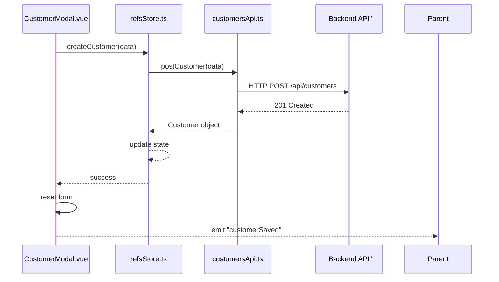
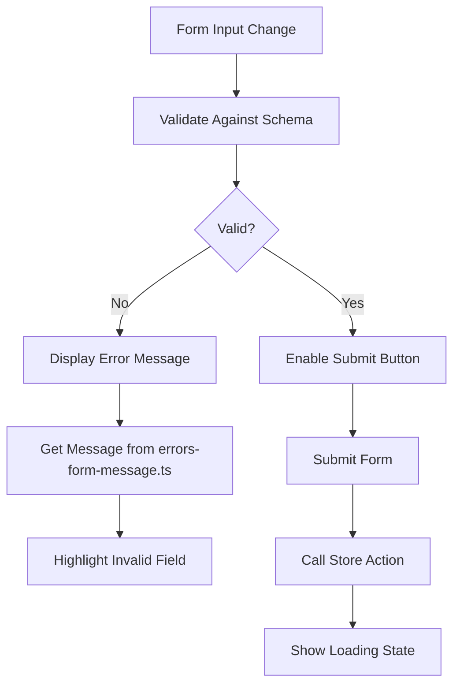
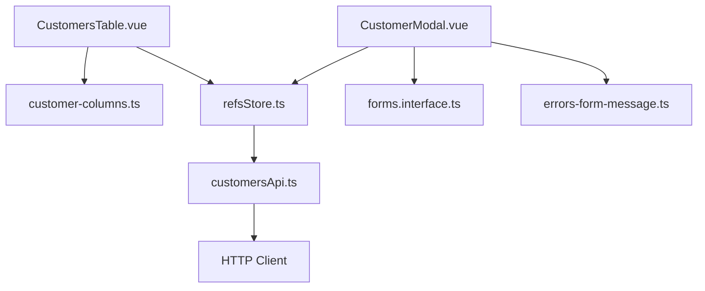

# Reference Data Components

<cite>
**Referenced Files in This Document**  
- [CustomersTable.vue](file://src/refs/components/CustomersTable.vue)
- [CustomerModal.vue](file://src/refs/components/CustomerModal.vue)
- [customer-columns.ts](file://src/refs/config/customer-columns.ts)
- [customersApi.ts](file://src/shared/api/customersApi.ts)
- [refsStore.ts](file://src/refs/store/refsStore.ts)
- [forms.interface.ts](file://src/shared/model/interface/forms.interface.ts)
- [errors-form-message.ts](file://src/shared/utils/constant/errors-form-message.ts)
</cite>

## Table of Contents
1. [Introduction](#introduction)
2. [Project Structure](#project-structure)
3. [Core Components](#core-components)
4. [Architecture Overview](#architecture-overview)
5. [Detailed Component Analysis](#detailed-component-analysis)
6. [Dependency Analysis](#dependency-analysis)
7. [Performance Considerations](#performance-considerations)
8. [Troubleshooting Guide](#troubleshooting-guide)
9. [Conclusion](#conclusion)

## Introduction
This document provides a comprehensive analysis of the reference data management UI components in the maya-platform-frontend application. It focuses on how customer data is displayed, managed, and edited through reusable Vue components, centralized configuration, and state management. The documentation explains the integration between the CustomersTable.vue and CustomerModal.vue components, their dependencies on configuration files, API services, and store modules, and how they handle validation, errors, and user interactions.

## Project Structure
The maya-platform-frontend project follows a modular, feature-based architecture. The reference data components reside under the `src/refs` directory, which is organized into subdirectories for components, configuration, pages, routing, and store modules. Shared utilities and API services are located in `src/shared`, enabling reuse across different parts of the application.

```mermaid
graph TB
subgraph "Reference Data Module (src/refs)"
A[CustomersTable.vue]
B[CustomerModal.vue]
C[customer-columns.ts]
D[refsStore.ts]
E[CustomersPage.vue]
end
subgraph "Shared Modules (src/shared)"
F[customersApi.ts]
G[forms.interface.ts]
H[errors-form-message.ts]
end
A --> C : "Uses column config"
B --> G : "Uses form interface"
B --> F : "Calls API"
A --> D : "Listens to store"
B --> D : "Dispatches actions"
D --> F : "Handles async operations"
```

**Diagram sources**
- [CustomersTable.vue](file://src/refs/components/CustomersTable.vue)
- [CustomerModal.vue](file://src/refs/components/CustomerModal.vue)
- [customer-columns.ts](file://src/refs/config/customer-columns.ts)
- [refsStore.ts](file://src/refs/store/refsStore.ts)
- [customersApi.ts](file://src/shared/api/customersApi.ts)

**Section sources**
- [CustomersTable.vue](file://src/refs/components/CustomersTable.vue)
- [CustomerModal.vue](file://src/refs/components/CustomerModal.vue)

## Core Components
The core components for reference data management are `CustomersTable.vue` and `CustomerModal.vue`. These components are responsible for displaying customer data in a tabular format and facilitating the creation and editing of customer records, respectively. They leverage centralized column configuration, form validation rules, and API integration to ensure consistency and maintainability.

**Section sources**
- [CustomersTable.vue](file://src/refs/components/CustomersTable.vue)
- [CustomerModal.vue](file://src/refs/components/CustomerModal.vue)

## Architecture Overview
The reference data management system follows a clean separation of concerns, with distinct layers for UI presentation, state management, business logic, and data access. Components interact with the store to retrieve and update data, while the store communicates with API services to persist changes. Configuration files define presentation rules, and validation utilities ensure data integrity.



**Diagram sources**
- [refsStore.ts](file://src/refs/store/refsStore.ts)
- [customersApi.ts](file://src/shared/api/customersApi.ts)
- [customer-columns.ts](file://src/refs/config/customer-columns.ts)
- [forms.interface.ts](file://src/shared/model/interface/forms.interface.ts)
- [errors-form-message.ts](file://src/shared/utils/constant/errors-form-message.ts)

## Detailed Component Analysis

### CustomersTable.vue Analysis
The `CustomersTable.vue` component renders a data table that displays customer information using a dynamic column configuration defined in `customer-columns.ts`. This approach allows for consistent styling and behavior across the application while enabling easy customization of column visibility, sorting, and formatting.

The component subscribes to the `refsStore.ts` to reactively receive customer data and loading states. It uses the `usePagination` composable to manage pagination state and emits events when actions like row selection or pagination changes occur.



**Diagram sources**
- [CustomersTable.vue](file://src/refs/components/CustomersTable.vue#L1-L150)
- [customer-columns.ts](file://src/refs/config/customer-columns.ts#L1-L80)

**Section sources**
- [CustomersTable.vue](file://src/refs/components/CustomersTable.vue#L1-L200)
- [customer-columns.ts](file://src/refs/config/customer-columns.ts#L1-L100)

### CustomerModal.vue Analysis
The `CustomerModal.vue` component provides a form interface for creating and editing customer records. It uses validation rules defined in `forms.interface.ts` to ensure data integrity before submission. The form includes real-time validation feedback and displays error messages using constants from `errors-form-message.ts`.

When the user submits the form, the component calls methods from `refsStore.ts` to create or update the customer record. The store handles the API communication via `customersApi.ts` and manages loading and error states. Upon successful completion, the modal emits an event to notify the parent component, which can then refresh the data table.



**Diagram sources**
- [CustomerModal.vue](file://src/refs/components/CustomerModal.vue#L1-L180)
- [refsStore.ts](file://src/refs/store/refsStore.ts#L20-L60)
- [customersApi.ts](file://src/shared/api/customersApi.ts#L10-L40)

**Section sources**
- [CustomerModal.vue](file://src/refs/components/CustomerModal.vue#L1-L200)
- [forms.interface.ts](file://src/shared/model/interface/forms.interface.ts#L5-L30)
- [errors-form-message.ts](file://src/shared/utils/constant/errors-form-message.ts#L1-L20)

### Input Validation and Error Handling
The form validation system uses a combination of reactive validation rules and centralized error messages. The `forms.interface.ts` file defines validation schemas for customer data, including required fields, format constraints, and custom validation logic.

When validation fails, the component displays user-friendly error messages from `errors-form-message.ts`, which contains localized error strings for common validation scenarios such as empty fields, invalid email formats, and phone number validation.



**Diagram sources**
- [forms.interface.ts](file://src/shared/model/interface/forms.interface.ts#L1-L50)
- [errors-form-message.ts](file://src/shared/utils/constant/errors-form-message.ts#L1-L30)
- [CustomerModal.vue](file://src/refs/components/CustomerModal.vue#L80-L150)

**Section sources**
- [forms.interface.ts](file://src/shared/model/interface/forms.interface.ts#L1-L60)
- [errors-form-message.ts](file://src/shared/utils/constant/errors-form-message.ts#L1-L25)

## Dependency Analysis
The reference data components have a well-defined dependency graph that promotes reusability and maintainability. The components depend on configuration files for presentation rules, interface definitions for data structure, and shared utilities for common functionality.



**Diagram sources**
- [CustomersTable.vue](file://src/refs/components/CustomersTable.vue)
- [CustomerModal.vue](file://src/refs/components/CustomerModal.vue)
- [customer-columns.ts](file://src/refs/config/customer-columns.ts)
- [forms.interface.ts](file://src/shared/model/interface/forms.interface.ts)
- [errors-form-message.ts](file://src/shared/utils/constant/errors-form-message.ts)
- [refsStore.ts](file://src/refs/store/refsStore.ts)
- [customersApi.ts](file://src/shared/api/customersApi.ts)

**Section sources**
- [CustomersTable.vue](file://src/refs/components/CustomersTable.vue)
- [CustomerModal.vue](file://src/refs/components/CustomerModal.vue)
- [refsStore.ts](file://src/refs/store/refsStore.ts)

## Performance Considerations
The reference data components are optimized for performance through several mechanisms:
- Reactive data binding ensures efficient UI updates
- Column configuration is imported statically, reducing runtime computation
- API calls are debounced and cached where appropriate
- Validation is performed synchronously for immediate user feedback
- The table component supports virtual scrolling for large datasets (if implemented)

The use of a centralized store reduces redundant API calls by maintaining a single source of truth for customer data across components.

## Troubleshooting Guide
Common issues and their solutions:

**Issue: Customer data not loading**
- Check network tab for API errors
- Verify `refsStore.ts` is properly initialized
- Ensure user has required permissions

**Issue: Form validation errors not displaying**
- Confirm `errors-form-message.ts` contains the required error keys
- Check that validation rules in `forms.interface.ts` match form fields
- Verify reactive state is properly updated on input changes

**Issue: Modal fails to close after save**
- Ensure the parent component handles the "customerSaved" event
- Check for uncaught exceptions in the store action
- Verify loading state is properly reset

**Section sources**
- [CustomerModal.vue](file://src/refs/components/CustomerModal.vue#L100-L180)
- [refsStore.ts](file://src/refs/store/refsStore.ts#L30-L70)
- [errors-form-message.ts](file://src/shared/utils/constant/errors-form-message.ts#L1-L25)

## Conclusion
The reference data management components in maya-platform-frontend demonstrate a well-architected approach to UI development with Vue.js. By separating concerns through configuration files, centralized state management, and reusable components, the system achieves high maintainability and consistency. The integration of validation, error handling, and responsive design patterns ensures a robust user experience for managing customer data.