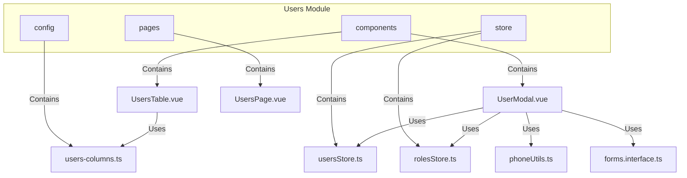
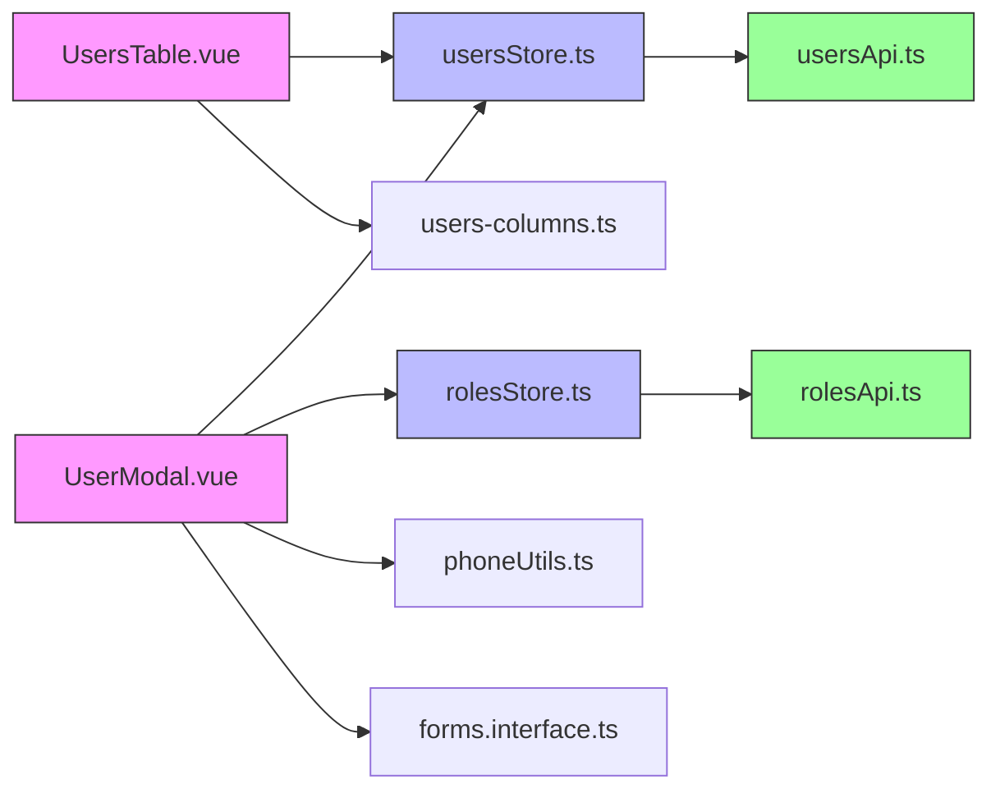
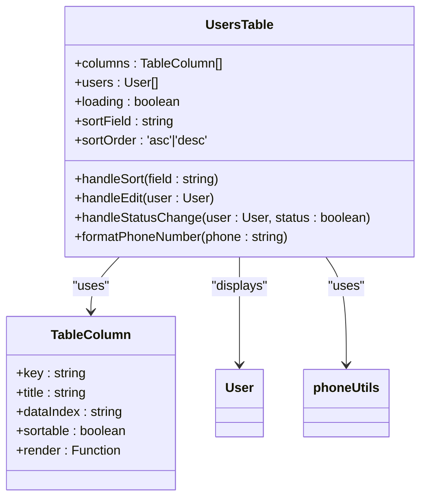
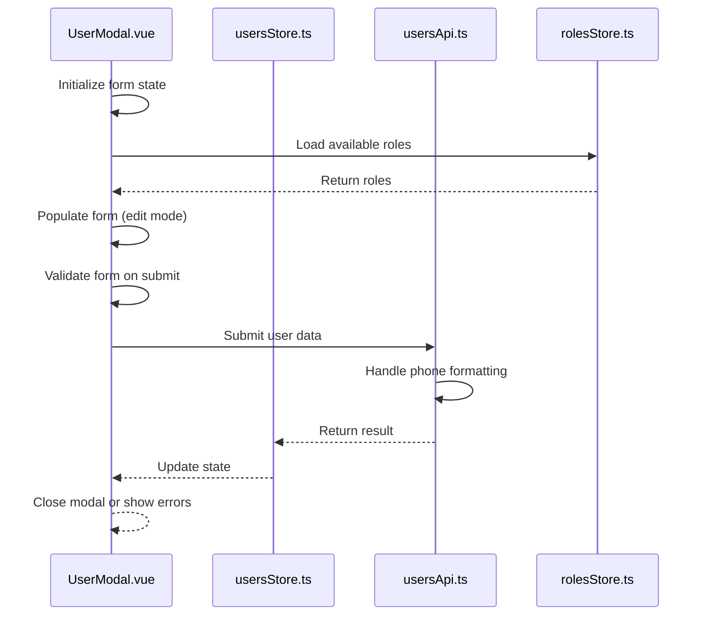
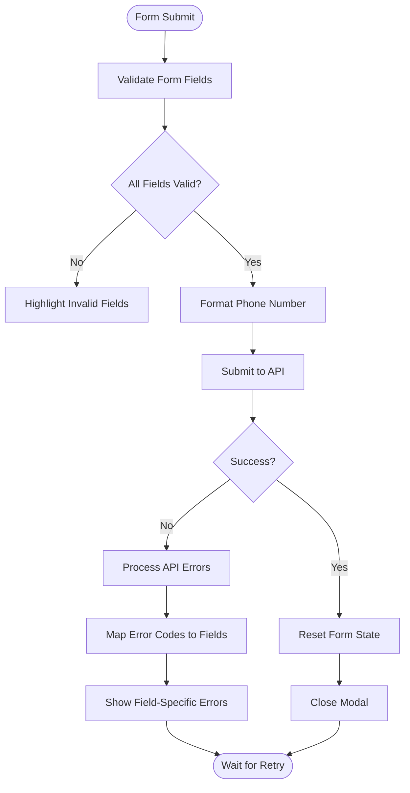
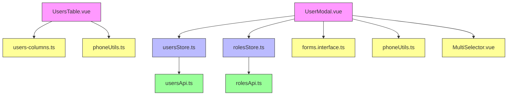

# User Management Components

<cite>
**Referenced Files in This Document**   
- [UsersTable.vue](file://src/root/users/components/UsersTable.vue)
- [UserModal.vue](file://src/root/users/components/UserModal.vue)
- [users-columns.ts](file://src/root/users/config/users-columns.ts)
- [usersApi.ts](file://src/root/shared/api/usersApi.ts)
- [forms.interface.ts](file://src/root/shared/model/interface/forms.interface.ts)
- [phoneUtils.ts](file://src/root/shared/utils/phoneUtils.ts)
- [MultiSelector.vue](file://src/root/shared/components/MultiSelector.vue)
- [usersStore.ts](file://src/root/users/store/usersStore.ts)
- [rolesStore.ts](file://src/root/users/store/rolesStore.ts)
- [permissions.enum.ts](file://src/root/shared/model/enum/permissions.enum.ts)
</cite>

## Table of Contents
1. [Introduction](#introduction)
2. [Project Structure](#project-structure)
3. [Core Components](#core-components)
4. [Architecture Overview](#architecture-overview)
5. [Detailed Component Analysis](#detailed-component-analysis)
6. [Dependency Analysis](#dependency-analysis)
7. [Performance Considerations](#performance-considerations)
8. [Troubleshooting Guide](#troubleshooting-guide)
9. [Conclusion](#conclusion)

## Introduction
The User Management Components in the maya-platform-frontend application provide a comprehensive interface for managing user accounts within the system. This document details the implementation of two primary components: UsersTable.vue and UserModal.vue. These components enable administrators to view, create, edit, and manage user data with robust functionality including sorting, inline actions, form validation, role assignment, and permission-based UI controls. The architecture leverages Vue 3's Composition API, Pinia for state management, and a modular service layer for API interactions.

## Project Structure
The user management module is organized under the `src/root/users` directory, following a feature-based structure that groups related components, configuration, pages, and store modules together. This organization enhances maintainability and makes it easier to locate related functionality.

**Diagram sources**
- [src/root/users/components/UsersTable.vue](file://src/root/users/components/UsersTable.vue)
- [src/root/users/config/users-columns.ts](file://src/root/users/config/users-columns.ts)
- [src/root/users/store/usersStore.ts](file://src/root/users/store/usersStore.ts)

## Core Components
The user management system centers around two key components: UsersTable.vue for displaying and interacting with user data, and UserModal.vue for creating and editing user records. These components work in conjunction with shared utilities and store modules to provide a seamless administrative experience.

**Section sources**
- [UsersTable.vue](file://src/root/users/components/UsersTable.vue)
- [UserModal.vue](file://src/root/users/components/UserModal.vue)

## Architecture Overview
The user management architecture follows a clean separation of concerns, with distinct layers for presentation, state management, and data access. Components interact with Pinia stores which in turn communicate with API services, creating a unidirectional data flow that enhances predictability and debuggability.

**Diagram sources**
- [UsersTable.vue](file://src/root/users/components/UsersTable.vue)
- [UserModal.vue](file://src/root/users/components/UserModal.vue)
- [usersStore.ts](file://src/root/users/store/usersStore.ts)
- [rolesStore.ts](file://src/root/users/store/rolesStore.ts)
- [usersApi.ts](file://src/root/shared/api/usersApi.ts)

## Detailed Component Analysis

### UsersTable.vue Analysis
The UsersTable.vue component implements a feature-rich data table for displaying user information with support for sorting, column customization, and inline actions. It leverages column definitions from users-columns.ts to maintain separation between presentation logic and data structure.

**Diagram sources**
- [UsersTable.vue](file://src/root/users/components/UsersTable.vue#L1-L200)
- [users-columns.ts](file://src/root/users/config/users-columns.ts#L1-L50)

#### Column Configuration and Rendering
The component imports column definitions from users-columns.ts, which exports an array of TableColumn objects defining the structure and behavior of each table column. Each column can specify whether it supports sorting, its width, alignment, and custom rendering functions. For example, the phone number column uses phoneUtils.formatPhoneNumber to ensure consistent formatting across the application.

**Section sources**
- [UsersTable.vue](file://src/root/users/components/UsersTable.vue#L50-L100)
- [users-columns.ts](file://src/root/users/config/users-columns.ts#L1-L30)

#### Sorting and Data Management
UsersTable.vue implements client-side sorting by tracking the current sort field and order. When a sortable column header is clicked, the handleSort method updates these values and re-sorts the user data accordingly. The component also handles loading states and error display, providing visual feedback during data retrieval operations.

**Section sources**
- [UsersTable.vue](file://src/root/users/components/UsersTable.vue#L101-L150)

#### Inline Actions
The table includes inline action buttons for editing user records and changing user status (active/inactive). These actions trigger events that are handled by the parent component or page, maintaining loose coupling between the table and its container. The status change action typically opens a confirmation dialog to prevent accidental modifications.

**Section sources**
- [UsersTable.vue](file://src/root/users/components/UsersTable.vue#L151-L200)

### UserModal.vue Analysis
The UserModal.vue component provides a form interface for creating and editing user accounts. It manages complex form state, validation, and API interactions while providing a consistent user experience.

**Diagram sources**
- [UserModal.vue](file://src/root/users/components/UserModal.vue#L1-L300)
- [usersStore.ts](file://src/root/users/store/usersStore.ts#L1-L100)
- [usersApi.ts](file://src/root/shared/api/usersApi.ts#L1-L50)

#### Form State Management
The modal component uses Vue's reactive system to manage form state, with a form object that mirrors the User interface. It distinguishes between create and edit modes, initializing the form with default values or existing user data accordingly. The component watches for changes and updates the internal state reactively.

**Section sources**
- [UserModal.vue](file://src/root/users/components/UserModal.vue#L50-L100)

#### Validation and Error Handling
Form validation rules are imported from forms.interface.ts, which defines validation schemas for user data. The modal applies these rules to ensure data integrity before submission. When validation fails or API errors occur, the component displays appropriate error messages near the relevant fields, using error codes from the response to provide specific feedback.

**Diagram sources**
- [UserModal.vue](file://src/root/users/components/UserModal.vue#L150-L250)
- [forms.interface.ts](file://src/root/shared/model/interface/forms.interface.ts#L1-L40)

#### Role Selection and Permissions
The component integrates MultiSelector.vue to allow administrators to assign roles to users. This reusable component provides a consistent interface for multi-selection across the application. Permission checks from permissions.enum.ts determine whether certain fields or actions are available in the modal, ensuring that users can only perform actions they are authorized to do.

**Section sources**
- [UserModal.vue](file://src/root/users/components/UserModal.vue#L101-L150)
- [MultiSelector.vue](file://src/root/shared/components/MultiSelector.vue#L1-L100)
- [permissions.enum.ts](file://src/root/shared/model/enum/permissions.enum.ts#L1-L20)

## Dependency Analysis
The user management components have well-defined dependencies that follow the dependency inversion principle, with higher-level modules depending on abstractions rather than concrete implementations.

**Diagram sources**
- [UsersTable.vue](file://src/root/users/components/UsersTable.vue)
- [UserModal.vue](file://src/root/users/components/UserModal.vue)
- [users-columns.ts](file://src/root/users/config/users-columns.ts)
- [phoneUtils.ts](file://src/root/shared/utils/phoneUtils.ts)
- [usersStore.ts](file://src/root/users/store/usersStore.ts)
- [rolesStore.ts](file://src/root/users/store/rolesStore.ts)

## Performance Considerations
The user management components are designed with performance in mind. The table implements virtual scrolling for large datasets, and the modal uses lazy loading for role data to minimize initial load time. Form validation is performed synchronously to provide immediate feedback, while API calls are debounced to prevent excessive requests during rapid input.

## Troubleshooting Guide
Common issues with the user management components include validation errors, API connectivity problems, and permission-related access denials. When encountering validation errors, check that all required fields are populated and meet the criteria defined in forms.interface.ts. For API issues, verify network connectivity and authentication status. Permission errors typically indicate that the current user lacks the necessary rights, which can be confirmed by checking the permissions.enum.ts definitions and the user's role in the authentication store.

**Section sources**
- [forms.interface.ts](file://src/root/shared/model/interface/forms.interface.ts#L1-L40)
- [permissions.enum.ts](file://src/root/shared/model/enum/permissions.enum.ts#L1-L20)
- [authStore.ts](file://src/root/auth/store/authStore.ts#L1-L42)

## Conclusion
The user management components in maya-platform-frontend demonstrate a well-architected approach to building complex administrative interfaces. By separating concerns across components, stores, and services, the implementation achieves high maintainability and extensibility. The use of standardized patterns for form handling, validation, and API interaction ensures consistency across the application while allowing for customization where needed.