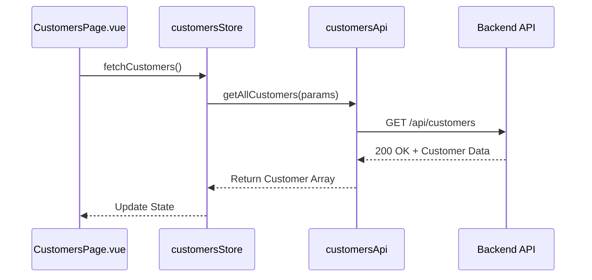
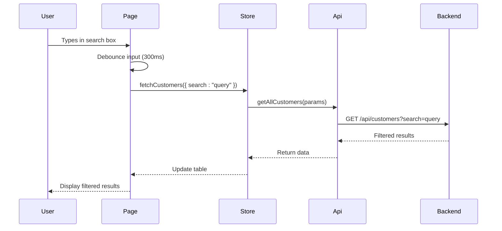
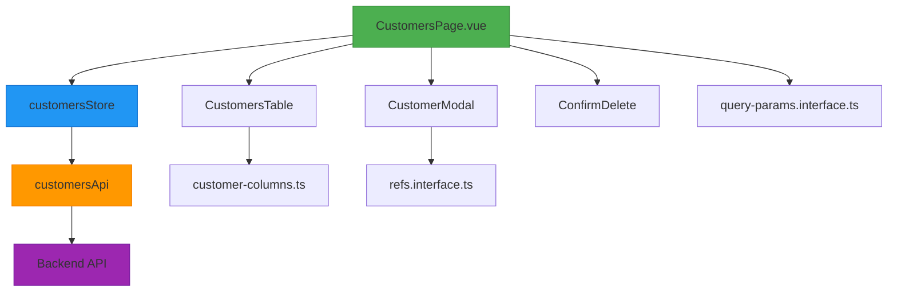

# Customers Page Component

<cite>
**Referenced Files in This Document**  
- [CustomersPage.vue](file://src/root/refs/pages/CustomersPage.vue)
- [customersStore.ts](file://src/root/refs/store/customersStore.ts)
- [customersApi.ts](file://src/root/shared/api/customersApi.ts)
- [CustomerModal.vue](file://src/root/refs/components/CustomerModal.vue)
- [CustomersTable.vue](file://src/root/refs/components/CustomersTable.vue)
- [customer-columns.ts](file://src/root/refs/config/customer-columns.ts)
- [refs.interface.ts](file://src/root/shared/model/interface/refs/refs.interface.ts)
- [query-params.interface.ts](file://src/root/shared/model/interface/query-params.interface.ts)
- [ConfirmDelete.vue](file://src/root/shared/components/ConfirmDelete.vue)
</cite>

## Table of Contents
1. [Introduction](#introduction)
2. [Component Overview](#component-overview)
3. [Data Initialization and State Management](#data-initialization-and-state-management)
4. [Customer Table and Column Configuration](#customer-table-and-column-configuration)
5. [Customer Modal: Creation and Editing](#customer-modal-creation-and-editing)
6. [Form Validation and Error Handling](#form-validation-and-error-handling)
7. [Event Handling: Edit and Delete Actions](#event-handling-edit-and-delete-actions)
8. [Search and Filtering with Backend Synchronization](#search-and-filtering-with-backend-synchronization)
9. [Edge Case Handling](#edge-case-handling)
10. [Architecture and Flow Diagrams](#architecture-and-flow-diagrams)

## Introduction
The **CustomersPage.vue** component serves as the central interface for managing customer data within the application. It provides a comprehensive view of all customer records, supports creation and modification of entries, and enables filtering and searching capabilities. This document details the implementation, data flow, and integration points of the component, focusing on its interaction with the store, API, and reusable UI components.

## Component Overview
The **CustomersPage.vue** component orchestrates customer data management through integration with several key modules:
- **customersStore**: Centralized state management for customer data
- **customersApi**: API service layer for backend communication
- **CustomersTable**: Reusable table component for displaying customer records
- **CustomerModal**: Form component for creating and editing customers
- **ConfirmDelete**: Shared confirmation dialog for deletion operations

The component follows Vue 3's Composition API pattern and leverages Pinia for state management.

**Section sources**
- [CustomersPage.vue](file://src/root/refs/pages/CustomersPage.vue#L1-L50)

## Data Initialization and State Management
Upon mounting, **CustomersPage.vue** initializes the customer data loading process via the **customersStore**. The store abstracts API calls and maintains the state of customer records, loading status, and error conditions.

```typescript
// Inside CustomersPage.vue setup
const customersStore = useCustomersStore()
const loading = ref(false)

onMounted(async () => {
  loading.value = true
  try {
    await customersStore.fetchCustomers()
  } catch (error) {
    // Handle error
  } finally {
    loading.value = false
  }
})
```

The **customersStore** uses **customersApi** to fetch data and updates its state accordingly. This separation ensures a single source of truth and enables state persistence across components.



**Diagram sources**
- [CustomersPage.vue](file://src/root/refs/pages/CustomersPage.vue#L25-L40)
- [customersStore.ts](file://src/root/refs/store/customersStore.ts#L15-L30)
- [customersApi.ts](file://src/root/shared/api/customersApi.ts#L10-L25)

**Section sources**
- [CustomersPage.vue](file://src/root/refs/pages/CustomersPage.vue#L20-L50)
- [customersStore.ts](file://src/root/refs/store/customersStore.ts#L10-L40)

## Customer Table and Column Configuration
The **CustomersTable** component renders customer data in a tabular format. Column definitions are dynamically imported from **customer-columns.ts**, allowing for flexible configuration without modifying the table component.

```typescript
// customer-columns.ts
export const customerColumns = [
  {
    key: 'name',
    title: 'Customer Name',
    sortable: true
  },
  {
    key: 'email',
    title: 'Email',
    render: (row) => h('a', { href: `mailto:${row.email}` }, row.email)
  },
  {
    key: 'actions',
    title: 'Actions',
    render: (row) => h(ActionButtons, { customer: row })
  }
]
```

This modular approach enables easy customization of display fields and behaviors while maintaining a consistent table interface.

**Section sources**
- [CustomersTable.vue](file://src/root/refs/components/CustomersTable.vue#L1-L20)
- [customer-columns.ts](file://src/root/refs/config/customer-columns.ts#L1-L30)

## Customer Modal: Creation and Editing
The **CustomerModal** component is used for both creating new customers and editing existing ones. It is conditionally displayed based on a reactive `showModal` flag and a `currentCustomer` reference.

```typescript
const showModal = ref(false)
const currentCustomer = ref<Customer | null>(null)

const openModal = (customer?: Customer) => {
  currentCustomer.value = customer || null
  showModal.value = true
}
```

When editing, the modal receives the customer object; when creating, it receives no data, triggering form initialization with default values.

```mermaid
flowchart TD
A[User Clicks "Add Customer"] --> B[openModal() called]
B --> C{customer parameter?}
C --> |No| D[Initialize empty form]
C --> |Yes| E[Populate form with customer data]
D --> F[Show Modal]
E --> F
F --> G[User submits form]
G --> H[Validate and Save]
```

**Diagram sources**
- [CustomersPage.vue](file://src/root/refs/pages/CustomersPage.vue#L60-L80)
- [CustomerModal.vue](file://src/root/refs/components/CustomerModal.vue#L15-L45)

**Section sources**
- [CustomersPage.vue](file://src/root/refs/pages/CustomersPage.vue#L55-L90)
- [CustomerModal.vue](file://src/root/refs/components/CustomerModal.vue#L10-L50)

## Form Validation and Error Handling
Form validation is implemented using refs from **refs.interface.ts** and integrated with the component's reactive state. Validation occurs on submission and provides immediate feedback.

```typescript
// refs.interface.ts
export interface CustomerFormErrors {
  name?: string
  email?: string
  phone?: string
}

const formErrors = ref<CustomerFormErrors>({})
```

Upon form submission, the data is validated locally before being sent to the API. If the backend returns validation errors (e.g., duplicate customer name), they are mapped to the appropriate form fields.

```typescript
try {
  if (currentCustomer.value) {
    await customersStore.updateCustomer(currentCustomer.value)
  } else {
    await customersStore.createCustomer(form.value)
  }
  showModal.value = false
} catch (error: any) {
  if (error.response?.data?.errors) {
    formErrors.value = error.response.data.errors
  } else {
    message.error('Failed to save customer')
  }
}
```

**Section sources**
- [CustomerModal.vue](file://src/root/refs/components/CustomerModal.vue#L80-L120)
- [refs.interface.ts](file://src/root/shared/model/interface/refs/refs.interface.ts#L5-L15)

## Event Handling: Edit and Delete Actions
The **CustomersTable** emits events for row actions (edit, delete), which are handled by **CustomersPage.vue**.

```typescript
const handleEdit = (customer: Customer) => {
  openModal(customer)
}

const handleDelete = async (customer: Customer) => {
  dialog.create({
    title: 'Confirm Delete',
    content: `Are you sure you want to delete ${customer.name}?`,
    component: ConfirmDelete,
    onPositiveClick: async () => {
      await customersStore.deleteCustomer(customer.id)
      message.success('Customer deleted')
    }
  })
}
```

The **ConfirmDelete** shared component provides a consistent user experience for destructive actions across the application.

**Section sources**
- [CustomersPage.vue](file://src/root/refs/pages/CustomersPage.vue#L95-L115)
- [ConfirmDelete.vue](file://src/root/shared/components/ConfirmDelete.vue#L1-L20)

## Search and Filtering with Backend Synchronization
Search and filtering are synchronized with the backend using query parameters defined in **query-params.interface.ts**.

```typescript
// query-params.interface.ts
export interface CustomerQueryParams {
  search?: string
  status?: string
  page?: number
  limit?: number
}

const searchQuery = ref('')
const handleSearch = () => {
  customersStore.fetchCustomers({ search: searchQuery.value })
}
```

The search is debounced to prevent excessive API calls and maintains URL state for bookmarking and navigation.



**Diagram sources**
- [CustomersPage.vue](file://src/root/refs/pages/CustomersPage.vue#L45-L55)
- [query-params.interface.ts](file://src/root/shared/model/interface/query-params.interface.ts#L1-L10)

**Section sources**
- [CustomersPage.vue](file://src/root/refs/pages/CustomersPage.vue#L40-L60)
- [query-params.interface.ts](file://src/root/shared/model/interface/query-params.interface.ts#L1-L15)

## Edge Case Handling
The component handles several edge cases:

### Duplicate Customer Names
When attempting to save a customer with a name that already exists, the backend returns a 409 Conflict response. This is caught and displayed as a form error.

```typescript
if (error.response?.status === 409) {
  formErrors.value.name = 'A customer with this name already exists'
}
```

### Network Failure During Save
Network errors are caught and presented with a user-friendly message. The modal remains open to allow retry.

```typescript
if (error.request) {
  message.error('Network error. Please check your connection and try again.')
} else {
  message.error('An unexpected error occurred')
}
```

### Empty State
When no customers exist, the table displays an empty state with a call-to-action to create the first customer.

**Section sources**
- [CustomersPage.vue](file://src/root/refs/pages/CustomersPage.vue#L120-L140)
- [CustomerModal.vue](file://src/root/refs/components/CustomerModal.vue#L130-L150)

## Architecture and Flow Diagrams
The following diagram illustrates the complete architecture of the customer management system:



**Diagram sources**
- [CustomersPage.vue](file://src/root/refs/pages/CustomersPage.vue)
- [customersStore.ts](file://src/root/refs/store/customersStore.ts)
- [customersApi.ts](file://src/root/shared/api/customersApi.ts)
- [customer-columns.ts](file://src/root/refs/config/customer-columns.ts)
- [refs.interface.ts](file://src/root/shared/model/interface/refs/refs.interface.ts)
- [query-params.interface.ts](file://src/root/shared/model/interface/query-params.interface.ts)