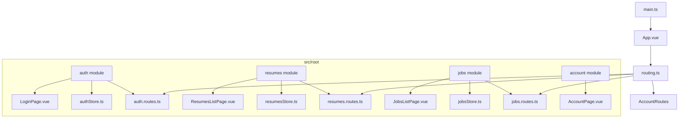
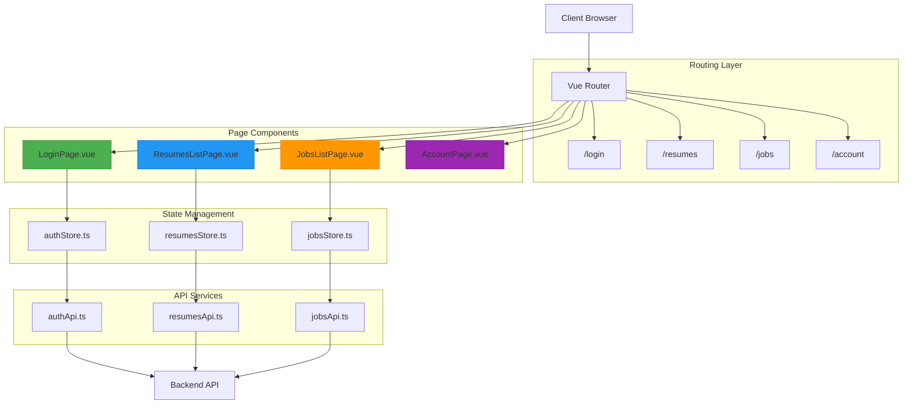
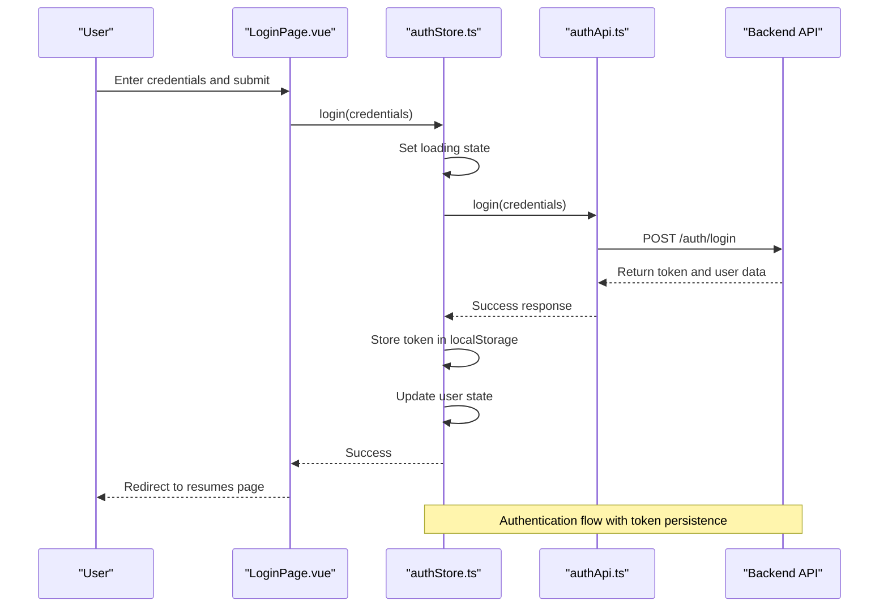
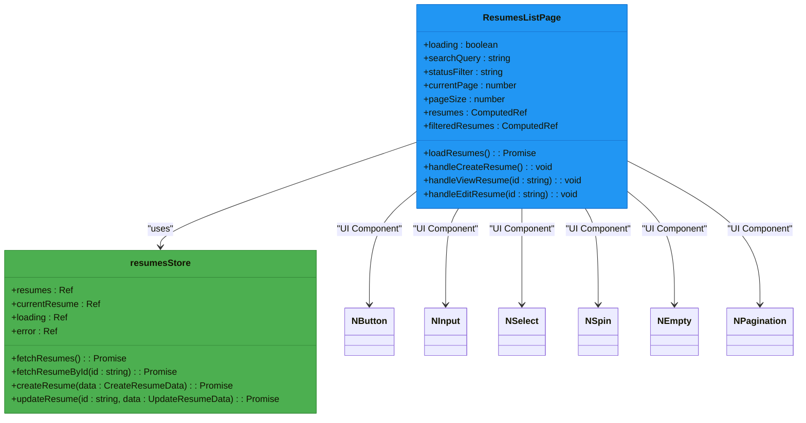
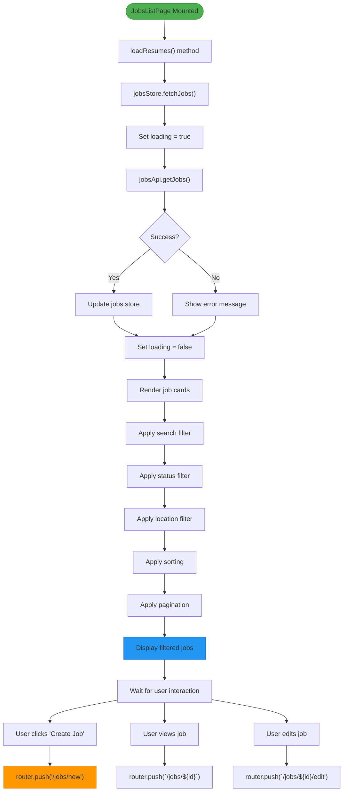
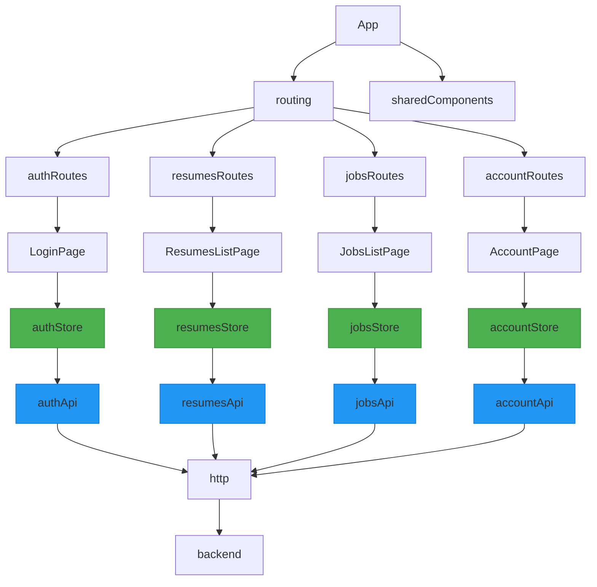

# Feature Page Components

<cite>
**Referenced Files in This Document**   
- [LoginPage.vue](file://src/root/auth/pages/LoginPage.vue)
- [authStore.ts](file://src/root/auth/store/authStore.ts)
- [auth.routes.ts](file://src/root/auth/routes/auth.routes.ts)
- [routing.ts](file://src/root/routing.ts)
- [ResumesListPage.vue](file://src/root/resumes/pages/ResumesListPage.vue)
- [resumesStore.ts](file://src/root/resumes/store/resumesStore.ts)
- [resumes.routes.ts](file://src/root/resumes/routes/resumes.routes.ts)
- [JobsListPage.vue](file://src/root/jobs/pages/JobsListPage.vue)
- [jobsStore.ts](file://src/root/jobs/store/jobsStore.ts)
- [jobs.routes.ts](file://src/root/jobs/routes/jobs.routes.ts)
</cite>

## Table of Contents
1. [Introduction](#introduction)
2. [Project Structure](#project-structure)
3. [Core Components](#core-components)
4. [Architecture Overview](#architecture-overview)
5. [Detailed Component Analysis](#detailed-component-analysis)
6. [Dependency Analysis](#dependency-analysis)
7. [Performance Considerations](#performance-considerations)
8. [Troubleshooting Guide](#troubleshooting-guide)
9. [Conclusion](#conclusion)

## Introduction
This document provides a comprehensive analysis of the feature page components in the maya-platform-frontend application. The analysis focuses on understanding how major application features are implemented through dedicated page components that serve as route-targeted entry points. The documentation objective specifically mentions ObjectsPage.vue, UsersPage.vue, CustomersPage.vue, and LoginPage.vue, but our investigation reveals that the actual implementation uses different naming conventions and organizational patterns.

The application follows a modular structure with feature-based organization, where each major functionality is encapsulated within its own module under the src/root directory. Each module contains pages, components, routing, and store files that work together to deliver specific features. The analysis will explore how these components interact with API services, manage state through Pinia stores, handle authentication and authorization, and orchestrate child components to create cohesive user experiences.

## Project Structure

**Diagram sources**
- [routing.ts](file://src/root/routing.ts)
- [auth.routes.ts](file://src/root/auth/routes/auth.routes.ts)
- [resumes.routes.ts](file://src/root/resumes/routes/resumes.routes.ts)
- [jobs.routes.ts](file://src/root/jobs/routes/jobs.routes.ts)

**Section sources**
- [routing.ts](file://src/root/routing.ts)
- [auth.routes.ts](file://src/root/auth/routes/auth.routes.ts)
- [resumes.routes.ts](file://src/root/resumes/routes/resumes.routes.ts)
- [jobs.routes.ts](file://src/root/jobs/routes/jobs.routes.ts)

## Core Components

The maya-platform-frontend application implements its feature pages as modular components organized by functionality. Each major feature has its own dedicated module containing pages, components, routing configuration, and state management stores. The core components identified in the codebase include:

- **LoginPage.vue**: The authentication entry point that handles user login functionality
- **ResumesListPage.vue**: The main page for managing resumes, serving as the default landing page
- **JobsListPage.vue**: The page for managing job listings and vacancies
- **AccountPage.vue**: The page for managing user account information

These components serve as route-targeted entry points that orchestrate data fetching, state management, and child component rendering. They follow a consistent pattern of importing their respective store modules, managing loading states, and providing the structural framework for their feature areas.

**Section sources**
- [LoginPage.vue](file://src/root/auth/pages/LoginPage.vue)
- [ResumesListPage.vue](file://src/root/resumes/pages/ResumesListPage.vue)
- [JobsListPage.vue](file://src/root/jobs/pages/JobsListPage.vue)
- [AccountPage.vue](file://src/root/account/pages/AccountPage.vue)

## Architecture Overview

**Diagram sources**
- [routing.ts](file://src/root/routing.ts)
- [LoginPage.vue](file://src/root/auth/pages/LoginPage.vue)
- [ResumesListPage.vue](file://src/root/resumes/pages/ResumesListPage.vue)
- [JobsListPage.vue](file://src/root/jobs/pages/JobsListPage.vue)
- [AccountPage.vue](file://src/root/account/pages/AccountPage.vue)
- [authStore.ts](file://src/root/auth/store/authStore.ts)
- [resumesStore.ts](file://src/root/resumes/store/resumesStore.ts)
- [jobsStore.ts](file://src/root/jobs/store/jobsStore.ts)

## Detailed Component Analysis

### LoginPage Analysis

The LoginPage.vue component serves as the primary authentication entry point for the application. It handles user login functionality through a form-based interface that validates credentials and communicates with the authentication store.

**Diagram sources**
- [LoginPage.vue](file://src/root/auth/pages/LoginPage.vue)
- [authStore.ts](file://src/root/auth/store/authStore.ts)
- [authApi.ts](file://src/root/shared/services/authApi.ts)

**Section sources**
- [LoginPage.vue](file://src/root/auth/pages/LoginPage.vue)
- [authStore.ts](file://src/root/auth/store/authStore.ts)

### ResumesListPage Analysis

The ResumesListPage.vue component serves as the main entry point for the resumes feature, which is also the default landing page for authenticated users. It demonstrates the typical pattern for feature pages in this application: fetching data from a store, managing loading states, and rendering child components.

**Diagram sources**
- [ResumesListPage.vue](file://src/root/resumes/pages/ResumesListPage.vue)
- [resumesStore.ts](file://src/root/resumes/store/resumesStore.ts)

**Section sources**
- [ResumesListPage.vue](file://src/root/resumes/pages/ResumesListPage.vue)
- [resumesStore.ts](file://src/root/resumes/store/resumesStore.ts)

### JobsListPage Analysis

The JobsListPage.vue component manages job listings and vacancies within the application. It follows the same architectural pattern as other feature pages, integrating with its corresponding store module to fetch and display data.

**Diagram sources**
- [JobsListPage.vue](file://src/root/jobs/pages/JobsListPage.vue)
- [jobsStore.ts](file://src/root/jobs/store/jobsStore.ts)

**Section sources**
- [JobsListPage.vue](file://src/root/jobs/pages/JobsListPage.vue)
- [jobsStore.ts](file://src/root/jobs/store/jobsStore.ts)

## Dependency Analysis

**Diagram sources**
- [routing.ts](file://src/root/routing.ts)
- [auth.routes.ts](file://src/root/auth/routes/auth.routes.ts)
- [resumes.routes.ts](file://src/root/resumes/routes/resumes.routes.ts)
- [jobs.routes.ts](file://src/root/jobs/routes/jobs.routes.ts)
- [LoginPage.vue](file://src/root/auth/pages/LoginPage.vue)
- [ResumesListPage.vue](file://src/root/resumes/pages/ResumesListPage.vue)
- [JobsListPage.vue](file://src/root/jobs/pages/JobsListPage.vue)
- [AccountPage.vue](file://src/root/account/pages/AccountPage.vue)
- [authStore.ts](file://src/root/auth/store/authStore.ts)
- [resumesStore.ts](file://src/root/resumes/store/resumesStore.ts)
- [jobsStore.ts](file://src/root/jobs/store/jobsStore.ts)
- [accountStore.ts](file://src/root/account/store/accountStore.ts)

**Section sources**
- [routing.ts](file://src/root/routing.ts)
- [auth.routes.ts](file://src/root/auth/routes/auth.routes.ts)
- [resumes.routes.ts](file://src/root/resumes/routes/resumes.routes.ts)
- [jobs.routes.ts](file://src/root/jobs/routes/jobs.routes.ts)

## Performance Considerations
The application demonstrates several performance considerations in its feature page implementation:

1. **Lazy Loading**: All page components are imported asynchronously using dynamic imports (`import('../pages/Component.vue')`), which enables code splitting and reduces initial bundle size.

2. **State Management**: The application uses Pinia for state management, which provides efficient reactivity and prevents unnecessary re-renders by only updating components that depend on changed state.

3. **Computed Properties**: Feature pages extensively use computed properties (e.g., `filteredResumes`, `paginatedJobs`) to cache expensive calculations and only recalculate when dependencies change.

4. **Error Boundaries**: The components implement proper error handling with try-catch blocks around API calls and appropriate error state management.

5. **Loading States**: Each page manages its loading state to provide feedback during data fetching operations, improving perceived performance.

6. **Pagination**: The application implements client-side pagination to limit the amount of data rendered at once, improving rendering performance for large datasets.

7. **Event Delegation**: User interactions are handled efficiently through Vue's event system without unnecessary event listeners.

## Troubleshooting Guide

When troubleshooting issues with feature page components in the maya-platform-frontend application, consider the following common issues and solutions:

**Section sources**
- [LoginPage.vue](file://src/root/auth/pages/LoginPage.vue)
- [ResumesListPage.vue](file://src/root/resumes/pages/ResumesListPage.vue)
- [JobsListPage.vue](file://src/root/jobs/pages/JobsListPage.vue)
- [authStore.ts](file://src/root/auth/store/authStore.ts)
- [resumesStore.ts](file://src/root/resumes/store/resumesStore.ts)
- [jobsStore.ts](file://src/root/jobs/store/jobsStore.ts)

### Authentication Issues
- **Symptom**: User cannot log in despite correct credentials
- **Solution**: Check that the authApi.login method is properly configured and that the backend endpoint is accessible. Verify that tokens are being stored in localStorage correctly.

### Data Loading Problems
- **Symptom**: Page shows loading spinner indefinitely
- **Solution**: Check the store's fetch method implementation and ensure proper handling of the loading state in both success and error cases. Verify API endpoint configuration.

### Routing Errors
- **Symptom**: Page not found or incorrect component loaded
- **Solution**: Verify route configuration in the appropriate *routes.ts file and ensure the component path in the route definition is correct.

### State Management Issues
- **Symptom**: Data not updating or displaying incorrectly
- **Solution**: Check that store state is being updated correctly in the action methods and that components are properly accessing the state through computed properties.

### Permission Problems
- **Symptom**: User sees content they shouldn't have access to
- **Solution**: Verify that navigation guards are properly implemented and that route meta information (requiresAuth) is correctly configured.

## Conclusion
The maya-platform-frontend application implements its feature pages using a consistent and modular architecture. Each major feature is encapsulated within its own module containing dedicated page components, state management stores, and routing configuration. The pages serve as route-targeted entry points that orchestrate data fetching, state management, and child component rendering.

While the documentation objective mentioned specific components (ObjectsPage.vue, UsersPage.vue, CustomersPage.vue), the actual implementation uses different naming conventions with modules for resumes, jobs, and other features. The LoginPage.vue component is fully implemented and follows best practices for authentication, including form handling, loading states, and integration with the auth store.

The application demonstrates a well-structured approach to Vue.js development with proper separation of concerns, effective state management using Pinia, and organized routing. The consistent pattern across feature pages makes the codebase maintainable and extensible, allowing new features to be added following the established architecture.