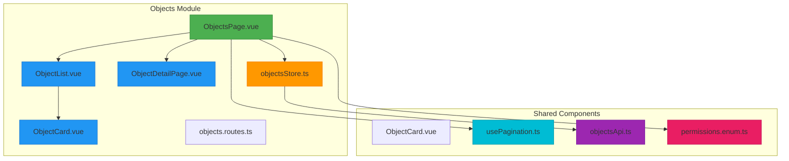
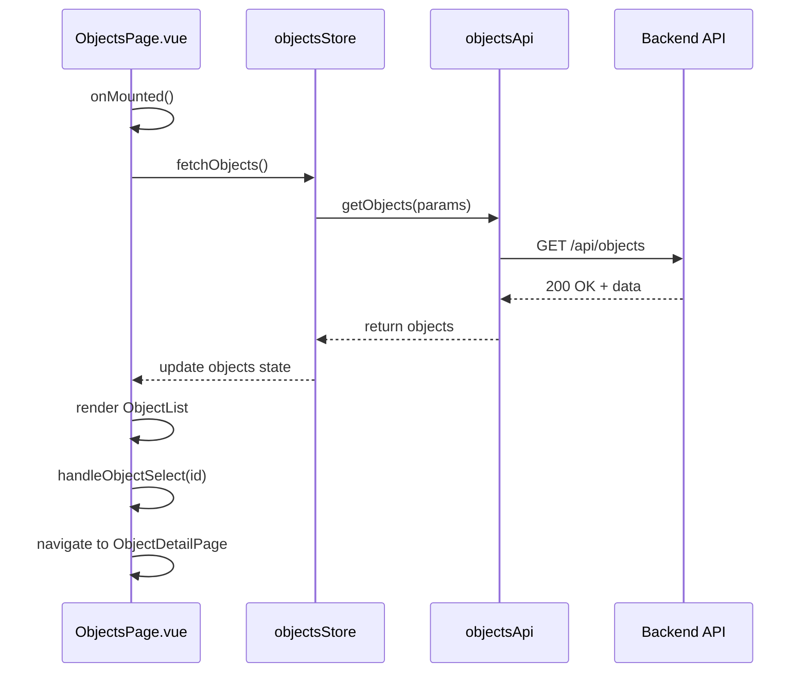
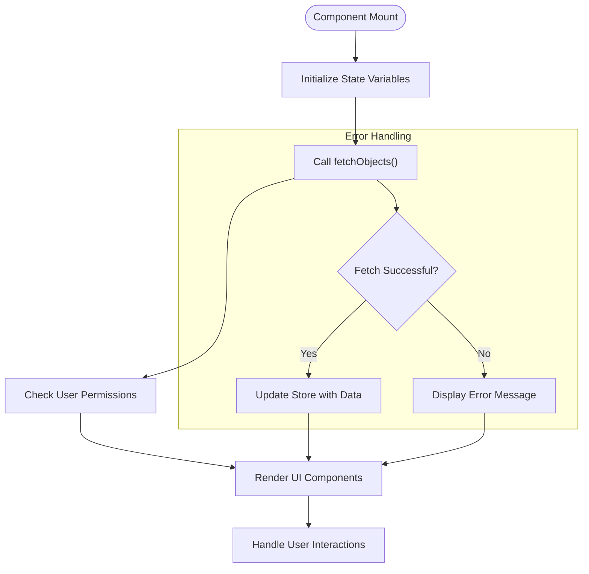
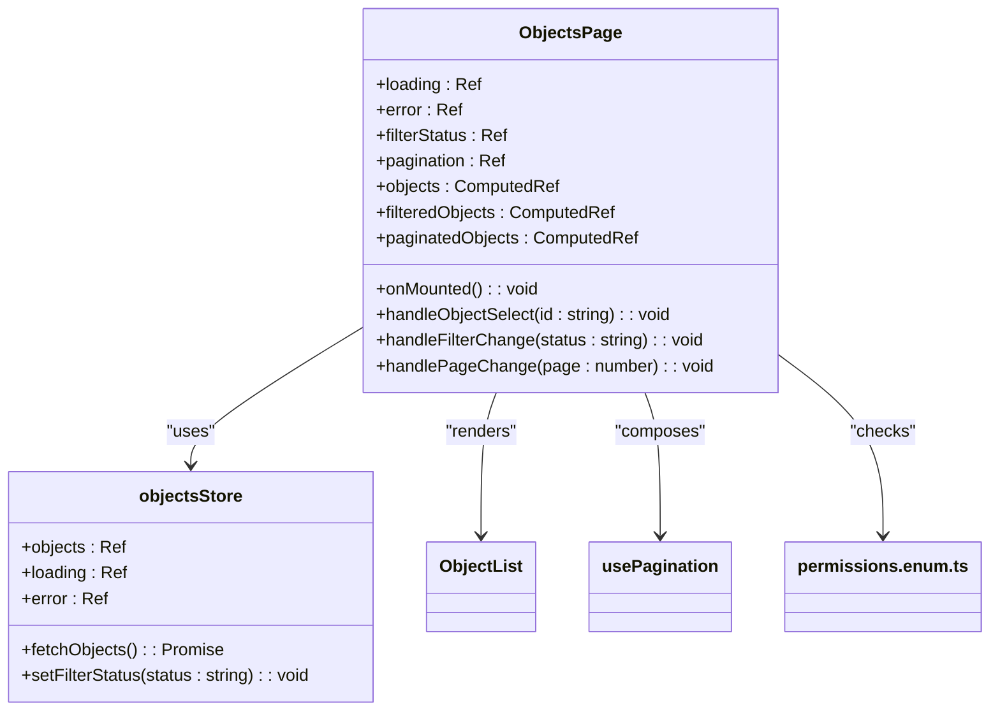
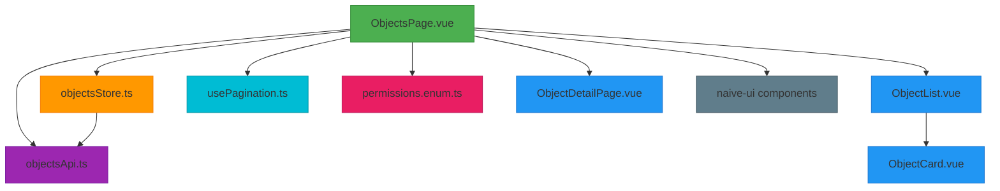

# Objects Page Component

<cite>
**Referenced Files in This Document**
- [ObjectsPage.vue](file://src/root/objects/pages/ObjectsPage.vue)
- [objectsStore.ts](file://src/root/objects/store/objectsStore.ts)
- [objectsApi.ts](file://src/root/shared/api/objectsApi.ts)
- [ObjectList.vue](file://src/root/objects/components/ObjectList.vue)
- [ObjectCard.vue](file://src/root/objects/components/ObjectCard.vue)
- [ObjectDetailPage.vue](file://src/root/objects/pages/ObjectDetailPage.vue)
- [usePagination.ts](file://src/root/shared/composables/usePagination.ts)
- [permissions.enum.ts](file://src/root/shared/model/enum/permissions.enum.ts)
</cite>

## Table of Contents
1. [Introduction](#introduction)
2. [Project Structure](#project-structure)
3. [Core Components](#core-components)
4. [Architecture Overview](#architecture-overview)
5. [Detailed Component Analysis](#detailed-component-analysis)
6. [Dependency Analysis](#dependency-analysis)
7. [Performance Considerations](#performance-considerations)
8. [Troubleshooting Guide](#troubleshooting-guide)
9. [Conclusion](#conclusion)

## Introduction
The **ObjectsPage.vue** component serves as the primary entry point for the object management module in the Maya Platform frontend application. This document provides a comprehensive analysis of its implementation, focusing on data initialization, state management, UI rendering, and integration with supporting components and services. The component orchestrates object data fetching through a Pinia store and API service, manages loading and error states, and renders a list of objects with filtering capabilities. It also handles navigation to detailed views and implements permission-based UI rendering.

## Project Structure
The object management module follows a feature-based organization within the project structure. All components, pages, routing, and store logic are encapsulated within the `src/root/objects` directory. This modular approach promotes separation of concerns and maintainability.

**Diagram sources**
- [ObjectsPage.vue](file://src/root/objects/pages/ObjectsPage.vue)
- [ObjectList.vue](file://src/root/objects/components/ObjectList.vue)
- [objectsStore.ts](file://src/root/objects/store/objectsStore.ts)

**Section sources**
- [ObjectsPage.vue](file://src/root/objects/pages/ObjectsPage.vue)
- [project_structure](file://project_structure#L1-L50)

## Core Components
The **ObjectsPage.vue** component acts as a container that coordinates data fetching, state management, and UI rendering for the object management interface. It initializes data loading through the `useObjectsStore` composable and subscribes to store changes to reactively update the view. The component manages loading and error states, provides filtering capabilities for object status (active/archived), and handles pagination through the `usePagination` composable.

Key responsibilities include:
- Initializing object data fetching on component mount
- Managing loading and error UI states
- Handling object status filters
- Implementing pagination state management
- Rendering the ObjectList component with appropriate props
- Handling object selection and navigation events
- Implementing permission-based UI rendering

**Section sources**
- [ObjectsPage.vue](file://src/root/objects/pages/ObjectsPage.vue)
- [objectsStore.ts](file://src/root/objects/store/objectsStore.ts)

## Architecture Overview
The Objects Page follows a clean architecture pattern with clear separation between presentation, state management, and data access layers. The component interacts with a Pinia store that encapsulates business logic and state, which in turn communicates with an API service for data persistence.

**Diagram sources**
- [ObjectsPage.vue](file://src/root/objects/pages/ObjectsPage.vue#L1-L100)
- [objectsStore.ts](file://src/root/objects/store/objectsStore.ts#L1-L50)
- [objectsApi.ts](file://src/root/shared/api/objectsApi.ts#L1-L30)

## Detailed Component Analysis

### ObjectsPage.vue Analysis
The **ObjectsPage.vue** component is implemented using Vue 3's Composition API with `<script setup>` syntax. It serves as the main container for the object management interface, coordinating data fetching, state management, and UI rendering.

#### Lifecycle and Initialization
The component uses the `onMounted` lifecycle hook to initialize data fetching when the component is mounted. This ensures that object data is loaded as soon as the page becomes active.

**Diagram sources**
- [ObjectsPage.vue](file://src/root/objects/pages/ObjectsPage.vue#L50-L100)
- [objectsStore.ts](file://src/root/objects/store/objectsStore.ts#L20-L40)

#### Data Management and State
The component manages several state variables to track the UI state and user interactions:

**State Variables:**
- `loading`: boolean flag to control loading state display
- `error`: string to store error messages for user feedback
- `filterStatus`: string to track the current object status filter (active/archived)
- `pagination`: object managing current page, page size, and total counts

The component subscribes to the `useObjectsStore` to reactively respond to changes in the object collection. When the store's objects array is updated, the component automatically re-renders to reflect the latest data.

**Diagram sources**
- [ObjectsPage.vue](file://src/root/objects/pages/ObjectsPage.vue#L20-L80)
- [objectsStore.ts](file://src/root/objects/store/objectsStore.ts#L10-L30)
- [usePagination.ts](file://src/root/shared/composables/usePagination.ts#L5-L20)

#### UI Rendering and Component Integration
The component renders the **ObjectList** component, passing the filtered and paginated objects as props. It also handles events from child components, such as object selection, which triggers navigation to the **ObjectDetailPage**.

The integration with **ObjectCard** is indirect, as ObjectList renders individual ObjectCard components for each object in the list. The ObjectsPage component may pass configuration or event handlers through ObjectList to the individual cards.

Permission-based UI rendering is implemented using the **permissions.enum.ts** file, which defines the user's permissions. The component checks these permissions to determine which actions are available to the current user (e.g., create, edit, delete objects).

#### Error Handling and Recovery
The component implements robust error handling patterns to provide a resilient user experience:

1. **Loading States**: Displays a loading spinner during data fetching operations
2. **Error Display**: Shows user-friendly error messages when API calls fail
3. **Retry Mechanisms**: Provides options to retry failed operations
4. **Graceful Degradation**: Continues to display cached data when possible

The error recovery pattern follows a standard approach:
- Catch errors from the store actions
- Display appropriate error messages using the UI message service
- Log errors for debugging purposes
- Provide user options to retry the operation

**Section sources**
- [ObjectsPage.vue](file://src/root/objects/pages/ObjectsPage.vue)
- [objectsStore.ts](file://src/root/objects/store/objectsStore.ts)
- [ObjectList.vue](file://src/root/objects/components/ObjectList.vue)

## Dependency Analysis
The ObjectsPage component has several key dependencies that enable its functionality:

**Diagram sources**
- [ObjectsPage.vue](file://src/root/objects/pages/ObjectsPage.vue#L1-L20)
- [objectsStore.ts](file://src/root/objects/store/objectsStore.ts#L1-L10)
- [usePagination.ts](file://src/root/shared/composables/usePagination.ts#L1-L5)

## Performance Considerations
The ObjectsPage component implements several performance optimizations:

1. **Lazy Loading**: Data is fetched only when the component is mounted, reducing initial load time
2. **Pagination**: Large object collections are paginated to minimize memory usage and improve rendering performance
3. **Computed Properties**: Uses Vue's computed properties to efficiently calculate filtered and paginated object lists
4. **Event Delegation**: Handles events at the container level when possible to reduce event listeners
5. **Conditional Rendering**: Only renders components and elements when necessary based on state

The component also addresses potential performance issues:
- **Stale Data**: Implements store subscription to ensure data is always up-to-date
- **Memory Leaks**: Properly cleans up event listeners and subscriptions on component unmount
- **Excessive Re-renders**: Uses Vue's reactivity system efficiently to minimize unnecessary updates

## Troubleshooting Guide
Common issues with the ObjectsPage component and their solutions:

**Issue: Objects not loading**
- **Cause**: API endpoint unreachable or authentication issues
- **Solution**: Check network tab for API calls, verify authentication token, ensure backend is running

**Issue: Stale data displayed**
- **Cause**: Store not properly updated after data changes
- **Solution**: Verify store actions are correctly updating state, check for race conditions in async operations

**Issue: Pagination not working correctly**
- **Cause**: Incorrect page state management or API pagination parameters
- **Solution**: Verify usePagination composable is correctly integrated, check API endpoint supports pagination

**Issue: Filter not applying**
- **Cause**: Filter state not properly bound to store or computed properties
- **Solution**: Check filterStatus ref is correctly passed to store, verify computed properties recalculate on filter change

**Issue: Permission-based UI not rendering correctly**
- **Cause**: User permissions not properly loaded or checked
- **Solution**: Verify permissions.enum.ts is correctly imported, check user authentication state

**Section sources**
- [ObjectsPage.vue](file://src/root/objects/pages/ObjectsPage.vue)
- [objectsStore.ts](file://src/root/objects/store/objectsStore.ts)
- [usePagination.ts](file://src/root/shared/composables/usePagination.ts)

## Conclusion
The **ObjectsPage.vue** component serves as a robust entry point for the object management module, effectively coordinating data fetching, state management, and UI rendering. Its implementation follows Vue 3 best practices with the Composition API, providing a maintainable and scalable solution. The component's integration with the Pinia store, API service, and reusable UI components creates a cohesive user experience while maintaining separation of concerns. With proper error handling, performance optimizations, and permission-based access control, the component provides a reliable interface for managing objects within the Maya Platform application.