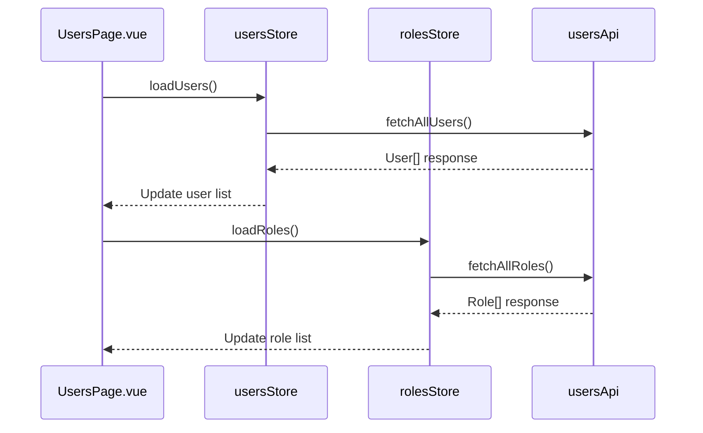
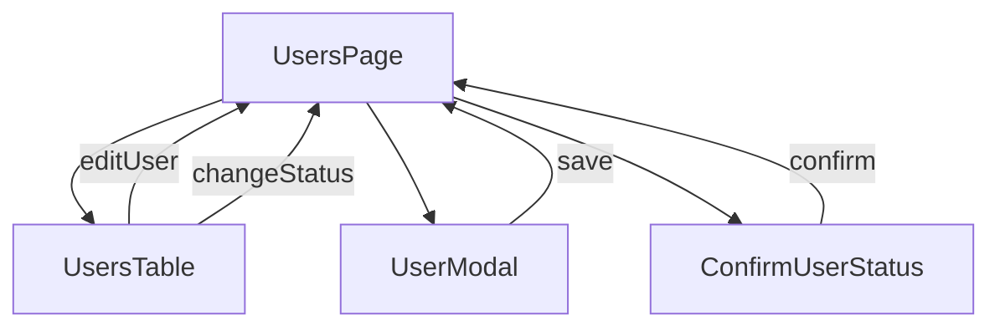
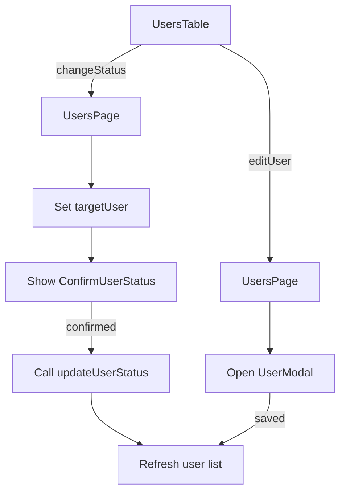
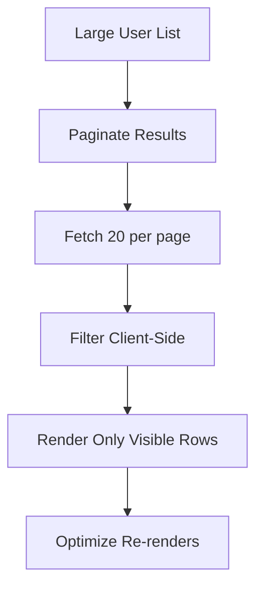

# Users Page Component

<cite>
**Referenced Files in This Document**  
- [UsersPage.vue](file://src/root/users/pages/UsersPage.vue)
- [usersStore.ts](file://src/root/users/store/usersStore.ts)
- [usersApi.ts](file://src/root/shared/api/usersApi.ts)
- [UserModal.vue](file://src/root/users/components/UserModal.vue)
- [ConfirmUserStatus.vue](file://src/root/users/components/ConfirmUserStatus.vue)
- [UsersTable.vue](file://src/root/users/components/UsersTable.vue)
- [users-columns.ts](file://src/root/users/config/users-columns.ts)
- [authStore.ts](file://src/root/auth/store/authStore.ts)
- [rolesStore.ts](file://src/root/users/store/rolesStore.ts)
</cite>

## Table of Contents
1. [Introduction](#introduction)
2. [Core Responsibilities](#core-responsibilities)
3. [Data Flow and State Management](#data-flow-and-state-management)
4. [User Interface Components](#user-interface-components)
5. [Event Handling and User Actions](#event-handling-and-user-actions)
6. [Role-Based Permissions and Authorization](#role-based-permissions-and-authorization)
7. [Column Configuration and Table Behavior](#column-configuration-and-table-behavior)
8. [Search Filtering and Performance](#search-filtering-and-performance)
9. [Error Handling and API Responses](#error-handling-and-api-responses)
10. [Performance Considerations](#performance-considerations)
11. [Component Lifecycle and Cleanup](#component-lifecycle-and-cleanup)

## Introduction
The **UsersPage.vue** component serves as the central interface for managing users and roles within the application. It orchestrates data loading, user interaction, and modal operations for creating and editing user records. This document details its architecture, integration with stores and APIs, event flow, permission handling, and performance characteristics.

## Core Responsibilities
The UsersPage component is responsible for:
- Initializing and managing user and role data via **usersStore** and **rolesStore**
- Coordinating with **usersApi** to fetch and update user information
- Rendering the **UsersTable** component with dynamic column configuration
- Managing the lifecycle of **UserModal** for create/edit operations
- Conditionally displaying the **ConfirmUserStatus** modal for status changes
- Enforcing role-based UI disablement through **authStore**

**Section sources**
- [UsersPage.vue](file://src/root/users/pages/UsersPage.vue#L1-L50)

## Data Flow and State Management
UsersPage leverages Pinia stores to manage application state. On component mount, it dispatches actions to load users and roles.



**Diagram sources**
- [UsersPage.vue](file://src/root/users/pages/UsersPage.vue#L51-L70)
- [usersStore.ts](file://src/root/users/store/usersStore.ts#L15-L40)
- [rolesStore.ts](file://src/root/users/store/rolesStore.ts#L10-L35)
- [usersApi.ts](file://src/root/shared/api/usersApi.ts#L5-L25)

**Section sources**
- [UsersPage.vue](file://src/root/users/pages/UsersPage.vue#L51-L80)

## User Interface Components
The page integrates several reusable components to manage user data:

### UsersTable
Displays the list of users with sortable and filterable columns. Emits events for row-level actions.

### UserModal
Handles creation and editing of user records. Binds to user data and validates input before submission.

### ConfirmUserStatus
A conditional modal that appears when changing a user’s active status, requiring confirmation.



**Diagram sources**
- [UsersPage.vue](file://src/root/users/pages/UsersPage.vue#L81-L100)
- [UsersTable.vue](file://src/root/users/components/UsersTable.vue#L1-L20)
- [UserModal.vue](file://src/root/users/components/UserModal.vue#L1-L15)
- [ConfirmUserStatus.vue](file://src/root/users/components/ConfirmUserStatus.vue#L1-L10)

**Section sources**
- [UsersPage.vue](file://src/root/users/pages/UsersPage.vue#L81-L120)

## Event Handling and User Actions
UsersPage listens for events emitted by **UsersTable** and responds accordingly:

- **editUser**: Opens **UserModal** with the selected user’s data
- **changeStatus**: Sets the target user and shows **ConfirmUserStatus** modal
- **createUser**: Opens **UserModal** in creation mode

Upon confirmation in **ConfirmUserStatus**, the component calls `updateUserStatus` via **usersApi** and refreshes the list.



**Diagram sources**
- [UsersPage.vue](file://src/root/users/pages/UsersPage.vue#L121-L160)
- [UsersTable.vue](file://src/root/users/components/UsersTable.vue#L45-L60)
- [ConfirmUserStatus.vue](file://src/root/users/components/ConfirmUserStatus.vue#L25-L40)

**Section sources**
- [UsersPage.vue](file://src/root/users/pages/UsersPage.vue#L121-L180)

## Role-Based Permissions and Authorization
The **authStore** provides the current user’s role and permissions. UsersPage uses this to disable UI elements for unauthorized actions.

For example:
- Only **admin** users can deactivate other admins
- **moderator** users cannot edit roles

```javascript
const canEditUser = computed(() => {
  return userRole.value === 'admin' || 
         (userRole.value === 'moderator' && targetUser.role !== 'admin');
});
```

Buttons in **UsersTable** and **UserModal** are conditionally disabled based on these computed properties.

**Section sources**
- [UsersPage.vue](file://src/root/users/pages/UsersPage.vue#L181-L200)
- [authStore.ts](file://src/root/auth/store/authStore.ts#L30-L55)

## Column Configuration and Table Behavior
Column definitions are externalized in **users-columns.ts**, allowing flexible table rendering.

Example column configuration:
```typescript
export const userColumns: TableColumn[] = [
  { key: 'firstName', title: 'First Name', dataIndex: 'firstName', sortable: true },
  { key: 'lastName', title: 'Last Name', dataIndex: 'lastName', sortable: true },
  { key: 'email', title: 'Email', dataIndex: 'email', ellipsis: true },
  { key: 'role', title: 'Role', dataIndex: 'role', filterable: true },
  { key: 'status', title: 'Status', render: (value) => value ? 'Active' : 'Inactive' }
];
```

These columns are passed to **UsersTable** and support sorting, filtering, and custom rendering.

**Section sources**
- [users-columns.ts](file://src/root/users/config/users-columns.ts#L1-L30)
- [UsersTable.vue](file://src/root/users/components/UsersTable.vue#L61-L80)

## Search Filtering and Performance
UsersPage implements client-side search filtering using a reactive search query. As the user types, the displayed user list is filtered in real time.

For large datasets, pagination is handled via **usePagination** composable, limiting API load and improving responsiveness.

```javascript
const filteredUsers = computed(() => {
  return users.value.filter(user =>
    user.firstName.toLowerCase().includes(searchQuery.value.toLowerCase()) ||
    user.lastName.toLowerCase().includes(searchQuery.value.toLowerCase()) ||
    user.email.toLowerCase().includes(searchQuery.value.toLowerCase())
  );
});
```

**Section sources**
- [UsersPage.vue](file://src/root/users/pages/UsersPage.vue#L201-L220)
- [usePagination.ts](file://src/root/shared/composables/usePagination.ts#L5-L25)

## Error Handling and API Responses
API errors during user updates are caught and displayed via a notification system. The component uses try/catch blocks around API calls:

```javascript
try {
  await usersApi.updateUser(userData);
  showSuccessNotification('User updated successfully');
} catch (error) {
  const apiError = error as ApiError;
  showErrorNotification(apiError.message || 'Failed to update user');
}
```

Errors are logged and user-friendly messages are shown without exposing sensitive details.

**Section sources**
- [UsersPage.vue](file://src/root/users/pages/UsersPage.vue#L221-L240)
- [usersApi.ts](file://src/root/shared/api/usersApi.ts#L26-L40)

## Performance Considerations
To handle large user lists efficiently:
- Pagination limits data fetched per request
- Computed properties are used for filtering to avoid re-rendering
- Event listeners are cleaned up on component unmount
- Modal components are lazy-loaded to reduce initial bundle size



**Section sources**
- [UsersPage.vue](file://src/root/users/pages/UsersPage.vue#L241-L260)
- [usePagination.ts](file://src/root/shared/composables/usePagination.ts#L26-L50)

## Component Lifecycle and Cleanup
On component unmount, UsersPage ensures all event listeners are removed and subscriptions are cleaned up to prevent memory leaks.

```javascript
onBeforeUnmount(() => {
  // Clean up any event listeners or subscriptions
  resetUsersStore();
});
```

This maintains application stability during navigation.

**Section sources**
- [UsersPage.vue](file://src/root/users/pages/UsersPage.vue#L261-L270)