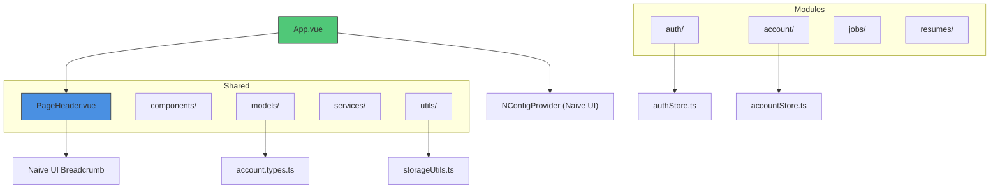
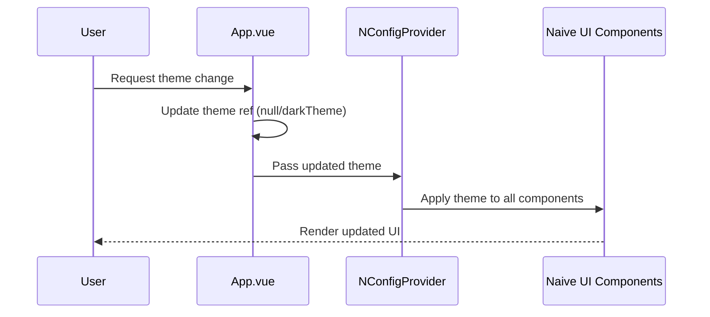
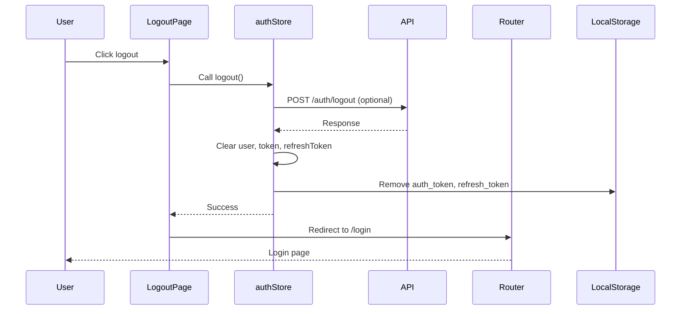

# Header Component

<cite>
**Referenced Files in This Document**   
- [App.vue](file://src/root/App.vue)
- [PageHeader.vue](file://src/root/shared/components/PageHeader.vue)
- [accountStore.ts](file://src/root/account/store/accountStore.ts)
- [authStore.ts](file://src/root/auth/store/authStore.ts)
- [account.types.ts](file://src/root/shared/models/account.types.ts)
- [storageUtils.ts](file://src/root/shared/utils/storageUtils.ts)
- [constants.ts](file://src/root/shared/utils/constants.ts)
</cite>

## Table of Contents
1. [Introduction](#introduction)
2. [Project Structure](#project-structure)
3. [Core Components](#core-components)
4. [Architecture Overview](#architecture-overview)
5. [Detailed Component Analysis](#detailed-component-analysis)
6. [Theme Management System](#theme-management-system)
7. [User Session and Authentication Flow](#user-session-and-authentication-flow)
8. [Accessibility and Responsive Design](#accessibility-and-responsive-design)
9. [Conclusion](#conclusion)

## Introduction
The HeaderComponent.vue (referred to as PageHeader.vue in the codebase) is a shared UI component responsible for rendering consistent page headers across the maya-platform-frontend application. It provides structured presentation of page titles, descriptions, breadcrumbs, and action buttons. While not directly handling user session display or theme toggling itself, it integrates into a broader system where these features are managed at the application level through shared state and configuration. This document analyzes its role within the ecosystem, particularly how it fits into navigation, theming, and user interaction patterns.

## Project Structure
The project follows a modular, feature-based architecture with clear separation of concerns. The shared components reside under `src/root/shared/components`, indicating their reusable nature across different modules such as account, auth, jobs, and resumes. The PageHeader component is part of this shared library, designed for consistent UI rendering. State management is handled via Pinia stores located in respective module directories, while utilities and models are centralized for maintainability.



**Diagram sources**
- [App.vue](file://src/root/App.vue#L1-L38)
- [PageHeader.vue](file://src/root/shared/components/PageHeader.vue#L1-L106)

**Section sources**
- [App.vue](file://src/root/App.vue#L1-L38)
- [PageHeader.vue](file://src/root/shared/components/PageHeader.vue#L1-L106)

## Core Components
The core components relevant to the header functionality include the PageHeader.vue for UI rendering, App.vue for global configuration, and associated Pinia stores (authStore.ts, accountStore.ts) for managing user session and preferences. The integration with Naive UI's NConfigProvider enables theme propagation throughout the application. The PageHeader component accepts structured input via props to render dynamic content such as breadcrumbs and titles, while delegating actions to parent components through slots.

**Section sources**
- [PageHeader.vue](file://src/root/shared/components/PageHeader.vue#L1-L106)
- [App.vue](file://src/root/App.vue#L1-L38)

## Architecture Overview
The application architecture employs a component-based design using Vue 3 with the Composition API. Global theming is managed through Naive UI's NConfigProvider, which receives a reactive theme reference from App.vue. User authentication state is maintained in Pinia stores, with session persistence handled via localStorage. The PageHeader component operates as a presentational element, receiving data from parent pages and rendering standardized layouts. Communication between components occurs through props, slots, and shared state rather than event emission.

```mermaid
graph TD
A[App.vue] --> B[NConfigProvider]
A --> C[Router View]
C --> D[Page Components]
D --> E[PageHeader.vue]
E --> F[Breadcrumbs]
E --> G[Title & Description]
E --> H[Action Slot]
I[authStore.ts] --> J[User Session]
K[accountStore.ts] --> L[User Preferences]
M[storageUtils.ts] --> N[localStorage]
B < --> |theme| A
J < --> |auth state| D
L < --> |preferences| D
N < --> |persistence| I
N < --> |persistence| K
style A fill:#50c878,stroke:#333
style E fill:#4a90e2,stroke:#333
style I fill:#f39c12,stroke:#333
style K fill:#f39c12,stroke:#333
```

**Diagram sources**
- [App.vue](file://src/root/App.vue#L1-L38)
- [PageHeader.vue](file://src/root/shared/components/PageHeader.vue#L1-L106)
- [authStore.ts](file://src/root/auth/store/authStore.ts#L44-L95)
- [accountStore.ts](file://src/root/account/store/accountStore.ts#L0-L42)

## Detailed Component Analysis

### PageHeader.vue Analysis
The PageHeader component serves as a standardized header for application pages, providing a consistent user experience. It accepts a title, optional description, and breadcrumb trail as props, rendering them in a structured layout. Actions are injected via named slots, allowing parent components to define context-specific buttons or controls.

```mermaid
classDiagram
class PageHeader {
+title : string
+description? : string
+breadcrumbs? : BreadcrumbItem[]
-$slots : actions, extra
}
class BreadcrumbItem {
+label : string
+to? : string
}
PageHeader --> BreadcrumbItem : "contains"
PageHeader --> "Slot" : "actions"
PageHeader --> "Slot" : "extra"
```

**Diagram sources**
- [PageHeader.vue](file://src/root/shared/components/PageHeader.vue#L1-L106)

**Section sources**
- [PageHeader.vue](file://src/root/shared/components/PageHeader.vue#L1-L106)

#### Implementation Details
The component uses Vue's script setup syntax with TypeScript for type safety. Breadcrumbs are rendered conditionally based on the presence of the `breadcrumbs` prop, with navigation handled via Vue Router's `$router.push()` method. The layout employs CSS Flexbox for responsive alignment, with styling controlled through CSS variables defined in the global stylesheet.

```vue
<template>
  <div class="page-header">
    <div class="page-header__content">
      <div class="page-header__main">
        <!-- Breadcrumbs -->
        <div v-if="breadcrumbs?.length" class="page-header__breadcrumbs">
          <NBreadcrumb>
            <NBreadcrumbItem
              v-for="(item, index) in breadcrumbs"
              :key="index"
              :clickable="!!item.to"
              @click="item.to && $router.push(item.to)"
            >
              {{ item.label }}
            </NBreadcrumbItem>
          </NBreadcrumb>
        </div>
        
        <!-- Title and Description -->
        <div class="page-header__title-section">
          <h1 class="page-header__title">{{ title }}</h1>
          <p v-if="description" class="page-header__description">
            {{ description }}
          </p>
        </div>
      </div>
      
      <!-- Actions -->
      <div v-if="$slots.actions" class="page-header__actions">
        <slot name="actions" />
      </div>
    </div>
    
    <!-- Extra content -->
    <div v-if="$slots.extra" class="page-header__extra">
      <slot name="extra" />
    </div>
  </div>
</template>
```

## Theme Management System
While the PageHeader component itself does not handle theme toggling, it operates within a theming system established in App.vue. The application uses Naive UI's theme system, where the `NConfigProvider` receives a reactive `theme` reference. Currently, the theme is set to `null` for light mode, with `darkTheme` available for dark mode. Although the toggle logic is commented out, the infrastructure supports dynamic theme switching.



**Diagram sources**
- [App.vue](file://src/root/App.vue#L1-L38)

**Section sources**
- [App.vue](file://src/root/App.vue#L1-L38)

The theme preference could be persisted using `storageUtils.ts`, which provides utilities for localStorage interaction. User preferences including theme selection are defined in the `AccountPreferences` interface within `account.types.ts`.

## User Session and Authentication Flow
User session management is handled by `authStore.ts`, which maintains authentication state including user data, tokens, and loading/error states. The logout process clears both in-memory state and localStorage entries for authentication tokens. The `SUCCESS_MESSAGES.LOGOUT` constant contains the localized logout confirmation message.



**Diagram sources**
- [authStore.ts](file://src/root/auth/store/authStore.ts#L44-L95)
- [LogoutPage.vue](file://src/root/auth/pages/LogoutPage.vue#L0-L81)

**Section sources**
- [authStore.ts](file://src/root/auth/store/authStore.ts#L44-L95)
- [LogoutPage.vue](file://src/root/auth/pages/LogoutPage.vue#L0-L81)

User profile data, including preferences like theme selection, is managed through `accountStore.ts` and the `UserProfile` interface. The `UpdatePreferencesData` type defines the structure for updating user settings, including theme preference as 'light', 'dark', or 'auto'.

## Accessibility and Responsive Design
The PageHeader component incorporates several accessibility features:
- Semantic HTML structure with proper heading levels (`<h1>` for title)
- Conditional rendering of elements to avoid empty headings
- Use of ARIA-compatible components from Naive UI (NBreadcrumb, NBreadcrumbItem)
- Responsive layout using CSS Flexbox with spacing controlled by CSS variables

The component adapts to different screen sizes through the global SCSS variables system, which defines spacing and typography scales. The layout maintains readability on smaller screens by stacking elements vertically when necessary, though specific mobile adaptations are not explicitly defined in the component's scoped styles.

## Conclusion
The PageHeader component serves as a critical UI element for maintaining consistency across the maya-platform-frontend application. While it does not directly implement theme toggling or user session display, it integrates seamlessly with the broader system architecture that manages these concerns. The component's design emphasizes reusability, accessibility, and responsiveness, adhering to modern Vue development practices. Future enhancements could include integrating theme toggle controls directly into the header and expanding accessibility features such as keyboard navigation for breadcrumb items.