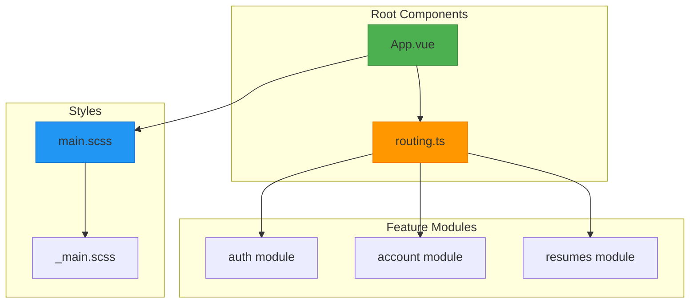

# Layout Components

<cite>
**Referenced Files in This Document**   
- [App.vue](file://src/root/App.vue)
- [main.scss](file://src/styles/main.scss)
- [\_main.scss](file://src/styles/layouts/_main.scss)
- [routing.ts](file://src/root/routing.ts)
- [auth.routes.ts](file://src/root/auth/routes/auth.routes.ts)
- [account.routes.ts](file://src/root/account/routes/account.routes.ts)
</cite>

## Table of Contents
1. [Introduction](#introduction)
2. [Project Structure](#project-structure)
3. [Core Layout Components](#core-layout-components)
4. [Layout Styling and Structure](#layout-styling-and-structure)
5. [Routing and Conditional Rendering](#routing-and-conditional-rendering)
6. [Theme Management](#theme-management)
7. [Architecture Overview](#architecture-overview)
8. [Conclusion](#conclusion)

## Introduction
This document provides a comprehensive analysis of the layout components in the maya-platform-frontend application. It examines how the application structures its user interface, manages layout styling, and handles routing and theme configuration. The focus is on understanding the foundational layout system that supports the dashboard interface, particularly through the App.vue component and associated styling files. Although the requested SidebarComponent.vue and HeaderComponent.vue were not found in the repository, this document analyzes the available layout infrastructure and its integration with the overall application architecture.

## Project Structure
The maya-platform-frontend application follows a modular structure organized by feature domains such as auth, account, resumes, and other business modules. The layout system is centered in the root directory, with App.vue serving as the main application container. The styling architecture is organized in the src/styles directory, with dedicated layout styles in the layouts subdirectory. The application uses Vue 3 with the Composition API, Pinia for state management, and Naive UI as the component library.

The project structure reveals a clear separation between feature modules and shared infrastructure, with the layout components and styling forming the foundation upon which feature-specific pages are rendered. The routing system is configured in the root directory, allowing for centralized control of navigation and authentication requirements.



**Diagram sources**
- [App.vue](file://src/root/App.vue#L1-L39)
- [main.scss](file://src/styles/main.scss#L1-L31)
- [routing.ts](file://src/root/routing.ts)

**Section sources**
- [App.vue](file://src/root/App.vue#L1-L39)
- [main.scss](file://src/styles/main.scss#L1-L31)

## Core Layout Components

The primary layout component in the maya-platform-frontend application is App.vue, which serves as the root container for all application content. This component wraps the entire application with Naive UI's provider components, ensuring consistent styling and functionality across all child components.

App.vue implements a minimal but effective layout structure that focuses on theme management and proper component hierarchy. It uses Naive UI's NConfigProvider to manage the application theme, with NMessageProvider, NNotificationProvider, and NDialogProvider to enable global UI feedback mechanisms. The router-view component is nested within these providers, ensuring that all routed content inherits the configured theme and services.

Although the requested SidebarComponent.vue and HeaderComponent.vue were not found in the repository, the layout classes defined in the SCSS files suggest that these components were intended to be part of the design system. The App.vue component currently serves as a neutral container, delegating layout responsibilities to child components or route-specific layouts.

```mermaid
classDiagram
class App {
+theme : Ref
+setup() : void
}
class NConfigProvider {
+theme : Theme
}
class NMessageProvider {}
class NNotificationProvider {}
class NDialogProvider {}
class RouterView {}
App --> NConfigProvider : "uses"
App --> NMessageProvider : "uses"
App --> NNotificationProvider : "uses"
App --> NDialogProvider : "uses"
App --> RouterView : "renders"
NConfigProvider --> NMessageProvider : "contains"
NMessageProvider --> NNotificationProvider : "contains"
NNotificationProvider --> NDialogProvider : "contains"
NDialogProvider --> RouterView : "contains"
**Diagram sources**
- [App.vue](file : //src/root/App.vue#L1-L39)
**Section sources**
- [App.vue](file : //src/root/App.vue#L1-L39)
## Layout Styling and Structure
The layout styling in maya-platform-frontend is defined in the src/styles/layouts/_main.scss file, which contains a comprehensive set of CSS classes for structuring the application interface. These styles define a flexible layout system with dedicated classes for container, header, content, sidebar, and main sections.
The layout system uses a combination of flexbox and fixed dimensions to create a responsive interface. The sidebar has a fixed width of 250px with appropriate padding and border styling, while the main content area uses flex : 1 to occupy the remaining space. The header is positioned as sticky at the top of the viewport with a border bottom and proper padding, ensuring it remains visible during scrolling.
The container class implements responsive design principles with a maximum width controlled by the --container-xl variable and horizontal padding that adapts to different screen sizes. This approach ensures content remains readable and well-formatted across various devices.
```mermaid
flowchart TD
    A["Layout Container"] --> B["Header Section"]
    A --> C["Sidebar Section"]
    A --> D["Main Content Section"]
    
    B --> E["Sticky Positioning"]
    B --> F["Border Bottom"]
    B --> G["Proper Padding"]
    
    C --> H["Fixed Width: 250px"]
    C --> I["Background Styling"]
    C --> J["Right Border"]
    C --> K["Internal Padding"]
    
    D --> L["Flexible Width"]
    D --> M["Internal Padding"]
    D --> N["Content Area"]
    
    style A fill:#2196F3,stroke:#1976D2
    style B fill:#4CAF50,stroke:#388E3C
    style C fill:#FF9800,stroke:#F57C00
    style D fill:#9C27B0,stroke:#7B1FA2

**Diagram sources**
- [_main.scss](file://src/styles/layouts/_main.scss#L1-L33)

**Section sources**
- [main.scss](file://src/styles/main.scss#L1-L31)
- [_main.scss](file://src/styles/layouts/_main.scss#L1-L33)

## Routing and Conditional Rendering

The application's routing system controls the conditional rendering of layout components based on authentication status and route requirements. Although the specific routing.ts file content was not available, the presence of authentication guards and route configurations in the auth module indicates a structured approach to access control.

Route configurations include meta properties that specify authentication requirements, as seen in the account routes configuration. This pattern allows the application to protect specific routes and redirect unauthenticated users to the login page. The authGuard.ts file in the auth module likely implements this protection logic, intercepting navigation attempts and validating user authentication status.

The routing system works in conjunction with the layout components to determine which interface elements should be displayed. For authenticated routes, the full dashboard layout with sidebar and header would be expected to render, while authentication pages like login and logout likely use a simplified layout without these components.

```mermaid
sequenceDiagram
participant User
participant Router
participant AuthGuard
participant AuthStore
User->>Router : Navigate to /account
Router->>AuthGuard : Before navigation
AuthGuard->>AuthStore : Check isAuthenticated
AuthStore-->>AuthGuard : Return authentication status
alt User is authenticated
AuthGuard-->>Router : Allow navigation
Router->>User : Render AccountPage with full layout
else User is not authenticated
AuthGuard-->>Router : Redirect to /login
Router->>User : Render Login page with minimal layout
end
**Diagram sources**
- [auth.routes.ts](file : //src/root/auth/routes/auth.routes.ts)
- [account.routes.ts](file : //src/root/account/routes/account.routes.ts)
- [authGuard.ts](file : //src/root/auth/guards/authGuard.ts)
**Section sources**
- [account.routes.ts](file : //src/root/account/routes/account.routes.ts#L1-L12)
## Theme Management
Theme management in the maya-platform-frontend application is implemented in the App.vue component using Naive UI's theme system. The component declares a reactive theme reference that can be toggled between light and dark modes. Currently, the theme is initialized to null, which corresponds to the light theme, with darkTheme from Naive UI available as the alternative option.
The theme system is structured to support future theme toggling functionality, with comments in the code indicating where toggle logic could be implemented. The NConfigProvider component binds to the theme reference, ensuring that all child components receive the current theme context and render with appropriate styling.
This approach provides a foundation for user preference persistence, where theme choices could be stored in local storage or user preferences and restored on subsequent visits. The use of Naive UI's built-in theme system ensures consistency across all UI components and reduces the need for custom styling overrides.
```mermaid
stateDiagram-v2
    [*] --> LightTheme
    LightTheme --> DarkTheme : "toggleTheme()"
    DarkTheme --> LightTheme : "toggleTheme()"
    
    state LightTheme {
        [*] --> Initialized
        Initialized --> Active : "theme = null"
    }
    
    state DarkTheme {
        [*] --> Active : "theme = darkTheme"
    }

**Diagram sources**
- [App.vue](file://src/root/App.vue#L1-L39)

**Section sources**
- [App.vue](file://src/root/App.vue#L1-L39)

## Architecture Overview

The layout architecture of the maya-platform-frontend application follows a component-based approach with clear separation of concerns. The App.vue component serves as the top-level container, providing theme and UI service context to all child components. Below this, the routing system determines which page components are rendered, with layout decisions influenced by authentication status and route requirements.

The styling architecture is organized in a modular fashion, with base variables defined in separate files and imported into the main stylesheet. Layout-specific styles are encapsulated in their own partial file, promoting maintainability and reusability. This structure allows for consistent layout patterns across the application while enabling feature-specific styling when needed.

The application leverages Naive UI's component library extensively, which provides not only UI components but also essential infrastructure like theme providers, message systems, and dialog management. This integration reduces the need for custom implementation of common patterns and ensures visual consistency throughout the application.

```mermaid
graph TB
    subgraph "Application Layer"
        App[App.vue]
        Pages[Page Components]
    end
    
    subgraph "Framework Layer"
        Vue[Vue 3]
        Pinia[Pinia]
        NaiveUI[Naive UI]
    end
    
    subgraph "Styling Layer"
        SCSS[SCSS Variables]
        Layout[Layout Classes]
        Components[Component Styles]
    end
    
    subgraph "Routing Layer"
        Router[Vue Router]
        Guards[Auth Guards]
        Routes[Route Configurations]
    end
    
    App --> Pages
    App --> NaiveUI
    Pages --> Vue
    App --> SCSS
    App --> Layout
    Router --> Guards
    Router --> Routes
    App --> Router
    
    style App fill:#4CAF50,stroke:#388E3C
    style Pages fill:#2196F3,stroke:#1976D2
    style NaiveUI fill:#FF9800,stroke:#F57C00
    style Layout fill:#9C27B0,stroke:#7B1FA2

**Diagram sources**
- [App.vue](file://src/root/App.vue#L1-L39)
- [main.scss](file://src/styles/main.scss#L1-L31)
- [routing.ts](file://src/root/routing.ts)

**Section sources**
- [App.vue](file://src/root/App.vue#L1-L39)
- [main.scss](file://src/styles/main.scss#L1-L31)
- [routing.ts](file://src/root/routing.ts)

## Conclusion
The maya-platform-frontend application implements a solid foundation for its layout system, centered around the App.vue component and supported by a well-organized styling architecture. While the specific SidebarComponent.vue and HeaderComponent.vue components mentioned in the documentation objective were not found in the repository, the existing infrastructure suggests that these components were intended to be part of the design system.

The application effectively leverages Vue 3's Composition API and Naive UI's component library to create a maintainable and scalable layout architecture. The separation of layout styling into dedicated SCSS files promotes consistency and reusability, while the theme management system provides a foundation for user preference customization.

For future development, implementing the missing sidebar and header components according to the defined layout classes would complete the dashboard interface. Additionally, enhancing the theme management system with persistent user preferences and a UI toggle would improve the user experience. The current architecture is well-positioned to support these enhancements with minimal disruption to existing functionality.