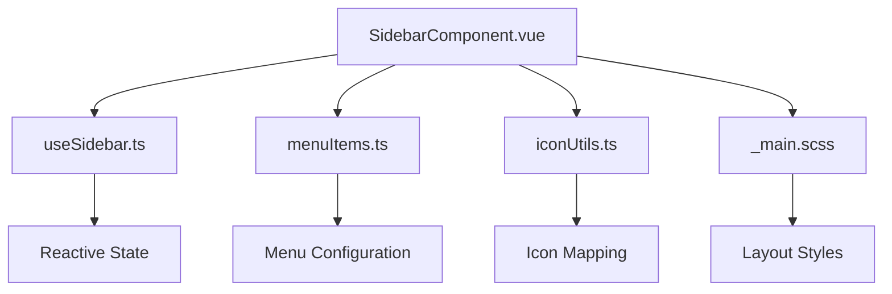
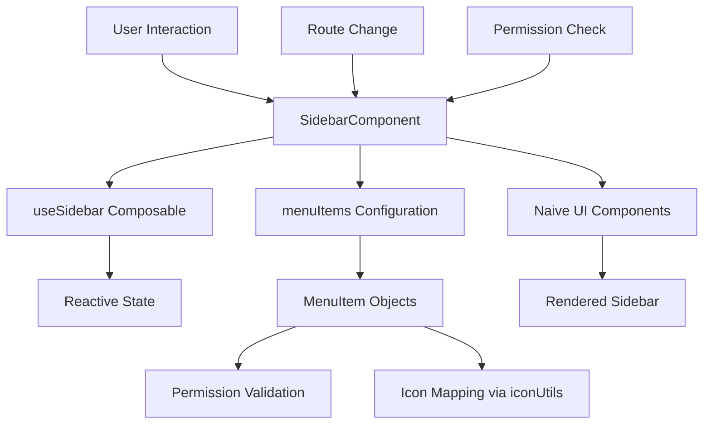
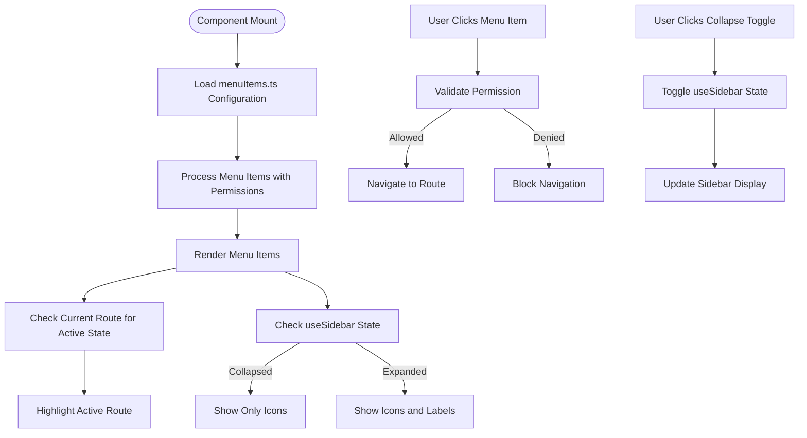
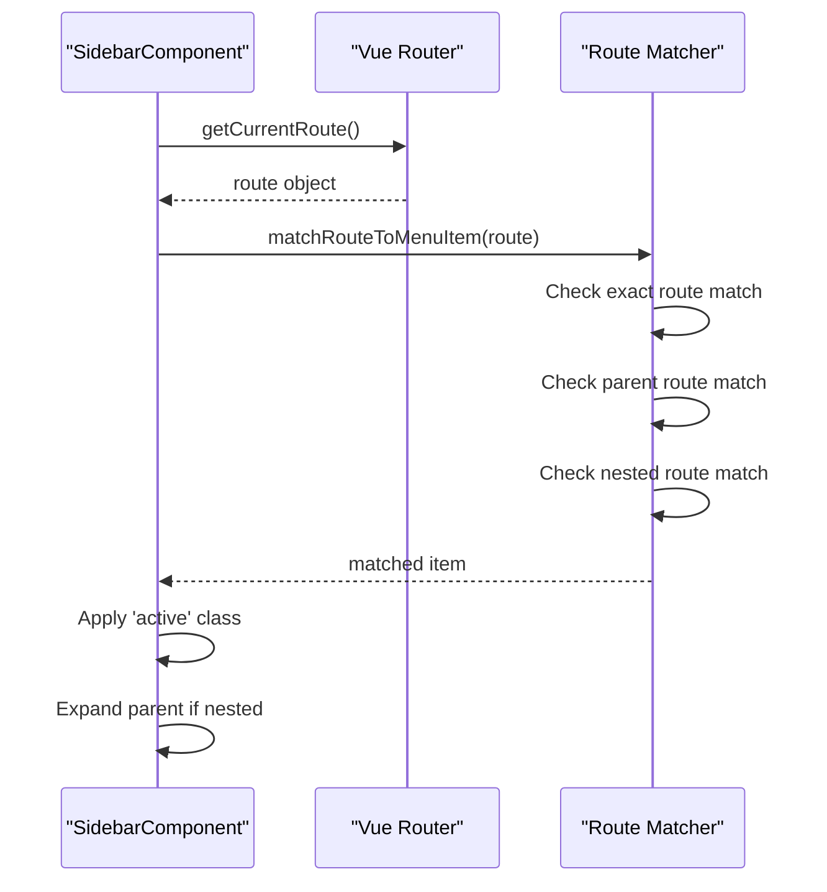
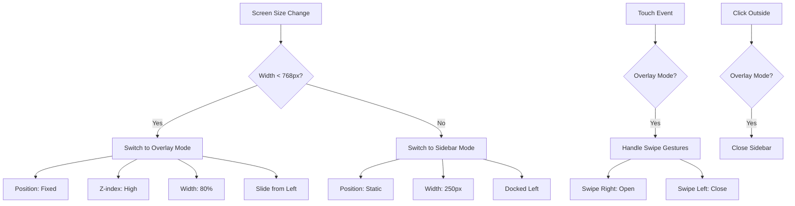
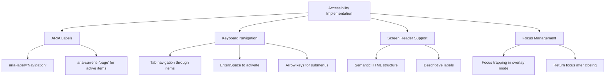
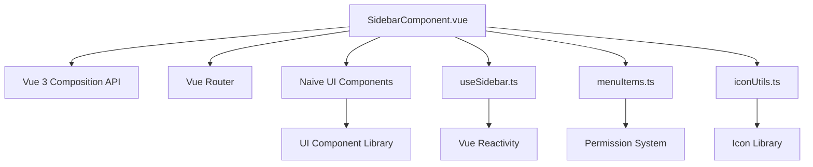

# Sidebar Component

<cite>
**Referenced Files in This Document**   
- [SidebarComponent.vue](file://src/root/main/components/SidebarComponent.vue)
- [useSidebar.ts](file://src/root/main/composables/useSidebar.ts)
- [menuItems.ts](file://src/root/main/config/menuItems.ts)
- [iconUtils.ts](file://src/root/shared/utils/iconUtils.ts)
- [_main.scss](file://src/styles/layouts/_main.scss)
</cite>

## Table of Contents
1. [Introduction](#introduction)
2. [Project Structure](#project-structure)
3. [Core Components](#core-components)
4. [Architecture Overview](#architecture-overview)
5. [Detailed Component Analysis](#detailed-component-analysis)
6. [Dependency Analysis](#dependency-analysis)
7. [Performance Considerations](#performance-considerations)
8. [Troubleshooting Guide](#troubleshooting-guide)
9. [Conclusion](#conclusion)

## Introduction
The SidebarComponent.vue is a key navigation element in the maya-platform-frontend application. It provides users with access to various application sections based on their permissions and current route context. This document details how the sidebar dynamically renders menu items, manages expand/collapse states, highlights active routes, and adapts to different screen sizes while maintaining accessibility standards.

## Project Structure
The sidebar component resides within the main module of the application under `src/root/main/components/`. It integrates with several supporting files:
- **SidebarComponent.vue**: Main component implementation
- **useSidebar.ts**: Composable for managing sidebar state
- **menuItems.ts**: Configuration for menu structure and permissions
- **iconUtils.ts**: Utility for mapping icon names to actual components

The component follows Vue 3's composition API pattern and leverages the Naive UI component library for visual elements.



**Diagram sources**
- [SidebarComponent.vue](file://src/root/main/components/SidebarComponent.vue)
- [useSidebar.ts](file://src/root/main/composables/useSidebar.ts)
- [menuItems.ts](file://src/root/main/config/menuItems.ts)
- [iconUtils.ts](file://src/root/shared/utils/iconUtils.ts)
- [_main.scss](file://src/styles/layouts/_main.scss)

**Section sources**
- [SidebarComponent.vue](file://src/root/main/components/SidebarComponent.vue)
- [useSidebar.ts](file://src/root/main/composables/useSidebar.ts)

## Core Components
The sidebar functionality is built around three core components:
1. **SidebarComponent.vue**: Renders the navigation interface and handles user interactions
2. **useSidebar.ts**: Manages the collapsed/expanded state and provides methods to toggle it
3. **menuItems.ts**: Defines the hierarchical menu structure with permission-based visibility rules

These components work together to create a dynamic, permission-aware navigation system that responds to route changes and user actions.

**Section sources**
- [SidebarComponent.vue](file://src/root/main/components/SidebarComponent.vue)
- [useSidebar.ts](file://src/root/main/composables/useSidebar.ts)
- [menuItems.ts](file://src/root/main/config/menuItems.ts)

## Architecture Overview
The sidebar architecture follows a clean separation of concerns pattern. The component consumes configuration data from `menuItems.ts` and state management from `useSidebar.ts`, while rendering UI elements using Vue's template syntax and Naive UI components.



**Diagram sources**
- [SidebarComponent.vue](file://src/root/main/components/SidebarComponent.vue)
- [useSidebar.ts](file://src/root/main/composables/useSidebar.ts)
- [menuItems.ts](file://src/root/main/config/menuItems.ts)
- [iconUtils.ts](file://src/root/shared/utils/iconUtils.ts)

## Detailed Component Analysis

### SidebarComponent.vue Analysis
The SidebarComponent.vue is responsible for rendering the navigation menu based on the configuration in `menuItems.ts`. It uses Vue Router's route matching to highlight the currently active route and applies permission checks to determine which items should be visible.



**Diagram sources**
- [SidebarComponent.vue](file://src/root/main/components/SidebarComponent.vue)
- [useSidebar.ts](file://src/root/main/composables/useSidebar.ts)
- [menuItems.ts](file://src/root/main/config/menuItems.ts)

#### Menu Item Structure Example
The menuItems.ts file defines a hierarchical structure of menu items with various properties:

```typescript
export const menuItems: MenuItem[] = [
  {
    key: 'resumes',
    label: 'Resumes',
    icon: 'document-text',
    to: '/resumes',
    children: [
      {
        key: 'resumes-list',
        label: 'All Resumes',
        to: '/resumes',
        permission: 'resumes.view'
      },
      {
        key: 'resumes-create',
        label: 'Create Resume',
        to: '/resumes/create',
        permission: 'resumes.create'
      }
    ],
    permission: 'resumes.access'
  },
  {
    key: 'jobs',
    label: 'Jobs',
    icon: 'briefcase',
    to: '/jobs',
    permission: 'jobs.access'
  }
]
```

Each menu item includes:
- **key**: Unique identifier for the menu item
- **label**: Display text for the menu item
- **icon**: Icon name mapped through iconUtils.ts
- **to**: Route path for navigation
- **children**: Nested submenu items
- **permission**: Permission required to view the item
- **hidden**: Optional flag to hide the item

**Section sources**
- [menuItems.ts](file://src/root/main/config/menuItems.ts)

#### useSidebar Composable Analysis
The useSidebar.ts composable manages the collapsed/expanded state of the sidebar using Vue's reactive system:

```mermaid
classDiagram
class useSidebar {
+collapsed : boolean
+toggle() : void
+expand() : void
+collapse() : void
+isCollapsed() : boolean
}
SidebarComponent --> useSidebar : "uses"
useSidebar --> "Reactive State" : "manages"
```

The composable provides a simple API for controlling the sidebar state:
- **toggle()**: Switches between collapsed and expanded states
- **expand()**: Sets the sidebar to expanded state
- **collapse()**: Sets the sidebar to collapsed state
- **isCollapsed()**: Returns current state

This state is synchronized across the application through Vue's reactivity system, ensuring that any component can respond to sidebar state changes.

**Diagram sources**
- [useSidebar.ts](file://src/root/main/composables/useSidebar.ts)

**Section sources**
- [useSidebar.ts](file://src/root/main/composables/useSidebar.ts)

#### Route Highlighting Mechanism
The sidebar uses Vue Router's route matching logic to determine which menu item should be highlighted as active:



The matching algorithm checks for:
1. Exact route match (direct navigation)
2. Parent route match (breadcrumb highlighting)
3. Nested route match (deep linking)

This ensures that the correct menu item is highlighted regardless of the specific route within a section.

**Diagram sources**
- [SidebarComponent.vue](file://src/root/main/components/SidebarComponent.vue)

**Section sources**
- [SidebarComponent.vue](file://src/root/main/components/SidebarComponent.vue)

#### Responsive Behavior
The sidebar implements responsive design patterns to adapt to different screen sizes:



On mobile devices, the sidebar switches to an overlay mode that can be toggled via a hamburger menu. It supports touch gestures for opening and closing, and closes when clicking outside the sidebar area.

**Diagram sources**
- [SidebarComponent.vue](file://src/root/main/components/SidebarComponent.vue)
- [_main.scss](file://src/styles/layouts/_main.scss)

**Section sources**
- [SidebarComponent.vue](file://src/root/main/components/SidebarComponent.vue)
- [_main.scss](file://src/styles/layouts/_main.scss)

#### Accessibility Features
The sidebar implements several accessibility features to ensure usability for all users:



Key accessibility features include:
- **ARIA labels**: Proper labeling for screen readers
- **Keyboard navigation**: Full keyboard operability
- **Focus management**: Logical focus order and trapping
- **Semantic HTML**: Proper use of navigation elements
- **High contrast**: Sufficient color contrast ratios

**Diagram sources**
- [SidebarComponent.vue](file://src/root/main/components/SidebarComponent.vue)

**Section sources**
- [SidebarComponent.vue](file://src/root/main/components/SidebarComponent.vue)

## Dependency Analysis
The sidebar component has a well-defined dependency structure that promotes maintainability and testability:



The component depends on:
- **Vue 3 Composition API**: For reactive state and lifecycle management
- **Vue Router**: For route matching and navigation
- **Naive UI**: For consistent UI components and styling
- **useSidebar.ts**: For shared state management
- **menuItems.ts**: For menu configuration
- **iconUtils.ts**: For icon rendering

These dependencies are imported and used in a modular fashion, allowing for easy testing and maintenance.

**Diagram sources**
- [SidebarComponent.vue](file://src/root/main/components/SidebarComponent.vue)
- [useSidebar.ts](file://src/root/main/composables/useSidebar.ts)
- [menuItems.ts](file://src/root/main/config/menuItems.ts)
- [iconUtils.ts](file://src/root/shared/utils/iconUtils.ts)

**Section sources**
- [SidebarComponent.vue](file://src/root/main/components/SidebarComponent.vue)

## Performance Considerations
The sidebar implementation considers several performance aspects:

1. **Lazy loading**: Menu configuration is imported statically but processed only when needed
2. **Reactivity optimization**: The useSidebar composable uses shallow refs for better performance
3. **Conditional rendering**: Hidden menu items are not rendered to the DOM
4. **Event delegation**: Click events are handled at the component level rather than on individual items
5. **Memoization**: Route matching results are cached to avoid redundant calculations

The component avoids expensive operations in the render cycle and leverages Vue's reactivity system efficiently.

## Troubleshooting Guide
Common issues and solutions for the sidebar component:

**Issue**: Menu items not appearing despite correct configuration
- **Check**: Verify permission values match user permissions
- **Check**: Ensure menuItems.ts exports the correct variable
- **Check**: Validate route paths exist in routing configuration

**Issue**: Sidebar state not synchronizing across components
- **Check**: Ensure useSidebar composable is imported from the same file
- **Check**: Verify Vue app instance is shared correctly
- **Check**: Confirm reactive state is properly exposed

**Issue**: Active route not highlighting correctly
- **Check**: Validate route paths match exactly
- **Check**: Ensure Vue Router is properly initialized
- **Check**: Verify route matching logic in component

**Issue**: Mobile overlay not working
- **Check**: Confirm CSS media queries are applied
- **Check**: Validate touch event handlers
- **Check**: Ensure z-index values are correct

**Section sources**
- [SidebarComponent.vue](file://src/root/main/components/SidebarComponent.vue)
- [useSidebar.ts](file://src/root/main/composables/useSidebar.ts)

## Conclusion
The SidebarComponent.vue provides a robust, permission-aware navigation system for the maya-platform-frontend application. By leveraging Vue 3's composition API, it effectively separates concerns between configuration, state management, and presentation. The component's responsive design ensures usability across devices, while its accessibility features make it inclusive for all users. Through proper dependency management and performance optimization, the sidebar delivers a smooth user experience while remaining maintainable and extensible.