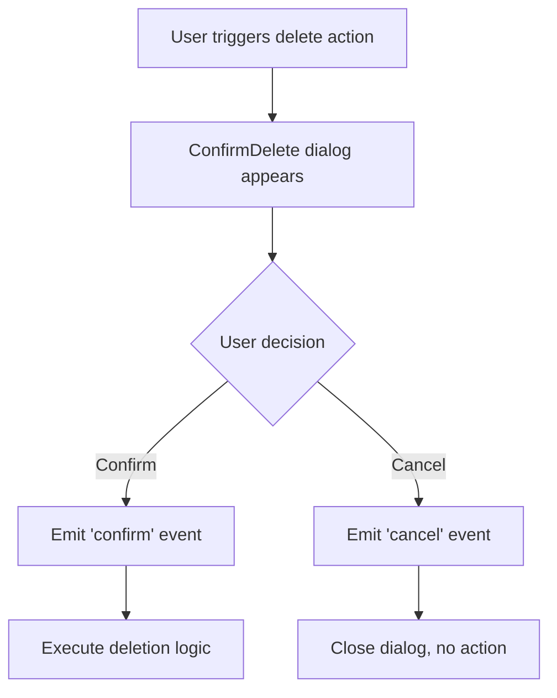
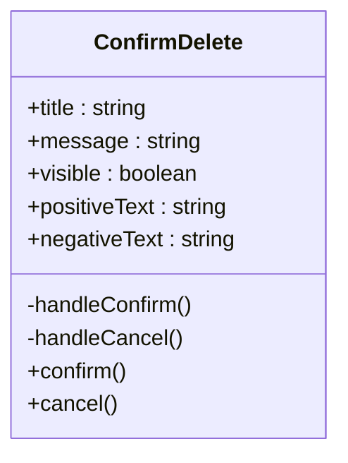
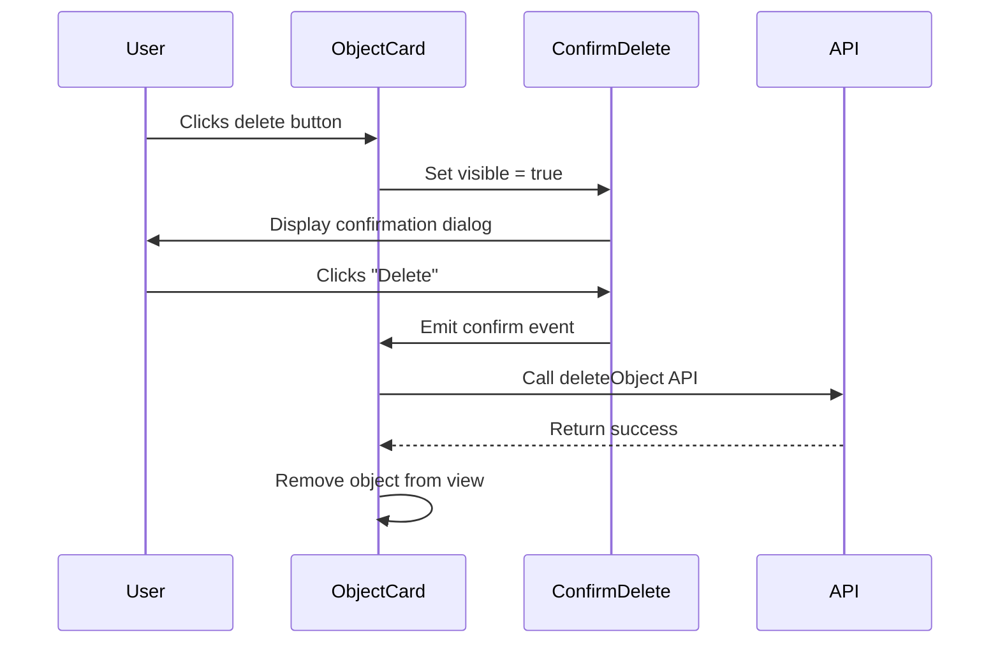

# ConfirmDelete Dialog

<cite>
**Referenced Files in This Document**   
- [ConfirmDelete.vue](file://src/root/shared/components/ConfirmDelete.vue)
- [ObjectCard.vue](file://src/root/objects/components/ObjectCard.vue)
- [CustomerModal.vue](file://src/root/refs/components/CustomerModal.vue)
- [JobsListPage.vue](file://src/root/jobs/pages/JobsListPage.vue)
- [ResumeDetailPage.vue](file://src/root/resumes/pages/ResumeDetailPage.vue)
- [variables.scss](file://src/styles/variables.scss)
- [naiveTheme.ts](file://src/styles/naiveTheme.ts)
</cite>

## Table of Contents
1. [Introduction](#introduction)
2. [Component Overview](#component-overview)
3. [Props and Events](#props-and-events)
4. [Integration Examples](#integration-examples)
5. [Slot Customization](#slot-customization)
6. [Visibility Management](#visibility-management)
7. [Styling and Theme Consistency](#styling-and-theme-consistency)
8. [Accessibility Features](#accessibility-features)
9. [Internationalization Support](#internationalization-support)
10. [Best Practices](#best-practices)

## Introduction
The ConfirmDelete dialog is a reusable Vue component designed to prevent accidental deletions across the maya-platform-frontend application. It provides a consistent, accessible, and user-friendly interface for confirming destructive actions. This document details its implementation, usage patterns, integration points, and best practices for developers working with this critical UI element.

**Section sources**
- [ConfirmDelete.vue](file://src/root/shared/components/ConfirmDelete.vue)

## Component Overview
The ConfirmDelete component serves as a standardized confirmation modal that appears before executing deletion operations. It is implemented using the Naive UI library's dialog system and follows the project's design system for visual consistency. The component is located in the shared components directory, making it accessible application-wide.

The dialog presents users with a clear warning message, a descriptive title, and two action buttons: "Delete" (destructive action) and "Cancel" (safe action). It supports both prop-based text configuration and slot-based content customization, allowing flexible usage across different contexts while maintaining a uniform user experience.



**Diagram sources**
- [ConfirmDelete.vue](file://src/root/shared/components/ConfirmDelete.vue)

## Props and Events
The ConfirmDelete component exposes a set of props for configuration and emits events to communicate user actions.

**Props:**
- `title`: String - The dialog title displayed at the top (e.g., "Delete Object")
- `message`: String - The main content message asking for confirmation
- `visible`: Boolean - Controls the visibility state of the dialog
- `positiveText`: String - Text for the confirmation button (default: "Delete")
- `negativeText`: String - Text for the cancel button (default: "Cancel")

**Emitted Events:**
- `confirm`: Triggered when the user clicks the positive (delete) button
- `cancel`: Triggered when the user clicks the negative (cancel) button or dismisses the dialog



**Diagram sources**
- [ConfirmDelete.vue](file://src/root/shared/components/ConfirmDelete.vue)

**Section sources**
- [ConfirmDelete.vue](file://src/root/shared/components/ConfirmDelete.vue)

## Integration Examples
The ConfirmDelete component is integrated into various parts of the application where deletion operations occur.

### ObjectCard.vue Integration
In the Objects module, ObjectCard.vue uses ConfirmDelete when a user attempts to delete an object. The component is conditionally rendered based on a local visibility flag, and the deletion action is only executed upon confirmation.



**Diagram sources**
- [ObjectCard.vue](file://src/root/objects/components/ObjectCard.vue)
- [ConfirmDelete.vue](file://src/root/shared/components/ConfirmDelete.vue)

### CustomerModal.vue Integration
The CustomerModal component in the refs module implements ConfirmDelete when removing customer references. It demonstrates the pattern of binding the dialog's visibility to a reactive variable and handling the confirm event with customer-specific deletion logic.

**Section sources**
- [CustomerModal.vue](file://src/root/refs/components/CustomerModal.vue)
- [ConfirmDelete.vue](file://src/root/shared/components/ConfirmDelete.vue)

## Slot Customization
The ConfirmDelete component supports Vue slots for advanced content customization beyond simple text messages. This allows for rich content in the dialog body, such as:

- Warning icons or illustrations
- Additional explanatory text
- Lists of affected items
- Pre-deletion checks or requirements

The default slot can be used to replace the entire message content, while specialized slots could be implemented for header or footer content. This flexibility enables context-specific messaging while maintaining the core confirmation interaction pattern.

**Section sources**
- [ConfirmDelete.vue](file://src/root/shared/components/ConfirmDelete.vue)

## Visibility Management
The ConfirmDelete dialog's visibility is managed through the `visible` prop, which follows Vue's reactivity system. Two primary patterns are used across the application:

1. **Boolean Binding**: A local reactive variable controls visibility
```javascript
const showDeleteConfirm = ref(false)
```

2. **v-model Pattern**: Two-way binding for more complex state management
```javascript
<ConfirmDelete v-model:visible="showDeleteConfirm" />
```

The visibility state is typically toggled by the parent component in response to user actions (e.g., clicking a delete button) and reset after the dialog is dismissed via either confirmation or cancellation.

**Section sources**
- [ConfirmDelete.vue](file://src/root/shared/components/ConfirmDelete.vue)
- [ObjectCard.vue](file://src/root/objects/components/ObjectCard.vue)

## Styling and Theme Consistency
The ConfirmDelete component maintains visual consistency through several mechanisms:

- **Naive UI Integration**: Built on Naive UI's dialog component, inheriting its styling and behavior
- **SCSS Variables**: Uses global variables from variables.scss for colors, spacing, and typography
- **Theme Support**: Compatible with both light and dark themes defined in naiveTheme.ts
- **Responsive Design**: Adapts to different screen sizes and device types

The styling ensures that the confirmation dialog appears cohesive with other application elements while drawing appropriate attention to the destructive nature of the action.

**Section sources**
- [ConfirmDelete.vue](file://src/root/shared/components/ConfirmDelete.vue)
- [variables.scss](file://src/styles/variables.scss)
- [naiveTheme.ts](file://src/styles/naiveTheme.ts)

## Accessibility Features
The ConfirmDelete component implements several accessibility features to ensure usability for all users:

- **Focus Trapping**: When open, keyboard focus is trapped within the dialog
- **ESC Key Dismissal**: Users can close the dialog by pressing the Escape key
- **ARIA Labels**: Proper ARIA attributes for screen readers
- **Keyboard Navigation**: Full keyboard operability with tab navigation
- **High Contrast**: Sufficient color contrast for text and interactive elements

These features comply with WCAG 2.1 guidelines and ensure that users with various assistive technologies can safely interact with the confirmation dialog.

**Section sources**
- [ConfirmDelete.vue](file://src/root/shared/components/ConfirmDelete.vue)

## Internationalization Support
The ConfirmDelete component is designed with internationalization in mind:

- **Prop-based Text**: All visible text is passed as props, enabling easy translation
- **Externalized Strings**: Text content can be sourced from i18n libraries or translation files
- **Dynamic Labels**: Button texts can be customized to match language conventions
- **RTL Support**: Layout adapts to right-to-left languages through Naive UI

This approach allows the component to be used in multilingual applications without modification, with translations managed at the parent component level.

**Section sources**
- [ConfirmDelete.vue](file://src/root/shared/components/ConfirmDelete.vue)

## Best Practices
When using the ConfirmDelete component, follow these best practices:

1. **Pair with API Calls**: Always connect the confirm event to appropriate API deletion endpoints
2. **Handle Async Operations**: Use async/await patterns for API calls with proper error handling
3. **Provide Feedback**: Show success or error messages after deletion attempts
4. **Use Descriptive Text**: Make titles and messages specific to the context
5. **Consider Bulk Operations**: For multiple deletions, consider batch confirmation patterns
6. **Log Actions**: Record deletion events for audit purposes when appropriate

Example implementation pattern:
```javascript
const handleDelete = async () => {
  try {
    await api.deleteResource(resourceId)
    message.success('Resource deleted successfully')
    // Update local state
  } catch (error) {
    message.error('Failed to delete resource')
  }
}
```

**Section sources**
- [JobsListPage.vue](file://src/root/jobs/pages/JobsListPage.vue)
- [ResumeDetailPage.vue](file://src/root/resumes/pages/ResumeDetailPage.vue)
- [ConfirmDelete.vue](file://src/root/shared/components/ConfirmDelete.vue)