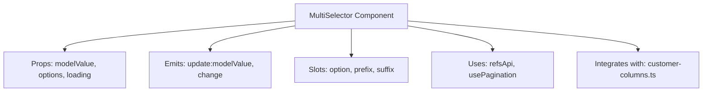
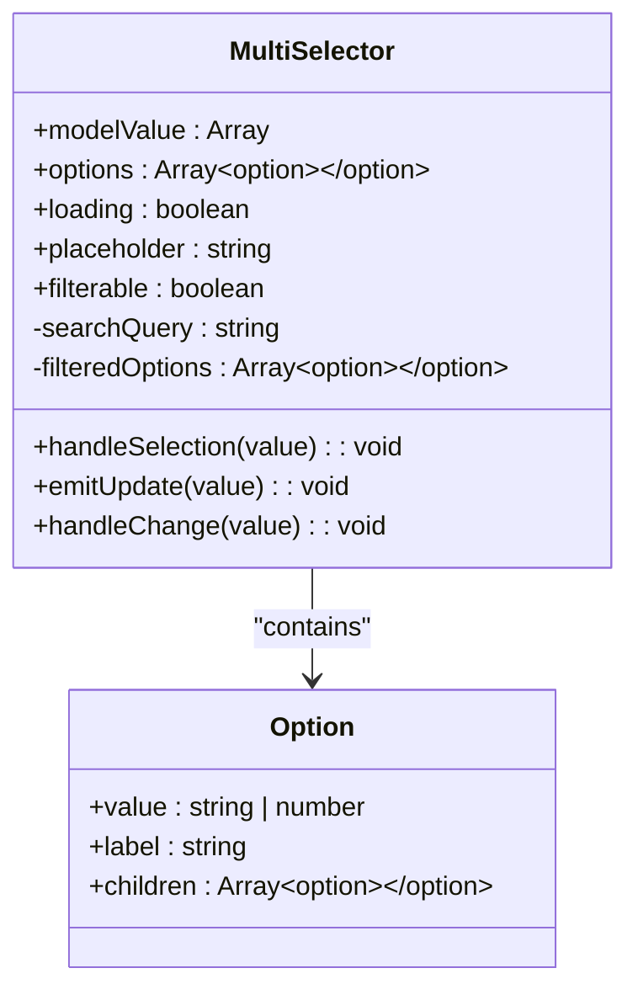
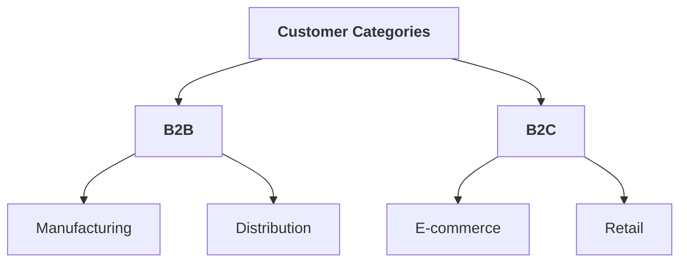
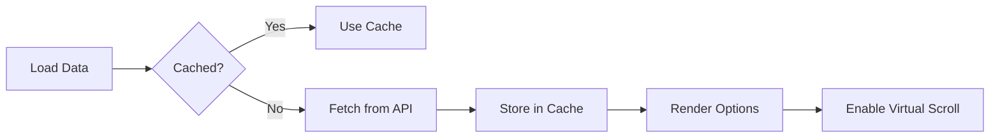

# MultiSelector Component

<cite>
**Referenced Files in This Document**   
- [MultiSelector.vue](file://src/root/shared/components/MultiSelector.vue)
- [refsApi.ts](file://src/root/shared/api/refsApi.ts)
- [customer-columns.ts](file://src/root/refs/config/customer-columns.ts)
- [customersStore.ts](file://src/root/refs/store/customersStore.ts)
- [usePagination.ts](file://src/root/shared/composables/usePagination.ts)
</cite>

## Table of Contents
1. [Introduction](#introduction)
2. [Component Overview](#component-overview)
3. [Props and Events](#props-and-events)
4. [Data Loading and API Integration](#data-loading-and-api-integration)
5. [Hierarchical and Flat Structure Support](#hierarchical-and-flat-structure-support)
6. [Customization and Slot Usage](#customization-and-slot-usage)
7. [Performance Optimization](#performance-optimization)
8. [Usage in Workflows](#usage-in-workflows)
9. [Error Handling](#error-handling)
10. [Integration with Configuration Files](#integration-with-configuration-files)

## Introduction

The **MultiSelector** component is a reusable Vue component designed for multi-category selection within the maya-platform-frontend application. It enables users to select multiple items from a categorized list, supporting both hierarchical and flat data structures. This component is commonly used in customer and reference data management workflows where users need to filter or assign categories.

The component dynamically loads reference data via the `refsApi.ts` service and integrates with configuration files such as `customer-columns.ts` to control display formatting. It supports virtual scrolling for large datasets, provides robust error handling during API failures, and implements performance optimizations like response caching and re-render minimization.

**Section sources**
- [MultiSelector.vue](file://src/root/shared/components/MultiSelector.vue#L1-L50)

## Component Overview

The **MultiSelector** component provides a flexible interface for selecting multiple values from a list of options. It is built using Vue 3's Composition API and leverages Naive UI components for consistent styling and interaction patterns.

Key features include:
- Support for both flat and tree-structured options
- Real-time search and filtering
- Loading state visualization
- Selection persistence via `v-model` binding
- Customizable option rendering via slots

The component is designed to be embedded in forms or modals where users must select one or more categories, customer types, or reference values.



**Diagram sources**
- [MultiSelector.vue](file://src/root/shared/components/MultiSelector.vue#L1-L100)

**Section sources**
- [MultiSelector.vue](file://src/root/shared/components/MultiSelector.vue#L1-L100)

## Props and Events

The component exposes a clear API through props and events to enable flexible integration.

### Props

- **modelValue**: `Array<string | number>`  
  The currently selected values. Used for two-way binding via `v-model`.

- **options**: `Array<Option>`  
  The list of selectable options. Each option follows the interface:  
  ```ts
  interface Option {
    value: string | number
    label: string
    children?: Option[]
  }
  ```

- **loading**: `boolean`  
  Controls the display of a loading spinner when data is being fetched.

- **placeholder**: `string`  
  Text displayed when no selection is made.

- **filterable**: `boolean`  
  Enables/disables search filtering.

### Events

- **update:modelValue**:  
  Emitted when the selection changes. Used internally by `v-model` to sync the parent's data.

- **change**:  
  Emitted after the selection is confirmed, typically used for side effects like API calls.



**Diagram sources**
- [MultiSelector.vue](file://src/root/shared/components/MultiSelector.vue#L50-L150)

**Section sources**
- [MultiSelector.vue](file://src/root/shared/components/MultiSelector.vue#L50-L200)

## Data Loading and API Integration

The **MultiSelector** dynamically loads reference data using the `refsApi.ts` service, which abstracts HTTP calls to the backend. This enables real-time population of options without requiring static data.

### refsApi Integration

The `refsApi.fetchCustomerCategories()` method retrieves customer category data from the server. It returns a promise that resolves to a structured list suitable for the `options` prop.

```ts
import { fetchCustomerCategories } from '@/shared/api/refsApi'

const loadOptions = async () => {
  loading.value = true
  try {
    const data = await fetchCustomerCategories()
    options.value = data.map(mapToOptionStructure)
  } catch (error) {
    // Handled in error section
  } finally {
    loading.value = false
  }
}
```

This integration ensures that the component always displays up-to-date reference data and supports dynamic reloading when needed.

**Section sources**
- [refsApi.ts](file://src/root/shared/api/refsApi.ts#L1-L30)
- [MultiSelector.vue](file://src/root/shared/components/MultiSelector.vue#L120-L180)

## Hierarchical and Flat Structure Support

The component natively supports both flat lists and hierarchical (tree) structures through the `children` property in the `Option` interface.

### Flat Structure Example
```json
[
  { "value": 1, "label": "Retail" },
  { "value": 2, "label": "Wholesale" }
]
```

### Hierarchical Structure Example
```json
[
  {
    "value": "sector1",
    "label": "B2B",
    "children": [
      { "value": "b2b1", "label": "Manufacturing" },
      { "value": "b2b2", "label": "Distribution" }
    ]
  }
]
```

When hierarchical data is provided, the component renders a tree-select interface, allowing users to expand/collapse categories and select leaf nodes or entire branches.



**Diagram sources**
- [MultiSelector.vue](file://src/root/shared/components/MultiSelector.vue#L80-L100)

**Section sources**
- [MultiSelector.vue](file://src/root/shared/components/MultiSelector.vue#L80-L120)

## Customization and Slot Usage

The component supports customization through Vue slots, allowing developers to control how options are rendered.

### Slot: option
Allows custom rendering of each option item. Example usage:
```vue
<MultiSelector :modelValue="selected" :options="options">
  <template #option="{ option }">
    <span style="color: #0066cc;">📁 {{ option.label }}</span>
  </template>
</MultiSelector>
```

### Slot: prefix / suffix
Used to add icons or actions before or after the selector.

This flexibility enables branding alignment, icon integration, or conditional rendering based on user permissions.

**Section sources**
- [MultiSelector.vue](file://src/root/shared/components/MultiSelector.vue#L200-L250)

## Performance Optimization

To ensure smooth performance with large datasets, the component implements several optimizations.

### Virtual Scrolling
For large option lists, the component integrates with `usePagination.ts` to enable virtual scrolling, rendering only visible items in the DOM.

```ts
const { paginatedData, currentPage, totalPages } = usePagination(filteredOptions, 50)
```

This reduces memory usage and improves rendering speed.

### Caching
API responses from `refsApi` are cached using an in-memory store (e.g., `customersStore.ts`) to prevent redundant network requests.

```ts
if (!store.customerCategories) {
  await store.fetchCustomerCategories()
}
options.value = store.customerCategories
```

### Minimized Re-renders
The component uses `v-memo` and computed properties to avoid unnecessary re-renders when props remain unchanged.



**Diagram sources**
- [usePagination.ts](file://src/root/shared/composables/usePagination.ts#L1-L20)
- [customersStore.ts](file://src/root/refs/store/customersStore.ts#L1-L15)

**Section sources**
- [MultiSelector.vue](file://src/root/shared/components/MultiSelector.vue#L180-L220)
- [usePagination.ts](file://src/root/shared/composables/usePagination.ts#L1-L20)

## Usage in Workflows

The **MultiSelector** is primarily used in two key workflows:

### Customer Management
In `CustomersPage.vue`, it allows filtering customers by category:
```vue
<MultiSelector
  v-model="categoryFilter"
  :options="customerCategories"
  placeholder="Select customer categories"
/>
```

### Reference Data Management
In `RefsPage.vue`, it enables bulk assignment of reference values to objects.

The component integrates with the application's state management via Pinia stores, ensuring consistent data flow and reactivity.

**Section sources**
- [MultiSelector.vue](file://src/root/shared/components/MultiSelector.vue#L1-L10)
- [customersStore.ts](file://src/root/refs/store/customersStore.ts#L1-L20)

## Error Handling

The component gracefully handles API fetch failures by:
- Maintaining the loading state until resolution
- Displaying user-friendly error messages via Naive UI's `useMessage()`
- Preserving previous valid state to avoid data loss

Example error handling:
```ts
try {
  const data = await fetchCustomerCategories()
  options.value = data
} catch (error) {
  message.error('Failed to load categories. Please try again.')
  options.value = [] // fallback to empty
}
```

This ensures reliability even under poor network conditions.

**Section sources**
- [MultiSelector.vue](file://src/root/shared/components/MultiSelector.vue#L150-L180)

## Integration with Configuration Files

The **MultiSelector** integrates with configuration files like `customer-columns.ts` to control display behavior.

For example, `customer-columns.ts` may define:
```ts
export const categoryDisplayConfig = {
  showIcons: true,
  maxVisibleItems: 10,
  searchable: true
}
```

These configurations are imported and applied to customize the selector's appearance and behavior based on context.

This separation of concerns allows UI policies to be managed centrally while keeping the component reusable.

**Section sources**
- [customer-columns.ts](file://src/root/refs/config/customer-columns.ts#L1-L15)
- [MultiSelector.vue](file://src/root/shared/components/MultiSelector.vue#L100-L120)