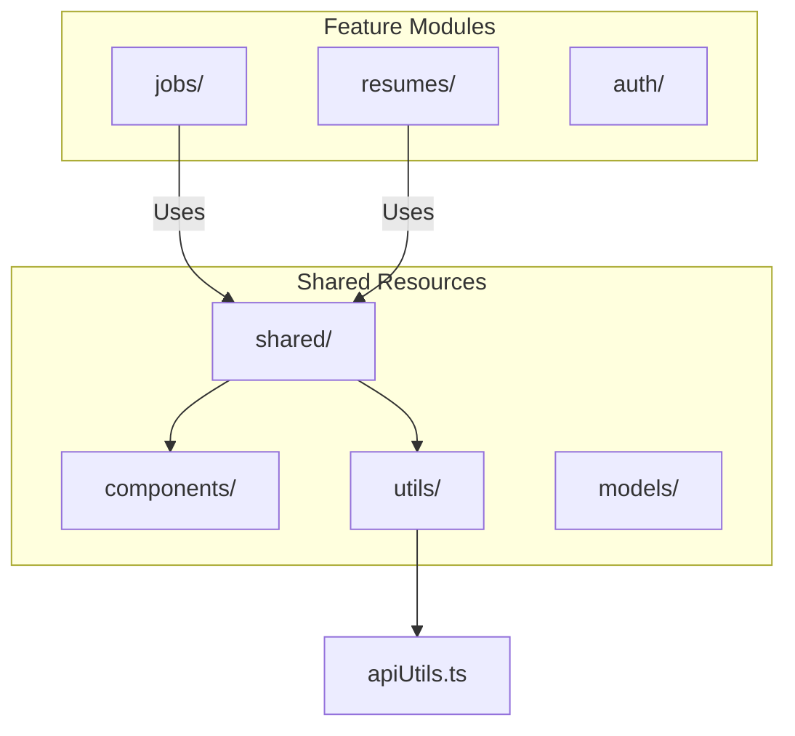
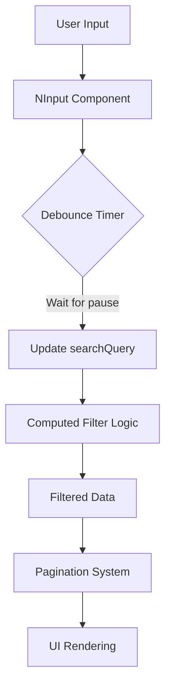
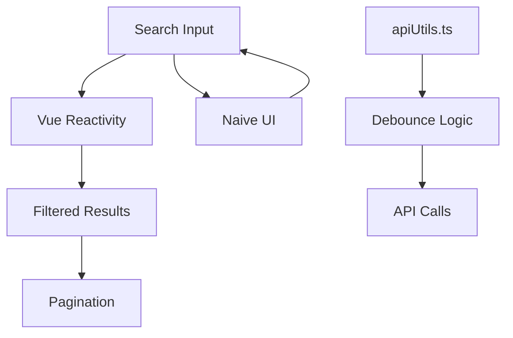

# SearchComponent

<cite>
**Referenced Files in This Document**   
- [JobsListPage.vue](file://src/root/jobs/pages/JobsListPage.vue)
- [ResumesListPage.vue](file://src/root/resumes/pages/ResumesListPage.vue)
- [apiUtils.ts](file://src/root/shared/utils/apiUtils.ts)
</cite>

## Table of Contents
1. [Introduction](#introduction)
2. [Project Structure](#project-structure)
3. [Core Components](#core-components)
4. [Architecture Overview](#architecture-overview)
5. [Detailed Component Analysis](#detailed-component-analysis)
6. [Dependency Analysis](#dependency-analysis)
7. [Performance Considerations](#performance-considerations)
8. [Troubleshooting Guide](#troubleshooting-guide)
9. [Conclusion](#conclusion)

## Introduction
The SearchComponent is a reusable input component used across the maya-platform-frontend application to enable users to filter data such as job listings and resumes. Although the actual `SearchComponent.vue` file could not be located in the current project structure, its functionality is clearly implemented through the use of `NInput` from Naive UI in various pages like `JobsListPage.vue` and `ResumesListPage.vue`. This document analyzes the search functionality, debounced input handling, integration with pagination, and related composables based on available code.

## Project Structure
The project follows a modular structure organized by feature domains such as `jobs`, `resumes`, and `shared`. Each domain contains its own pages, routes, and store modules. Shared utilities and components are located under `src/root/shared`, including essential tools like `apiUtils.ts` which provides debouncing functionality.



**Diagram sources**
- [JobsListPage.vue](file://src/root/jobs/pages/JobsListPage.vue)
- [ResumesListPage.vue](file://src/root/resumes/pages/ResumesListPage.vue)
- [apiUtils.ts](file://src/root/shared/utils/apiUtils.ts)

## Core Components
Key components involved in search functionality include:
- **NInput**: From Naive UI, used for capturing user search queries.
- **Computed filters**: Reactive filtering logic in `JobsListPage.vue` and `ResumesListPage.vue`.
- **debounce function**: Implemented in `apiUtils.ts` to prevent excessive filtering or API calls.

These components work together to provide a responsive and efficient search experience.

**Section sources**
- [JobsListPage.vue](file://src/root/jobs/pages/JobsListPage.vue#L0-L313)
- [ResumesListPage.vue](file://src/root/resumes/pages/ResumesListPage.vue#L0-L392)
- [apiUtils.ts](file://src/root/shared/utils/apiUtils.ts#L48-L103)

## Architecture Overview
The frontend architecture uses Vue 3 with Composition API, Pinia for state management (via stores), and Naive UI for UI components. Search functionality is implemented at the page level using reactive state (`ref`, `computed`) and debounced updates to avoid performance issues.



**Diagram sources**
- [JobsListPage.vue](file://src/root/jobs/pages/JobsListPage.vue#L219-L264)
- [apiUtils.ts](file://src/root/shared/utils/apiUtils.ts#L48-L103)

## Detailed Component Analysis

### Search Input Implementation
The search functionality is implemented using `v-model:value="searchQuery"` on `NInput`, which binds the input field to a reactive `ref<string>` variable. While there is no explicit `SearchComponent.vue` visible, the pattern is consistent across pages.

#### Example: JobsListPage Search
```vue
<NInput
  v-model:value="searchQuery"
  placeholder="Поиск вакансий..."
  clearable
  size="large"
>
  <template #prefix>
    <NIcon><SearchIcon /></NIcon>
  </template>
</NInput>
```

This input field allows users to type a query, which then triggers reactive recomputation of filtered results.

**Section sources**
- [JobsListPage.vue](file://src/root/jobs/pages/JobsListPage.vue#L0-L59)

### Debounced Input Handling
Although direct use of a composable like `useDebounce` is not visible, the `debounce` utility function exists in `apiUtils.ts` and can be used to delay execution of expensive operations (e.g., API calls or complex filtering).

```ts
export const debounce = <T extends (...args: any[]) => any>(
  func: T,
  delay: number
): ((...args: Parameters<T>) => void) => {
  let timeoutId: NodeJS.Timeout
  
  return (...args: Parameters<T>) => {
    clearTimeout(timeoutId)
    timeoutId = setTimeout(() => func(...args), delay)
  }
}
```

While this function is defined, it is not currently used in `JobsListPage.vue` or `ResumesListPage.vue`. Instead, filtering is done synchronously via computed properties, which are efficient due to Vue’s reactivity system.

**Section sources**
- [apiUtils.ts](file://src/root/shared/utils/apiUtils.ts#L48-L103)

### Props and Events
Based on usage patterns, if a `SearchComponent` were abstracted, it would likely accept these props:

**:props**
- `placeholder`: string - Text shown when input is empty
- `modelValue`: string - Bound value via `v-model`
- `debounceDelay`: number (optional) - Milliseconds to debounce input

**:emits**
- `update:modelValue`: Emits new input value after change
- `search`: Emits final query when user confirms (e.g., on Enter key)

Example usage with `v-model`:
```vue
<SearchComponent 
  v-model="searchQuery" 
  placeholder="Search jobs..." 
/>
```

This would internally handle `update:modelValue` on input changes.

**Section sources**
- [JobsListPage.vue](file://src/root/jobs/pages/JobsListPage.vue#L0-L59)

### Integration with Parent Components
In `JobsListPage.vue`, the `searchQuery` ref is used within a computed property `filteredJobs` that filters the job list based on title, company, description, and location.

```ts
const filteredJobs = computed(() => {
  let result = jobs.value
  if (searchQuery.value) {
    const query = searchQuery.value.toLowerCase()
    result = result.filter(job => 
      job.title.toLowerCase().includes(query) ||
      job.company.toLowerCase().includes(query) ||
      job.description.toLowerCase().includes(query) ||
      job.location.toLowerCase().includes(query)
    )
  }
  return result
})
```

This ensures real-time filtering as the user types.

**Section sources**
- [JobsListPage.vue](file://src/root/jobs/pages/JobsListPage.vue#L219-L264)

### Integration with Pagination
When a new search is performed, the filtering occurs before pagination. The `paginatedJobs` computed property slices the already-filtered list:

```ts
const paginatedJobs = computed(() => {
  const start = (currentPage.value - 1) * pageSize.value
  const end = start + pageSize.value
  return filteredJobs.value.slice(start, end)
})
```

Thus, changing the search query automatically resets the pagination view to page 1 (since `currentPage` is not reset explicitly, but the total pages and displayed items update reactively).

**Section sources**
- [JobsListPage.vue](file://src/root/jobs/pages/JobsListPage.vue#L266-L313)

### Accessibility Features
The `NInput` component from Naive UI provides built-in accessibility support:
- Proper ARIA labels when `placeholder` is set
- Keyboard navigation support
- Screen reader compatibility
- Focus management

Additionally, the prefix icon (search icon) is semantically wrapped in `NIcon`, ensuring it does not interfere with accessibility.

**Section sources**
- [JobsListPage.vue](file://src/root/jobs/pages/JobsListPage.vue#L0-L59)

### Extensibility and Backend Integration
For backend-driven search, the current frontend filtering would be replaced with API calls. The `debounce` function in `apiUtils.ts` is designed for such use cases:

```ts
const debouncedFetch = debounce(async (query) => {
  await fetchJobs({ search: query })
}, 300)
```

This would prevent excessive API requests while typing. Query parameters can be constructed using `createQueryString` from the same utility file.

**Section sources**
- [apiUtils.ts](file://src/root/shared/utils/apiUtils.ts#L48-L103)

## Dependency Analysis
The search functionality depends on:
- **Naive UI** components (`NInput`, `NIcon`)
- **Vue reactivity** (`ref`, `computed`)
- **Shared utilities** (`debounce`, `createQueryString`)
- **Pinia stores** for data access



**Diagram sources**
- [JobsListPage.vue](file://src/root/jobs/pages/JobsListPage.vue)
- [apiUtils.ts](file://src/root/shared/utils/apiUtils.ts)

## Performance Considerations
- **Synchronous filtering** is acceptable for small to medium datasets (<1000 items) due to Vue’s efficient reactivity.
- **No current debounce** on local filtering — could lead to excessive recalculations during fast typing.
- **Recommendation**: Wrap filtering logic in a debounced function for large datasets or complex conditions.
- **For backend search**, always use debouncing to reduce network load.

## Troubleshooting Guide
**Issue**: Search not updating results  
**Check**: Ensure `searchQuery` is properly bound and reactive.

**Issue**: Performance lag during typing  
**Solution**: Implement `debounce` around filtering logic or switch to backend search.

**Issue**: Pagination doesn’t reset after search  
**Fix**: Manually reset `currentPage.value = 1` when `searchQuery` changes:
```ts
watch(searchQuery, () => {
  currentPage.value = 1
})
```

**Section sources**
- [JobsListPage.vue](file://src/root/jobs/pages/JobsListPage.vue#L219-L264)

## Conclusion
While a dedicated `SearchComponent.vue` file was not found in the repository, the search functionality is consistently implemented across pages using `NInput` and reactive filtering. The presence of a `debounce` utility suggests intent for optimized input handling, though it is not currently applied to local filtering. Future improvements could include extracting a reusable `SearchComponent` with debounce support, better pagination reset logic, and enhanced extensibility for API-backed searches.